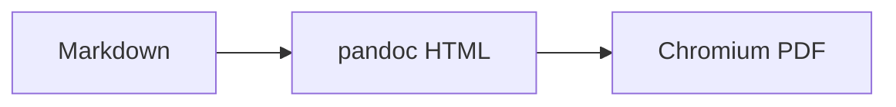

# Chương 1 — Dấu tiếng Việt

Các ký tự cần kiểm tra: ắ ằ ẳ ẵ ặ ơ ư đ Ư Đ.

Câu mẫu: Đường về quê mẹ ướt đẫm mưa; chúng ta học lập trình Java để thắng kỳ thi.

| Cột | Giá trị |
|---|---|
| Chữ hoa | Ư Đ Ắ Ặ |
| Chữ thường | ắ ằ ẳ ẵ ặ ơ ư đ |

```java
// Chú thích tiếng Việt trong code: đặc biệt
System.out.println("Xin chào, thế giới!");
```


