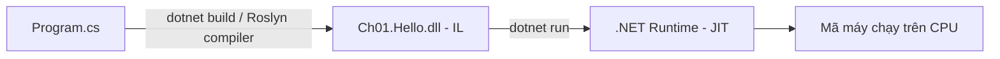

# Chương 1 — Bắt đầu với .NET 10 và C# 14

## Mục tiêu

Sau chương này, bạn sẽ:

- Hiểu .NET, SDK, runtime và C# là gì, khác nhau thế nào.
- Tạo, build và chạy một chương trình console bằng `dotnet` CLI.
- Biết *top-level statements* (câu lệnh cấp cao nhất) và *file-based app* (ứng dụng một file) mới của .NET 10.

## Giải thích đơn giản

Nếu bạn biết TypeScript, hãy nghĩ như sau:

| TypeScript / Node | C# / .NET | Ý nghĩa |
|---|---|---|
| Node.js (runtime) | .NET Runtime | Chương trình chạy code của bạn |
| `tsc` + `npm` | .NET SDK (`dotnet` CLI) | Công cụ biên dịch (compile), tải gói, chạy test |
| `package.json` | file `.csproj` | Mô tả project và gói phụ thuộc |
| npm registry | NuGet (nuget.org) | Kho gói thư viện |
| TypeScript | C# | Ngôn ngữ lập trình |

- **.NET** là nền tảng (platform) mã nguồn mở của Microsoft, chạy trên Windows, Linux, macOS.
- **C#** là ngôn ngữ chính trên .NET. Code C# được biên dịch thành *IL* (Intermediate Language —
  ngôn ngữ trung gian), rồi runtime dịch IL sang mã máy lúc chạy bằng *JIT* (Just-In-Time compiler).
  Giống Java: `.java` → bytecode → JVM.
- **SDK** (Software Development Kit) = bộ công cụ để *viết* code. **Runtime** = để *chạy* code.

Bộ sách dùng **.NET 10 (LTS)**, SDK **10.0.112**, runtime **10.0.12** và **C# 14**
(chi tiết và nguồn trong [`STACK.md`](../STACK.md), checked 2026-09-28).

## Ví dụ

### Bước 1 — Kiểm tra SDK

```text
$ dotnet --version
10.0.112
```

Trong thư mục `books/csharp/` có file `global.json` ghim SDK. Nếu máy bạn có SDK 10.0.x
mới hơn (ví dụ 10.0.401), `rollForward: latestFeature` vẫn cho phép dùng.

### Bước 2 — Tạo project

```text
$ dotnet new console -n Ch01.Hello
$ cd Ch01.Hello
$ dotnet run
```

Lệnh `dotnet new console` tạo 2 file: `Ch01.Hello.csproj` và `Program.cs`.
Trong bộ sách, các thiết lập chung (TargetFramework, Nullable...) nằm ở
`Directory.Build.props`, nên file `.csproj` rất ngắn:

<!-- include: examples/Ch01.Hello/Ch01.Hello.csproj -->
```xml
<Project Sdk="Microsoft.NET.Sdk">

  <PropertyGroup>
    <OutputType>Exe</OutputType>
  </PropertyGroup>

</Project>
```

### Bước 3 — Viết code

<!-- include: examples/Ch01.Hello/Program.cs -->
```csharp
// Top-level statements: không cần class Program hay hàm Main.
Console.WriteLine("Xin chào, C#!");

string name = args.Length > 0 ? args[0] : "Nobin";
int year = DateTime.Now.Year;
Console.WriteLine($"Chào {name}. Năm nay là {year}.");

// Thông tin môi trường chạy
Console.WriteLine($".NET runtime: {Environment.Version}");
Console.WriteLine($"OS: {Environment.OSVersion.Platform}");
Console.WriteLine($"C# ví dụ tính toán: 7 / 2 = {7 / 2}, 7 / 2.0 = {7 / 2.0}");
```

Output thật khi chạy `dotnet run`:

<!-- output: examples/Ch01.Hello -->
```text
Xin chào, C#!
Chào Nobin. Năm nay là 2026.
.NET runtime: 10.0.12
OS: Unix
C# ví dụ tính toán: 7 / 2 = 3, 7 / 2.0 = 3.5
```

Chú ý dòng cuối: `7 / 2 = 3`. Chia hai số nguyên (`int`) thì kết quả là số nguyên.
Trong TypeScript, `7 / 2` là `3.5` vì mọi số đều là `number`.

### Bước 4 — File-based app (mới trong .NET 10)

Từ .NET 10, bạn có thể chạy **một file `.cs` duy nhất**, không cần `.csproj`.
Rất tiện để thử nhanh, giống `node script.js` hoặc `java Hello.java`.

<!-- include: examples/FileBased/hello.cs -->
```csharp
#!/usr/bin/env dotnet
// File-based app (.NET 10): chạy trực tiếp bằng `dotnet run hello.cs`, không cần .csproj.
#:property Nullable=enable

var numbers = new[] { 3, 1, 4, 1, 5, 9, 2, 6 };
Console.WriteLine($"Có {numbers.Length} số, tổng = {numbers.Sum()}, lớn nhất = {numbers.Max()}");
```

<!-- output: examples/FileBased -->
```text
$ dotnet run hello.cs
Có 8 số, tổng = 31, lớn nhất = 9
```

Dòng `#:property ...` là *directive* (chỉ thị) cho công cụ build, ngôn ngữ C# bỏ qua nó.
Có các directive: `#:package` (thêm gói NuGet), `#:property`, `#:sdk`, `#:project`.

## Đi sâu

### Top-level statements là gì?

Trước C# 9, mọi chương trình phải có class và hàm `Main` (giống Java):

<!-- include: examples/Ch01.ClassicMain/Program.cs -->
```csharp
namespace Ch01.ClassicMain;

// Cách viết "cổ điển" trước C# 9: class Program + hàm Main.
internal class Program
{
    private static void Main(string[] args)
    {
        Console.WriteLine("Xin chào, C#! (kiểu cổ điển với Main)");
        Console.WriteLine($"Số tham số dòng lệnh: {args.Length}");
    }
}
```

<!-- output: examples/Ch01.ClassicMain -->
```text
Xin chào, C#! (kiểu cổ điển với Main)
Số tham số dòng lệnh: 0
```

Với *top-level statements*, compiler tự sinh class và hàm `Main` cho bạn. Biến `args`
(tham số dòng lệnh) vẫn dùng được. Mỗi project chỉ có **một** file được dùng top-level statements.

### `ImplicitUsings` — vì sao không cần `using System;`?

Khi `ImplicitUsings` bật, SDK tự thêm các `using` phổ biến (`System`, `System.IO`,
`System.Linq`, `System.Collections.Generic`, `System.Threading.Tasks`...). Vì vậy `Console`
dùng được ngay.

### Quy trình build



- `dotnet build`: biên dịch ra `bin/Debug/net10.0/Ch01.Hello.dll`.
- `dotnet run`: build (nếu cần) rồi chạy.
- `dotnet publish -c Release`: đóng gói để triển khai (Tập 3 dùng với Docker).

### Các lệnh `dotnet` hay dùng

| Lệnh | Tương đương npm | Việc làm |
|---|---|---|
| `dotnet new console` | `npm init` | Tạo project |
| `dotnet add package X` | `npm install X` | Thêm gói NuGet |
| `dotnet restore` | `npm ci` | Tải gói |
| `dotnet build` | `tsc` | Biên dịch |
| `dotnet run` | `npm start` | Chạy |
| `dotnet test` | `npm test` | Chạy test |

## Lỗi và bẫy thường gặp

- **Sai SDK**: nếu thấy lỗi *"A compatible .NET SDK was not found"*, máy bạn chưa có SDK
  10.0.x ≥ 10.0.112. Cài SDK .NET 10 mới nhất.
- **Chia số nguyên**: `7 / 2` là `3`, không phải `3.5`. Dùng `7 / 2.0` hoặc `(double)7 / 2`.
- **Hai file top-level**: nếu hai file cùng có top-level statements → lỗi CS8802.
- **Chạy sai thư mục**: `dotnet run` cần chạy trong thư mục có `.csproj`, hoặc dùng
  `dotnet run --project <đường dẫn>`.
- **File-based app nằm trong thư mục project**: file `.cs` rời trong thư mục có `.csproj` sẽ bị
  compile chung vào project đó. Để file-based app ở thư mục riêng.

## Tóm tắt

- .NET = runtime + thư viện; SDK = công cụ; C# = ngôn ngữ.
- `dotnet new console`, `dotnet run`, `dotnet build` là 3 lệnh đầu tiên cần nhớ.
- Top-level statements giúp `Program.cs` ngắn gọn như một script.
- .NET 10 cho phép `dotnet run file.cs` không cần project.

## Bài tập (có lời giải)

**Bài 1.** Sửa `Program.cs` để in ra tên của bạn lấy từ tham số dòng lệnh:
`dotnet run -- An` in ra `Chào An.`.

<details>
<summary>Lời giải</summary>

Code ở ví dụ đã đọc `args[0]`. Tham số sau `--` được truyền cho chương trình:

<!-- output: examples/Ch01.HelloArgs -->
```text
$ dotnet run -- An
Xin chào, C#!
Chào An. Năm nay là 2026.
.NET runtime: 10.0.12
OS: Unix
C# ví dụ tính toán: 7 / 2 = 3, 7 / 2.0 = 3.5
```

Dấu `--` tách tham số của `dotnet run` và tham số của chương trình.
</details>

**Bài 2.** Tại sao `7 / 2` in ra `3` còn `7 / 2.0` in ra `3.5`?

<details>
<summary>Lời giải</summary>

`7` và `2` đều là `int`, nên phép chia là chia nguyên (bỏ phần thập phân).
`2.0` là `double`, nên `7` được chuyển thành `double` và phép chia là chia số thực.
</details>

**Bài 3.** Viết file-based app `sum.cs` in tổng các số từ 1 đến 100.

<details>
<summary>Lời giải</summary>

<!-- include: examples/Ch01.Solutions/Program.cs -->
```csharp
// Bài 3: tổng các số từ 1 đến 100
int sum = 0;
for (int i = 1; i <= 100; i++) sum += i;
Console.WriteLine($"Tổng 1..100 = {sum}");
```

<!-- output: examples/Ch01.Solutions -->
```text
Tổng 1..100 = 5050
```

Lưu code trên thành `sum.cs` ở một thư mục riêng rồi chạy `dotnet run sum.cs`
(ở đây code nằm trong project `Ch01.Solutions` để script chạy tự động).
</details>

## Nguồn tham khảo (Sources)

- File-based apps (nguồn Microsoft Learn): https://github.com/dotnet/docs/blob/main/docs/core/sdk/file-based-apps.md
- Top-level statements: https://github.com/dotnet/docs/blob/main/docs/csharp/fundamentals/program-structure/top-level-statements.md
- What's new in C# 14: https://github.com/dotnet/docs/blob/main/docs/csharp/whats-new/csharp-14.md
- .NET 10 release data: https://raw.githubusercontent.com/dotnet/core/main/release-notes/10.0/releases.json
