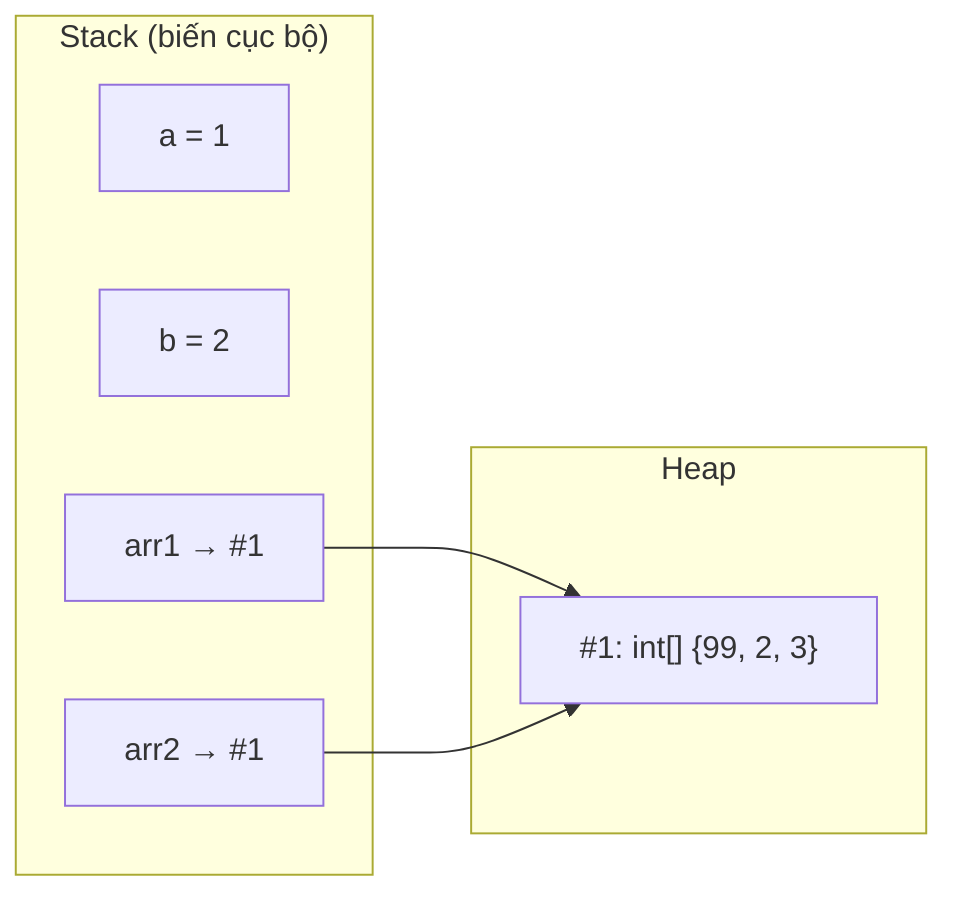

# Chương 2 — Biến, kiểu dữ liệu và chuỗi

## Mục tiêu

- Khai báo biến với kiểu rõ ràng và với `var`.
- Hiểu các kiểu số (`int`, `long`, `double`, `decimal`), `bool`, `char`, `string`.
- Phân biệt *value type* (kiểu giá trị) và *reference type* (kiểu tham chiếu).
- Dùng *nullable* (`int?`, `string?`) và các toán tử `?.`, `??`.
- Làm việc với chuỗi: nội suy, định dạng, `StringBuilder`, raw string.

## Giải thích đơn giản

C# là ngôn ngữ **kiểu tĩnh** (statically typed), giống TypeScript ở chế độ `strict`,
nhưng chặt hơn: kiểu tồn tại **cả lúc chạy** (runtime), không bị xóa như TypeScript.

- TypeScript chỉ có `number`. C# có nhiều kiểu số, mỗi kiểu có kích thước và độ chính xác riêng.
- `var` trong C# **không** giống `var` trong JavaScript. `var x = 5;` nghĩa là
  "compiler, hãy tự suy ra kiểu" → `x` là `int` mãi mãi. Giống `let x = 5` trong TS.

| Kiểu C# | Kích thước | Ví dụ | Dùng cho |
|---|---|---|---|
| `int` | 32 bit | `42` | số nguyên thông thường |
| `long` | 64 bit | `42L` | số lớn, ID |
| `double` | 64 bit | `3.14` | khoa học, đo lường |
| `decimal` | 128 bit | `19.99m` | **tiền tệ** |
| `bool` | — | `true` | đúng/sai |
| `char` | 16 bit | `'A'` | một ký tự UTF-16 |
| `string` | — | `"abc"` | chuỗi (reference type, bất biến) |

## Ví dụ

### Ví dụ 1 — Kiểu dữ liệu cơ bản

<!-- include: examples/Ch02.Types/Program.cs -->
```csharp
// 1. Khai báo biến: kiểu rõ ràng hoặc var (suy luận kiểu lúc biên dịch)
int age = 30;
var price = 19.99m;          // m = decimal (tiền tệ)
double ratio = 1.0 / 3;
bool isActive = true;
char grade = 'A';
Console.WriteLine($"age={age}, price={price}, ratio={ratio}, isActive={isActive}, grade={grade}");
Console.WriteLine($"Kiểu của price: {price.GetType().Name}");

// 2. Giới hạn và tràn số
Console.WriteLine($"int: {int.MinValue} .. {int.MaxValue}");
int big = int.MaxValue;
int overflow = unchecked(big + 1);
Console.WriteLine($"int.MaxValue + 1 (unchecked) = {overflow}");
try
{
    int boom = checked(big + 1);
    Console.WriteLine(boom);
}
catch (OverflowException ex)
{
    Console.WriteLine($"checked: {ex.GetType().Name}");
}

// 3. double và decimal
Console.WriteLine($"0.1 + 0.2 (double)  = {0.1 + 0.2}");
Console.WriteLine($"0.1 + 0.2 (decimal) = {0.1m + 0.2m}");

// 4. Chuyển kiểu
long l = age;                 // ngầm định (an toàn)
int back = (int)3.99;         // ép kiểu: cắt phần thập phân
int parsed = int.Parse("42");
bool ok = int.TryParse("abc", out int value);
Console.WriteLine($"l={l}, (int)3.99={back}, parsed={parsed}, TryParse(\"abc\")={ok}, value={value}");

// 5. Value type vs reference type
int a = 1;
int b = a;    // copy giá trị
b = 2;
int[] arr1 = [1, 2, 3];
int[] arr2 = arr1;  // copy tham chiếu: cùng một mảng
arr2[0] = 99;
Console.WriteLine($"a={a}, b={b}; arr1[0]={arr1[0]} (vì arr2 trỏ cùng mảng)");

// 6. Nullable
int? maybe = null;
Console.WriteLine($"maybe.HasValue={maybe.HasValue}, maybe ?? -1 = {maybe ?? -1}");
string? nickname = null;
Console.WriteLine($"Độ dài nickname: {nickname?.Length ?? 0}");

// 7. const và hằng số
const double Pi = 3.14159;
Console.WriteLine($"Diện tích hình tròn r=2: {Pi * 2 * 2:F2}");
```

Output thật:

<!-- output: examples/Ch02.Types -->
```text
age=30, price=19.99, ratio=0.3333333333333333, isActive=True, grade=A
Kiểu của price: Decimal
int: -2147483648 .. 2147483647
int.MaxValue + 1 (unchecked) = -2147483648
checked: OverflowException
0.1 + 0.2 (double)  = 0.30000000000000004
0.1 + 0.2 (decimal) = 0.3
l=30, (int)3.99=3, parsed=42, TryParse("abc")=False, value=0
a=1, b=2; arr1[0]=99 (vì arr2 trỏ cùng mảng)
maybe.HasValue=False, maybe ?? -1 = -1
Độ dài nickname: 0
Diện tích hình tròn r=2: 12.57
```

Các điểm cần để ý trong output:

- `unchecked(int.MaxValue + 1)` quay vòng về số âm. `checked(...)` ném `OverflowException`.
- `0.1 + 0.2` với `double` ra `0.30000000000000004` (giống JavaScript). Với `decimal` ra đúng `0.3`.
- `arr1[0]` bị đổi thành `99` vì `arr2 = arr1` chỉ copy **tham chiếu**.

### Ví dụ 2 — Chuỗi

<!-- include: examples/Ch02.Strings/Program.cs -->
```csharp
using System.Text;

string first = "Nguyễn";
string last = "Văn A";

// Nối chuỗi và nội suy chuỗi (string interpolation)
string full1 = first + " " + last;
string full2 = $"{first} {last}";
Console.WriteLine(full1 == full2);  // so sánh nội dung, không phải tham chiếu

// Định dạng số trong interpolation
decimal total = 1234567.891m;
Console.WriteLine($"Tổng: {total:N2} | {total,15:F1} | {0.256:P1}");

// Các phương thức hay dùng
string s = "  Hello, C# World  ";
Console.WriteLine($"[{s.Trim()}] upper={s.Trim().ToUpper()} len={s.Length}");
Console.WriteLine($"Contains C#: {s.Contains("C#")}, IndexOf World: {s.IndexOf("World")}");
Console.WriteLine($"Replace: {s.Trim().Replace("World", "Việt Nam")}");
string[] parts = "a,b,,c".Split(',', StringSplitOptions.RemoveEmptyEntries);
Console.WriteLine($"Split: {parts.Length} phần -> {string.Join(" | ", parts)}");

// So sánh không phân biệt hoa thường
Console.WriteLine(string.Equals("abc", "ABC", StringComparison.OrdinalIgnoreCase));

// Chuỗi là bất biến (immutable): mỗi lần "sửa" tạo chuỗi mới
string original = "abc";
string upper = original.ToUpper();
Console.WriteLine($"original={original}, upper={upper}");

// StringBuilder khi nối nhiều lần
var sb = new StringBuilder();
for (int i = 1; i <= 5; i++)
{
    sb.Append(i).Append(i < 5 ? "-" : "");
}
Console.WriteLine($"StringBuilder: {sb}");

// Verbatim và raw string literal
string path = @"C:\temp\file.txt";
string json = """
    { "name": "Nobin", "lang": "C#" }
    """;
Console.WriteLine(path);
Console.WriteLine(json);

// Truy cập ký tự, index từ cuối (^1) và range (..)
string word = "TypeScript";
Console.WriteLine($"{word[0]} {word[^1]} {word[..4]} {word[4..]}");
```

<!-- output: examples/Ch02.Strings -->
```text
True
Tổng: 1,234,567.89 |       1234567.9 | 25.6 %
[Hello, C# World] upper=HELLO, C# WORLD len=19
Contains C#: True, IndexOf World: 12
Replace: Hello, C# Việt Nam
Split: 3 phần -> a | b | c
True
original=abc, upper=ABC
StringBuilder: 1-2-3-4-5
C:\temp\file.txt
{ "name": "Nobin", "lang": "C#" }
T t Type Script
```

## Đi sâu

### Value type và reference type



- **Value type**: `int`, `double`, `decimal`, `bool`, `char`, `struct`, `enum`.
  Gán = copy toàn bộ giá trị.
- **Reference type**: `string`, mảng, `class`, `record` (class), interface, delegate.
  Gán = copy địa chỉ; hai biến cùng trỏ một object.
- `string` là reference type nhưng **bất biến** (immutable) và so sánh `==` theo nội dung,
  nên dùng giống value type.

Trong Java cũng vậy: `int` là primitive, `Integer`/`String` là object. Khác biệt: C# cho phép
bạn tự định nghĩa value type bằng `struct` (Chương 4).

### Nullable

- `int?` là viết tắt của `Nullable<int>`: value type có thể mang giá trị `null`.
- `string?` là *nullable reference type*: chỉ là **chú thích cho compiler**. Khi
  `Nullable` = `enable` (bộ sách bật sẵn), compiler cảnh báo nếu bạn dùng biến có thể null
  mà không kiểm tra. Vì `TreatWarningsAsErrors` = `true`, cảnh báo thành lỗi build.
- `x?.Length`: nếu `x` là null thì cả biểu thức là null, không ném lỗi.
- `a ?? b`: nếu `a` null thì dùng `b`. Giống hệt TypeScript.

### Chuyển kiểu

| Cách | Ví dụ | Khi nào lỗi |
|---|---|---|
| Ngầm định (implicit) | `long l = someInt;` | không bao giờ (an toàn) |
| Ép kiểu (cast) | `(int)3.99` → `3` | có thể mất dữ liệu |
| `Parse` | `int.Parse("42")` | ném `FormatException` nếu sai |
| `TryParse` | `int.TryParse(s, out var n)` | không ném, trả `false` |

Với dữ liệu người dùng nhập, **luôn dùng `TryParse`**.

### Định dạng chuỗi

`{value:format}` và `{value,width}` trong chuỗi nội suy:
`N2` (phân cách hàng nghìn, 2 số lẻ), `F1` (1 số lẻ), `P1` (phần trăm), `,15` (căn phải 15 ký tự),
`,-7` (căn trái 7 ký tự). Output dùng dấu `,` và `.` kiểu Mỹ vì bộ sách bật
`InvariantGlobalization` (xem `STACK.md`).

## Lỗi và bẫy thường gặp

- **Dùng `double` cho tiền**: sai số làm tròn. Dùng `decimal`.
- **Tràn số âm thầm**: mặc định C# không kiểm tra tràn `int`. Dùng `checked` hoặc `long`.
- **So sánh chuỗi không phân biệt hoa thường** bằng `ToLower()` → tạo chuỗi mới và có thể sai
  với một số ngôn ngữ. Dùng `string.Equals(a, b, StringComparison.OrdinalIgnoreCase)`.
- **Nối chuỗi trong vòng lặp lớn** bằng `+=` → chậm. Dùng `StringBuilder`.
- **Quên `m`**: `decimal price = 19.99;` là lỗi biên dịch, vì `19.99` là `double`. Viết `19.99m`.
- **`char` khác `string`**: `'A'` là `char`, `"A"` là `string`.

## Tóm tắt

- C# có nhiều kiểu số; chọn `int` cho số đếm, `decimal` cho tiền, `double` cho đo lường.
- `var` = suy luận kiểu lúc biên dịch, kiểu không đổi.
- Value type copy giá trị; reference type copy tham chiếu.
- `?.`, `??` và `T?` giúp xử lý null an toàn.
- Chuỗi bất biến; dùng `$"..."` để nội suy và `StringBuilder` khi nối nhiều.

## Bài tập (có lời giải)

1. Đổi 36.6 độ C sang độ F (`F = C * 9 / 5 + 32`), in 1 chữ số thập phân.
2. Tính tổng tiền 3 sản phẩm giá 19.990 VND, VAT 8%. Chọn kiểu dữ liệu đúng.
3. Đọc tuổi từ các chuỗi `"25"`, `"hai mươi"`, `""` mà không để chương trình bị lỗi.
4. Đảo ngược chuỗi `"Lap trinh CSharp"` và đếm số nguyên âm (a, e, i, o, u).

<details>
<summary>Lời giải</summary>

<!-- include: examples/Ch02.Solutions/Program.cs -->
```csharp
// Bài 1: đổi nhiệt độ C -> F, làm tròn 1 chữ số
double celsius = 36.6;
double fahrenheit = celsius * 9 / 5 + 32;
Console.WriteLine($"Bài 1: {celsius}°C = {fahrenheit:F1}°F");

// Bài 2: tính tiền với decimal (không dùng double cho tiền)
decimal unitPrice = 19_990m;
int quantity = 3;
decimal vat = 0.08m;
decimal total = unitPrice * quantity * (1 + vat);
Console.WriteLine($"Bài 2: tổng tiền = {total:N0} VND");

// Bài 3: đọc số an toàn bằng TryParse
foreach (var input in new[] { "25", "hai mươi", "" })
{
    string result = int.TryParse(input, out int age) ? $"tuổi = {age}" : "không hợp lệ";
    Console.WriteLine($"Bài 3: '{input}' -> {result}");
}

// Bài 4: đảo ngược chuỗi và đếm nguyên âm
string text = "Lap trinh CSharp";
char[] chars = text.ToCharArray();
Array.Reverse(chars);
int vowels = text.ToLower().Count(c => "aeiou".Contains(c));
Console.WriteLine($"Bài 4: đảo ngược = '{new string(chars)}', số nguyên âm = {vowels}");
```

<!-- output: examples/Ch02.Solutions -->
```text
Bài 1: 36.6°C = 97.9°F
Bài 2: tổng tiền = 64,768 VND
Bài 3: '25' -> tuổi = 25
Bài 3: 'hai mươi' -> không hợp lệ
Bài 3: '' -> không hợp lệ
Bài 4: đảo ngược = 'prahSC hnirt paL', số nguyên âm = 3
```

Giải thích: bài 2 dùng `decimal` vì là tiền; bài 3 dùng `TryParse` để không ném exception;
bài 4 dùng `Count` của LINQ (sẽ học kỹ ở Tập 2).
</details>

## Nguồn tham khảo (Sources)

- Built-in types: https://github.com/dotnet/docs/blob/main/docs/csharp/language-reference/builtin-types/built-in-types.md
- Integral numeric types: https://github.com/dotnet/docs/blob/main/docs/csharp/language-reference/builtin-types/integral-numeric-types.md
- Floating-point numeric types: https://github.com/dotnet/docs/blob/main/docs/csharp/language-reference/builtin-types/floating-point-numeric-types.md
- Nullable value types: https://github.com/dotnet/docs/blob/main/docs/csharp/language-reference/builtin-types/nullable-value-types.md
- Nullable reference types: https://github.com/dotnet/docs/blob/main/docs/csharp/fundamentals/null-safety/nullable-reference-types.md
- Strings: https://github.com/dotnet/docs/blob/main/docs/csharp/fundamentals/strings/index.md
- Raw string literals: https://github.com/dotnet/docs/blob/main/docs/csharp/fundamentals/strings/raw-string-literals.md
