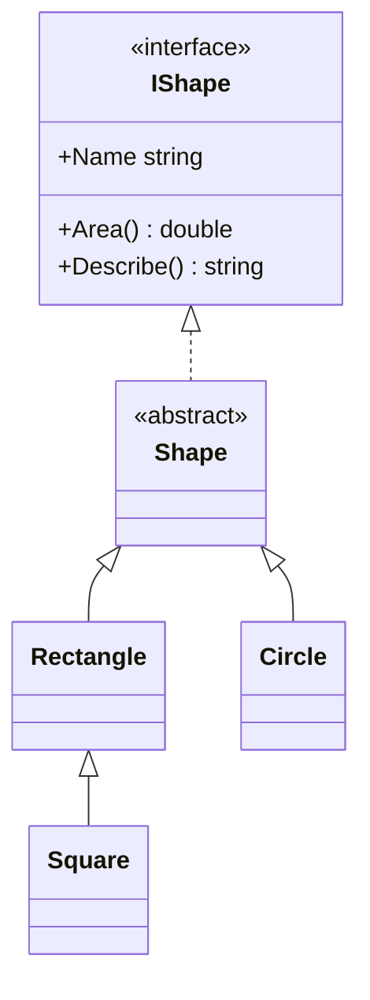

# Chương 4 — Lập trình hướng đối tượng

## Mục tiêu

- Viết class với field, *property*, constructor, phương thức.
- Dùng từ khóa `field` mới của C# 14 trong property.
- Hiểu *access modifier* (`public`, `private`, `protected`, `internal`).
- Dùng interface, abstract class, kế thừa, `override`, `sealed`.
- Biết khi nào dùng `struct` thay vì `class`.
- Dùng *primary constructor*, `required` và `init`.

## Giải thích đơn giản

OOP trong C# rất giống Java và class trong TypeScript. Khác biệt lớn nhất là **property**:

- Java: `private int age; getAge(); setAge(...)`.
- TypeScript: `get age() {...}` / `set age(v) {...}`.
- C#: `public int Age { get; set; }` — một dòng, compiler tự tạo field ẩn (*backing field*).

Property nhìn như field khi dùng (`account.Balance`), nhưng thực chất là hàm `get`/`set`,
nên bạn có thể thêm kiểm tra dữ liệu (validation) sau này mà không đổi code gọi.

## Ví dụ

Project `Ch04.Oop` có 3 file.

**`BankAccount.cs`** — class với property, constructor và từ khóa `field`:

<!-- include: examples/Ch04.Oop/BankAccount.cs -->
```csharp
namespace Ch04.Oop;

// Class với field private, property, constructor và phương thức
public class BankAccount
{
    private readonly List<string> _history = [];

    public BankAccount(string owner, decimal initialBalance = 0)
    {
        Owner = owner;
        Balance = initialBalance;
        _history.Add($"Mở tài khoản: {initialBalance:N0}");
    }

    public string Owner { get; }                  // chỉ đọc (read-only)
    public decimal Balance { get; private set; }  // chỉ class này được gán

    // C# 14: từ khóa `field` = backing field do compiler tạo sẵn
    public string Note
    {
        get;
        set => field = string.IsNullOrWhiteSpace(value) ? "(trống)" : value.Trim();
    } = "(trống)";

    public void Deposit(decimal amount)
    {
        if (amount <= 0) throw new ArgumentOutOfRangeException(nameof(amount), "Số tiền phải > 0");
        Balance += amount;
        _history.Add($"Nạp: {amount:N0}");
    }

    public bool TryWithdraw(decimal amount)
    {
        if (amount > Balance) return false;
        Balance -= amount;
        _history.Add($"Rút: {amount:N0}");
        return true;
    }

    public IReadOnlyList<string> History => _history;

    public override string ToString() => $"{Owner}: {Balance:N0} VND";
}
```

**`Shapes.cs`** — interface, abstract class, kế thừa, struct, `required`:

<!-- include: examples/Ch04.Oop/Shapes.cs -->
```csharp
namespace Ch04.Oop;

// Interface: "hợp đồng" mà class phải thực hiện
public interface IShape
{
    string Name { get; }
    double Area();
    // Default interface method (có thân hàm sẵn)
    string Describe() => $"{Name} có diện tích {Area():F2}";
}

// Abstract class: không tạo object trực tiếp được
public abstract class Shape : IShape
{
    public abstract string Name { get; }
    public abstract double Area();
    public override string ToString() => ((IShape)this).Describe();
}

// Primary constructor (C# 12): tham số (width, height) dùng trong cả class
public class Rectangle(double width, double height) : Shape
{
    public double Width { get; } = width;
    public double Height { get; } = height;
    public override string Name => "Hình chữ nhật";
    public override double Area() => Width * Height;
}

public sealed class Square(double side) : Rectangle(side, side)
{
    public override string Name => "Hình vuông";
}

public class Circle(double radius) : Shape
{
    public override string Name => "Hình tròn";
    public override double Area() => Math.PI * radius * radius;
}

// struct: value type, thích hợp cho dữ liệu nhỏ, bất biến
public readonly struct Point(int x, int y)
{
    public int X { get; } = x;
    public int Y { get; } = y;
    public Point Move(int dx, int dy) => new(X + dx, Y + dy);
    public override string ToString() => $"({X}, {Y})";
}

// required + init: bắt buộc gán khi khởi tạo, không sửa được sau đó
public class Product
{
    public required string Sku { get; init; }
    public required string Name { get; init; }
    public decimal Price { get; init; }
    public static int CreatedCount { get; private set; }   // static: thuộc về class
    public Product() => CreatedCount++;
}
```

**`Program.cs`**:

<!-- include: examples/Ch04.Oop/Program.cs -->
```csharp
using Ch04.Oop;

// 1. Class và object
var account = new BankAccount("Nobin", 1_000_000);
account.Deposit(500_000);
bool ok = account.TryWithdraw(2_000_000);
Console.WriteLine($"Rút 2 triệu thành công? {ok}");
account.TryWithdraw(300_000);
account.Note = "   tài khoản lương   ";
Console.WriteLine(account);
Console.WriteLine($"Note: '{account.Note}'");
Console.WriteLine("Lịch sử: " + string.Join("; ", account.History));

try
{
    account.Deposit(-5);
}
catch (ArgumentOutOfRangeException ex)
{
    Console.WriteLine($"Lỗi: {ex.Message}");
}

// 2. Kế thừa và đa hình (polymorphism)
List<IShape> shapes = [new Rectangle(3, 4), new Square(2), new Circle(1)];
foreach (var shape in shapes)
{
    Console.WriteLine(shape.Describe());
}
Console.WriteLine($"Square là Rectangle? {shapes[1] is Rectangle}");

// 3. struct là value type: copy khi gán
var p1 = new Point(1, 2);
var p2 = p1.Move(10, 0);
Console.WriteLine($"p1={p1}, p2={p2}");

// 4. required / init / static
var product = new Product { Sku = "SKU-1", Name = "Bàn phím", Price = 750_000 };
_ = new Product { Sku = "SKU-2", Name = "Chuột" };
Console.WriteLine($"{product.Name} giá {product.Price:N0}; đã tạo {Product.CreatedCount} sản phẩm");
```

Output thật:

<!-- output: examples/Ch04.Oop -->
```text
Rút 2 triệu thành công? False
Nobin: 1,200,000 VND
Note: 'tài khoản lương'
Lịch sử: Mở tài khoản: 1,000,000; Nạp: 500,000; Rút: 300,000
Lỗi: Số tiền phải > 0 (Parameter 'amount')
Hình chữ nhật có diện tích 12.00
Hình vuông có diện tích 4.00
Hình tròn có diện tích 3.14
Square là Rectangle? True
p1=(1, 2), p2=(11, 2)
Bàn phím giá 750,000; đã tạo 2 sản phẩm
```

## Đi sâu

### Property và từ khóa `field` (C# 14)

Trước C# 14, muốn thêm logic vào `set` bạn phải tự khai báo field:

```csharp
private string _note = "(trống)";
public string Note { get => _note; set => _note = value.Trim(); }
```

Với C# 14, `field` là backing field do compiler tạo:

```csharp
public string Note { get; set => field = value.Trim(); } = "(trống)";
```

Ngắn hơn và không ai trong class truy cập nhầm `_note` được. Nếu class của bạn đã có
một thành viên tên `field`, dùng `@field` hoặc `this.field` để phân biệt.

### Access modifiers

| Modifier | Ai truy cập được | Java tương đương |
|---|---|---|
| `public` | mọi nơi | `public` |
| `private` | chỉ trong class (mặc định cho member) | `private` |
| `protected` | class và class con | `protected` (Java còn cho cả package) |
| `internal` | trong cùng assembly (project) — mặc định cho class | gần giống package-private |
| `protected internal`, `private protected` | kết hợp | — |

### Kế thừa và đa hình



- C# chỉ cho kế thừa **một** class, nhưng implement **nhiều** interface (giống Java).
- Phương thức muốn cho class con ghi đè phải là `virtual` hoặc `abstract`; class con dùng
  `override`. Java thì mọi method mặc định là virtual — C# thì **không**.
- `sealed` = không cho kế thừa tiếp (giống `final` của Java).
- Interface có thể có *default method* (`Describe()` ở trên).

### Primary constructor (C# 12)

`public class Circle(double radius) : Shape` — tham số `radius` dùng được trong toàn class.
Nó **không** tự trở thành property; muốn public thì gán: `public double Radius { get; } = radius;`.
Với `record` (Tập 2), tham số của primary constructor **tự** thành property.

### struct hay class?

| | `class` | `struct` |
|---|---|---|
| Loại | reference type | value type |
| Gán | copy tham chiếu | copy toàn bộ dữ liệu |
| Null | có thể null | không (trừ `T?`) |
| Kế thừa | có | không |
| Dùng khi | hầu hết trường hợp | dữ liệu nhỏ (≤ ~16 byte), bất biến: `Point`, `Money` |

Nên dùng `readonly struct` để tránh lỗi copy rồi sửa nhầm bản copy.

### `required` và `init`

- `init`: chỉ gán được lúc khởi tạo (`new Product { Name = ... }`), sau đó chỉ đọc.
- `required`: compiler bắt buộc người tạo object phải gán. Thiếu → lỗi CS9035.

## Lỗi và bẫy thường gặp

- **Quên `virtual`**: viết method cùng tên ở class con mà cha không `virtual` → đó là *ẩn*
  (hiding, cảnh báo CS0108), không phải override. Gọi qua biến kiểu cha sẽ chạy method của cha.
- **Field public**: nên dùng property, không public field (trừ `const`/`static readonly`).
- **Struct lớn, có thể sửa**: copy ngầm khiến bạn sửa bản copy, bản gốc không đổi.
- **Gọi method virtual trong constructor**: class con chưa khởi tạo xong.
- **So sánh object bằng `==`**: với class, `==` mặc định so sánh tham chiếu. Muốn so sánh
  theo giá trị → dùng `record` (Tập 2).

## Tóm tắt

- Property = cách chuẩn để lộ dữ liệu; `field` (C# 14) giúp thêm logic dễ dàng.
- Một class cha, nhiều interface; phải `virtual`/`abstract` mới `override` được.
- Primary constructor, `required`, `init` giúp code ngắn và an toàn.
- `struct` cho dữ liệu nhỏ, bất biến; còn lại dùng `class`.

## Bài tập (có lời giải)

1. Viết class `Student` có `Name` (chỉ đọc) và `Score` (0–10, ném exception nếu sai) dùng `field`.
2. Cho `Student` implement interface `IGradable` với method `Grade()` trả về xếp loại.
3. Viết abstract class `Animal` với `Speak()`, và class `Dog`, `Cat` override nó.
4. Viết `readonly struct Money(decimal amount, string currency)` với method `Multiply`.

<details>
<summary>Lời giải</summary>

<!-- include: examples/Ch04.Solutions/Program.cs -->
```csharp
// Bài 1 + 2: class Student với validation bằng `field`, và interface IGradable
var s = new Student("An") { Score = 8.5 };
Console.WriteLine($"Bài 1: {s.Name} điểm {s.Score}, xếp loại {s.Grade()}");
try
{
    s.Score = 11;
}
catch (ArgumentOutOfRangeException ex)
{
    Console.WriteLine($"Bài 1: lỗi -> {ex.ParamName}: {ex.Message.Split(" (")[0]}");
}

// Bài 3: kế thừa + override
Animal[] animals = [new Dog("Mực"), new Cat("Mướp")];
foreach (var a in animals) Console.WriteLine($"Bài 3: {a.Name} kêu {a.Speak()}");

// Bài 4: struct Money bất biến
var price = new Money(100_000, "VND");
var doubled = price.Multiply(2);
Console.WriteLine($"Bài 4: {price} x2 = {doubled}");

public interface IGradable
{
    string Grade();
}

public class Student(string name) : IGradable
{
    public string Name { get; } = name;

    public double Score
    {
        get;
        set => field = value is >= 0 and <= 10
            ? value
            : throw new ArgumentOutOfRangeException(nameof(Score), "Điểm phải từ 0 đến 10");
    }

    public string Grade() => Score switch { >= 8 => "Giỏi", >= 6.5 => "Khá", >= 5 => "TB", _ => "Yếu" };
}

public abstract class Animal(string name)
{
    public string Name { get; } = name;
    public abstract string Speak();
}

public class Dog(string name) : Animal(name) { public override string Speak() => "Gâu gâu"; }
public class Cat(string name) : Animal(name) { public override string Speak() => "Meo meo"; }

public readonly struct Money(decimal amount, string currency)
{
    public decimal Amount { get; } = amount;
    public string Currency { get; } = currency;
    public Money Multiply(decimal factor) => new(Amount * factor, Currency);
    public override string ToString() => $"{Amount:N0} {Currency}";
}
```

<!-- output: examples/Ch04.Solutions -->
```text
Bài 1: An điểm 8.5, xếp loại Giỏi
Bài 1: lỗi -> Score: Điểm phải từ 0 đến 10
Bài 3: Mực kêu Gâu gâu
Bài 3: Mướp kêu Meo meo
Bài 4: 100,000 VND x2 = 200,000 VND
```

Chú ý: type declarations (class, interface, struct) phải đặt **sau** top-level statements
trong cùng file.
</details>

## Nguồn tham khảo (Sources)

- Classes: https://github.com/dotnet/docs/blob/main/docs/csharp/fundamentals/types/classes.md
- Inheritance: https://github.com/dotnet/docs/blob/main/docs/csharp/fundamentals/object-oriented/inheritance.md
- Polymorphism: https://github.com/dotnet/docs/blob/main/docs/csharp/fundamentals/object-oriented/polymorphism.md
- Interfaces: https://github.com/dotnet/docs/blob/main/docs/csharp/fundamentals/types/interfaces.md
- Structs: https://github.com/dotnet/docs/blob/main/docs/csharp/fundamentals/types/structs.md
- `field` keyword (C# 14 proposal): https://github.com/dotnet/csharplang/blob/main/proposals/csharp-14.0/field-keyword.md
- Primary constructors (C# 12 proposal): https://github.com/dotnet/csharplang/blob/main/proposals/csharp-12.0/primary-constructors.md
