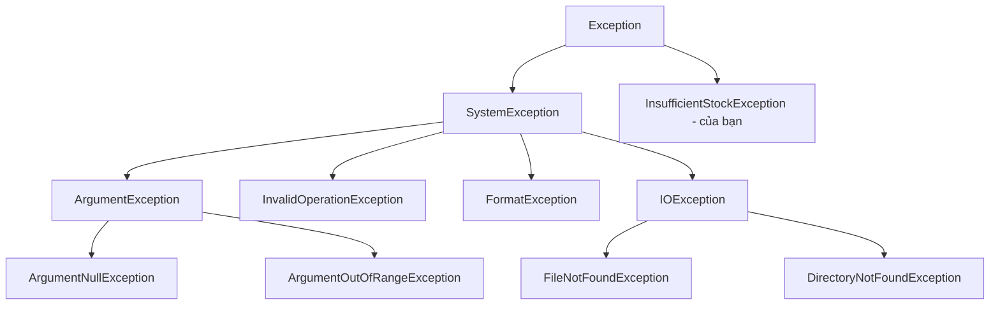

# Chương 6 — Exceptions và làm việc với file

## Mục tiêu

- Bắt và xử lý lỗi với `try` / `catch` / `finally`, *exception filter* (`when`).
- Tạo *custom exception* (exception tự định nghĩa) và bọc lỗi bằng `InnerException`.
- Dùng `using` để giải phóng tài nguyên (file, kết nối).
- Đọc/ghi file với `File`, `StreamReader`, `StreamWriter`, `Path`, `Directory`, `FileInfo`.

## Giải thích đơn giản

*Exception* (ngoại lệ) là cách .NET báo lỗi: khi có lỗi, runtime "ném" (throw) một object
exception, và chương trình nhảy đến khối `catch` gần nhất phù hợp. Giống `try/catch` trong TS
và Java, với vài khác biệt:

- C# **không có checked exception** như Java. Không cần khai báo `throws`.
- Bạn bắt theo **kiểu** exception: `catch (FileNotFoundException ex)`. TS chỉ có `catch (e)`.
- `using` tự động gọi `Dispose()` để đóng file — giống `try-with-resources` của Java.

## Ví dụ

Custom exception dùng primary constructor:

<!-- include: examples/Ch06.Files/InsufficientStockException.cs -->
```csharp
namespace Ch06.Files;

// Custom exception: kế thừa Exception, thêm dữ liệu riêng
public class InsufficientStockException(string sku, int requested, int available)
    : Exception($"Không đủ hàng cho {sku}: cần {requested}, còn {available}")
{
    public string Sku { get; } = sku;
    public int Requested { get; } = requested;
    public int Available { get; } = available;
}
```

Chương trình chính (phần 1: exceptions, phần 2: file):

<!-- include: examples/Ch06.Files/Program.cs -->
```csharp
using System.Text;
using Ch06.Files;

// ---------- Phần 1: Exceptions ----------
static int ParseQuantity(string input)
{
    try
    {
        return int.Parse(input);
    }
    catch (FormatException)
    {
        Console.WriteLine($"  '{input}' không phải số -> dùng 0");
        return 0;
    }
    finally
    {
        Console.WriteLine($"  finally luôn chạy (input='{input}')");
    }
}

Console.WriteLine($"ParseQuantity(\"12\") = {ParseQuantity("12")}");
Console.WriteLine($"ParseQuantity(\"x\") = {ParseQuantity("x")}");

static void Reserve(string sku, int requested, int available)
{
    if (requested > available)
        throw new InsufficientStockException(sku, requested, available);
    Console.WriteLine($"  Đã giữ {requested} {sku}");
}

try
{
    Reserve("SKU-1", 2, 5);
    Reserve("SKU-2", 9, 3);
}
catch (InsufficientStockException ex) when (ex.Available > 0)   // exception filter
{
    Console.WriteLine($"  Bắt được: {ex.Message} (thiếu {ex.Requested - ex.Available})");
}

// Bọc exception để thêm ngữ cảnh, giữ InnerException
try
{
    try { _ = int.Parse("abc"); }
    catch (FormatException inner) { throw new InvalidOperationException("Đọc cấu hình thất bại", inner); }
}
catch (InvalidOperationException ex)
{
    Console.WriteLine($"  {ex.Message} <- {ex.InnerException?.GetType().Name}");
}

// ---------- Phần 2: File và thư mục ----------
string dir = Path.Combine(Path.GetTempPath(), "csharp-book-ch06");
Directory.CreateDirectory(dir);
string csvPath = Path.Combine(dir, "products.csv");

// Ghi toàn bộ file một lần
string[] lines =
[
    "sku,name,price",
    "SKU-1,Bàn phím,750000",
    "SKU-2,Chuột,250000",
    "SKU-3,Màn hình,3200000",
];
File.WriteAllLines(csvPath, lines, Encoding.UTF8);
Console.WriteLine($"Đã ghi {lines.Length} dòng vào {Path.GetFileName(csvPath)}");

// Đọc từng dòng bằng StreamReader + using (tự Dispose khi ra khỏi scope)
decimal total = 0;
using (var reader = new StreamReader(csvPath, Encoding.UTF8))
{
    _ = reader.ReadLine(); // bỏ header
    string? line;
    while ((line = reader.ReadLine()) is not null)
    {
        var cols = line.Split(',');
        total += decimal.Parse(cols[2]);
        Console.WriteLine($"  {cols[0]} | {cols[1],-10} | {decimal.Parse(cols[2]),12:N0}");
    }
}
Console.WriteLine($"Tổng giá: {total:N0}");

// Ghi thêm (append) bằng using declaration (C# 8)
{
    using var writer = new StreamWriter(csvPath, append: true, Encoding.UTF8);
    writer.WriteLine("SKU-4,Tai nghe,990000");
}
Console.WriteLine($"Số dòng sau khi append: {File.ReadAllLines(csvPath).Length}");

// Thông tin file
var info = new FileInfo(csvPath);
Console.WriteLine($"Kích thước: {info.Length} bytes, đuôi: {info.Extension}");

// File không tồn tại
try
{
    File.ReadAllText(Path.Combine(dir, "missing.txt"));
}
catch (FileNotFoundException ex)
{
    Console.WriteLine($"FileNotFoundException: {Path.GetFileName(ex.FileName)}");
}

// Dọn dẹp
Directory.Delete(dir, recursive: true);
Console.WriteLine($"Đã xóa thư mục tạm? {!Directory.Exists(dir)}");
```

Output thật:

<!-- output: examples/Ch06.Files -->
```text
  finally luôn chạy (input='12')
ParseQuantity("12") = 12
  'x' không phải số -> dùng 0
  finally luôn chạy (input='x')
ParseQuantity("x") = 0
  Đã giữ 2 SKU-1
  Bắt được: Không đủ hàng cho SKU-2: cần 9, còn 3 (thiếu 6)
  Đọc cấu hình thất bại <- FormatException
Đã ghi 4 dòng vào products.csv
  SKU-1 | Bàn phím   |      750,000
  SKU-2 | Chuột      |      250,000
  SKU-3 | Màn hình   |    3,200,000
Tổng giá: 4,200,000
Số dòng sau khi append: 5
Kích thước: 110 bytes, đuôi: .csv
FileNotFoundException: missing.txt
Đã xóa thư mục tạm? True
```

Để ý thứ tự dòng: `finally luôn chạy` được in **trước** `ParseQuantity("12") = 12`,
vì `finally` chạy trước khi hàm thực sự trả về, còn dòng `Console.WriteLine` bên ngoài chỉ
chạy sau khi có kết quả.

## Đi sâu

### Cây exception thường gặp



- Bắt exception **cụ thể** trước, tổng quát sau. `catch (Exception)` chỉ nên dùng ở tầng
  ngoài cùng (ví dụ middleware Web API ở Tập 3) để ghi log.
- `throw;` (không kèm biến) ném lại exception **giữ nguyên stack trace**.
  `throw ex;` làm mất stack trace gốc — tránh dùng.
- *Exception filter* `catch (X ex) when (điều kiện)`: chỉ bắt khi điều kiện đúng; nếu sai,
  exception tiếp tục đi lên như chưa bị bắt.

### Khi nào ném exception?

- Tham số sai → `ArgumentException` / `ArgumentNullException` / `ArgumentOutOfRangeException`.
  Có hàm tiện ích: `ArgumentNullException.ThrowIfNull(x)`, `ArgumentOutOfRangeException.ThrowIfNegative(n)`.
- Trạng thái object không cho phép → `InvalidOperationException`.
- Lỗi "bình thường, dự đoán được" (người dùng nhập sai) → nên dùng mẫu `TryXxx` trả `bool`,
  vì exception tốn chi phí hơn.

### `using` và `IDisposable`

```csharp
using (var reader = new StreamReader(path)) { ... }   // khối using
using var writer = new StreamWriter(path);             // using declaration: Dispose khi hết scope
```

Mọi class giữ tài nguyên hệ điều hành (file, socket, kết nối DB) implement `IDisposable`.
`using` đảm bảo `Dispose()` được gọi **kể cả khi có exception** (compiler sinh `try/finally`).

### API file hay dùng

| Việc | API | Ghi chú |
|---|---|---|
| Đọc/ghi cả file nhỏ | `File.ReadAllText`, `File.WriteAllLines` | đơn giản nhất |
| Đọc từng dòng file lớn | `File.ReadLines` (lười), `StreamReader` | không nạp hết vào RAM |
| Ghi thêm | `File.AppendAllText`, `new StreamWriter(path, append: true)` | |
| Đường dẫn | `Path.Combine`, `Path.GetFileName`, `Path.GetTempPath` | không tự nối bằng `+ "/"` |
| Thư mục | `Directory.CreateDirectory`, `Directory.Delete(dir, true)` | |
| Thông tin | `FileInfo.Length`, `.Extension`, `File.Exists` | |
| Bất đồng bộ | `File.ReadAllTextAsync`, ... | dùng trong Web API (Tập 2 ch.5) |

## Lỗi và bẫy thường gặp

- **Nuốt lỗi** (`catch { }` rỗng): lỗi biến mất, rất khó debug. Ít nhất hãy ghi log.
- **Dùng exception cho luồng bình thường**: chậm và khó đọc. Dùng `TryParse`, `TryGetValue`.
- **Quên `using`**: file bị khóa, rò rỉ tài nguyên.
- **Nối đường dẫn bằng tay** `"dir" + "\\" + "file"`: sai trên Linux. Dùng `Path.Combine`.
- **`File.Exists` rồi mới mở**: file có thể bị xóa giữa hai lệnh (race condition). Hãy mở và
  bắt `FileNotFoundException`.
- **Quên encoding**: nên chỉ rõ `Encoding.UTF8` khi làm việc với tiếng Việt.

## Tóm tắt

- `try/catch/finally`, bắt exception cụ thể, dùng `when` khi cần lọc.
- Custom exception kế thừa `Exception`, thêm thuộc tính riêng.
- `using` đảm bảo tài nguyên được giải phóng.
- `File`, `Path`, `Directory`, `StreamReader/Writer` là bộ công cụ file cơ bản.

## Bài tập (có lời giải)

1. Ghi file log 4 dòng rồi đếm số dòng bắt đầu bằng `ERROR`.
2. Viết `ReadOrNull(path)` trả về nội dung file hoặc `null` nếu file không tồn tại.
3. Tạo `InsufficientFundsException` và ném nó khi rút quá số dư; dùng `finally` để dọn thư mục tạm.

<details>
<summary>Lời giải</summary>

<!-- include: examples/Ch06.Solutions/Program.cs -->
```csharp
using System.Text;

string dir = Path.Combine(Path.GetTempPath(), "csharp-book-ch06-sol");
Directory.CreateDirectory(dir);
string log = Path.Combine(dir, "app.log");

// Bài 1: ghi log và đếm số dòng ERROR
File.WriteAllLines(log, ["INFO start", "ERROR db timeout", "INFO retry", "ERROR db timeout"], Encoding.UTF8);
int errors = File.ReadLines(log).Count(l => l.StartsWith("ERROR"));
Console.WriteLine($"Bài 1: số dòng ERROR = {errors}");

// Bài 2: hàm đọc file an toàn, trả về null nếu không có file
Console.WriteLine($"Bài 2: có file -> {ReadOrNull(log)?.Length} ký tự; không có file -> {ReadOrNull(Path.Combine(dir, "x.txt")) ?? "null"}");

// Bài 3: custom exception + finally
try
{
    Withdraw(balance: 100, amount: 150);
}
catch (InsufficientFundsException ex)
{
    Console.WriteLine($"Bài 3: {ex.Message}");
}
finally
{
    Directory.Delete(dir, recursive: true);
    Console.WriteLine("Bài 3: finally đã dọn thư mục tạm");
}

static string? ReadOrNull(string path)
{
    try { return File.ReadAllText(path); }
    catch (FileNotFoundException) { return null; }
}

static void Withdraw(decimal balance, decimal amount)
{
    if (amount > balance) throw new InsufficientFundsException(amount - balance);
}

public class InsufficientFundsException(decimal missing)
    : Exception($"Thiếu {missing} để rút tiền")
{
    public decimal Missing { get; } = missing;
}
```

<!-- output: examples/Ch06.Solutions -->
```text
Bài 1: số dòng ERROR = 2
Bài 2: có file -> 56 ký tự; không có file -> null
Bài 3: Thiếu 50 để rút tiền
Bài 3: finally đã dọn thư mục tạm
```

Bài 1 dùng `File.ReadLines` (đọc lười từng dòng) kết hợp `Count` của LINQ.
</details>

## Nguồn tham khảo (Sources)

- Exceptions and exception handling: https://github.com/dotnet/docs/blob/main/docs/csharp/fundamentals/exceptions/index.md
- Creating and throwing exceptions: https://github.com/dotnet/docs/blob/main/docs/csharp/fundamentals/exceptions/creating-and-throwing-exceptions.md
- Exception handling (try/catch/finally): https://github.com/dotnet/docs/blob/main/docs/csharp/fundamentals/exceptions/exception-handling.md
- File and stream I/O: https://github.com/dotnet/docs/blob/main/docs/standard/io/index.md
