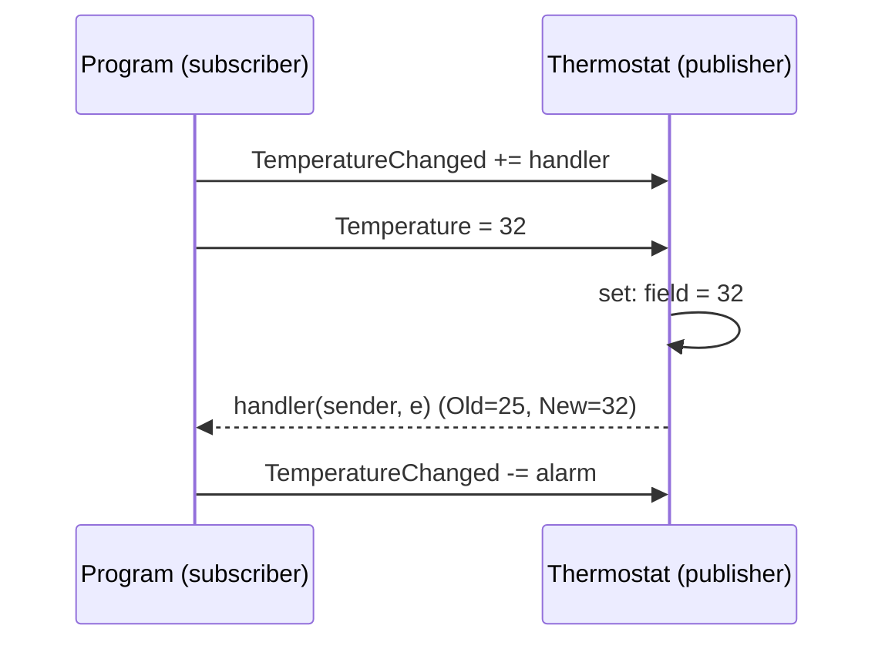

# Chương 2 — Delegates, lambda và events

## Mục tiêu

- Hiểu *delegate* (kiểu đại diện cho hàm) và dùng `Func`, `Action`, `Predicate`.
- Viết *lambda expression* và hiểu *closure*.
- Dùng *multicast delegate* và `event` theo mẫu publisher/subscriber.
- Biết tính năng C# 14: modifier (`out`, `ref`) trên tham số lambda không cần ghi kiểu.

## Giải thích đơn giản

Trong TypeScript, hàm là giá trị: `const f = (x: number) => x * 2;` và kiểu của nó là
`(x: number) => number`. Trong C#, **delegate** là "kiểu của hàm":

| TypeScript | C# |
|---|---|
| `(x: number) => number` | `Func<int, int>` |
| `(msg: string) => void` | `Action<string>` |
| `(n: number) => boolean` | `Predicate<int>` hoặc `Func<int, bool>` |
| `() => void` | `Action` |

Quy tắc nhớ: `Func<T1, T2, ..., TResult>` — **kiểu cuối cùng là kiểu trả về**.
`Action<...>` không trả về gì (`void`).

**Event** là delegate được "bảo vệ": bên ngoài chỉ được `+=` (đăng ký) và `-=` (hủy),
không được gọi hay gán đè. Giống `addEventListener` trong DOM.

## Ví dụ

<!-- include: examples/V2Ch02.Delegates/Program.cs -->
```csharp
// 1. Delegate tự khai báo
Calculate add = (a, b) => a + b;
Calculate mul = Multiply;               // method group
Console.WriteLine($"add(2,3)={add(2, 3)}, mul(2,3)={mul(2, 3)}");

// 2. Func và Action có sẵn
Func<int, int> square = x => x * x;
Func<string, int, string> repeat = (s, n) => string.Concat(Enumerable.Repeat(s, n));
Action<string> log = msg => Console.WriteLine($"[log] {msg}");
Predicate<int> isEven = n => n % 2 == 0;
log($"square(5)={square(5)}, repeat(\"ab\",3)={repeat("ab", 3)}, isEven(4)={isEven(4)}");

// 3. Hàm nhận hàm (higher-order function)
static List<TOut> Map<TIn, TOut>(IEnumerable<TIn> source, Func<TIn, TOut> f)
{
    var result = new List<TOut>();
    foreach (var item in source) result.Add(f(item));
    return result;
}
Console.WriteLine($"Map: {string.Join(", ", Map([1, 2, 3], x => $"#{x}"))}");

// 4. Closure: lambda "nhớ" biến bên ngoài
Func<int> MakeCounter()
{
    int count = 0;
    return () => ++count;
}
var next = MakeCounter();
Console.WriteLine($"Counter: {next()}, {next()}, {next()}");

// 5. Multicast delegate: một delegate gọi nhiều hàm
Action<string> pipeline = s => Console.WriteLine($"  bước 1: {s}");
pipeline += s => Console.WriteLine($"  bước 2: {s.ToUpper()}");
pipeline("xin chào");

// 6. Event: publisher / subscriber
var thermostat = new Thermostat();
thermostat.TemperatureChanged += (sender, e) =>
    Console.WriteLine($"  Nhiệt độ: {e.OldValue} -> {e.NewValue}");
EventHandler<TemperatureChangedEventArgs> alarm = (_, e) =>
{
    if (e.NewValue > 30) Console.WriteLine("  CẢNH BÁO: quá nóng!");
};
thermostat.TemperatureChanged += alarm;
thermostat.Temperature = 25;
thermostat.Temperature = 32;
thermostat.TemperatureChanged -= alarm;    // hủy đăng ký
thermostat.Temperature = 35;
thermostat.Temperature = 35;               // không đổi -> không phát event

// 7. C# 14: modifier trên tham số lambda không cần ghi kiểu
TryParser<int> parse = (text, out result) => int.TryParse(text, out result);
Console.WriteLine($"parse(\"12\") -> {parse("12", out var n)} ({n})");

static int Multiply(int a, int b) => a * b;

delegate int Calculate(int a, int b);
delegate bool TryParser<T>(string text, out T result);

public class TemperatureChangedEventArgs(double oldValue, double newValue) : EventArgs
{
    public double OldValue { get; } = oldValue;
    public double NewValue { get; } = newValue;
}

public class Thermostat
{
    public event EventHandler<TemperatureChangedEventArgs>? TemperatureChanged;

    public double Temperature
    {
        get;
        set
        {
            if (field == value) return;
            var old = field;
            field = value;
            TemperatureChanged?.Invoke(this, new TemperatureChangedEventArgs(old, value));
        }
    }
}
```

Output thật:

<!-- output: examples/V2Ch02.Delegates -->
```text
add(2,3)=5, mul(2,3)=6
[log] square(5)=25, repeat("ab",3)=ababab, isEven(4)=True
Map: #1, #2, #3
Counter: 1, 2, 3
  bước 1: xin chào
  bước 2: XIN CHÀO
  Nhiệt độ: 0 -> 25
  Nhiệt độ: 25 -> 32
  CẢNH BÁO: quá nóng!
  Nhiệt độ: 32 -> 35
parse("12") -> True (12)
```

Dòng `Nhiệt độ: 32 -> 35` không kèm cảnh báo, vì `alarm` đã bị hủy đăng ký (`-=`).
Lần gán `35` thứ hai không in gì vì setter bỏ qua giá trị không đổi.

## Đi sâu

### Delegate là object

`Calculate add = (a, b) => a + b;` tạo một object delegate trỏ tới hàm. Có thể truyền nó
làm tham số, lưu vào field, trả về từ hàm. LINQ (Chương 3) được xây trên `Func<...>`.

### Closure

Lambda trong `MakeCounter` "bắt" (capture) biến `count`. Compiler chuyển `count` thành field
của một class ẩn, nên biến sống lâu hơn hàm tạo ra nó. Giống closure trong JavaScript.

Bẫy kinh điển: capture biến vòng lặp `for` — mọi lambda thấy **cùng một** biến. `foreach`
thì an toàn (mỗi vòng một biến mới, từ C# 5).

### Mẫu event chuẩn của .NET



- Khai báo: `public event EventHandler<TArgs>? Name;`
- `TArgs` kế thừa `EventArgs`, chứa dữ liệu sự kiện.
- Phát sự kiện: `Name?.Invoke(this, args);` — `?.` để an toàn khi chưa ai đăng ký.

### Lambda trong C# 14

Trước C# 14, nếu một tham số lambda có `out`/`ref` thì phải ghi kiểu cho **mọi** tham số:
`(string text, out int result) => ...`. C# 14 cho phép `(text, out result) => ...`
(xem `TryParser<int>` ở ví dụ).

### Delegate hay interface?

- Chỉ một hành động, ngắn → delegate/lambda (`Func<T, bool>` để lọc).
- Nhiều hành động liên quan, có trạng thái, cần DI → interface (Chương 7).

## Lỗi và bẫy thường gặp

- **Quên hủy đăng ký event**: publisher sống lâu giữ tham chiếu tới subscriber → rò rỉ bộ nhớ
  (memory leak). Luôn `-=` khi subscriber bị hủy.
- **Gọi event khi null**: `Name(this, e)` ném `NullReferenceException` nếu chưa ai đăng ký.
  Dùng `Name?.Invoke(...)`.
- **Exception trong một handler** của multicast delegate làm các handler sau không chạy.
- **`async void` lambda cho event**: exception không bắt được bằng `try/catch` bên ngoài.
  Chỉ dùng `async void` cho event handler và luôn tự `try/catch` bên trong.
- **Capture biến trong `for`** → mọi lambda dùng giá trị cuối cùng.

## Tóm tắt

- Delegate = kiểu của hàm; thường dùng `Func<>`/`Action<>` có sẵn.
- Lambda `x => ...` tạo delegate; closure bắt biến bên ngoài.
- `event` = delegate chỉ cho `+=`/`-=` từ bên ngoài; theo mẫu `EventHandler<TArgs>`.

## Bài tập (có lời giải)

1. Viết `Retry<T>(Func<T> action, int maxAttempts, Action<Exception>? onError)`.
2. Viết `Compose(f, g)` trả về hàm `x => g(f(x))`.
3. Viết class `Stock` có event `PriceChanged`, chỉ phát khi giá đổi hơn 5% so với lần báo trước.

<details>
<summary>Lời giải</summary>

<!-- include: examples/V2Ch02.Solutions/Program.cs -->
```csharp
// Bài 1: Retry<T>(Func<T>, maxAttempts)
int attempts = 0;
int result = Retry(() =>
{
    attempts++;
    if (attempts < 3) throw new TimeoutException($"lần {attempts} lỗi");
    return 42;
}, maxAttempts: 5, onError: ex => Console.WriteLine($"Bài 1: thử lại vì: {ex.Message}"));
Console.WriteLine($"Bài 1: kết quả {result} sau {attempts} lần");

// Bài 2: Compose hai hàm
Func<int, int> addOne = x => x + 1;
Func<int, int> twice = x => x * 2;
var addThenTwice = Compose(addOne, twice);
Console.WriteLine($"Bài 2: Compose(addOne, twice)(5) = {addThenTwice(5)}");

// Bài 3: event PriceChanged trên Stock, chỉ báo khi thay đổi > 5%
var stock = new Stock("VNM", 100m);
stock.PriceChanged += (_, e) => Console.WriteLine($"Bài 3: {e.Symbol} {e.Old} -> {e.New} ({e.PercentChange:+0.0;-0.0}%)");
foreach (var p in new[] { 103m, 110m, 109m, 95m }) stock.Price = p;

static T Retry<T>(Func<T> action, int maxAttempts, Action<Exception>? onError = null)
{
    for (int i = 1; ; i++)
    {
        try { return action(); }
        catch (Exception ex) when (i < maxAttempts)
        {
            onError?.Invoke(ex);
        }
    }
}

static Func<T, TResult> Compose<T, TMid, TResult>(Func<T, TMid> first, Func<TMid, TResult> second)
    => x => second(first(x));

public record PriceChangedEventArgs(string Symbol, decimal Old, decimal New)
{
    public decimal PercentChange => (New - Old) / Old * 100;
}

public class Stock(string symbol, decimal price)
{
    private decimal _lastNotified = price;
    public event EventHandler<PriceChangedEventArgs>? PriceChanged;

    public decimal Price
    {
        get;
        set
        {
            field = value;
            var args = new PriceChangedEventArgs(symbol, _lastNotified, value);
            if (Math.Abs(args.PercentChange) > 5)
            {
                _lastNotified = value;
                PriceChanged?.Invoke(this, args);
            }
        }
    } = price;
}
```

<!-- output: examples/V2Ch02.Solutions -->
```text
Bài 1: thử lại vì: lần 1 lỗi
Bài 1: thử lại vì: lần 2 lỗi
Bài 1: kết quả 42 sau 3 lần
Bài 2: Compose(addOne, twice)(5) = 12
Bài 3: VNM 100 -> 110 (+10.0%)
Bài 3: VNM 110 -> 95 (-13.6%)
```

Bài 1 dùng *exception filter* `when (i < maxAttempts)`: lần cuối cùng exception không bị bắt
và bay ra ngoài cho người gọi xử lý.
</details>

## Nguồn tham khảo (Sources)

- Delegates and lambdas (C# fundamentals): https://github.com/dotnet/docs/blob/main/docs/csharp/fundamentals/types/delegates-lambdas.md
- Lambda expressions: https://github.com/dotnet/docs/blob/main/docs/csharp/language-reference/operators/lambda-expressions.md
- Events (C# programming guide): https://github.com/dotnet/docs/blob/main/docs/csharp/programming-guide/events/index.md
- Handling and raising events (.NET): https://github.com/dotnet/docs/blob/main/docs/standard/events/index.md
- Simple lambda parameters with modifiers (C# 14): https://github.com/dotnet/csharplang/blob/main/proposals/csharp-14.0/simple-lambda-parameters-with-modifiers.md
