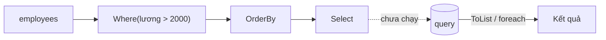

# Chương 3 — LINQ

## Mục tiêu

- Viết truy vấn LINQ bằng *method syntax* và *query syntax*.
- Dùng các toán tử chính: `Where`, `Select`, `OrderBy`, `GroupBy`, `Join`, `Any`, `Sum`,
  `First`, `Skip`/`Take`, `ToDictionary`, `SelectMany`, `CountBy`.
- Hiểu *deferred execution* (thực thi trì hoãn) và vì sao nó quan trọng.

## Giải thích đơn giản

**LINQ** (Language Integrated Query) là bộ method để lọc, biến đổi, nhóm dữ liệu.
Nếu bạn biết `array.filter().map()` trong TypeScript hoặc `stream().filter().map()`
trong Java, bạn đã hiểu 80% LINQ:

| TypeScript | Java Stream | LINQ |
|---|---|---|
| `filter` | `filter` | `Where` |
| `map` | `map` | `Select` |
| `flatMap` | `flatMap` | `SelectMany` |
| `sort` | `sorted` | `OrderBy` / `ThenBy` |
| `find` | `findFirst` | `First` / `FirstOrDefault` |
| `some` / `every` | `anyMatch` / `allMatch` | `Any` / `All` |
| `reduce` | `reduce` | `Aggregate` |
| `slice` | `skip` / `limit` | `Skip` / `Take` |

LINQ chạy trên mọi `IEnumerable<T>` (List, mảng, Dictionary...). Với EF Core (Tập 3),
cùng code LINQ được dịch sang **SQL**.

## Ví dụ

<!-- include: examples/V2Ch03.Linq/Program.cs -->
```csharp
List<Employee> employees =
[
    new("An", "Backend", 2500, 2019),
    new("Bình", "Frontend", 2200, 2021),
    new("Chi", "Backend", 3100, 2017),
    new("Dũng", "QA", 1800, 2022),
    new("Em", "Frontend", 2600, 2018),
];
List<Department> departments = [new("Backend", "Tầng 3"), new("Frontend", "Tầng 2"), new("QA", "Tầng 1")];

// 1. Where + Select + OrderBy (method syntax)
var seniors = employees
    .Where(e => e.JoinedYear <= 2019)
    .OrderByDescending(e => e.Salary)
    .Select(e => $"{e.Name} ({e.Salary})");
Console.WriteLine("Senior: " + string.Join(", ", seniors));

// 2. Query syntax (giống SQL) - cùng kết quả
var seniors2 = from e in employees
               where e.JoinedYear <= 2019
               orderby e.Salary descending
               select $"{e.Name} ({e.Salary})";
Console.WriteLine("Query syntax giống nhau? " + seniors.SequenceEqual(seniors2));

// 3. Aggregate: Count, Sum, Average, Max, MaxBy
Console.WriteLine($"Số NV={employees.Count}, tổng lương={employees.Sum(e => e.Salary)}, TB={employees.Average(e => e.Salary):F0}");
Console.WriteLine($"Lương cao nhất: {employees.MaxBy(e => e.Salary)!.Name}");
Console.WriteLine($"Có ai lương < 2000? {employees.Any(e => e.Salary < 2000)}; tất cả > 1000? {employees.All(e => e.Salary > 1000)}");

// 4. GroupBy
foreach (var g in employees.GroupBy(e => e.Team).OrderBy(g => g.Key))
    Console.WriteLine($"  {g.Key,-8}: {g.Count()} người, TB {g.Average(e => e.Salary):F0}");

// 5. Join
var withFloor = employees.Join(departments, e => e.Team, d => d.Name, (e, d) => $"{e.Name}@{d.Floor}");
Console.WriteLine("Join: " + string.Join(", ", withFloor));

// 6. First / FirstOrDefault / Single
Console.WriteLine($"First QA: {employees.First(e => e.Team == "QA").Name}");
Console.WriteLine($"FirstOrDefault DevOps: {employees.FirstOrDefault(e => e.Team == "DevOps")?.Name ?? "null"}");

// 7. Phân trang: Skip + Take; Chunk
var page2 = employees.OrderBy(e => e.Name).Skip(2).Take(2).Select(e => e.Name);
Console.WriteLine("Trang 2 (size 2): " + string.Join(", ", page2));
Console.WriteLine("Chunk(2): " + string.Join(" | ", employees.Select(e => e.Name).Chunk(2).Select(c => string.Join(",", c))));

// 8. ToDictionary, Distinct, SelectMany
var byName = employees.ToDictionary(e => e.Name);
Console.WriteLine($"byName[\"Chi\"].Team = {byName["Chi"].Team}");
Console.WriteLine("Teams: " + string.Join(", ", employees.Select(e => e.Team).Distinct()));
string[][] tags = [["c#", "sql"], ["ts", "c#"]];
Console.WriteLine("SelectMany: " + string.Join(", ", tags.SelectMany(t => t).Distinct()));

// 9. Deferred execution: query chỉ chạy khi duyệt
int calls = 0;
var query = employees.Where(e => { calls++; return e.Salary > 2000; });
Console.WriteLine($"Sau khi tạo query: calls={calls}");
var list = query.ToList();
Console.WriteLine($"Sau ToList(): calls={calls}, kết quả={list.Count}");
_ = query.Count();
Console.WriteLine($"Duyệt lần 2: calls={calls} (chạy lại từ đầu!)");

// 10. CountBy / AggregateBy (.NET 9+)
foreach (var (team, count) in employees.CountBy(e => e.Team))
    Console.Write($"{team}={count} ");
Console.WriteLine();

record Employee(string Name, string Team, decimal Salary, int JoinedYear);
record Department(string Name, string Floor);
```

Output thật:

<!-- output: examples/V2Ch03.Linq -->
```text
Senior: Chi (3100), Em (2600), An (2500)
Query syntax giống nhau? True
Số NV=5, tổng lương=12200, TB=2440
Lương cao nhất: Chi
Có ai lương < 2000? True; tất cả > 1000? True
  Backend : 2 người, TB 2800
  Frontend: 2 người, TB 2400
  QA      : 1 người, TB 1800
Join: An@Tầng 3, Bình@Tầng 2, Chi@Tầng 3, Dũng@Tầng 1, Em@Tầng 2
First QA: Dũng
FirstOrDefault DevOps: null
Trang 2 (size 2): Chi, Dũng
Chunk(2): An,Bình | Chi,Dũng | Em
byName["Chi"].Team = Backend
Teams: Backend, Frontend, QA
SelectMany: c#, sql, ts
Sau khi tạo query: calls=0
Sau ToList(): calls=5, kết quả=4
Duyệt lần 2: calls=10 (chạy lại từ đầu!)
Backend=2 Frontend=2 QA=1 
```

## Đi sâu

### Deferred execution

Hầu hết toán tử LINQ (`Where`, `Select`, `OrderBy`...) **không chạy ngay**. Chúng chỉ tạo
một "công thức". Công thức chạy khi bạn:

- duyệt bằng `foreach`, hoặc
- gọi toán tử "kết thúc" (`ToList`, `ToArray`, `Count`, `Sum`, `First`, `Any`...).

Output ở mục 9 chứng minh: tạo query xong `calls=0`; `ToList()` chạy 5 lần; gọi `Count()`
thêm lần nữa chạy lại 5 lần (`calls=10`). Nếu nguồn dữ liệu đắt (đọc DB, file), hãy
`ToList()` một lần rồi dùng lại list.



### `First` vs `FirstOrDefault` vs `Single`

| Method | Không có phần tử | Nhiều phần tử |
|---|---|---|
| `First` | ném `InvalidOperationException` | lấy phần tử đầu |
| `FirstOrDefault` | trả `default` (null với class) | lấy phần tử đầu |
| `Single` | ném exception | ném exception |
| `SingleOrDefault` | trả `default` | ném exception |

Dùng `Single` khi logic đảm bảo chỉ có đúng một (ví dụ tìm theo khóa chính).

### Query syntax

`from e in employees where ... orderby ... select ...` được compiler dịch sang method syntax.
Hai cách cho cùng kết quả (dòng `Query syntax giống nhau? True`). Method syntax phổ biến hơn;
query syntax dễ đọc hơn khi có `join` hoặc `let` phức tạp.

### Toán tử mới

- `MaxBy` / `MinBy` (.NET 6): lấy **phần tử** có giá trị lớn nhất, không chỉ giá trị.
- `Chunk` (.NET 6): chia thành các nhóm kích thước cố định.
- `CountBy` / `AggregateBy` (.NET 9): đếm/gộp theo khóa mà không cần `GroupBy`.

## Lỗi và bẫy thường gặp

- **Duyệt query nhiều lần** → chạy lại nhiều lần (có thể gọi DB nhiều lần). `ToList()` một lần.
- **Side effect trong lambda** (như `calls++` ở ví dụ): chỉ dùng để minh họa; code thật nên
  giữ lambda "thuần" (pure).
- **`First` trên collection rỗng** → exception. Dùng `FirstOrDefault` và kiểm tra null.
- **`Count() > 0` để kiểm tra có phần tử**: dùng `Any()` — dừng ngay khi thấy phần tử đầu.
- **Sửa collection nguồn khi đang duyệt query** → `InvalidOperationException`.
- **`OrderBy(...).OrderBy(...)`**: lần sắp xếp thứ hai xóa lần đầu. Dùng `ThenBy`.

## Tóm tắt

- LINQ = filter/map/reduce của C#, chạy trên mọi `IEnumerable<T>`.
- Hầu hết toán tử là lười (deferred); `ToList`, `Count`, `First`... mới chạy query.
- Chọn đúng `First`/`FirstOrDefault`/`Single` theo ý nghĩa nghiệp vụ.

## Bài tập (có lời giải)

1. Lấy 3 sản phẩm đắt nhất **còn hàng**.
2. Nhóm theo danh mục: số sản phẩm và tổng giá trị tồn kho (`Price * Stock`), sắp giảm dần.
3. Tìm 2 từ xuất hiện nhiều nhất trong một câu (không phân biệt hoa thường).
4. In tên các sản phẩm hết hàng, hoặc `"không có"` nếu không có sản phẩm nào.

<details>
<summary>Lời giải</summary>

<!-- include: examples/V2Ch03.Solutions/Program.cs -->
```csharp
Product[] products =
[
    new("Laptop", "Máy tính", 25_000_000m, 5),
    new("Chuột", "Phụ kiện", 300_000m, 50),
    new("Bàn phím", "Phụ kiện", 900_000m, 0),
    new("Màn hình", "Máy tính", 5_000_000m, 12),
    new("Tai nghe", "Phụ kiện", 1_200_000m, 8),
];

// Bài 1: 3 sản phẩm đắt nhất còn hàng
var top3 = products.Where(p => p.Stock > 0).OrderByDescending(p => p.Price).Take(3).Select(p => p.Name);
Console.WriteLine($"Bài 1: {string.Join(", ", top3)}");

// Bài 2: theo danh mục: số sản phẩm và tổng giá trị tồn kho
var byCategory = products
    .GroupBy(p => p.Category)
    .Select(g => new { Category = g.Key, Count = g.Count(), Value = g.Sum(p => p.Price * p.Stock) })
    .OrderByDescending(x => x.Value);
foreach (var c in byCategory) Console.WriteLine($"Bài 2: {c.Category,-9} {c.Count} sp, tồn kho {c.Value,15:N0}");

// Bài 3: 2 từ xuất hiện nhiều nhất (không phân biệt hoa thường)
string text = "C# và LINQ. LINQ rất mạnh; C# rất gọn. linq!";
var topWords = text
    .Split([' ', '.', ';', '!'], StringSplitOptions.RemoveEmptyEntries)
    .GroupBy(w => w.ToLowerInvariant())
    .OrderByDescending(g => g.Count()).ThenBy(g => g.Key)
    .Take(2)
    .Select(g => $"{g.Key}={g.Count()}");
Console.WriteLine($"Bài 3: {string.Join(", ", topWords)}");

// Bài 4: tên sản phẩm hết hàng (hoặc "không có")
var outOfStock = products.Where(p => p.Stock == 0).Select(p => p.Name).DefaultIfEmpty("không có");
Console.WriteLine($"Bài 4: hết hàng: {string.Join(", ", outOfStock)}");

record Product(string Name, string Category, decimal Price, int Stock);
```

<!-- output: examples/V2Ch03.Solutions -->
```text
Bài 1: Laptop, Màn hình, Tai nghe
Bài 2: Máy tính  2 sp, tồn kho     185,000,000
Bài 2: Phụ kiện  3 sp, tồn kho      24,600,000
Bài 3: linq=3, c#=2
Bài 4: hết hàng: Bàn phím
```

Bài 2 dùng *anonymous type* `new { Category, Count, Value }` — tiện cho kết quả tạm thời
trong một method. Bài 4 dùng `DefaultIfEmpty`.
</details>

## Nguồn tham khảo (Sources)

- LINQ overview (C#): https://github.com/dotnet/docs/blob/main/docs/csharp/linq/index.md
- Introduction to LINQ queries: https://github.com/dotnet/docs/blob/main/docs/csharp/linq/get-started/introduction-to-linq-queries.md
- LINQ in .NET: https://github.com/dotnet/docs/blob/main/docs/standard/linq/index.md
- .NET 9 runtime libraries (CountBy, AggregateBy): https://github.com/dotnet/docs/blob/main/docs/core/whats-new/dotnet-9/libraries.md
