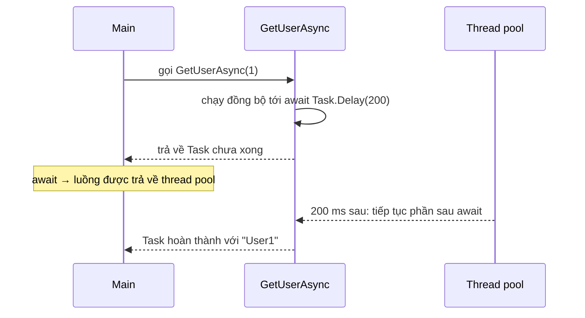

# Chương 5 — async / await

## Mục tiêu

- Viết hàm bất đồng bộ với `async Task` / `async Task<T>` và `await`.
- Chạy nhiều tác vụ song song bằng `Task.WhenAll`, `Task.WhenAny`.
- Hủy tác vụ bằng `CancellationToken` (kể cả timeout).
- Stream dữ liệu với `IAsyncEnumerable<T>` và `await foreach`.
- Biết khi nào dùng `ValueTask<T>`.

## Giải thích đơn giản

Bạn đã quen `async/await` trong TypeScript. C# (có trước TypeScript) dùng cùng ý tưởng:

| TypeScript | C# |
|---|---|
| `Promise<T>` | `Task<T>` |
| `Promise<void>` | `Task` |
| `async function f(): Promise<T>` | `async Task<T> F()` |
| `await p` | `await t` |
| `Promise.all([...])` | `Task.WhenAll(...)` |
| `Promise.race([...])` | `Task.WhenAny(...)` |
| `AbortController` / `signal` | `CancellationTokenSource` / `CancellationToken` |
| `for await (const x of stream)` | `await foreach (var x in stream)` |

Khác biệt lớn: Node.js chạy trên **một luồng** với event loop. .NET có **thread pool**
(nhiều luồng). `await` giải phóng luồng hiện tại trong lúc chờ I/O, để luồng đó phục vụ
việc khác (ví dụ request HTTP khác). Đây là lý do ASP.NET Core chịu tải tốt.

## Ví dụ

<!-- include: examples/V2Ch05.Async/Program.cs -->
```csharp
using System.Diagnostics;
using System.Runtime.CompilerServices;

var sw = Stopwatch.StartNew();

// 1. await tuần tự: tổng thời gian = cộng dồn
var user = await GetUserAsync(1);
var orders = await GetOrdersAsync(1);
Console.WriteLine($"Tuần tự: {user}, {orders} đơn — ~{Round(sw.ElapsedMilliseconds)} ms");

// 2. Chạy song song với Task.WhenAll: tổng thời gian = task lâu nhất
sw.Restart();
Task<string> userTask = GetUserAsync(2);
Task<int> ordersTask = GetOrdersAsync(2);
await Task.WhenAll(userTask, ordersTask);
Console.WriteLine($"WhenAll: {userTask.Result}, {ordersTask.Result} đơn — ~{Round(sw.ElapsedMilliseconds)} ms");

// 3. WhenAll trả về mảng kết quả
int[] ids = [1, 2, 3];
string[] names = await Task.WhenAll(ids.Select(GetUserAsync));
Console.WriteLine($"Nhiều user: {string.Join(", ", names)}");

// 4. Exception trong async
try
{
    await GetUserAsync(-1);
}
catch (ArgumentException ex)
{
    Console.WriteLine($"Bắt lỗi async: {ex.Message}");
}

// 5. Cancellation với timeout
using var cts = new CancellationTokenSource(TimeSpan.FromMilliseconds(150));
try
{
    await SlowReportAsync(cts.Token);
}
catch (OperationCanceledException)
{
    Console.WriteLine("Báo cáo bị hủy sau 150 ms (timeout)");
}

// 6. IAsyncEnumerable + await foreach: stream dữ liệu
await foreach (var price in StreamPricesAsync(3))
    Console.WriteLine($"  giá mới: {price}");

// 7. Task.WhenAny: lấy kết quả đầu tiên
var fast = Task.Delay(50).ContinueWith(_ => "server A");
var slow = Task.Delay(300).ContinueWith(_ => "server B");
var winner = await Task.WhenAny(fast, slow);
Console.WriteLine($"Nhanh nhất: {await winner}");

// 8. ValueTask cho đường đi nhanh có cache
var cache = new PriceCache();
Console.WriteLine($"Lần 1: {await cache.GetAsync("AAPL")} (từ nguồn), lần 2: {await cache.GetAsync("AAPL")} (cache), số lần gọi nguồn = {cache.SourceCalls}");

static long Round(long ms) => (ms + 50) / 100 * 100;   // làm tròn 100 ms để output ổn định

static async Task<string> GetUserAsync(int id)
{
    if (id < 0) throw new ArgumentException($"id không hợp lệ: {id}");
    await Task.Delay(200);           // giả lập gọi DB
    return $"User{id}";
}

static async Task<int> GetOrdersAsync(int userId)
{
    await Task.Delay(300);           // giả lập gọi API khác
    return userId * 2;
}

static async Task SlowReportAsync(CancellationToken ct)
{
    for (int i = 0; i < 10; i++)
    {
        await Task.Delay(100, ct);    // ném OperationCanceledException khi token bị hủy
    }
}

static async IAsyncEnumerable<decimal> StreamPricesAsync(int count, [EnumeratorCancellation] CancellationToken ct = default)
{
    decimal price = 100m;
    for (int i = 0; i < count; i++)
    {
        await Task.Delay(20, ct);
        price += 1.5m;
        yield return price;
    }
}

class PriceCache
{
    private readonly Dictionary<string, decimal> _cache = [];
    public int SourceCalls { get; private set; }

    public ValueTask<decimal> GetAsync(string symbol)
    {
        if (_cache.TryGetValue(symbol, out var cached))
            return ValueTask.FromResult(cached);     // không cấp phát Task
        return new ValueTask<decimal>(LoadAsync(symbol));
    }

    private async Task<decimal> LoadAsync(string symbol)
    {
        SourceCalls++;
        await Task.Delay(10);
        return _cache[symbol] = 123.45m;
    }
}
```

Output thật (thời gian được làm tròn 100 ms để output ổn định giữa các lần chạy):

<!-- output: examples/V2Ch05.Async -->
```text
Tuần tự: User1, 2 đơn — ~500 ms
WhenAll: User2, 4 đơn — ~300 ms
Nhiều user: User1, User2, User3
Bắt lỗi async: id không hợp lệ: -1
Báo cáo bị hủy sau 150 ms (timeout)
  giá mới: 101.5
  giá mới: 103.0
  giá mới: 104.5
Nhanh nhất: server A
Lần 1: 123.45 (từ nguồn), lần 2: 123.45 (cache), số lần gọi nguồn = 1
```

- **Tuần tự** ~500 ms = 200 + 300. **WhenAll** ~300 ms = thời gian của tác vụ lâu nhất.
- Báo cáo 10 × 100 ms bị hủy ở 150 ms nhờ `CancellationTokenSource(TimeSpan)`.

## Đi sâu

### Chuyện gì xảy ra ở `await`?



Compiler biến hàm `async` thành một *state machine* (máy trạng thái). Mỗi `await` là một điểm
dừng; phần code sau `await` được chạy tiếp khi tác vụ xong.

### Bắt đầu task trước, `await` sau

`Task<string> userTask = GetUserAsync(2);` **bắt đầu** công việc ngay. Gọi hai hàm trước rồi
mới `await Task.WhenAll(...)` → hai việc chạy chồng lên nhau. Nếu viết `await` ngay sau mỗi lời
gọi → chạy tuần tự.

### Exception với async

- Exception trong hàm `async` được lưu trong `Task`, và ném lại khi bạn `await`.
- `Task.WhenAll` ném exception **đầu tiên**; các exception khác nằm trong
  `task.Exception.InnerExceptions`.

### Cancellation

- Người gọi tạo `CancellationTokenSource`, truyền `cts.Token` xuống.
- Hàm nhận `CancellationToken ct` và truyền tiếp cho mọi API hỗ trợ (`Task.Delay(ms, ct)`,
  `HttpClient.GetAsync(url, ct)`, EF Core `ToListAsync(ct)`).
- Khi bị hủy → `OperationCanceledException` (hoặc lớp con `TaskCanceledException`).
- Trong ASP.NET Core, `HttpContext.RequestAborted` là token bị hủy khi client ngắt kết nối.

### `ValueTask<T>`

`Task<T>` là class → mỗi lần trả về tạo một object. `ValueTask<T>` là struct: khi kết quả có
sẵn (cache hit), không cấp phát gì. Chỉ dùng khi đo đạc thấy cần; và **chỉ `await` một
`ValueTask` một lần**.

### Async và luồng: `Task.Run`

`async` **không** tự tạo luồng mới. Code CPU nặng (tính toán) trong hàm async vẫn chặn luồng.
Dùng `Task.Run(() => ...)` để đẩy việc CPU sang thread pool (Tập 3, Chương 4).

## Lỗi và bẫy thường gặp

- **`.Result` / `.Wait()`**: chặn luồng; trong một số môi trường (UI, ASP.NET cũ) gây
  *deadlock*. Dùng `await` từ đầu đến cuối.
- **`async void`**: người gọi không `await` được, exception làm sập tiến trình. Chỉ dùng cho
  event handler. Còn lại dùng `async Task`.
- **Quên `await`**: compiler cảnh báo CS4014; task chạy "mồ côi", lỗi bị nuốt.
- **Không truyền `CancellationToken`** xuống dưới → không hủy được thật sự.
- **Dùng `Task.Delay` để "đợi cho chắc"**: dùng cơ chế đồng bộ đúng (Tập 3, Chương 4).
- **`await` trong vòng lặp khi các việc độc lập** → chậm. Dùng `Task.WhenAll`, nhưng giới hạn
  số lượng đồng thời nếu gọi dịch vụ ngoài (xem Bài tập 1).

## Tóm tắt

- `Task<T>` ≈ `Promise<T>`; `await` giải phóng luồng trong lúc chờ.
- Bắt đầu nhiều task rồi `Task.WhenAll` để chạy song song.
- Luôn nhận và truyền `CancellationToken` trong code I/O.
- `IAsyncEnumerable<T>` + `await foreach` để stream dữ liệu.

## Bài tập (có lời giải)

1. "Tải" 6 trang (mỗi trang 100 ms) nhưng tối đa 2 trang cùng lúc. In số trang đồng thời tối đa.
2. Viết `WithTimeout(work, timeoutMs)`: trả về kết quả, hoặc chuỗi `timeout` nếu quá giờ.
3. Viết `RetryAsync<T>` thử lại khi gặp `HttpRequestException`, chờ tăng dần (20, 40, 80 ms...).

<details>
<summary>Lời giải</summary>

<!-- include: examples/V2Ch05.Solutions/Program.cs -->
```csharp
using System.Diagnostics;

// Bài 1: tải 6 "trang" nhưng tối đa 2 cùng lúc (SemaphoreSlim)
var gate = new SemaphoreSlim(2);
int running = 0, maxRunning = 0;
var sw = Stopwatch.StartNew();
var pages = await Task.WhenAll(Enumerable.Range(1, 6).Select(async i =>
{
    await gate.WaitAsync();
    try
    {
        int now = Interlocked.Increment(ref running);
        InterlockedMax(ref maxRunning, now);
        await Task.Delay(100);
        return $"page{i}";
    }
    finally
    {
        Interlocked.Decrement(ref running);
        gate.Release();
    }
}));
Console.WriteLine($"Bài 1: {pages.Length} trang, tối đa đồng thời = {maxRunning}, ~{(sw.ElapsedMilliseconds + 50) / 100 * 100} ms");

// Bài 2: WithTimeout — hủy nếu quá thời gian
Console.WriteLine($"Bài 2: nhanh -> {await WithTimeout(ct => WorkAsync(50, ct), 200)}");
Console.WriteLine($"Bài 2: chậm  -> {await WithTimeout(ct => WorkAsync(500, ct), 200)}");

// Bài 3: RetryAsync với backoff
int calls = 0;
var value = await RetryAsync(async () =>
{
    calls++;
    await Task.Delay(10);
    if (calls < 3) throw new HttpRequestException($"503 lần {calls}");
    return "OK";
}, maxAttempts: 4);
Console.WriteLine($"Bài 3: {value} sau {calls} lần gọi");

static async Task<string> WorkAsync(int ms, CancellationToken ct)
{
    await Task.Delay(ms, ct);
    return $"xong sau {ms} ms";
}

static async Task<string> WithTimeout(Func<CancellationToken, Task<string>> work, int timeoutMs)
{
    using var cts = new CancellationTokenSource(timeoutMs);
    try { return await work(cts.Token); }
    catch (OperationCanceledException) { return $"timeout ({timeoutMs} ms)"; }
}

static async Task<T> RetryAsync<T>(Func<Task<T>> action, int maxAttempts)
{
    for (int attempt = 1; ; attempt++)
    {
        try { return await action(); }
        catch (HttpRequestException ex) when (attempt < maxAttempts)
        {
            var delay = TimeSpan.FromMilliseconds(20 * Math.Pow(2, attempt - 1));
            Console.WriteLine($"Bài 3: lỗi '{ex.Message}', chờ {delay.TotalMilliseconds} ms");
            await Task.Delay(delay);
        }
    }
}

static void InterlockedMax(ref int target, int value)
{
    int current;
    while (value > (current = Volatile.Read(ref target)))
        Interlocked.CompareExchange(ref target, value, current);
}
```

<!-- output: examples/V2Ch05.Solutions -->
```text
Bài 1: 6 trang, tối đa đồng thời = 2, ~300 ms
Bài 2: nhanh -> xong sau 50 ms
Bài 2: chậm  -> timeout (200 ms)
Bài 3: lỗi '503 lần 1', chờ 20 ms
Bài 3: lỗi '503 lần 2', chờ 40 ms
Bài 3: OK sau 3 lần gọi
```

Bài 1: `SemaphoreSlim(2)` là "cổng" chỉ cho 2 tác vụ vào cùng lúc; `Interlocked` đếm an toàn
giữa nhiều luồng. 6 trang / 2 = 3 đợt × 100 ms ≈ 300 ms.
</details>

## Nguồn tham khảo (Sources)

- Asynchronous programming with async and await: https://github.com/dotnet/docs/blob/main/docs/csharp/asynchronous-programming/index.md
- Task asynchronous programming model: https://github.com/dotnet/docs/blob/main/docs/csharp/asynchronous-programming/task-asynchronous-programming-model.md
- Cancel async tasks after a period of time: https://github.com/dotnet/docs/blob/main/docs/csharp/asynchronous-programming/cancel-async-tasks-after-a-period-of-time.md
- Async streams tutorial: https://github.com/dotnet/docs/blob/main/docs/csharp/asynchronous-programming/generate-consume-asynchronous-stream.md
- Async return types (ValueTask): https://github.com/dotnet/docs/blob/main/docs/csharp/asynchronous-programming/async-return-types.md
