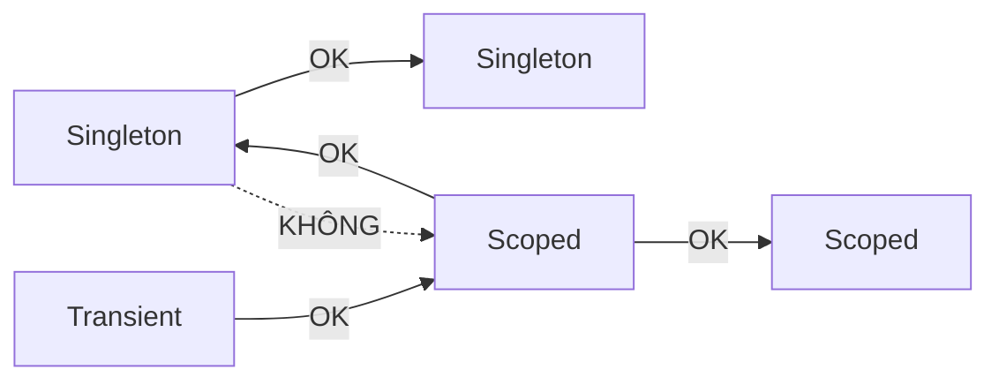

# Chương 7 — Dependency injection

## Mục tiêu

- Hiểu *dependency injection* (DI — tiêm phụ thuộc) và vì sao nó giúp code dễ test.
- Đăng ký service với 3 *lifetime*: Singleton, Scoped, Transient.
- Dùng *Generic Host* (`Host.CreateApplicationBuilder`) với configuration, options và logging.
- Dùng nhiều implementation, *keyed services* và mẫu decorator.

## Giải thích đơn giản

Bạn là Angular developer — bạn **đã dùng DI mỗi ngày**:

```typescript
@Injectable({ providedIn: 'root' })
export class OrderService {
  constructor(private http: HttpClient, private logger: Logger) {}
}
```

(Đoạn Angular trên chỉ để minh họa, không chạy trong bộ sách.)

Angular tạo `HttpClient` và `Logger` rồi "tiêm" vào constructor. .NET làm y hệt:

| Angular | .NET (`Microsoft.Extensions.DependencyInjection`) |
|---|---|
| `@Injectable({ providedIn: 'root' })` | `services.AddSingleton<IClock, SystemClock>()` |
| provider ở component (mỗi component một instance) | `AddScoped` (mỗi HTTP request một instance) |
| `useFactory` | `services.AddSingleton<IFoo>(sp => new Foo(...))` |
| `InjectionToken` | keyed service `AddKeyedSingleton<T, TImpl>("key")` |
| `inject(Foo)` | `provider.GetRequiredService<Foo>()` |

Spring (Java) cũng vậy: `@Service` + constructor injection.

## Ví dụ

<!-- include: examples/V2Ch07.DI/V2Ch07.DI.csproj -->
```xml
<Project Sdk="Microsoft.NET.Sdk">

  <PropertyGroup>
    <OutputType>Exe</OutputType>
  </PropertyGroup>

  <ItemGroup>
    <PackageReference Include="Microsoft.Extensions.Hosting" Version="10.0.12" />
  </ItemGroup>

</Project>
```

<!-- include: examples/V2Ch07.DI/Program.cs -->
```csharp
using Microsoft.Extensions.Configuration;
using Microsoft.Extensions.DependencyInjection;
using Microsoft.Extensions.Hosting;
using Microsoft.Extensions.Logging;
using Microsoft.Extensions.Options;

// 1. Container DI "trần": ServiceCollection
var services = new ServiceCollection();
services.AddSingleton<IClock, FixedClock>();          // 1 instance cho cả ứng dụng
services.AddScoped<RequestContext>();                  // 1 instance mỗi scope (mỗi HTTP request)
services.AddTransient<IGreeter, VietnameseGreeter>();  // instance mới mỗi lần xin

using (var provider = services.BuildServiceProvider(validateScopes: true))
{
    for (int request = 1; request <= 2; request++)
    {
        using var scope = provider.CreateScope();
        var sp = scope.ServiceProvider;
        var ctx1 = sp.GetRequiredService<RequestContext>();
        var ctx2 = sp.GetRequiredService<RequestContext>();
        var g1 = sp.GetRequiredService<IGreeter>();
        var g2 = sp.GetRequiredService<IGreeter>();
        bool sameClock = ReferenceEquals(sp.GetRequiredService<IClock>(), provider.GetRequiredService<IClock>());
        Console.WriteLine($"Request {request}: scoped cùng object? {ReferenceEquals(ctx1, ctx2)} (id={ctx1}), " +
                          $"transient cùng object? {ReferenceEquals(g1, g2)}, singleton cùng object? {sameClock}");
        Console.WriteLine("  " + g1.Greet("Nobin"));
    }
}

// 2. Generic Host: DI + configuration + logging + options (giống ASP.NET Core)
var builder = Host.CreateApplicationBuilder(args);
builder.Logging.ClearProviders();
builder.Logging.AddSimpleConsole(o => { o.SingleLine = true; o.IncludeScopes = false; });
builder.Configuration.AddInMemoryCollection(new Dictionary<string, string?>
{
    ["Email:Sender"] = "noreply@shop.vn",
    ["Email:MaxRetries"] = "3",
});
builder.Services.Configure<EmailOptions>(builder.Configuration.GetSection("Email"));
builder.Services.AddSingleton<IClock, FixedClock>();
builder.Services.AddTransient<IEmailSender, FakeEmailSender>();
builder.Services.AddTransient<OrderService>();

using var host = builder.Build();
var orderService = host.Services.GetRequiredService<OrderService>();
orderService.PlaceOrder("an@example.com", 250_000m);

// 3. Lỗi thường gặp: quên đăng ký service
try
{
    host.Services.GetRequiredService<IGreeter>();
}
catch (InvalidOperationException ex)
{
    Console.WriteLine($"Lỗi DI: {ex.Message}");
}

public interface IClock { DateTime Now { get; } }
public sealed class FixedClock : IClock { public DateTime Now => new(2026, 9, 28, 9, 0, 0); }

public sealed class RequestContext { public Guid Id { get; } = Guid.NewGuid(); public override string ToString() => Id.ToString()[..8]; }

public interface IGreeter { string Greet(string name); }
public sealed class VietnameseGreeter(IClock clock) : IGreeter
{
    public string Greet(string name) => $"Chào buổi {(clock.Now.Hour < 12 ? "sáng" : "chiều")}, {name}!";
}

public sealed class EmailOptions
{
    public string Sender { get; set; } = "";
    public int MaxRetries { get; set; }
}

public interface IEmailSender { void Send(string to, string subject); }

public sealed class FakeEmailSender(IOptions<EmailOptions> options, ILogger<FakeEmailSender> logger) : IEmailSender
{
    public void Send(string to, string subject) =>
        logger.LogInformation("Gửi email từ {Sender} tới {To}: {Subject} (retry tối đa {MaxRetries})",
            options.Value.Sender, to, subject, options.Value.MaxRetries);
}

// Constructor injection: OrderService không tự tạo dependency
public sealed class OrderService(IEmailSender email, IClock clock, ILogger<OrderService> logger)
{
    public void PlaceOrder(string customerEmail, decimal amount)
    {
        logger.LogInformation("Đặt hàng {Amount} lúc {Time:HH:mm}", amount, clock.Now);
        email.Send(customerEmail, $"Xác nhận đơn hàng {amount:N0} VND");
    }
}
```

Output thật (id của scope là `Guid` ngẫu nhiên, mỗi lần chạy khác nhau):

<!-- output: examples/V2Ch07.DI -->
```text
Request 1: scoped cùng object? True (id=bbe42ba2), transient cùng object? False, singleton cùng object? True
  Chào buổi sáng, Nobin!
Request 2: scoped cùng object? True (id=1f2cc984), transient cùng object? False, singleton cùng object? True
  Chào buổi sáng, Nobin!
info: OrderService[0] Đặt hàng 250000 lúc 09:00
info: FakeEmailSender[0] Gửi email từ noreply@shop.vn tới an@example.com: Xác nhận đơn hàng 250,000 VND (retry tối đa 3)
Lỗi DI: No service for type 'IGreeter' has been registered.
```

## Đi sâu

### Ba lifetime

| Lifetime | Tạo instance | Ví dụ dùng |
|---|---|---|
| **Singleton** | 1 lần cho cả ứng dụng | cache, cấu hình, `HttpClient` factory, clock |
| **Scoped** | 1 lần mỗi scope (ASP.NET Core: mỗi request) | `DbContext` của EF Core, thông tin user hiện tại |
| **Transient** | mỗi lần được xin | service nhẹ, không trạng thái |

Output chứng minh: trong cùng request, scoped là **cùng object** (`True`), transient là object
**khác** (`False`); hai request có id scoped khác nhau.

### Quy tắc "captive dependency"

Service sống lâu **không được** giữ service sống ngắn hơn: Singleton không được nhận Scoped
qua constructor (DbContext sẽ bị dùng chung giữa các request → lỗi). `validateScopes: true`
(bật sẵn trong môi trường Development của ASP.NET Core) sẽ ném exception khi phát hiện.



### Generic Host

`Host.CreateApplicationBuilder(args)` tạo sẵn:

- **Configuration**: đọc `appsettings.json`, biến môi trường, tham số dòng lệnh
  (ví dụ dùng `AddInMemoryCollection` để tự chứa).
- **Logging**: `ILogger<T>` inject được ở mọi nơi.
- **Options**: `services.Configure<EmailOptions>(section)` rồi inject `IOptions<EmailOptions>`.
- **DI container**: `builder.Services`.

ASP.NET Core (`WebApplication.CreateBuilder`) dùng đúng mô hình này — Tập 3 sẽ thấy lại.

### Structured logging

`logger.LogInformation("Gửi email từ {Sender} tới {To}", sender, to)` — **không** dùng `$"..."`.
`{Sender}` là tên trường; hệ thống log lưu cả giá trị riêng để tìm kiếm/lọc (Tập 3, Chương 6).

### DI giúp test

`OrderService` chỉ biết `IEmailSender`, `IClock`. Trong test, bạn truyền `FakeEmailSender`
và `FixedClock` — không gửi email thật, thời gian cố định. Đây chính là kỹ thuật ở Chương 6.

## Lỗi và bẫy thường gặp

- **Quên đăng ký service** → `InvalidOperationException: No service for type ... has been registered`
  (xem output).
- **Captive dependency** (Singleton giữ Scoped) → dữ liệu lẫn giữa request, lỗi đa luồng.
- **Service locator**: gọi `provider.GetService<T>()` rải rác trong code thay vì constructor
  injection → khó đọc, khó test. Chỉ dùng ở "gốc" ứng dụng.
- **Tự `new` dependency** bên trong class → mất khả năng thay thế khi test.
- **Dispose**: container tự `Dispose` service nó tạo khi scope/provider kết thúc. Đừng tự
  `Dispose` service được inject.

## Tóm tắt

- DI trong .NET giống DI trong Angular/Spring: đăng ký rồi inject qua constructor.
- Singleton / Scoped / Transient quyết định vòng đời object.
- Generic Host gom DI + configuration + logging + options — nền tảng của ASP.NET Core.

## Bài tập (có lời giải)

1. Đăng ký 2 `INotifier` (email, sms) và cho `AlertService` nhận `IEnumerable<INotifier>` để gửi qua tất cả.
2. Dùng keyed services để chọn cổng thanh toán `"momo"` hoặc `"vnpay"`.
3. Viết decorator `LoggingProductRepository` bọc `SqlProductRepository` và đăng ký sao cho
   người dùng `IProductRepository` nhận bản có log.

<details>
<summary>Lời giải</summary>

<!-- include: examples/V2Ch07.Solutions/Program.cs -->
```csharp
using Microsoft.Extensions.DependencyInjection;

var services = new ServiceCollection();

// Bài 1: nhiều implementation cho cùng interface -> inject IEnumerable<T>
services.AddSingleton<INotifier, EmailNotifier>();
services.AddSingleton<INotifier, SmsNotifier>();
services.AddSingleton<AlertService>();

// Bài 2: keyed services (.NET 8+): chọn implementation theo khóa
services.AddKeyedSingleton<IPaymentGateway, MomoGateway>("momo");
services.AddKeyedSingleton<IPaymentGateway, VnPayGateway>("vnpay");

// Bài 3: decorator thủ công: thêm log quanh repository thật
services.AddSingleton<SqlProductRepository>();
services.AddSingleton<IProductRepository>(sp => new LoggingProductRepository(sp.GetRequiredService<SqlProductRepository>()));

using var provider = services.BuildServiceProvider();

provider.GetRequiredService<AlertService>().Alert("Server CPU 95%");

foreach (var key in new[] { "momo", "vnpay" })
    Console.WriteLine($"Bài 2: {provider.GetRequiredKeyedService<IPaymentGateway>(key).Pay(150_000m)}");

var repo = provider.GetRequiredService<IProductRepository>();
Console.WriteLine($"Bài 3: kết quả = {repo.GetName(7)}");

public interface INotifier { string Channel { get; } void Send(string message); }
public sealed class EmailNotifier : INotifier { public string Channel => "email"; public void Send(string m) => Console.WriteLine($"Bài 1: [email] {m}"); }
public sealed class SmsNotifier : INotifier { public string Channel => "sms"; public void Send(string m) => Console.WriteLine($"Bài 1: [sms] {m}"); }

public sealed class AlertService(IEnumerable<INotifier> notifiers)
{
    public void Alert(string message)
    {
        foreach (var n in notifiers) n.Send(message);
    }
}

public interface IPaymentGateway { string Pay(decimal amount); }
public sealed class MomoGateway : IPaymentGateway { public string Pay(decimal a) => $"MoMo thanh toán {a:N0}"; }
public sealed class VnPayGateway : IPaymentGateway { public string Pay(decimal a) => $"VNPay thanh toán {a:N0}"; }

public interface IProductRepository { string GetName(int id); }
public sealed class SqlProductRepository : IProductRepository { public string GetName(int id) => $"Sản phẩm #{id}"; }
public sealed class LoggingProductRepository(IProductRepository inner) : IProductRepository
{
    public string GetName(int id)
    {
        Console.WriteLine($"Bài 3: [log] GetName({id}) bắt đầu");
        var result = inner.GetName(id);
        Console.WriteLine("Bài 3: [log] GetName xong");
        return result;
    }
}
```

<!-- output: examples/V2Ch07.Solutions -->
```text
Bài 1: [email] Server CPU 95%
Bài 1: [sms] Server CPU 95%
Bài 2: MoMo thanh toán 150,000
Bài 2: VNPay thanh toán 150,000
Bài 3: [log] GetName(7) bắt đầu
Bài 3: [log] GetName xong
Bài 3: kết quả = Sản phẩm #7
```

Bài 3 dùng *factory registration* `AddSingleton<IProductRepository>(sp => ...)` để tự dựng
chuỗi decorator.
</details>

## Nguồn tham khảo (Sources)

- Dependency injection in .NET: https://github.com/dotnet/docs/blob/main/docs/core/extensions/dependency-injection/overview.md
- Service lifetimes: https://github.com/dotnet/docs/blob/main/docs/core/extensions/dependency-injection/service-lifetimes.md
- DI guidelines (captive dependency): https://github.com/dotnet/docs/blob/main/docs/core/extensions/dependency-injection/guidelines.md
- .NET Generic Host: https://github.com/dotnet/docs/blob/main/docs/core/extensions/generic-host.md
- Options pattern: https://github.com/dotnet/docs/blob/main/docs/core/extensions/options.md
- Microsoft.Extensions.Hosting on NuGet: https://www.nuget.org/packages/Microsoft.Extensions.Hosting/10.0.12
