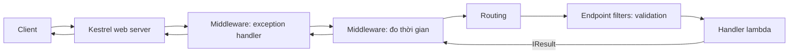

# Chương 1 — ASP.NET Core Web API (Minimal API)

## Mục tiêu

- Hiểu cấu trúc một ứng dụng ASP.NET Core: builder → services → app → middleware → endpoints.
- Viết endpoint với Minimal API: `MapGet`, `MapPost`, `MapDelete`, `MapGroup`, route constraint.
- Nhận dữ liệu (route, query, body JSON) và trả kết quả đúng HTTP status với `TypedResults`.
- Dùng validation có sẵn của .NET 10 (`AddValidation`) và *Problem Details* cho lỗi.
- Viết middleware đơn giản.

## Giải thích đơn giản

**ASP.NET Core** là framework web của .NET. Có hai cách viết API:

- **Minimal API**: khai báo endpoint bằng lambda — giống Express/Fastify trong Node.js.
- **Controller** (MVC): class kế thừa `ControllerBase`, attribute `[HttpGet]` — giống Spring
  `@RestController` hoặc NestJS.

Bộ sách dùng Minimal API vì ngắn, nhanh và là hướng Microsoft đang đầu tư mạnh.

| Express (Node) | Spring Boot | ASP.NET Core Minimal API |
|---|---|---|
| `const app = express()` | `@SpringBootApplication` | `var builder = WebApplication.CreateBuilder(args)` |
| `app.use(mw)` | `Filter` / `HandlerInterceptor` | `app.Use(...)` (middleware) |
| `app.get('/x/:id', h)` | `@GetMapping("/x/{id}")` | `app.MapGet("/x/{id:int}", h)` |
| `express.Router()` | `@RequestMapping` trên class | `app.MapGroup("/api/x")` |
| `res.status(201).json(x)` | `ResponseEntity.created(...)` | `TypedResults.Created(url, x)` |
| `class-validator` / `zod` | Bean Validation `@Valid` | DataAnnotations + `AddValidation()` (.NET 10) |

## Ví dụ

Ví dụ này **tự chạy server, tự gọi API bằng `HttpClient` rồi tắt** — nên output ở dưới là
request/response thật.

<!-- include: examples/V3Ch01.MinimalApi/V3Ch01.MinimalApi.csproj -->
```xml
<Project Sdk="Microsoft.NET.Sdk.Web">

  <!-- Web SDK: includes ASP.NET Core (Kestrel, routing, DI, logging, config). -->

</Project>
```

<!-- include: examples/V3Ch01.MinimalApi/Program.cs -->
```csharp
using System.Collections.Concurrent;
using System.ComponentModel.DataAnnotations;
using System.Diagnostics;
using System.Net.Http.Json;
using Microsoft.AspNetCore.Http.HttpResults;

var builder = WebApplication.CreateBuilder(args);
builder.Logging.SetMinimumLevel(LogLevel.Warning);   // giữ output ngắn gọn
builder.WebHost.UseUrls("http://127.0.0.1:5199");

builder.Services.AddSingleton<ProductStore>();
builder.Services.AddValidation();       // .NET 10: validate DataAnnotations trong Minimal API
builder.Services.AddProblemDetails();

var app = builder.Build();

// Middleware tự viết: đo thời gian xử lý và thêm header
app.Use(async (context, next) =>
{
    var sw = Stopwatch.StartNew();
    context.Response.OnStarting(() =>
    {
        context.Response.Headers["X-Elapsed-Ms"] = sw.ElapsedMilliseconds.ToString();
        return Task.CompletedTask;
    });
    await next(context);
});

// Endpoints
app.MapGet("/", () => "Xin chào từ ASP.NET Core!");

var products = app.MapGroup("/api/products");

products.MapGet("/", (ProductStore store, string? search, int page = 1, int pageSize = 10) =>
{
    var query = store.All();
    if (!string.IsNullOrWhiteSpace(search))
        query = query.Where(p => p.Name.Contains(search, StringComparison.OrdinalIgnoreCase));
    return TypedResults.Ok(query.Skip((page - 1) * pageSize).Take(pageSize).ToList());
});

products.MapGet("/{id:int}", Results<Ok<ProductDto>, NotFound> (int id, ProductStore store) =>
    store.Find(id) is { } p ? TypedResults.Ok(p) : TypedResults.NotFound());

products.MapPost("/", (CreateProductRequest request, ProductStore store) =>
{
    var created = store.Add(request);
    return TypedResults.Created($"/api/products/{created.Id}", created);
});

products.MapDelete("/{id:int}", Results<NoContent, NotFound> (int id, ProductStore store) =>
    store.Remove(id) ? TypedResults.NoContent() : TypedResults.NotFound());

await app.StartAsync();

// ---- Client: gọi chính API vừa chạy ----
using var http = new HttpClient { BaseAddress = new Uri("http://127.0.0.1:5199") };

async Task Show(string label, Func<Task<HttpResponseMessage>> call)
{
    var response = await call();
    var body = await response.Content.ReadAsStringAsync();
    Console.WriteLine($"{label} -> {(int)response.StatusCode} {response.StatusCode}");
    if (body.Length > 0) Console.WriteLine($"   {body}");
}

await Show("GET /", () => http.GetAsync("/"));
await Show("POST /api/products", () => http.PostAsJsonAsync("/api/products", new { name = "Bàn phím cơ", price = 1_200_000 }));
await Show("POST /api/products", () => http.PostAsJsonAsync("/api/products", new { name = "Chuột", price = 250_000 }));
await Show("POST (dữ liệu sai)", () => http.PostAsJsonAsync("/api/products", new { name = "", price = -5 }));
await Show("GET /api/products?search=bàn", () => http.GetAsync("/api/products?search=b%C3%A0n"));
await Show("GET /api/products/2", () => http.GetAsync("/api/products/2"));
await Show("GET /api/products/99", () => http.GetAsync("/api/products/99"));
await Show("GET /api/products/abc", () => http.GetAsync("/api/products/abc"));
await Show("DELETE /api/products/1", () => http.DeleteAsync("/api/products/1"));

var head = await http.GetAsync("/api/products");
Console.WriteLine($"Header X-Elapsed-Ms có mặt? {head.Headers.Contains("X-Elapsed-Ms")}");

await app.StopAsync();

// ---- Models ----
public record CreateProductRequest(
    [property: Required, StringLength(100, MinimumLength = 1)] string Name,
    [property: Range(0, 1_000_000_000)] decimal Price);

public record ProductDto(int Id, string Name, decimal Price);

public class ProductStore
{
    private readonly ConcurrentDictionary<int, ProductDto> _items = new();
    private int _nextId;

    public IEnumerable<ProductDto> All() => _items.Values.OrderBy(p => p.Id);
    public ProductDto? Find(int id) => _items.GetValueOrDefault(id);
    public bool Remove(int id) => _items.TryRemove(id, out _);

    public ProductDto Add(CreateProductRequest request)
    {
        var product = new ProductDto(Interlocked.Increment(ref _nextId), request.Name, request.Price);
        _items[product.Id] = product;
        return product;
    }
}
```

Output thật:

<!-- output: examples/V3Ch01.MinimalApi -->
```text
GET / -> 200 OK
   Xin chào từ ASP.NET Core!
POST /api/products -> 201 Created
   {"id":1,"name":"Bàn phím cơ","price":1200000}
POST /api/products -> 201 Created
   {"id":2,"name":"Chuột","price":250000}
POST (dữ liệu sai) -> 400 BadRequest
   {"type":"https://tools.ietf.org/html/rfc9110#section-15.5.1","title":"One or more validation errors occurred.","status":400,"errors":{"Name":["The Name field is required."],"Price":["The field Price must be between 0 and 1000000000."]},"traceId":"00-789ece916d56ef39916aa0f6a4dd0ffa-c2794034ee276aad-00"}
GET /api/products?search=bàn -> 200 OK
   [{"id":1,"name":"Bàn phím cơ","price":1200000}]
GET /api/products/2 -> 200 OK
   {"id":2,"name":"Chuột","price":250000}
GET /api/products/99 -> 404 NotFound
GET /api/products/abc -> 404 NotFound
DELETE /api/products/1 -> 204 NoContent
Header X-Elapsed-Ms có mặt? True
```

Để ý:

- `POST` dữ liệu sai → **400** kèm `errors` cho từng trường, do `AddValidation()` tự kiểm tra
  `[Required]`, `[Range]` — không cần viết `if` nào.
- `GET /api/products/abc` → **404** vì route constraint `{id:int}` không khớp.
- `DELETE` thành công → **204 No Content** (không có body).

## Đi sâu

### Vòng đời một request



- **Middleware** chạy theo thứ tự đăng ký, "bọc" nhau như củ hành: code trước `await next()`
  chạy khi request đi vào, code sau chạy khi response đi ra.
- **Endpoint filter** chỉ chạy cho endpoint cụ thể (validation, kiểm tra API key...).

### Parameter binding — tham số đến từ đâu?

| Nguồn | Ví dụ | Quy tắc |
|---|---|---|
| Route | `/{id:int}` → `int id` | trùng tên với route |
| Query | `?search=bàn&page=2` → `string? search, int page = 1` | kiểu đơn giản, không có trong route |
| Body (JSON) | `CreateProductRequest request` | kiểu phức tạp (class/record) |
| DI | `ProductStore store` | kiểu đã đăng ký trong `builder.Services` |
| Đặc biệt | `HttpContext`, `CancellationToken` | framework tự truyền |

Có thể ghi rõ bằng `[FromRoute]`, `[FromQuery]`, `[FromBody]`, `[FromServices]`, `[FromHeader]`.

### `TypedResults` và `Results<...>`

`TypedResults.Ok(x)` trả về kiểu cụ thể `Ok<T>`, giúp OpenAPI biết chính xác response.
Khi một endpoint có nhiều kết quả, khai báo kiểu trả về `Results<Ok<ProductDto>, NotFound>` —
compiler kiểm tra bạn chỉ trả về đúng các loại đã khai báo.

### Status code nên dùng

| Tình huống | Status |
|---|---|
| Đọc thành công | 200 OK |
| Tạo mới | 201 Created + header `Location` |
| Xóa / cập nhật không trả body | 204 No Content |
| Dữ liệu gửi lên sai | 400 Bad Request (Problem Details) |
| Chưa đăng nhập / sai key | 401 Unauthorized |
| Không tìm thấy | 404 Not Found |
| Xung đột trạng thái nghiệp vụ | 409 Conflict |
| Lỗi server | 500 Internal Server Error |

### Problem Details (RFC 7807 / RFC 9457)

Định dạng JSON chuẩn cho lỗi HTTP: `type`, `title`, `status`, `detail`, `errors`...
Tài liệu ASP.NET Core gọi đây là chuẩn RFC 7807; RFC 9457 là bản thay thế mới hơn
(**UNVERIFIED** — không mở được rfc-editor.org từ môi trường viết sách).
`builder.Services.AddProblemDetails()` bật định dạng này cho toàn ứng dụng. Frontend (Angular)
chỉ cần một hàm xử lý lỗi cho mọi API.

## Lỗi và bẫy thường gặp

- **Thứ tự middleware sai**: `UseExceptionHandler` phải đứng đầu để bắt lỗi của mọi middleware sau.
- **Trả entity EF Core trực tiếp**: lộ cột nội bộ, vòng lặp JSON (navigation 2 chiều). Luôn trả **DTO**.
- **Quên `CancellationToken`** trong endpoint gọi DB → request bị hủy nhưng query vẫn chạy.
- **Dùng `async void`** trong handler → lỗi không bắt được. Luôn trả `Task`/`Task<T>`.
- **Validation chỉ ở frontend**: API phải tự kiểm tra; client có thể là bất kỳ ai.
- **`AddValidation` và nhiều assembly**: source generator chỉ quét assembly gọi `AddValidation()`
  (theo release notes ASP.NET Core 10).

## Tóm tắt

- `WebApplication.CreateBuilder` → đăng ký services → `Build()` → middleware → `Map...` → `Run()`.
- Minimal API: endpoint là lambda, tham số tự bind từ route/query/body/DI.
- `TypedResults` + `Results<...>` cho kết quả rõ ràng; Problem Details cho lỗi.
- .NET 10 có validation có sẵn cho Minimal API.

## Bài tập (có lời giải)

1. Thêm `PUT /api/notes/{id}` cập nhật ghi chú, trả 404 nếu không tồn tại.
2. Thêm endpoint filter cho cả group: thiếu header `X-Api-Key: secret` thì trả 401.
3. 404 phải trả về Problem Details có `title` rõ ràng bằng tiếng Việt.

<details>
<summary>Lời giải</summary>

<!-- include: examples/V3Ch01.Solutions/Program.cs -->
```csharp
using System.Collections.Concurrent;
using System.Net.Http.Json;
using Microsoft.AspNetCore.Http.HttpResults;

var builder = WebApplication.CreateBuilder(args);
builder.Logging.SetMinimumLevel(LogLevel.Warning);
builder.WebHost.UseUrls("http://127.0.0.1:5198");
builder.Services.AddProblemDetails();
var app = builder.Build();

var notes = new ConcurrentDictionary<int, Note>();
notes[1] = new Note(1, "Học Minimal API");

// Bài 2: endpoint filter kiểm tra header X-Api-Key cho cả group
var api = app.MapGroup("/api/notes").AddEndpointFilter(async (ctx, next) =>
    ctx.HttpContext.Request.Headers["X-Api-Key"] == "secret"
        ? await next(ctx)
        : TypedResults.Problem(statusCode: 401, title: "Thiếu hoặc sai X-Api-Key"));

// Bài 3: 404 trả về ProblemDetails có title rõ ràng
api.MapGet("/{id:int}", Results<Ok<Note>, ProblemHttpResult> (int id) =>
    notes.TryGetValue(id, out var n) ? TypedResults.Ok(n)
        : TypedResults.Problem(statusCode: 404, title: $"Không có ghi chú {id}"));

// Bài 1: PUT cập nhật, trả 404 nếu không có
api.MapPut("/{id:int}", Results<Ok<Note>, ProblemHttpResult> (int id, UpdateNote body) =>
{
    if (!notes.ContainsKey(id)) return TypedResults.Problem(statusCode: 404, title: $"Không có ghi chú {id}");
    var updated = new Note(id, body.Text);
    notes[id] = updated;
    return TypedResults.Ok(updated);
});

await app.StartAsync();
using var http = new HttpClient { BaseAddress = new Uri("http://127.0.0.1:5198") };

async Task Show(string label, HttpRequestMessage req, bool withKey = true)
{
    if (withKey) req.Headers.Add("X-Api-Key", "secret");
    var res = await http.SendAsync(req);
    Console.WriteLine($"{label} -> {(int)res.StatusCode}: {await res.Content.ReadAsStringAsync()}");
}

await Show("Bài 2: GET không có key", new(HttpMethod.Get, "/api/notes/1"), withKey: false);
await Show("Bài 1: PUT /api/notes/1", new(HttpMethod.Put, "/api/notes/1") { Content = JsonContent.Create(new { text = "Đã học xong" }) });
await Show("Bài 1: GET /api/notes/1", new(HttpMethod.Get, "/api/notes/1"));
await Show("Bài 3: GET /api/notes/7", new(HttpMethod.Get, "/api/notes/7"));
await app.StopAsync();

public record Note(int Id, string Text);
public record UpdateNote(string Text);
```

<!-- output: examples/V3Ch01.Solutions -->
```text
Bài 2: GET không có key -> 401: {"type":"https://tools.ietf.org/html/rfc9110#section-15.5.2","title":"Thiếu hoặc sai X-Api-Key","status":401,"traceId":"00-16cf65097b7cca1d2e2200734da61303-5d8707481bc6e879-00"}
Bài 1: PUT /api/notes/1 -> 200: {"id":1,"text":"Đã học xong"}
Bài 1: GET /api/notes/1 -> 200: {"id":1,"text":"Đã học xong"}
Bài 3: GET /api/notes/7 -> 404: {"type":"https://tools.ietf.org/html/rfc9110#section-15.5.5","title":"Không có ghi chú 7","status":404,"traceId":"00-30e79e512b2f0af0ed2abc9f89f6234d-38ebeb3e4c6ed537-00"}
```

`AddEndpointFilter` trên `MapGroup` áp dụng cho mọi endpoint trong group. (API key trong ví dụ
chỉ để học; hệ thống thật dùng JWT/OAuth và lưu bí mật trong cấu hình an toàn.)
</details>

## Nguồn tham khảo (Sources)

- Minimal APIs overview (nguồn Microsoft Learn): https://github.com/dotnet/AspNetCore.Docs/blob/main/aspnetcore/fundamentals/minimal-apis.md
- Route handlers: https://github.com/dotnet/AspNetCore.Docs/blob/main/aspnetcore/fundamentals/minimal-apis/route-handlers.md
- Parameter binding: https://github.com/dotnet/AspNetCore.Docs/blob/main/aspnetcore/fundamentals/minimal-apis/parameter-binding.md
- Responses (TypedResults): https://github.com/dotnet/AspNetCore.Docs/blob/main/aspnetcore/fundamentals/minimal-apis/responses.md
- Validation support in Minimal APIs (.NET 10 release notes): https://github.com/dotnet/AspNetCore.Docs/blob/main/aspnetcore/release-notes/aspnetcore-10/includes/ValidationSupportMinAPI.md
- Middleware: https://github.com/dotnet/AspNetCore.Docs/blob/main/aspnetcore/fundamentals/middleware/index.md
- Handle errors in APIs (Problem Details): https://github.com/dotnet/AspNetCore.Docs/blob/main/aspnetcore/fundamentals/error-handling-api.md
