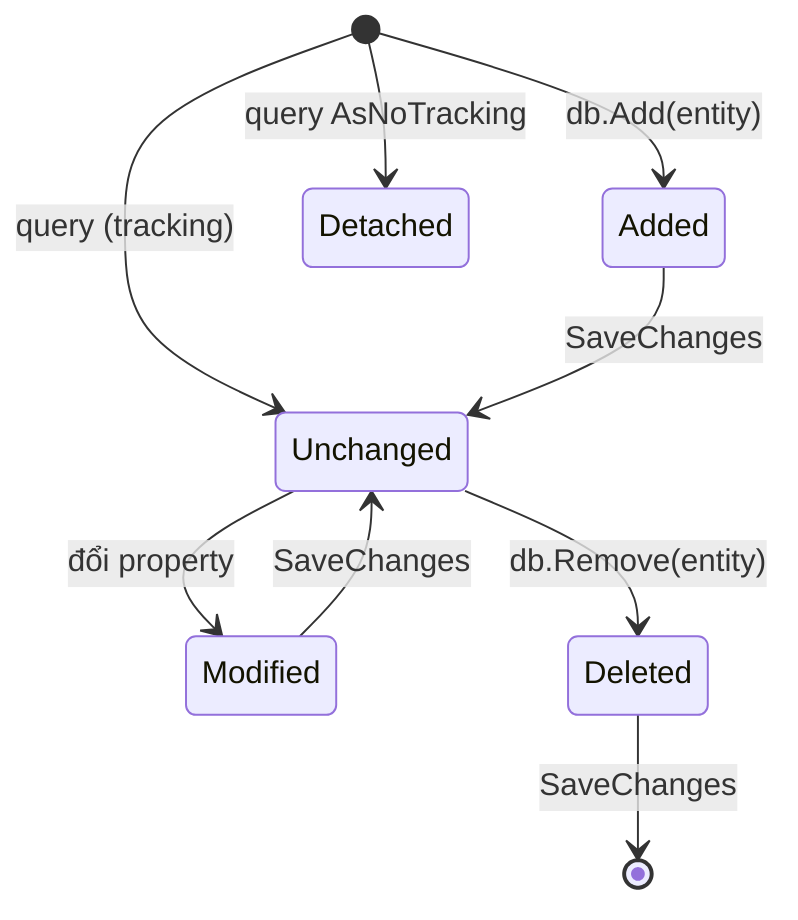

# Chương 2 — EF Core với SQLite

## Mục tiêu

- Hiểu ORM và EF Core: `DbContext`, `DbSet<T>`, entity, navigation, foreign key.
- Viết query LINQ và xem SQL mà EF Core sinh ra.
- Hiểu *change tracking*, `AsNoTracking`, `Include`, projection bằng `Select`.
- Dùng `ExecuteUpdate`/`ExecuteDelete`, transaction.
- Dùng *migrations* với `dotnet ef` để quản lý schema.

## Giải thích đơn giản

**EF Core** (Entity Framework Core) là *ORM* (Object-Relational Mapper): bạn làm việc với object
C#, EF Core dịch sang SQL. Tương đương:

| Node/TS | Java | .NET |
|---|---|---|
| Prisma / TypeORM | JPA / Hibernate | EF Core |
| `prisma.book.findMany({ where })` | `repository.findAll(spec)` | `db.Books.Where(...).ToListAsync()` |
| `prisma migrate` | Flyway / Liquibase | `dotnet ef migrations` |

- **`DbContext`** = một "phiên làm việc" với database (giống `EntityManager` của JPA).
- **`DbSet<Book>`** = một bảng, query được bằng LINQ (Tập 2, Chương 3).
- Bộ sách dùng **SQLite** để chạy được ở mọi máy, không cần cài database server. Đổi sang
  SQL Server/PostgreSQL chủ yếu chỉ đổi provider (`UseSqlServer`, `UseNpgsql`).

## Ví dụ

<!-- include: examples/V3Ch02.EfCore/V3Ch02.EfCore.csproj -->
```xml
<Project Sdk="Microsoft.NET.Sdk">

  <PropertyGroup>
    <OutputType>Exe</OutputType>
  </PropertyGroup>

  <ItemGroup>
    <PackageReference Include="Microsoft.EntityFrameworkCore.Sqlite" Version="10.0.12" />
  </ItemGroup>

</Project>
```

**Model và DbContext:**

<!-- include: examples/V3Ch02.EfCore/Model.cs -->
```csharp
using Microsoft.EntityFrameworkCore;
using Microsoft.Extensions.Logging;

namespace V3Ch02.EfCore;

public class Author
{
    public int Id { get; set; }
    public required string Name { get; set; }
    public List<Book> Books { get; } = [];          // navigation: 1 author - n books
}

public class Book
{
    public int Id { get; set; }
    public required string Title { get; set; }
    public decimal Price { get; set; }
    public int Year { get; set; }
    public int AuthorId { get; set; }               // foreign key
    public Author Author { get; set; } = null!;     // navigation
}

public class LibraryContext(string connectionString) : DbContext
{
    public DbSet<Author> Authors => Set<Author>();
    public DbSet<Book> Books => Set<Book>();

    /// <summary>When true, the SQL that EF Core sends to SQLite is printed.</summary>
    public static bool ShowSql { get; set; }

    protected override void OnConfiguring(DbContextOptionsBuilder options) => options
        .UseSqlite(connectionString)
        .LogTo(sql => { if (ShowSql) Console.WriteLine("   SQL> " + OneLine(sql)); },
               [DbLoggerCategory.Database.Command.Name], LogLevel.Information);

    protected override void OnModelCreating(ModelBuilder model)
    {
        model.Entity<Author>().Property(a => a.Name).HasMaxLength(100);
        model.Entity<Book>().Property(b => b.Title).HasMaxLength(200);
        model.Entity<Book>().HasIndex(b => b.Title);
        model.Entity<Book>().Property(b => b.Price).HasConversion<double>(); // SQLite has no decimal type
    }

    private static string OneLine(string log)
    {
        // Keep only the SQL text (after the first blank line) on one line.
        var idx = log.IndexOf(Environment.NewLine, StringComparison.Ordinal);
        var sql = idx >= 0 ? log[(idx + Environment.NewLine.Length)..] : log;
        return string.Join(' ', sql.Split(Environment.NewLine, StringSplitOptions.RemoveEmptyEntries).Select(s => s.Trim()));
    }
}
```

**Chương trình:**

<!-- include: examples/V3Ch02.EfCore/Program.cs -->
```csharp
using Microsoft.EntityFrameworkCore;
using V3Ch02.EfCore;

string dbPath = Path.Combine(Path.GetTempPath(), "v3ch02-library.db");
File.Delete(dbPath);
string cs = $"Data Source={dbPath}";

// 1. Tạo database từ model (demo). Dự án thật dùng migrations (xem chương).
await using (var db = new LibraryContext(cs))
{
    await db.Database.EnsureCreatedAsync();
    Console.WriteLine($"Đã tạo DB: {Path.GetFileName(dbPath)}");
}

// 2. Thêm dữ liệu: Add + SaveChanges (1 transaction)
await using (var db = new LibraryContext(cs))
{
    var nam = new Author { Name = "Nguyễn Nhật Ánh" };
    nam.Books.Add(new Book { Title = "Mắt biếc", Price = 110_000m, Year = 1990 });
    nam.Books.Add(new Book { Title = "Cho tôi xin một vé đi tuổi thơ", Price = 85_000m, Year = 2008 });
    var to = new Author { Name = "Tô Hoài" };
    to.Books.Add(new Book { Title = "Dế Mèn phiêu lưu ký", Price = 60_000m, Year = 1941 });
    db.Authors.AddRange(nam, to);
    int rows = await db.SaveChangesAsync();
    Console.WriteLine($"SaveChanges: {rows} dòng; id tác giả = {nam.Id}, {to.Id}");
}

// 3. Query LINQ -> SQL
await using (var db = new LibraryContext(cs))
{
    LibraryContext.ShowSql = true;
    Console.WriteLine("Sách sau năm 1980, giá giảm dần:");
    var books = await db.Books
        .Where(b => b.Year > 1980)
        .OrderByDescending(b => b.Price)
        .Select(b => new { b.Title, b.Price, Author = b.Author.Name })   // projection: chỉ lấy cột cần
        .ToListAsync();
    LibraryContext.ShowSql = false;
    foreach (var b in books) Console.WriteLine($"  {b.Title} - {b.Author} - {b.Price:N0}");
}

// 4. Include (eager loading) và GroupBy
await using (var db = new LibraryContext(cs))
{
    var authors = await db.Authors.Include(a => a.Books).OrderBy(a => a.Name).ToListAsync();
    foreach (var a in authors) Console.WriteLine($"  {a.Name}: {a.Books.Count} cuốn");

    var stats = await db.Books.GroupBy(b => b.Author.Name)
        .Select(g => new { Author = g.Key, Avg = g.Average(b => (double)b.Price) })
        .ToListAsync();
    foreach (var s in stats) Console.WriteLine($"  Giá TB {s.Author}: {s.Avg:N0}");
}

// 5. Change tracking: sửa object rồi SaveChanges -> UPDATE
await using (var db = new LibraryContext(cs))
{
    var book = await db.Books.SingleAsync(b => b.Title == "Mắt biếc");
    book.Price = 120_000m;
    Console.WriteLine($"Trạng thái trước SaveChanges: {db.Entry(book).State}");
    LibraryContext.ShowSql = true;
    await db.SaveChangesAsync();
    LibraryContext.ShowSql = false;
    Console.WriteLine($"Trạng thái sau SaveChanges: {db.Entry(book).State}");

    var readOnly = await db.Books.AsNoTracking().FirstAsync();
    Console.WriteLine($"AsNoTracking -> trạng thái: {db.Entry(readOnly).State}");
}

// 6. ExecuteUpdate / ExecuteDelete: cập nhật hàng loạt, không nạp entity
await using (var db = new LibraryContext(cs))
{
    LibraryContext.ShowSql = true;
    int updated = await db.Books.Where(b => b.Year < 2000)
        .ExecuteUpdateAsync(s => s.SetProperty(b => b.Price, b => b.Price * 0.9m));
    LibraryContext.ShowSql = false;
    Console.WriteLine($"ExecuteUpdate: giảm giá 10% cho {updated} cuốn");
}

// 7. Transaction thủ công: hoặc tất cả, hoặc không gì cả
await using (var db = new LibraryContext(cs))
{
    await using var tx = await db.Database.BeginTransactionAsync();
    try
    {
        db.Books.Add(new Book { Title = "Sách tạm", Price = 1m, Year = 2026, AuthorId = 1 });
        await db.SaveChangesAsync();
        db.Books.Add(new Book { Title = "Sách lỗi", Price = 1m, Year = 2026, AuthorId = 999 }); // FK không tồn tại
        await db.SaveChangesAsync();
        await tx.CommitAsync();
    }
    catch (DbUpdateException ex)
    {
        await tx.RollbackAsync();
        Console.WriteLine($"Rollback vì: {ex.InnerException?.Message}");
    }
}

await using (var db = new LibraryContext(cs))
{
    Console.WriteLine($"Số sách cuối cùng: {await db.Books.CountAsync()} (không có 'Sách tạm')");
}
File.Delete(dbPath);
```

Output thật (dòng `SQL>` là câu lệnh EF Core gửi tới SQLite):

<!-- output: examples/V3Ch02.EfCore -->
```text
Đã tạo DB: v3ch02-library.db
SaveChanges: 5 dòng; id tác giả = 1, 2
Sách sau năm 1980, giá giảm dần:
   SQL> Executed DbCommand (0ms) [Parameters=[], CommandType='Text', CommandTimeout='30'] SELECT "b"."Title", "b"."Price", "a"."Name" AS "Author" FROM "Books" AS "b" INNER JOIN "Authors" AS "a" ON "b"."AuthorId" = "a"."Id" WHERE "b"."Year" > 1980 ORDER BY "b"."Price" DESC
  Mắt biếc - Nguyễn Nhật Ánh - 110,000
  Cho tôi xin một vé đi tuổi thơ - Nguyễn Nhật Ánh - 85,000
  Nguyễn Nhật Ánh: 2 cuốn
  Tô Hoài: 1 cuốn
  Giá TB Nguyễn Nhật Ánh: 97,500
  Giá TB Tô Hoài: 60,000
Trạng thái trước SaveChanges: Modified
   SQL> Executed DbCommand (0ms) [Parameters=[@p1='?' (DbType = Int32), @p0='?' (DbType = Double)], CommandType='Text', CommandTimeout='30'] UPDATE "Books" SET "Price" = @p0 WHERE "Id" = @p1 RETURNING 1;
Trạng thái sau SaveChanges: Unchanged
AsNoTracking -> trạng thái: Detached
   SQL> Executed DbCommand (1ms) [Parameters=[], CommandType='Text', CommandTimeout='30'] UPDATE "Books" AS "b" SET "Price" = "b"."Price" * 0.90000000000000002 WHERE "b"."Year" < 2000
ExecuteUpdate: giảm giá 10% cho 2 cuốn
Rollback vì: SQLite Error 19: 'FOREIGN KEY constraint failed'.
Số sách cuối cùng: 3 (không có 'Sách tạm')
```

Để ý:

- Query có `Select(new { ... b.Author.Name })` → EF Core tự sinh `INNER JOIN` và chỉ lấy 3 cột.
- Sửa `book.Price` → trạng thái `Modified` → `SaveChanges` sinh đúng một câu `UPDATE` cho cột đó.
- `ExecuteUpdate` sinh một câu `UPDATE ... WHERE` chạy thẳng trên DB, không nạp entity.
- Giá trị `0.90000000000000002`: SQLite không có kiểu `decimal`, nên model chuyển `decimal`
  sang `double` → phép nhân bị sai số nhỏ. Đây là giới hạn đã được ghi trong tài liệu provider SQLite.
- Transaction: lỗi khóa ngoại ở lệnh thứ hai → `Rollback` → "Sách tạm" cũng không được lưu.

## Đi sâu

### Change tracking



- Query mặc định là **tracking**: EF Core nhớ giá trị gốc để biết cái gì đã đổi.
- Chỉ đọc (API GET) → dùng `AsNoTracking()` cho nhanh và nhẹ bộ nhớ.
- `SaveChanges` gom mọi thay đổi vào **một transaction**.

### Nạp dữ liệu liên quan

| Cách | Code | Khi nào |
|---|---|---|
| Eager loading | `.Include(a => a.Books)` | cần cả entity liên quan |
| Projection | `.Select(b => new Dto(b.Title, b.Author.Name))` | API trả DTO — **nên dùng nhất** |
| Lazy loading | cần cấu hình thêm | dễ gây N+1 query, bộ sách không dùng |

**N+1 query**: lấy 100 tác giả (1 query) rồi với mỗi tác giả lại query sách (100 query).
Tránh bằng `Include` hoặc projection.

### Migrations

`EnsureCreated()` chỉ hợp cho demo/test: nó tạo schema từ model nhưng **không cập nhật** được
khi model đổi. Dự án thật dùng **migrations**. Dự án cuối (`final-project/`) dùng
công cụ `dotnet-ef` 10.0.12 cài qua *local tool manifest* (`dotnet-tools.json`):

```text
dotnet tool restore
dotnet ef migrations add InitialCreate --project src/TaskBoard.Infrastructure --startup-project src/TaskBoard.Api --output-dir Migrations
```

Output thật của các lệnh kiểm tra:

<!-- output: examples/V3Ch02.Migrations -->
```text
$ dotnet ef migrations list
20260928145829_InitialCreate
$ dotnet ef migrations has-pending-model-changes
No changes have been made to the model since the last migration.
$ dotnet ef migrations script (first 14 lines)
CREATE TABLE IF NOT EXISTS "__EFMigrationsHistory" (
    "MigrationId" TEXT NOT NULL CONSTRAINT "PK___EFMigrationsHistory" PRIMARY KEY,
    "ProductVersion" TEXT NOT NULL
);

BEGIN TRANSACTION;
CREATE TABLE "tasks" (
    "Id" INTEGER NOT NULL CONSTRAINT "PK_tasks" PRIMARY KEY AUTOINCREMENT,
    "Title" TEXT NOT NULL,
    "Description" TEXT NULL,
    "Status" TEXT NOT NULL,
    "Priority" INTEGER NOT NULL,
    "DueDate" TEXT NULL,
    "CreatedAt" TEXT NOT NULL,
```

- `(Pending)` = migration chưa được áp dụng vào file DB trên máy (API sẽ áp dụng khi khởi động
  bằng `Database.Migrate()`).
- `has-pending-model-changes` nên chạy trong CI: nếu ai đó sửa model mà quên tạo migration,
  lệnh báo lỗi. Từ EF Core 9, `Migrate()` cũng ném exception nếu model có thay đổi chưa có migration.
- Khi thử `migrations script --idempotent`, SQLite báo *"Generating idempotent scripts for
  migrations is not currently supported for SQLite"* (lỗi thật khi viết chương) — với
  SQL Server/PostgreSQL thì dùng được.
- Áp dụng migration lúc khởi động là cách đơn giản; hệ thống lớn nên chạy migration như một
  bước deploy riêng (theo tài liệu EF Core).

## Lỗi và bẫy thường gặp

- **`DbContext` không thread-safe**: không dùng một `DbContext` cho nhiều request/luồng. Trong
  ASP.NET Core, `AddDbContext` đăng ký **Scoped** (mỗi request một instance).
- **Quên `await`/dùng `.Result`** với `ToListAsync()` → chặn luồng.
- **N+1 query** khi duyệt navigation trong vòng lặp.
- **Kéo cả bảng về rồi mới lọc**: `db.Books.ToList().Where(...)` lọc trên RAM. Hãy `Where` trước
  `ToList`.
- **SQLite và `decimal`/`DateTimeOffset`**: không có kiểu tương ứng; không `ORDER BY` được
  `DateTimeOffset`. Dùng converter hoặc kiểu khác (tài liệu provider SQLite).
- **Lưu tiền bằng `double`**: sai số. Với SQLite có thể lưu số nguyên (đồng/xu) như Bài tập 1.
- **Enum lưu dạng chuỗi rồi `ORDER BY`**: sắp theo chữ cái, không theo giá trị. Dự án cuối lưu
  `Priority` dạng số vì lý do này.

## Tóm tắt

- `DbContext` + `DbSet<T>` + LINQ = truy vấn database bằng C#.
- Tracking cho ghi, `AsNoTracking` + projection cho đọc.
- `ExecuteUpdate/Delete` cho thao tác hàng loạt; transaction cho nhiều bước.
- Migrations (`dotnet ef`) để quản lý schema theo thời gian.

## Bài tập (có lời giải)

1. Với `Category` và `Product`, tìm danh mục có tổng giá sản phẩm cao nhất (một query).
2. Lấy trang 2 (mỗi trang 2 sản phẩm), sắp theo tên.
3. Cài *soft delete*: thêm `IsDeleted` và *global query filter* để query mặc định bỏ qua sản phẩm
   đã xóa; dùng `IgnoreQueryFilters()` để đếm tất cả.

<details>
<summary>Lời giải</summary>

<!-- include: examples/V3Ch02.Solutions/Program.cs -->
```csharp
using Microsoft.Data.Sqlite;
using Microsoft.EntityFrameworkCore;

// In-memory SQLite: DB sống khi connection còn mở (tiện cho demo và test)
await using var connection = new SqliteConnection("Data Source=:memory:");
await connection.OpenAsync();
var options = new DbContextOptionsBuilder<ShopContext>().UseSqlite(connection).Options;

await using (var db = new ShopContext(options))
{
    await db.Database.EnsureCreatedAsync();
    var fruits = new Category { Name = "Trái cây" };
    var drinks = new Category { Name = "Đồ uống" };
    db.Products.AddRange(
        new Product { Name = "Cam", Price = 30_000, Category = fruits },
        new Product { Name = "Xoài", Price = 45_000, Category = fruits },
        new Product { Name = "Trà sữa", Price = 35_000, Category = drinks },
        new Product { Name = "Cà phê", Price = 25_000, Category = drinks },
        new Product { Name = "Nước cam", Price = 20_000, Category = drinks });
    await db.SaveChangesAsync();
}

await using (var db = new ShopContext(options))
{
    // Bài 1: danh mục có tổng giá cao nhất
    var top = await db.Categories
        .Select(c => new { c.Name, Total = c.Products.Sum(p => p.Price) })
        .OrderByDescending(x => x.Total)
        .FirstAsync();
    Console.WriteLine($"Bài 1: {top.Name} (tổng {top.Total:N0})");

    // Bài 2: phân trang, trang 2, mỗi trang 2 sản phẩm, sắp theo tên
    var page2 = await db.Products.OrderBy(p => p.Name).Skip(2).Take(2).Select(p => p.Name).ToListAsync();
    Console.WriteLine($"Bài 2: trang 2 = {string.Join(", ", page2)}");

    // Bài 3: soft delete với global query filter
    var coffee = await db.Products.SingleAsync(p => p.Name == "Cà phê");
    coffee.IsDeleted = true;
    await db.SaveChangesAsync();
}

await using (var db = new ShopContext(options))
{
    Console.WriteLine($"Bài 3: số sản phẩm thấy được = {await db.Products.CountAsync()}");
    Console.WriteLine($"Bài 3: kể cả đã xóa mềm = {await db.Products.IgnoreQueryFilters().CountAsync()}");
}

public class Category
{
    public int Id { get; set; }
    public required string Name { get; set; }
    public List<Product> Products { get; } = [];
}

public class Product
{
    public int Id { get; set; }
    public required string Name { get; set; }
    public long Price { get; set; }            // lưu tiền VND dạng số nguyên (đồng)
    public bool IsDeleted { get; set; }
    public int CategoryId { get; set; }
    public Category Category { get; set; } = null!;
}

public class ShopContext(DbContextOptions<ShopContext> options) : DbContext(options)
{
    public DbSet<Product> Products => Set<Product>();
    public DbSet<Category> Categories => Set<Category>();

    protected override void OnModelCreating(ModelBuilder model) =>
        model.Entity<Product>().HasQueryFilter(p => !p.IsDeleted);
}
```

<!-- output: examples/V3Ch02.Solutions -->
```text
Bài 1: Đồ uống (tổng 80,000)
Bài 2: trang 2 = Nước cam, Trà sữa
Bài 3: số sản phẩm thấy được = 4
Bài 3: kể cả đã xóa mềm = 5
```

Lời giải dùng SQLite **in-memory** (`Data Source=:memory:`): database tồn tại khi connection còn mở.
Rất tiện cho test (dự án cuối dùng cách tương tự trong integration test).
</details>

## Nguồn tham khảo (Sources)

- EF Core overview: https://github.com/dotnet/EntityFramework.Docs/blob/main/entity-framework/core/index.md
- Tracking vs. no-tracking queries: https://github.com/dotnet/EntityFramework.Docs/blob/main/entity-framework/core/querying/tracking.md
- Eager loading: https://github.com/dotnet/EntityFramework.Docs/blob/main/entity-framework/core/querying/related-data/eager.md
- ExecuteUpdate and ExecuteDelete: https://github.com/dotnet/EntityFramework.Docs/blob/main/entity-framework/core/saving/execute-insert-update-delete.md
- Transactions: https://github.com/dotnet/EntityFramework.Docs/blob/main/entity-framework/core/saving/transactions.md
- Migrations overview: https://github.com/dotnet/EntityFramework.Docs/blob/main/entity-framework/core/managing-schemas/migrations/index.md
- Applying migrations: https://github.com/dotnet/EntityFramework.Docs/blob/main/entity-framework/core/managing-schemas/migrations/applying.md
- SQLite provider limitations: https://github.com/dotnet/EntityFramework.Docs/blob/main/entity-framework/core/providers/sqlite/limitations.md
- Global query filters: https://github.com/dotnet/EntityFramework.Docs/blob/main/entity-framework/core/querying/filters.md
