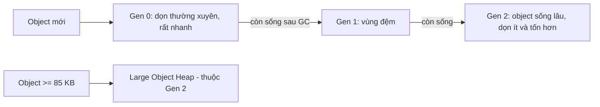

# Chương 3 — Hiệu năng: Span, bộ nhớ, BenchmarkDotNet

## Mục tiêu

- Hiểu cách .NET quản lý bộ nhớ: stack, heap, *GC* (Garbage Collector — bộ gom rác) và các thế hệ (generation).
- Dùng `Span<T>`, `ReadOnlySpan<T>`, `stackalloc`, `ArrayPool<T>` để giảm cấp phát.
- Đo hiệu năng **đúng cách** bằng BenchmarkDotNet, đọc bảng kết quả.

## Giải thích đơn giản

Mỗi lần bạn tạo object (chuỗi, mảng, class), .NET cấp phát trên **heap**. GC định kỳ dọn các
object không còn dùng. GC nhanh, nhưng **cấp phát càng ít thì GC càng ít phải chạy** → ứng dụng
mượt hơn, nhất là Web API xử lý hàng nghìn request/giây.

`Span<T>` là "cửa sổ" nhìn vào một vùng nhớ **có sẵn** (mảng, chuỗi, stack) mà không copy.
Giống `subarray()` của `Uint8Array` trong JavaScript: cắt mà không tạo dữ liệu mới.

Quy tắc vàng: **đo trước, tối ưu sau**. Đừng đoán; dùng BenchmarkDotNet hoặc profiler.

## Ví dụ

### Ví dụ 1 — Span và cấp phát bộ nhớ

<!-- include: examples/V3Ch03.Spans/Program.cs -->
```csharp
using System.Buffers;
using System.Runtime.InteropServices;

const string line = "SKU-001,Bàn phím cơ,1200000,15";

// 1. Span<T> là "cửa sổ" nhìn vào bộ nhớ có sẵn, không copy
int[] numbers = [10, 20, 30, 40, 50];
Span<int> middle = numbers.AsSpan(1, 3);   // 20, 30, 40
middle[0] = 99;                            // sửa luôn mảng gốc
Console.WriteLine($"numbers = [{string.Join(", ", numbers)}], middle.Length = {middle.Length}");

// 2. ReadOnlySpan<char>: cắt chuỗi không tạo chuỗi mới
ReadOnlySpan<char> span = line;
int firstComma = span.IndexOf(',');
ReadOnlySpan<char> sku = span[..firstComma];
Console.WriteLine($"SKU = {sku.ToString()} (chỉ ToString() khi cần mới cấp phát)");

// 3. So sánh cấp phát bộ nhớ: string.Split vs Span
const int N = 100_000;
long before = GC.GetAllocatedBytesForCurrentThread();
long sum1 = 0;
for (int i = 0; i < N; i++) sum1 += ParseWithSplit(line);
long splitBytes = GC.GetAllocatedBytesForCurrentThread() - before;

before = GC.GetAllocatedBytesForCurrentThread();
long sum2 = 0;
for (int i = 0; i < N; i++) sum2 += ParseWithSpan(line);
long spanBytes = GC.GetAllocatedBytesForCurrentThread() - before;

Console.WriteLine($"Split: tổng={sum1}, cấp phát ~{splitBytes / N} bytes/lần");
Console.WriteLine($"Span : tổng={sum2}, cấp phát ~{spanBytes / N} bytes/lần");

// 4. stackalloc: bộ nhớ tạm trên stack (nhỏ, ngắn hạn), không cần GC
Span<byte> buffer = stackalloc byte[16];
Random.Shared.NextBytes(buffer);
Console.WriteLine($"stackalloc 16 bytes, Length = {buffer.Length}");

// 5. ArrayPool: mượn mảng lớn rồi trả lại, tránh cấp phát lặp lại
byte[] rented = ArrayPool<byte>.Shared.Rent(4096);
try
{
    Console.WriteLine($"Rent(4096) -> mảng dài {rented.Length} (có thể lớn hơn yêu cầu)");
}
finally
{
    ArrayPool<byte>.Shared.Return(rented);
}

// 6. C# 14 first-class span: mảng tự chuyển sang ReadOnlySpan khi gọi hàm
Console.WriteLine($"Sum(array) = {Sum(numbers)}");

// 7. CollectionsMarshal.AsSpan: duyệt List<T> không kiểm tra version
List<int> list = [1, 2, 3, 4];
foreach (ref int x in CollectionsMarshal.AsSpan(list)) x *= 10;
Console.WriteLine($"list = [{string.Join(", ", list)}]");

// 8. Thông tin GC
Console.WriteLine($"GC: gen0={GC.CollectionCount(0)}, gen1={GC.CollectionCount(1)}, gen2={GC.CollectionCount(2)}, server GC={System.Runtime.GCSettings.IsServerGC}");

static int ParseWithSplit(string csv)
{
    string[] parts = csv.Split(',');            // cấp phát mảng + 4 chuỗi
    return int.Parse(parts[3]);
}

static int ParseWithSpan(ReadOnlySpan<char> csv)
{
    int last = csv.LastIndexOf(',');
    return int.Parse(csv[(last + 1)..]);         // không cấp phát
}

static int Sum(ReadOnlySpan<int> values)
{
    int total = 0;
    foreach (var v in values) total += v;
    return total;
}
```

Output thật:

<!-- output: examples/V3Ch03.Spans -->
```text
numbers = [10, 99, 30, 40, 50], middle.Length = 3
SKU = SKU-001 (chỉ ToString() khi cần mới cấp phát)
Split: tổng=1500000, cấp phát ~216 bytes/lần
Span : tổng=1500000, cấp phát ~0 bytes/lần
stackalloc 16 bytes, Length = 16
Rent(4096) -> mảng dài 4096 (có thể lớn hơn yêu cầu)
Sum(array) = 229
list = [10, 20, 30, 40]
GC: gen0=0, gen1=0, gen2=0, server GC=False
```

`string.Split` cấp phát khoảng 216 bytes mỗi lần (một mảng + 4 chuỗi). Bản dùng `Span` cấp phát
**0 byte** — cùng kết quả.

### Ví dụ 2 — BenchmarkDotNet

<!-- include: examples/V3Ch03.Bench/V3Ch03.Bench.csproj -->
```xml
<Project Sdk="Microsoft.NET.Sdk">

  <PropertyGroup>
    <OutputType>Exe</OutputType>
    <!-- BenchmarkDotNet generates code; keep warnings as warnings for this project. -->
    <TreatWarningsAsErrors>false</TreatWarningsAsErrors>
  </PropertyGroup>

  <ItemGroup>
    <PackageReference Include="BenchmarkDotNet" Version="0.15.8" />
  </ItemGroup>

</Project>
```

<!-- include: examples/V3Ch03.Bench/Program.cs -->
```csharp
using System.Text;
using BenchmarkDotNet.Attributes;
using BenchmarkDotNet.Running;

// Chạy: dotnet run -c Release -- --job short --filter "*"
BenchmarkSwitcher.FromAssembly(typeof(ParsingBenchmarks).Assembly).Run(args);

[MemoryDiagnoser]            // đo thêm bộ nhớ cấp phát và số lần GC
public class ParsingBenchmarks
{
    private const string Line = "SKU-001,Bàn phím cơ,1200000,15";

    [Benchmark(Baseline = true)]
    public int Split() => int.Parse(Line.Split(',')[3]);

    [Benchmark]
    public int Span()
    {
        ReadOnlySpan<char> s = Line;
        return int.Parse(s[(s.LastIndexOf(',') + 1)..]);
    }
}

[MemoryDiagnoser]
public class ConcatBenchmarks
{
    [Params(10, 1000)]
    public int Count { get; set; }

    [Benchmark(Baseline = true)]
    public string PlusEquals()
    {
        string s = "";
        for (int i = 0; i < Count; i++) s += i;
        return s;
    }

    [Benchmark]
    public string Builder()
    {
        var sb = new StringBuilder();
        for (int i = 0; i < Count; i++) sb.Append(i);
        return sb.ToString();
    }
}
```

Chạy với **ShortRun** (3 lần đo, nhanh nhưng kém chính xác hơn job mặc định). Output thật
(chỉ giữ phần Summary; thông tin máy nằm ở đầu mỗi bảng):

<!-- output: examples/V3Ch03.BenchRun -->
```text
$ dotnet run -c Release -- --job short --filter "*"
// * Summary *
BenchmarkDotNet v0.15.8, Linux Ubuntu 24.04.4 LTS (Noble Numbat)
Intel Xeon Processor 2.10GHz, 1 CPU, 4 logical and 4 physical cores
.NET SDK 10.0.112
  [Host]   : .NET 10.0.12 (10.0.12, 10.0.1226.42308), X64 RyuJIT x86-64-v4
  ShortRun : .NET 10.0.12 (10.0.12, 10.0.1226.42308), X64 RyuJIT x86-64-v4
Job=ShortRun  IterationCount=3  LaunchCount=1  
WarmupCount=3  
| Method     | Count | Mean          | Error         | StdDev        | Ratio | RatioSD | Gen0    | Allocated | Alloc Ratio |
|----------- |------ |--------------:|--------------:|--------------:|------:|--------:|--------:|----------:|------------:|
| PlusEquals | 10    |     138.57 ns |     146.17 ns |      8.012 ns |  1.00 |    0.07 |  0.0024 |     336 B |        1.00 |
| Builder    | 10    |      63.67 ns |      33.74 ns |      1.849 ns |  0.46 |    0.03 |  0.0011 |     152 B |        0.45 |
|            |       |               |               |               |       |         |         |           |             |
| PlusEquals | 1000  | 310,242.61 ns | 470,992.23 ns | 25,816.674 ns |  1.00 |    0.10 | 20.5078 | 2840456 B |       1.000 |
| Builder    | 1000  |   5,975.64 ns |   1,485.25 ns |     81.412 ns |  0.02 |    0.00 |  0.1068 |   14712 B |       0.005 |
// * Summary *
BenchmarkDotNet v0.15.8, Linux Ubuntu 24.04.4 LTS (Noble Numbat)
Intel Xeon Processor 2.10GHz, 1 CPU, 4 logical and 4 physical cores
.NET SDK 10.0.112
  [Host]   : .NET 10.0.12 (10.0.12, 10.0.1226.42308), X64 RyuJIT x86-64-v4
  ShortRun : .NET 10.0.12 (10.0.12, 10.0.1226.42308), X64 RyuJIT x86-64-v4
Job=ShortRun  IterationCount=3  LaunchCount=1  
WarmupCount=3  
| Method | Mean      | Error     | StdDev    | Ratio | RatioSD | Gen0   | Allocated | Alloc Ratio |
|------- |----------:|----------:|----------:|------:|--------:|-------:|----------:|------------:|
| Split  | 84.683 ns | 94.740 ns | 5.1930 ns |  1.00 |    0.07 | 0.0015 |     216 B |        1.00 |
| Span   |  6.470 ns |  7.644 ns | 0.4190 ns |  0.08 |    0.01 |      - |         - |        0.00 |
Global total time: 00:00:59 (59.91 sec), executed benchmarks: 6
Load average khi chạy xong (1/5/15 phút): 7.39 5.75 4.88
```

**Lưu ý về độ tin cậy**: máy chạy là máy ảo dùng chung với các tiến trình khác (xem dòng
load average). Cột `Error` lớn (ví dụ ±100 ns cho `Split`) cho thấy nhiễu cao. Tỉ lệ (`Ratio`) và
bộ nhớ (`Allocated`) đáng tin hơn thời gian tuyệt đối. Muốn số liệu chính xác, chạy job mặc định
(không `--job short`) trên máy rảnh.

## Đi sâu

### Đọc bảng BenchmarkDotNet

| Cột | Ý nghĩa |
|---|---|
| Mean | thời gian trung bình mỗi lần gọi |
| Error / StdDev | độ bất định / độ lệch chuẩn — càng nhỏ càng tin cậy |
| Ratio | so với phương thức `Baseline = true` |
| Gen0 / Gen1 | số lần GC mỗi 1000 lần gọi |
| Allocated | bộ nhớ cấp phát mỗi lần gọi |

Kết quả: `Span` nhanh hơn `Split` hơn 10 lần (Ratio khoảng 0.06–0.07 ở các lần chạy khi viết sách) và không cấp phát. Với `Count = 1000`,
`+=` cấp phát ~2.8 MB (mỗi lần nối tạo chuỗi mới), `StringBuilder` chỉ ~14 KB.

### GC và các thế hệ



- Phần lớn object "chết trẻ" → Gen 0 dọn rất rẻ.
- Object lớn (mảng ≥ 85.000 byte) vào LOH, dọn tốn kém → dùng `ArrayPool` để tái sử dụng.
- ASP.NET Core mặc định dùng *Server GC* (nhiều heap, tối ưu thông lượng); app console dùng
  Workstation GC (output `server GC=False`).

### Công cụ giảm cấp phát

| Công cụ | Dùng khi |
|---|---|
| `ReadOnlySpan<char>` | parse/cắt chuỗi không tạo chuỗi con |
| `stackalloc` | buffer nhỏ (vài trăm byte), ngắn hạn, trong một method |
| `ArrayPool<T>.Shared` | buffer lớn dùng lặp lại (đọc stream, xử lý file) |
| `StringBuilder` / `string.Create` | ghép chuỗi nhiều phần |
| `ValueTask<T>` | async thường hoàn thành đồng bộ (cache hit) |
| `struct` nhỏ, `readonly struct` | dữ liệu nhỏ, tránh cấp phát heap |

C# 14 thêm *first-class span*: mảng tự chuyển sang `Span<T>`/`ReadOnlySpan<T>` khi gọi hàm,
làm API dùng span dễ dùng hơn (`Sum(numbers)` trong ví dụ).

### Giới hạn của Span

`Span<T>` là `ref struct`: chỉ sống trên stack. Không lưu vào field của class, không dùng qua
`await` trong cùng biểu thức, không đưa vào lambda bắt biến. Cần lưu lâu → dùng `Memory<T>`.

## Lỗi và bẫy thường gặp

- **Benchmark bằng `Stopwatch` trong Debug**: sai lệch lớn (JIT chưa tối ưu, không warmup).
  Luôn chạy BenchmarkDotNet với `-c Release`.
- **Tối ưu code không nóng**: 90% thời gian thường nằm ở 10% code (và I/O, database).
  Đo trước bằng profiler (`dotnet-trace`, `dotnet-counters`).
- **`stackalloc` quá lớn** → `StackOverflowException` (không bắt được). Giữ dưới vài KB, hoặc
  dùng `ArrayPool` khi kích thước lớn/không biết trước.
- **Quên `Return` mảng về `ArrayPool`** → mất lợi ích; dùng `try/finally`.
- **Dùng mảng từ pool sau khi đã Return** → dữ liệu bị ghi đè bởi nơi khác.
- **Tin số liệu từ máy ồn**: xem cột Error/StdDev; so sánh Ratio thay vì thời gian tuyệt đối.

## Tóm tắt

- Ít cấp phát = ít GC = nhanh và ổn định hơn.
- `Span<T>` cắt dữ liệu không copy; `stackalloc`, `ArrayPool` cho buffer.
- BenchmarkDotNet + `[MemoryDiagnoser]` là cách đo chuẩn; đọc Ratio và Allocated.

## Bài tập (có lời giải)

1. Đếm số từ trong một câu mà **không cấp phát** (không dùng `Split`).
2. Tạo mã đơn hàng dạng `ORD-2026-000042` vào buffer `stackalloc` bằng `TryFormat`.
3. Tính tổng các số trong chuỗi CSV 1000 phần tử, dùng `ArrayPool` và `MemoryExtensions.Split`.

<details>
<summary>Lời giải</summary>

<!-- include: examples/V3Ch03.Solutions/Program.cs -->
```csharp
using System.Buffers;

// Bài 1: đếm số từ trong câu mà không cấp phát (không Split)
const string text = "  Span giúp   xử lý chuỗi  nhanh và ít rác ";
long before = GC.GetAllocatedBytesForCurrentThread();
int words = CountWords(text);
long allocated = GC.GetAllocatedBytesForCurrentThread() - before;
Console.WriteLine($"Bài 1: {words} từ, cấp phát {allocated} bytes");

// Bài 2: định dạng mã đơn hàng vào buffer stackalloc bằng TryFormat
Span<char> buffer = stackalloc char[32];
int written = FormatOrderCode(buffer, 2026, 42);
Console.WriteLine($"Bài 2: {buffer[..written].ToString()}");

// Bài 3: tổng các số trong một chuỗi CSV dài dùng buffer mượn từ ArrayPool
string csv = string.Join(",", Enumerable.Range(1, 1000));
Console.WriteLine($"Bài 3: tổng = {SumCsv(csv)}");

static int CountWords(ReadOnlySpan<char> s)
{
    int count = 0;
    bool inWord = false;
    foreach (char c in s)
    {
        if (char.IsWhiteSpace(c)) inWord = false;
        else if (!inWord) { inWord = true; count++; }
    }
    return count;
}

static int FormatOrderCode(Span<char> destination, int year, int number)
{
    "ORD-".CopyTo(destination);
    int pos = 4;
    year.TryFormat(destination[pos..], out int w1); pos += w1;
    destination[pos++] = '-';
    number.TryFormat(destination[pos..], out int w2, "D6"); pos += w2;
    return pos;
}

static long SumCsv(string csv)
{
    int[] values = ArrayPool<int>.Shared.Rent(csv.Length / 2 + 1);
    try
    {
        int n = 0;
        foreach (var range in csv.AsSpan().Split(','))       // MemoryExtensions.Split (.NET 9): không cấp phát
            values[n++] = int.Parse(csv.AsSpan()[range]);
        long sum = 0;
        foreach (var v in values.AsSpan(0, n)) sum += v;
        return sum;
    }
    finally
    {
        ArrayPool<int>.Shared.Return(values);
    }
}
```

<!-- output: examples/V3Ch03.Solutions -->
```text
Bài 1: 9 từ, cấp phát 0 bytes
Bài 2: ORD-2026-000042
Bài 3: tổng = 500500
```

Bài 1 đo bằng `GC.GetAllocatedBytesForCurrentThread()` và thấy đúng 0 byte.
</details>

## Nguồn tham khảo (Sources)

- Memory and spans: https://github.com/dotnet/docs/blob/main/docs/standard/memory-and-spans/index.md
- Memory<T> and Span<T> usage guidelines: https://github.com/dotnet/docs/blob/main/docs/standard/memory-and-spans/memory-t-usage-guidelines.md
- Garbage collection fundamentals: https://github.com/dotnet/docs/blob/main/docs/standard/garbage-collection/fundamentals.md
- stackalloc: https://github.com/dotnet/docs/blob/main/docs/csharp/language-reference/operators/stackalloc.md
- First-class Span types (C# 14): https://github.com/dotnet/csharplang/blob/main/proposals/csharp-14.0/first-class-span-types.md
- BenchmarkDotNet repository: https://github.com/dotnet/BenchmarkDotNet
- BenchmarkDotNet on NuGet: https://www.nuget.org/packages/BenchmarkDotNet/0.15.8
