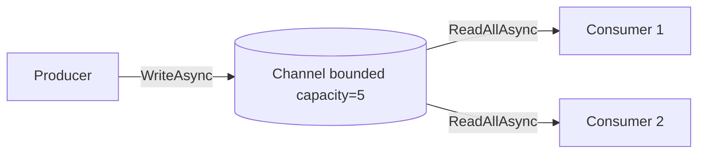

# Chương 4 — Concurrency (xử lý đồng thời)

## Mục tiêu

- Phân biệt *concurrency* (đồng thời), *parallelism* (song song) và *asynchrony* (bất đồng bộ).
- Nhận ra *race condition* và sửa bằng `lock` (`System.Threading.Lock`), `Interlocked`, collection đồng thời.
- Dùng `Task.Run`, `Parallel.For/ForEach/ForEachAsync`, PLINQ cho việc nặng CPU.
- Xây producer/consumer bằng `Channel<T>`.
- Tránh deadlock.

## Giải thích đơn giản

- **Asynchrony** (Tập 2, Chương 5): chờ I/O mà không chặn luồng. Phù hợp gọi DB, HTTP, file.
- **Parallelism**: chia việc **tính toán** cho nhiều lõi CPU chạy cùng lúc.
- **Concurrency**: nhiều việc "đang diễn ra" cùng lúc (có thể song song hoặc xen kẽ).

Node.js chạy JavaScript trên một luồng, nên bạn hiếm khi gặp race condition trên biến.
Java và .NET có **nhiều luồng thật** dùng chung bộ nhớ → phải đồng bộ khi nhiều luồng cùng sửa
một dữ liệu. Web API ASP.NET Core xử lý nhiều request **song song** trên thread pool, nên mọi
singleton phải an toàn đa luồng (thread-safe).

## Ví dụ

<!-- include: examples/V3Ch04.Concurrency/Program.cs -->
```csharp
using System.Collections.Concurrent;
using System.Diagnostics;
using System.Threading.Channels;

Console.WriteLine($"Số CPU logic: {Environment.ProcessorCount}");
const int N = 1_000_000;

// 1. Race condition: nhiều luồng cùng sửa một biến
int unsafeCounter = 0;
Parallel.For(0, N, _ => unsafeCounter++);            // ++ không phải thao tác nguyên tử
Console.WriteLine($"Không đồng bộ: {unsafeCounter:N0} (mong đợi {N:N0})");

// 2. lock với System.Threading.Lock (C# 13 / .NET 9)
var gate = new Lock();
int lockedCounter = 0;
Parallel.For(0, N, _ => { lock (gate) { lockedCounter++; } });
Console.WriteLine($"lock:          {lockedCounter:N0}");

// 3. Interlocked: nguyên tử, nhanh cho phép toán đơn giản
int atomicCounter = 0;
Parallel.For(0, N, _ => Interlocked.Increment(ref atomicCounter));
Console.WriteLine($"Interlocked:   {atomicCounter:N0}");

// 4. ConcurrentDictionary: collection an toàn đa luồng
var wordCounts = new ConcurrentDictionary<string, int>();
string[] words = ["c#", "java", "c#", "ts", "c#", "java"];
Parallel.ForEach(Enumerable.Range(0, 1000), i =>
    wordCounts.AddOrUpdate(words[i % words.Length], 1, (_, old) => old + 1));
Console.WriteLine("ConcurrentDictionary: " + string.Join(", ", wordCounts.OrderBy(kv => kv.Key).Select(kv => $"{kv.Key}={kv.Value}")));

// 5. Việc nặng CPU: tuần tự vs Task.Run vs PLINQ
static bool IsPrime(int n)
{
    if (n < 2) return false;
    for (int d = 2; d * d <= n; d++) if (n % d == 0) return false;
    return true;
}
const int Limit = 3_000_000;
var sw = Stopwatch.StartNew();
int seq = Enumerable.Range(0, Limit).Count(IsPrime);
var seqMs = sw.ElapsedMilliseconds;

sw.Restart();
// Chia đều theo kiểu "xen kẽ" (i, i+4, i+8...) để 4 task có lượng việc gần bằng nhau
var tasks = Enumerable.Range(0, 4).Select(offset => Task.Run(() =>
{
    int count = 0;
    for (int n = offset; n < Limit; n += 4) if (IsPrime(n)) count++;
    return count;
}));
int par = (await Task.WhenAll(tasks)).Sum();
var parMs = sw.ElapsedMilliseconds;

sw.Restart();
int plinq = Enumerable.Range(0, Limit).AsParallel().Count(IsPrime);
var plinqMs = sw.ElapsedMilliseconds;
Console.WriteLine($"Số nguyên tố < 3 triệu: tuần tự={seq:N0} ({seqMs} ms), 4 task={par:N0} ({parMs} ms), PLINQ={plinq:N0} ({plinqMs} ms)");

// 6. Parallel.ForEachAsync: giới hạn số việc I/O chạy cùng lúc
int inFlight = 0, maxInFlight = 0;
await Parallel.ForEachAsync(Enumerable.Range(1, 12), new ParallelOptions { MaxDegreeOfParallelism = 3 }, async (i, ct) =>
{
    int now = Interlocked.Increment(ref inFlight);
    int seen;
    while (now > (seen = Volatile.Read(ref maxInFlight)) && Interlocked.CompareExchange(ref maxInFlight, now, seen) != seen) { }
    await Task.Delay(30, ct);
    Interlocked.Decrement(ref inFlight);
});
Console.WriteLine($"ForEachAsync: tối đa {maxInFlight} việc cùng lúc (giới hạn 3)");

// 7. Channel<T>: producer / consumer có giới hạn (back-pressure)
var channel = Channel.CreateBounded<int>(new BoundedChannelOptions(capacity: 5)
{
    FullMode = BoundedChannelFullMode.Wait,
});
var producer = Task.Run(async () =>
{
    for (int i = 1; i <= 20; i++) await channel.Writer.WriteAsync(i);
    channel.Writer.Complete();
});
var consumers = Enumerable.Range(1, 2).Select(id => Task.Run(async () =>
{
    int handled = 0, total = 0;
    await foreach (var item in channel.Reader.ReadAllAsync())
    {
        handled++;
        total += item;
        await Task.Delay(5);
    }
    return (id, handled, total);
})).ToArray();
await producer;
var results = await Task.WhenAll(consumers);
Console.WriteLine($"Channel: tổng xử lý = {results.Sum(r => r.handled)} việc, tổng giá trị = {results.Sum(r => r.total)} " +
                  $"(consumer 1 làm {results[0].handled}, consumer 2 làm {results[1].handled})");

// Máy build dùng chung với tiến trình khác? Load average cao làm song song kém hiệu quả.
if (File.Exists("/proc/loadavg"))
    Console.WriteLine($"Load average (1/5/15 phút): {string.Join(" ", File.ReadAllText("/proc/loadavg").Split(' ')[..3])}");
```

Output thật (các con số thời gian và giá trị "Không đồng bộ" thay đổi mỗi lần chạy):

<!-- output: examples/V3Ch04.Concurrency -->
```text
Số CPU logic: 4
Không đồng bộ: 549,063 (mong đợi 1,000,000)
lock:          1,000,000
Interlocked:   1,000,000
ConcurrentDictionary: c#=500, java=333, ts=167
Số nguyên tố < 3 triệu: tuần tự=216,816 (766 ms), 4 task=216,816 (454 ms), PLINQ=216,816 (481 ms)
ForEachAsync: tối đa 3 việc cùng lúc (giới hạn 3)
Channel: tổng xử lý = 20 việc, tổng giá trị = 210 (consumer 1 làm 10, consumer 2 làm 10)
Load average (1/5/15 phút): 2.94 3.71 4.28
```

Đọc kết quả:

- **Race condition**: `unsafeCounter++` gồm 3 bước (đọc, cộng, ghi). Hai luồng đọc cùng giá trị
  rồi cùng ghi → mất lượt cộng. Kết quả nhỏ hơn 1.000.000 và khác nhau mỗi lần chạy.
- `lock` và `Interlocked` cho kết quả đúng.
- Phần số nguyên tố: trên máy rảnh 4 lõi, bản song song thường nhanh hơn rõ rệt. Khi viết sách,
  máy build là máy ảo 4 lõi **dùng chung** với nhiều tiến trình khác, nên mức tăng tốc đo được
  thấp và thay đổi giữa các lần chạy (xem load average ở dòng cuối: số càng gần hoặc vượt số lõi
  thì các luồng càng phải tranh CPU). Bài học: **luôn đo trên môi trường giống production**.

## Đi sâu

### Chọn công cụ đồng bộ

| Công cụ | Dùng khi | Ghi chú |
|---|---|---|
| `Interlocked` | tăng/giảm/đổi một biến số | nhanh nhất, không khóa |
| `lock (Lock)` | bảo vệ nhiều lệnh (critical section) | C# 13 + .NET 9: kiểu `System.Threading.Lock` riêng |
| `SemaphoreSlim` | giới hạn số luồng/tác vụ vào cùng lúc; dùng được với `await` | `WaitAsync()` |
| `ConcurrentDictionary`, `ConcurrentQueue` | collection dùng chung | không cần tự lock |
| `Channel<T>` | producer/consumer bất đồng bộ | có back-pressure (bounded) |
| Immutable (record, `ImmutableList`) | chia sẻ dữ liệu chỉ đọc | không cần khóa |

**Không `await` bên trong `lock`** (compiler báo lỗi). Cần khóa quanh code async → dùng
`SemaphoreSlim.WaitAsync()`.

### Parallel vs Task.Run vs PLINQ

- `Parallel.For/ForEach`: vòng lặp CPU song song, tự chia việc.
- `Parallel.ForEachAsync` (.NET 6): nhiều tác vụ **async** với `MaxDegreeOfParallelism` — ví dụ
  gọi 1000 URL nhưng tối đa 10 cùng lúc.
- `Task.Run`: đẩy một việc CPU ra thread pool (ví dụ: tránh chặn luồng xử lý request).
- PLINQ `.AsParallel()`: LINQ song song cho dữ liệu lớn, tính toán nặng.

Trong ASP.NET Core, **không** bọc code I/O bằng `Task.Run` — đã có `async/await`. Chỉ dùng
`Task.Run` cho việc CPU thật sự nặng.

### Channel<T> — producer/consumer



Khi channel đầy (bounded), `WriteAsync` **chờ** → producer tự chậm lại theo tốc độ consumer
(*back-pressure*). Mẫu này thường dùng cho hàng đợi việc nền (`BackgroundService`) trong Web API.

### Deadlock

Luồng A giữ khóa X chờ khóa Y; luồng B giữ Y chờ X → cả hai chờ mãi. Cách tránh: **luôn lấy
khóa theo cùng một thứ tự** (Bài tập 1), giữ khóa trong thời gian ngắn nhất, không gọi code lạ
(callback, event) khi đang giữ khóa.

## Lỗi và bẫy thường gặp

- **Dùng `List<T>`/`Dictionary` chung giữa các request** mà không khóa → dữ liệu hỏng, exception khó tái hiện.
- **Singleton có trạng thái thay đổi** trong Web API mà không thread-safe.
- **`Parallel.ForEach` với code async** (`async` lambda) → thành `async void`, không chờ được.
  Dùng `Parallel.ForEachAsync`.
- **Song song hóa việc quá nhỏ** → chi phí chia việc lớn hơn lợi ích.
- **`lock(this)` hoặc lock trên chuỗi** → code khác có thể khóa cùng object. Dùng field `private readonly Lock`.
- **Tin rằng song song luôn nhanh hơn**: phụ thuộc số lõi rảnh, cách chia việc, bộ nhớ.

## Tóm tắt

- Nhiều luồng sửa chung dữ liệu → cần `Interlocked`, `lock`, hoặc collection đồng thời.
- CPU nặng: `Parallel`, PLINQ, `Task.Run`; I/O: `async/await`, `Parallel.ForEachAsync`, `SemaphoreSlim`.
- `Channel<T>` cho producer/consumer có back-pressure.
- Khóa theo thứ tự cố định để tránh deadlock.

## Bài tập (có lời giải)

1. Viết `Account.Transfer(from, to, amount)` an toàn đa luồng, không deadlock khi hai luồng chuyển
   ngược chiều nhau; chạy 10.000 lần chuyển song song và kiểm tra tổng tiền không đổi.
2. Tạo pipeline 2 bước bằng `Channel<T>`: bước 1 đưa tên vào, bước 2 viết hoa, cuối cùng in kết quả.
3. Viết `RequestCounter` đếm số request theo đường dẫn, an toàn khi gọi từ nhiều luồng.

<details>
<summary>Lời giải</summary>

<!-- include: examples/V3Ch04.Solutions/Program.cs -->
```csharp
using System.Threading.Channels;

// Bài 1: chuyển tiền an toàn giữa 2 tài khoản, tránh deadlock bằng thứ tự lock theo Id
var a = new Account(1, 1_000);
var b = new Account(2, 1_000);
var transfers = Enumerable.Range(0, 10_000).Select(i => Task.Run(() =>
{
    if (i % 2 == 0) Account.Transfer(a, b, 1); else Account.Transfer(b, a, 1);
}));
await Task.WhenAll(transfers);
Console.WriteLine($"Bài 1: a={a.Balance}, b={b.Balance}, tổng={a.Balance + b.Balance} (luôn 2000)");

// Bài 2: pipeline 2 bước bằng Channel: đọc -> xử lý -> ghi
var raw = Channel.CreateUnbounded<string>();
var processed = Channel.CreateBounded<string>(10);
var stage1 = Task.Run(async () =>
{
    foreach (var line in new[] { "an", "bình", "chi", "dũng" }) await raw.Writer.WriteAsync(line);
    raw.Writer.Complete();
});
var stage2 = Task.Run(async () =>
{
    await foreach (var s in raw.Reader.ReadAllAsync()) await processed.Writer.WriteAsync(s.ToUpperInvariant());
    processed.Writer.Complete();
});
var output = new List<string>();
await foreach (var s in processed.Reader.ReadAllAsync()) output.Add(s);
await Task.WhenAll(stage1, stage2);
Console.WriteLine($"Bài 2: {string.Join(" -> ", output)}");

// Bài 3: bộ đếm request theo endpoint an toàn đa luồng
var counter = new RequestCounter();
Parallel.For(0, 3000, i => counter.Hit(i % 3 == 0 ? "/api/tasks" : "/health"));
Console.WriteLine($"Bài 3: {counter}");

public class Account(int id, decimal balance)
{
    private readonly Lock _gate = new();
    public int Id { get; } = id;
    public decimal Balance { get; private set; } = balance;

    public static void Transfer(Account from, Account to, decimal amount)
    {
        var (first, second) = from.Id < to.Id ? (from, to) : (to, from);   // luôn lock theo cùng thứ tự
        lock (first._gate)
        lock (second._gate)
        {
            if (from.Balance < amount) return;
            from.Balance -= amount;
            to.Balance += amount;
        }
    }
}

public class RequestCounter
{
    private readonly System.Collections.Concurrent.ConcurrentDictionary<string, long> _counts = new();
    public void Hit(string path) => _counts.AddOrUpdate(path, 1, (_, c) => c + 1);
    public override string ToString() => string.Join(", ", _counts.OrderBy(kv => kv.Key).Select(kv => $"{kv.Key}={kv.Value}"));
}
```

<!-- output: examples/V3Ch04.Solutions -->
```text
Bài 1: a=1000, b=1000, tổng=2000 (luôn 2000)
Bài 2: AN -> BÌNH -> CHI -> DŨNG
Bài 3: /api/tasks=1000, /health=2000
```

Bài 1: khóa theo thứ tự `Id` tăng dần nên hai chiều chuyển tiền không bao giờ chờ vòng tròn.
</details>

## Nguồn tham khảo (Sources)

- Managed threading best practices: https://github.com/dotnet/docs/blob/main/docs/standard/threading/managed-threading-best-practices.md
- Overview of synchronization primitives: https://github.com/dotnet/docs/blob/main/docs/standard/threading/overview-of-synchronization-primitives.md
- The lock statement (System.Threading.Lock): https://github.com/dotnet/docs/blob/main/docs/csharp/language-reference/statements/lock.md
- Data parallelism (TPL): https://github.com/dotnet/docs/blob/main/docs/standard/parallel-programming/data-parallelism-task-parallel-library.md
- Introduction to PLINQ: https://github.com/dotnet/docs/blob/main/docs/standard/parallel-programming/introduction-to-plinq.md
- Channels: https://github.com/dotnet/docs/blob/main/docs/core/extensions/channels.md
- SemaphoreSlim: https://github.com/dotnet/docs/blob/main/docs/standard/threading/semaphore-and-semaphoreslim.md
