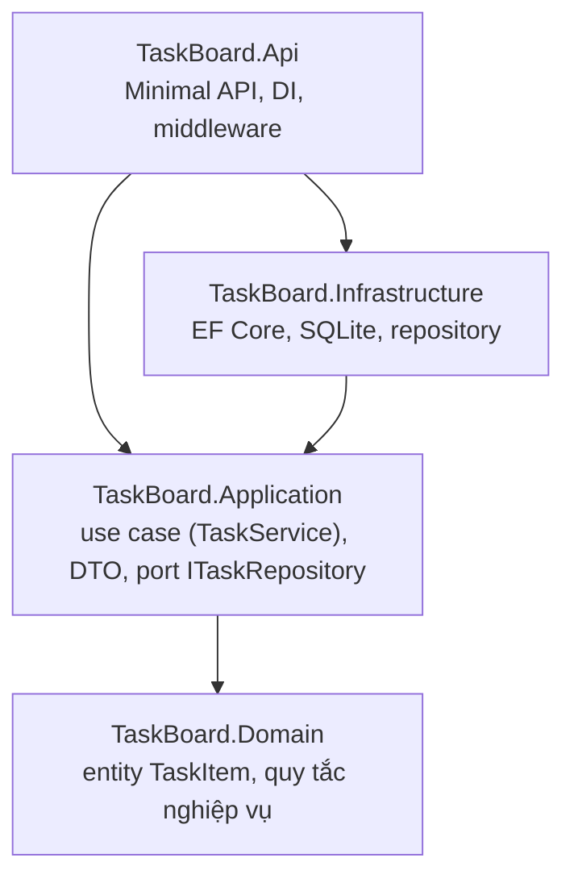

# Chương 5 — Clean architecture

## Mục tiêu

- Hiểu *clean architecture* (kiến trúc sạch) và *dependency rule* (quy tắc phụ thuộc).
- Chia một Web API thành 4 project: Domain, Application, Infrastructure, Api.
- Biết mỗi loại code nên nằm ở tầng nào.
- Kiểm tra quy tắc kiến trúc bằng test tự động.

## Giải thích đơn giản

Hãy nghĩ tới một ứng dụng Angular lớn: bạn tách *component* (giao diện), *service* (logic),
*HTTP client* (gọi API). Nếu logic nằm hết trong component, rất khó test và khó đổi.

Clean architecture áp dụng ý tưởng đó cho backend, với một quy tắc duy nhất:

> **Phụ thuộc chỉ hướng vào trong.** Tầng trong (nghiệp vụ) không biết gì về tầng ngoài
> (database, web, framework).



- **Domain**: entity và quy tắc nghiệp vụ thuần C#. Không tham chiếu EF Core, ASP.NET Core.
- **Application**: *use case* (trường hợp sử dụng) — điều phối domain; định nghĩa **interface**
  (port) như `ITaskRepository` mà nó cần.
- **Infrastructure**: cài đặt interface đó bằng công nghệ cụ thể (EF Core + SQLite).
- **Api**: nhận HTTP, gọi use case, trả kết quả. Là nơi "lắp ráp" mọi thứ bằng DI.

Nhờ *dependency inversion* (đảo ngược phụ thuộc), Application gọi `ITaskRepository` mà không biết
bên dưới là SQLite, PostgreSQL hay một list trong RAM (như trong unit test).

## Ví dụ — dự án cuối `TaskBoard`

Cấu trúc thư mục `vol3-advanced/final-project/`:

```text
final-project/
├── TaskBoard.slnx
├── global.json, Directory.Build.props, dotnet-tools.json
├── Dockerfile, compose.yaml, .dockerignore, requests.http
├── src/
│   ├── TaskBoard.Domain/          TaskItem.cs (entity + rule)
│   ├── TaskBoard.Application/     Contracts.cs (DTO, port), TaskService.cs (use cases)
│   ├── TaskBoard.Infrastructure/  TaskBoardDbContext.cs, EfTaskRepository.cs, Migrations/
│   └── TaskBoard.Api/             Program.cs, TaskEndpoints.cs, ApiExceptionHandler.cs
└── tests/
    ├── TaskBoard.UnitTests/        domain, use case, architecture tests (không DB)
    └── TaskBoard.IntegrationTests/ gọi HTTP thật vào API + SQLite in-memory
```

### Domain: quy tắc nghiệp vụ nằm trong entity

<!-- include: final-project/src/TaskBoard.Domain/TaskItem.cs -->
```csharp
namespace TaskBoard.Domain;

public enum TaskStatus
{
    Todo = 0,
    InProgress = 1,
    Done = 2,
}

public enum Priority
{
    Low = 0,
    Medium = 1,
    High = 2,
}

/// <summary>Entity: a task on the board. Business rules live here, not in the API.</summary>
public class TaskItem
{
    public const int TitleMaxLength = 200;

    // For EF Core
    private TaskItem() { Title = ""; }

    public TaskItem(string title, string? description, Priority priority, DateOnly? dueDate, DateTimeOffset createdAt)
    {
        Title = ValidateTitle(title);
        Description = description?.Trim();
        Priority = priority;
        DueDate = dueDate;
        CreatedAt = createdAt;
        Status = TaskStatus.Todo;
    }

    public int Id { get; private set; }
    public string Title { get; private set; }
    public string? Description { get; private set; }
    public TaskStatus Status { get; private set; }
    public Priority Priority { get; private set; }
    public DateOnly? DueDate { get; private set; }
    public DateTimeOffset CreatedAt { get; private set; }
    public DateTimeOffset? CompletedAt { get; private set; }

    public void UpdateDetails(string title, string? description, Priority priority, DateOnly? dueDate)
    {
        if (Status == TaskStatus.Done)
            throw new DomainException("Không sửa được công việc đã hoàn thành.");
        Title = ValidateTitle(title);
        Description = description?.Trim();
        Priority = priority;
        DueDate = dueDate;
    }

    /// <summary>Allowed moves: Todo → InProgress → Done, and InProgress → Todo. Done is final.</summary>
    public void MoveTo(TaskStatus next, DateTimeOffset now)
    {
        var allowed = (Status, next) switch
        {
            (TaskStatus.Todo, TaskStatus.InProgress) => true,
            (TaskStatus.InProgress, TaskStatus.Done) => true,
            (TaskStatus.InProgress, TaskStatus.Todo) => true,
            _ => false,
        };
        if (!allowed)
            throw new DomainException($"Không chuyển được trạng thái từ {Status} sang {next}.");
        Status = next;
        CompletedAt = next == TaskStatus.Done ? now : null;
    }

    public bool IsOverdue(DateOnly today) => Status != TaskStatus.Done && DueDate is { } due && due < today;

    private static string ValidateTitle(string title)
    {
        if (string.IsNullOrWhiteSpace(title))
            throw new DomainException("Tiêu đề không được để trống.");
        title = title.Trim();
        if (title.Length > TitleMaxLength)
            throw new DomainException($"Tiêu đề tối đa {TitleMaxLength} ký tự.");
        return title;
    }
}

public class DomainException(string message) : Exception(message);
```

Quy tắc "Done là trạng thái cuối", "không sửa công việc đã xong" nằm **ở đây**, không nằm trong
endpoint. Mọi nơi dùng `TaskItem` đều phải tuân theo.

### Application: use case và port

<!-- include: final-project/src/TaskBoard.Application/Contracts.cs -->
```csharp
using TaskBoard.Domain;
using TaskStatus = TaskBoard.Domain.TaskStatus;

namespace TaskBoard.Application;

// DTOs: what the API receives and returns. Records = immutable, value equality.
public record CreateTaskRequest(string Title, string? Description, Priority Priority = Priority.Medium, DateOnly? DueDate = null);

public record UpdateTaskRequest(string Title, string? Description, Priority Priority, DateOnly? DueDate);

public record ChangeStatusRequest(TaskStatus Status);

public record TaskDto(
    int Id,
    string Title,
    string? Description,
    TaskStatus Status,
    Priority Priority,
    DateOnly? DueDate,
    bool IsOverdue,
    DateTimeOffset CreatedAt,
    DateTimeOffset? CompletedAt);

public record TaskQuery(TaskStatus? Status = null, string? Search = null, int Page = 1, int PageSize = 20);

public record PagedResult<T>(IReadOnlyList<T> Items, int Page, int PageSize, int TotalCount);

/// <summary>Port: implemented by Infrastructure (EF Core). Application does not know about EF.</summary>
public interface ITaskRepository
{
    Task<TaskItem?> FindAsync(int id, CancellationToken ct);
    Task<(IReadOnlyList<TaskItem> Items, int Total)> ListAsync(TaskQuery query, CancellationToken ct);
    Task AddAsync(TaskItem task, CancellationToken ct);
    void Remove(TaskItem task);
    Task SaveChangesAsync(CancellationToken ct);
}

public class NotFoundException(string message) : Exception(message);

public class ValidationException(IDictionary<string, string[]> errors) : Exception("Dữ liệu không hợp lệ.")
{
    public IDictionary<string, string[]> Errors { get; } = errors;
}
```

<!-- include: final-project/src/TaskBoard.Application/TaskService.cs -->
```csharp
using Microsoft.Extensions.Logging;
using TaskBoard.Domain;

namespace TaskBoard.Application;

/// <summary>Use cases of the application. Depends only on abstractions (ports).</summary>
public class TaskService(ITaskRepository repository, TimeProvider clock, ILogger<TaskService> logger)
{
    private DateOnly Today => DateOnly.FromDateTime(clock.GetUtcNow().UtcDateTime);

    public async Task<TaskDto> CreateAsync(CreateTaskRequest request, CancellationToken ct = default)
    {
        Validate(request.Title, request.DueDate, isNew: true);
        var task = new TaskItem(request.Title, request.Description, request.Priority, request.DueDate, clock.GetUtcNow());
        await repository.AddAsync(task, ct);
        await repository.SaveChangesAsync(ct);
        logger.LogInformation("Created task {TaskId} with priority {Priority}", task.Id, task.Priority);
        return ToDto(task);
    }

    public async Task<TaskDto> GetAsync(int id, CancellationToken ct = default)
        => ToDto(await FindOrThrowAsync(id, ct));

    public async Task<PagedResult<TaskDto>> ListAsync(TaskQuery query, CancellationToken ct = default)
    {
        var errors = new Dictionary<string, string[]>();
        if (query.Page < 1) errors["page"] = ["page phải >= 1."];
        if (query.PageSize is < 1 or > 100) errors["pageSize"] = ["pageSize phải từ 1 đến 100."];
        if (errors.Count > 0) throw new ValidationException(errors);

        var (items, total) = await repository.ListAsync(query, ct);
        return new PagedResult<TaskDto>(items.Select(ToDto).ToList(), query.Page, query.PageSize, total);
    }

    public async Task<TaskDto> UpdateAsync(int id, UpdateTaskRequest request, CancellationToken ct = default)
    {
        Validate(request.Title, request.DueDate, isNew: false);
        var task = await FindOrThrowAsync(id, ct);
        task.UpdateDetails(request.Title, request.Description, request.Priority, request.DueDate);
        await repository.SaveChangesAsync(ct);
        return ToDto(task);
    }

    public async Task<TaskDto> ChangeStatusAsync(int id, ChangeStatusRequest request, CancellationToken ct = default)
    {
        var task = await FindOrThrowAsync(id, ct);
        var old = task.Status;
        task.MoveTo(request.Status, clock.GetUtcNow());
        await repository.SaveChangesAsync(ct);
        logger.LogInformation("Task {TaskId} moved {OldStatus} -> {NewStatus}", id, old, task.Status);
        return ToDto(task);
    }

    public async Task DeleteAsync(int id, CancellationToken ct = default)
    {
        var task = await FindOrThrowAsync(id, ct);
        repository.Remove(task);
        await repository.SaveChangesAsync(ct);
        logger.LogInformation("Deleted task {TaskId}", id);
    }

    private async Task<TaskItem> FindOrThrowAsync(int id, CancellationToken ct)
        => await repository.FindAsync(id, ct) ?? throw new NotFoundException($"Không tìm thấy công việc {id}.");

    private void Validate(string? title, DateOnly? dueDate, bool isNew)
    {
        var errors = new Dictionary<string, string[]>();
        if (string.IsNullOrWhiteSpace(title))
            errors["title"] = ["Tiêu đề là bắt buộc."];
        else if (title.Trim().Length > TaskItem.TitleMaxLength)
            errors["title"] = [$"Tiêu đề tối đa {TaskItem.TitleMaxLength} ký tự."];
        if (isNew && dueDate is { } due && due < Today)
            errors["dueDate"] = ["Hạn chót không được ở quá khứ."];
        if (errors.Count > 0) throw new ValidationException(errors);
    }

    private TaskDto ToDto(TaskItem t) => new(
        t.Id, t.Title, t.Description, t.Status, t.Priority, t.DueDate, t.IsOverdue(Today), t.CreatedAt, t.CompletedAt);
}
```

`TaskService` nhận `TimeProvider` thay vì gọi `DateTime.UtcNow` → test điều khiển được thời gian.

### Infrastructure: cài đặt port bằng EF Core

<!-- include: final-project/src/TaskBoard.Infrastructure/EfTaskRepository.cs -->
```csharp
using Microsoft.EntityFrameworkCore;
using TaskBoard.Application;
using TaskBoard.Domain;

namespace TaskBoard.Infrastructure;

public class EfTaskRepository(TaskBoardDbContext db) : ITaskRepository
{
    public Task<TaskItem?> FindAsync(int id, CancellationToken ct) =>
        db.Tasks.FirstOrDefaultAsync(t => t.Id == id, ct);

    public async Task<(IReadOnlyList<TaskItem> Items, int Total)> ListAsync(TaskQuery query, CancellationToken ct)
    {
        IQueryable<TaskItem> q = db.Tasks.AsNoTracking();
        if (query.Status is { } status) q = q.Where(t => t.Status == status);
        if (!string.IsNullOrWhiteSpace(query.Search))
            q = q.Where(t => EF.Functions.Like(t.Title, $"%{query.Search.Trim()}%"));

        int total = await q.CountAsync(ct);
        var items = await q
            .OrderBy(t => t.Status == Domain.TaskStatus.Done)   // unfinished first
            .ThenByDescending(t => t.Priority)
            .ThenBy(t => t.Id)
            .Skip((query.Page - 1) * query.PageSize)
            .Take(query.PageSize)
            .ToListAsync(ct);
        return (items, total);
    }

    public async Task AddAsync(TaskItem task, CancellationToken ct) => await db.Tasks.AddAsync(task, ct);

    public void Remove(TaskItem task) => db.Tasks.Remove(task);

    public Task SaveChangesAsync(CancellationToken ct) => db.SaveChangesAsync(ct);
}
```

<!-- include: final-project/src/TaskBoard.Infrastructure/DependencyInjection.cs -->
```csharp
using Microsoft.EntityFrameworkCore;
using Microsoft.Extensions.Configuration;
using Microsoft.Extensions.DependencyInjection;
using TaskBoard.Application;

namespace TaskBoard.Infrastructure;

public static class DependencyInjection
{
    public const string ConnectionStringName = "TaskBoard";

    public static IServiceCollection AddInfrastructure(this IServiceCollection services)
    {
        // The connection string is read when the DbContext is created (not at startup),
        // so tests can override it through configuration.
        services.AddDbContext<TaskBoardDbContext>((sp, options) =>
            options.UseSqlite(sp.GetRequiredService<IConfiguration>().GetConnectionString(ConnectionStringName)
                              ?? "Data Source=taskboard.db"));
        services.AddScoped<ITaskRepository, EfTaskRepository>();
        return services;
    }
}
```

### Api: endpoint mỏng, lỗi xử lý tập trung

<!-- include: final-project/src/TaskBoard.Api/Program.cs -->
```csharp
using System.Text.Json.Serialization;
using Microsoft.EntityFrameworkCore;
using TaskBoard.Api;
using TaskBoard.Application;
using TaskBoard.Infrastructure;

var builder = WebApplication.CreateBuilder(args);

// ---- Services (DI) ----
builder.Services.AddInfrastructure();     // EF Core + SQLite (connection string "TaskBoard")
builder.Services.AddSingleton(TimeProvider.System);
builder.Services.AddScoped<TaskService>();

builder.Services.ConfigureHttpJsonOptions(o =>
    o.SerializerOptions.Converters.Add(new JsonStringEnumConverter()));
builder.Services.AddProblemDetails();
builder.Services.AddExceptionHandler<ApiExceptionHandler>();
builder.Services.AddOpenApi();
builder.Services.AddHealthChecks().AddCheck<DatabaseHealthCheck>("database");

var app = builder.Build();

// ---- Database migration on startup (simple apps / demos) ----
if (app.Configuration.GetValue("Database:MigrateOnStartup", true))
{
    using var scope = app.Services.CreateScope();
    scope.ServiceProvider.GetRequiredService<TaskBoardDbContext>().Database.Migrate();
}

// ---- Middleware pipeline ----
app.UseExceptionHandler();
app.UseStatusCodePages();

app.MapOpenApi();                      // GET /openapi/v1.json
app.MapHealthChecks("/health");        // GET /health
app.MapGet("/", () => Results.Redirect("/openapi/v1.json")).ExcludeFromDescription();
app.MapTaskEndpoints();                // /api/tasks

app.Run();

// Makes Program visible to WebApplicationFactory<Program> in the integration tests.
public partial class Program;
```

<!-- include: final-project/src/TaskBoard.Api/TaskEndpoints.cs -->
```csharp
using Microsoft.AspNetCore.Http.HttpResults;
using TaskBoard.Application;
using TaskStatus = TaskBoard.Domain.TaskStatus;

namespace TaskBoard.Api;

public static class TaskEndpoints
{
    public static IEndpointRouteBuilder MapTaskEndpoints(this IEndpointRouteBuilder app)
    {
        var group = app.MapGroup("/api/tasks").WithTags("Tasks");

        group.MapGet("/", async (TaskService service, TaskStatus? status, string? search,
                int page = 1, int pageSize = 20, CancellationToken ct = default) =>
            TypedResults.Ok(await service.ListAsync(new TaskQuery(status, search, page, pageSize), ct)))
            .WithName("ListTasks");

        group.MapGet("/{id:int}", async (int id, TaskService service, CancellationToken ct) =>
            TypedResults.Ok(await service.GetAsync(id, ct)))
            .WithName("GetTask");

        group.MapPost("/", async Task<Created<TaskDto>> (CreateTaskRequest request, TaskService service, CancellationToken ct) =>
        {
            var created = await service.CreateAsync(request, ct);
            return TypedResults.Created($"/api/tasks/{created.Id}", created);
        }).WithName("CreateTask");

        group.MapPut("/{id:int}", async (int id, UpdateTaskRequest request, TaskService service, CancellationToken ct) =>
            TypedResults.Ok(await service.UpdateAsync(id, request, ct)))
            .WithName("UpdateTask");

        group.MapPatch("/{id:int}/status", async (int id, ChangeStatusRequest request, TaskService service, CancellationToken ct) =>
            TypedResults.Ok(await service.ChangeStatusAsync(id, request, ct)))
            .WithName("ChangeTaskStatus");

        group.MapDelete("/{id:int}", async Task<NoContent> (int id, TaskService service, CancellationToken ct) =>
        {
            await service.DeleteAsync(id, ct);
            return TypedResults.NoContent();
        }).WithName("DeleteTask");

        return app;
    }
}
```

<!-- include: final-project/src/TaskBoard.Api/ApiExceptionHandler.cs -->
```csharp
using Microsoft.AspNetCore.Diagnostics;
using Microsoft.AspNetCore.Mvc;
using TaskBoard.Application;
using TaskBoard.Domain;

namespace TaskBoard.Api;

/// <summary>Maps exceptions to Problem Details (RFC 7807 / 9457) responses in one place.</summary>
public sealed class ApiExceptionHandler(IProblemDetailsService problemDetails, ILogger<ApiExceptionHandler> logger)
    : IExceptionHandler
{
    public async ValueTask<bool> TryHandleAsync(HttpContext http, Exception exception, CancellationToken ct)
    {
        ProblemDetails problem = exception switch
        {
            ValidationException v => new ValidationProblemDetails(v.Errors)
            {
                Status = StatusCodes.Status400BadRequest,
                Title = v.Message,
            },
            NotFoundException nf => new ProblemDetails { Status = StatusCodes.Status404NotFound, Title = nf.Message },
            DomainException d => new ProblemDetails { Status = StatusCodes.Status409Conflict, Title = d.Message },
            BadHttpRequestException b => new ProblemDetails { Status = StatusCodes.Status400BadRequest, Title = b.Message },
            _ => new ProblemDetails { Status = StatusCodes.Status500InternalServerError, Title = "Lỗi hệ thống." },
        };

        if (problem.Status == StatusCodes.Status500InternalServerError)
            logger.LogError(exception, "Unhandled exception for {Method} {Path}", http.Request.Method, http.Request.Path);
        else
            logger.LogInformation("Request {Method} {Path} failed with {Status}: {Title}",
                http.Request.Method, http.Request.Path, problem.Status, problem.Title);

        http.Response.StatusCode = problem.Status!.Value;
        return await problemDetails.TryWriteAsync(new ProblemDetailsContext
        {
            HttpContext = http,
            ProblemDetails = problem,
            Exception = exception,
        });
    }
}
```

Endpoint chỉ có một dòng: gọi use case. Exception nghiệp vụ được đổi sang HTTP status ở **một chỗ**
(`ApiExceptionHandler`): `ValidationException` → 400, `NotFoundException` → 404,
`DomainException` → 409.

### Kiểm tra quy tắc kiến trúc bằng test

<!-- include: final-project/tests/TaskBoard.UnitTests/ArchitectureTests.cs -->
```csharp
using TaskBoard.Application;
using TaskBoard.Domain;

namespace TaskBoard.UnitTests;

/// <summary>Checks the dependency rule of clean architecture: inner layers do not know outer layers.</summary>
public class ArchitectureTests
{
    private static string[] ReferencedNames(Type typeInAssembly) =>
        typeInAssembly.Assembly.GetReferencedAssemblies().Select(a => a.Name!).ToArray();

    [Fact]
    public void Domain_DependsOnNoOtherLayerOrFramework()
    {
        var refs = ReferencedNames(typeof(TaskItem));
        Assert.DoesNotContain(refs, n => n.StartsWith("TaskBoard.", StringComparison.Ordinal));
        Assert.DoesNotContain(refs, n => n.StartsWith("Microsoft.EntityFrameworkCore", StringComparison.Ordinal));
        Assert.DoesNotContain(refs, n => n.StartsWith("Microsoft.AspNetCore", StringComparison.Ordinal));
    }

    [Fact]
    public void Application_DependsOnDomainOnly_NotOnInfrastructureOrEfCore()
    {
        var refs = ReferencedNames(typeof(TaskService));
        Assert.Contains("TaskBoard.Domain", refs);
        Assert.DoesNotContain("TaskBoard.Infrastructure", refs);
        Assert.DoesNotContain("TaskBoard.Api", refs);
        Assert.DoesNotContain(refs, n => n.StartsWith("Microsoft.EntityFrameworkCore", StringComparison.Ordinal));
    }
}
```

Kết quả chạy toàn bộ test của dự án cuối (unit + integration + architecture), output thật:

<!-- output: examples/V3Ch05.FinalProjectTests -->
```text
$ dotnet build TaskBoard.slnx
    0 Warning(s)
    0 Error(s)
$ dotnet test --solution TaskBoard.slnx --output Detailed
Running tests from <repo>/books/csharp/vol3-advanced/final-project/tests/TaskBoard.UnitTests/bin/Debug/net10.0/TaskBoard.UnitTests.dll (net10.0|x64)
Running tests from <repo>/books/csharp/vol3-advanced/final-project/tests/TaskBoard.IntegrationTests/bin/Debug/net10.0/TaskBoard.IntegrationTests.dll (net10.0|x64)
passed TaskBoard.UnitTests.TaskItemTests.NewTask_StartsInTodo_WithTrimmedTitle (24ms)
passed TaskBoard.UnitTests.TaskServiceTests.Create_InvalidInput_ThrowsValidationWithAllErrors (27ms)
passed TaskBoard.UnitTests.ArchitectureTests.Application_DependsOnDomainOnly_NotOnInfrastructureOrEfCore (25ms)
passed TaskBoard.UnitTests.ArchitectureTests.Domain_DependsOnNoOtherLayerOrFramework (0ms)
passed TaskBoard.UnitTests.TaskItemTests.DoneTask_CannotBeEdited (2ms)
passed TaskBoard.UnitTests.TaskItemTests.MoveTo_FollowsWorkflow_AndSetsCompletedAt (4ms)
passed TaskBoard.UnitTests.TaskServiceTests.Create_ReturnsDto_AndSaves (16ms)
passed TaskBoard.UnitTests.TaskServiceTests.List_InvalidPaging_Throws(page: 1, pageSize: 101) (1ms)
passed TaskBoard.UnitTests.TaskServiceTests.List_InvalidPaging_Throws(page: 0, pageSize: 20) (0ms)
passed TaskBoard.UnitTests.TaskServiceTests.List_InvalidPaging_Throws(page: 1, pageSize: 0) (0ms)
passed TaskBoard.UnitTests.TaskServiceTests.Overdue_IsComputedFromClock (2ms)
passed TaskBoard.UnitTests.TaskServiceTests.Get_Missing_ThrowsNotFound (0ms)
passed TaskBoard.UnitTests.TaskItemTests.MoveTo_InvalidTransition_Throws(from: Todo, to: Done) (15ms)
passed TaskBoard.UnitTests.TaskServiceTests.ChangeStatus_ToDone_SetsCompletedAtFromClock (2ms)
passed TaskBoard.UnitTests.TaskItemTests.MoveTo_InvalidTransition_Throws(from: Todo, to: Todo) (0ms)
passed TaskBoard.UnitTests.TaskItemTests.IsOverdue_OnlyWhenNotDoneAndPastDue (0ms)
passed TaskBoard.UnitTests.TaskItemTests.NewTask_BlankTitle_Throws(title: "   ") (0ms)
passed TaskBoard.UnitTests.TaskItemTests.NewTask_BlankTitle_Throws(title: "") (0ms)
passed TaskBoard.UnitTests.TaskServiceTests.List_FiltersBySearch (3ms)
<repo>/books/csharp/vol3-advanced/final-project/tests/TaskBoard.UnitTests/bin/Debug/net10.0/TaskBoard.UnitTests.dll (net10.0|x64) passed (858ms)
passed TaskBoard.IntegrationTests.TasksApiTests.Post_ThenGet_ReturnsSameTask_WithLocationHeader (1s 553ms)
passed TaskBoard.IntegrationTests.TasksApiTests.List_FiltersByStatusAndSearch_WithPaging (90ms)
passed TaskBoard.IntegrationTests.TasksApiTests.Health_ReturnsHealthy (16ms)
passed TaskBoard.IntegrationTests.TasksApiTests.Put_UpdatesTask (16ms)
passed TaskBoard.IntegrationTests.TasksApiTests.OpenApi_DocumentIsServed (161ms)
passed TaskBoard.IntegrationTests.TasksApiTests.Status_Workflow_AndInvalidTransition_Returns409 (37ms)
passed TaskBoard.IntegrationTests.TasksApiTests.Delete_RemovesTask (14ms)
passed TaskBoard.IntegrationTests.TasksApiTests.Get_Unknown_Returns404 (2ms)
passed TaskBoard.IntegrationTests.TasksApiTests.Post_InvalidBody_Returns400ProblemDetails (7ms)
<repo>/books/csharp/vol3-advanced/final-project/tests/TaskBoard.IntegrationTests/bin/Debug/net10.0/TaskBoard.IntegrationTests.dll (net10.0|x64) passed (2s 716ms)

Test run summary: Passed!
  <repo>/books/csharp/vol3-advanced/final-project/tests/TaskBoard.UnitTests/bin/Debug/net10.0/TaskBoard.UnitTests.dll (net10.0|x64) passed (858ms)
  <repo>/books/csharp/vol3-advanced/final-project/tests/TaskBoard.IntegrationTests/bin/Debug/net10.0/TaskBoard.IntegrationTests.dll (net10.0|x64) passed (2s 716ms)

  total: 28
  failed: 0
  succeeded: 28
  skipped: 0
  duration: 3s 000ms
```

## Đi sâu

### Code nào nằm ở đâu?

| Loại code | Tầng |
|---|---|
| Entity, value object, quy tắc nghiệp vụ, `DomainException` | Domain |
| Use case, DTO request/response, interface repository/email/clock | Application |
| `DbContext`, migration, repository EF Core, gửi email SMTP, gọi API ngoài | Infrastructure |
| Endpoint, middleware, cấu hình DI, OpenAPI, health check | Api |

### Test theo tầng

- **Unit test** (nhanh, không DB): Domain và Application với fake repository, `FixedTimeProvider`.
- **Integration test**: `WebApplicationFactory<Program>` chạy API thật trong bộ nhớ, SQLite
  in-memory, gọi HTTP thật → kiểm tra routing, JSON, status code, EF Core mapping.

### Khi nào **không** cần 4 project?

Clean architecture có chi phí: nhiều project, nhiều file, nhiều mapping. Với API nhỏ (vài endpoint,
một người làm), một project chia thư mục (`Domain/`, `Features/`...) là đủ. Hãy bắt đầu đơn giản và
tách khi code lớn lên. Một lựa chọn khác phổ biến là *vertical slice architecture* (chia theo tính
năng thay vì theo tầng).

### Template tham khảo (reputable repos, checked 2026-09-28)

| URL | Stars | Last commit | License | Hữu ích | Checked |
|---|---|---|---|---|---|
| https://github.com/jasontaylordev/CleanArchitecture | ~20.6k | 2026-09-28 | MIT | template `dotnet new`, .NET 10, có frontend Angular/React | 2026-09-28 |
| https://github.com/ardalis/CleanArchitecture | ~18.5k | 2026-09-21 | MIT | template ASP.NET Core, nhiều ghi chú giải thích | 2026-09-28 |

Số sao và ngày commit đọc từ trang GitHub bằng công cụ fetch ngày 2026-09-28; có thể thay đổi.

## Lỗi và bẫy thường gặp

- **Domain tham chiếu EF Core** (attribute `[Key]`, `DbSet`) → vi phạm dependency rule. Dùng
  Fluent API trong Infrastructure (`OnModelCreating`).
- **Logic nghiệp vụ trong endpoint/controller** → trùng lặp, khó test.
- **Entity có setter public khắp nơi** → ai cũng sửa được, bỏ qua quy tắc. Dùng `private set` và method.
- **Repository "chung chung" bọc mọi thứ của EF Core** (`IRepository<T>` với 30 method) → thêm lớp mà
  không thêm giá trị. Chỉ định nghĩa method use case cần.
- **Trả entity ra API** thay vì DTO.
- **Quá nhiều tầng cho project nhỏ** (xem mục "Khi nào không cần").

## Tóm tắt

- Dependency rule: phụ thuộc hướng vào trong; Domain không biết gì về framework.
- Application định nghĩa port; Infrastructure cài đặt; Api lắp ráp bằng DI.
- Test kiến trúc giúp quy tắc không bị phá vỡ theo thời gian.

## Bài tập (có lời giải)

1. Với mỗi đoạn code sau, nó thuộc tầng nào? (a) quy tắc "hạn chót không ở quá khứ khi tạo mới";
   (b) `CREATE INDEX` cho cột `Status`; (c) chuyển `NotFoundException` thành HTTP 404;
   (d) interface `IEmailSender`; (e) class `SmtpEmailSender`.
2. Vì sao `TaskService` nhận `TimeProvider` thay vì dùng `DateTime.UtcNow`?
3. Thêm một test kiến trúc: Domain không được tham chiếu `Microsoft.AspNetCore`.

<details>
<summary>Lời giải</summary>

1. (a) Application — đây là kiểm tra dữ liệu đầu vào của use case "tạo mới" (xem `Validate` trong
   `TaskService`); quy tắc bất biến của entity (tiêu đề không rỗng) nằm ở Domain.
   (b) Infrastructure (`HasIndex` trong `TaskBoardDbContext`, sinh ra migration).
   (c) Api (`ApiExceptionHandler`). (d) Application (port). (e) Infrastructure (adapter).
2. Để test điều khiển được thời gian: `FixedTimeProvider` trong unit test đặt "bây giờ" là
   2026-09-28 rồi tua tới 2026-10-02 để kiểm tra `IsOverdue` (test `Overdue_IsComputedFromClock`).
3. Test đã có trong `ArchitectureTests.Domain_DependsOnNoOtherLayerOrFramework` (dòng kiểm tra
   `Microsoft.AspNetCore`), và pass trong output ở trên.
</details>

## Nguồn tham khảo (Sources)

- Common web application architectures (nguồn Microsoft Learn, e-book .NET): https://github.com/dotnet/docs/blob/main/docs/architecture/modern-web-apps-azure/common-web-application-architectures.md
- Architectural principles (dependency inversion, separation of concerns): https://github.com/dotnet/docs/blob/main/docs/architecture/modern-web-apps-azure/architectural-principles.md
- Integration tests in ASP.NET Core: https://github.com/dotnet/AspNetCore.Docs/blob/main/aspnetcore/test/integration-tests.md
- TimeProvider (.NET 8+): https://github.com/dotnet/docs/blob/main/docs/standard/datetime/timeprovider-overview.md
- jasontaylordev/CleanArchitecture: https://github.com/jasontaylordev/CleanArchitecture
- ardalis/CleanArchitecture: https://github.com/ardalis/CleanArchitecture
