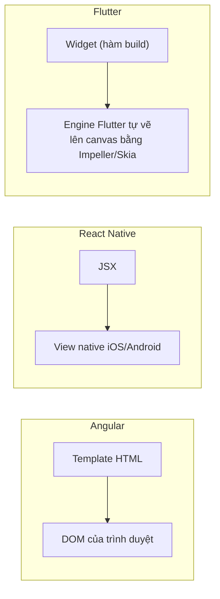

# Chương 2 — Flutter cho Angular (và React Native) developer

## Mục tiêu

Bạn đã giỏi Angular và đã học React Native (RN). Chương này giúp bạn **chuyển kiến thức** sang Flutter nhanh:

- Đối chiếu từng khái niệm: component ↔ widget, template ↔ hàm `build`, service/DI, RxJS/Signals ↔
  Stream/`ValueNotifier`/`ChangeNotifier`, routing, forms, testing.
- Hiểu điểm khác lớn nhất: Flutter **tự vẽ mọi pixel** (không dùng view native như RN, không dùng DOM
  như Angular) và UI là **khai báo (declarative)**: `UI = f(state)`.
- Viết 4 ví dụ nhỏ có test: `@Input/@Output`, Signals, DI, `debounceTime`.

## Giải thích đơn giản

Docs chính thức ("Introduction to declarative UI") giải thích: với kiểu **mệnh lệnh (imperative)**, bạn
tìm một view rồi gọi hàm để sửa nó. Với kiểu **khai báo (declarative)** của Flutter, bạn chỉ **mô tả giao
diện ứng với state hiện tại**; khi state đổi, Flutter gọi lại hàm `build` và tự tính phần cần vẽ lại.

Angular cũng khai báo (template), React/RN cũng vậy (JSX). Khác biệt nằm ở **chỗ vẽ**:



Hệ quả thực tế:
- App Flutter trông **giống hệt nhau** trên iPhone, Android, web (vì tự vẽ). Muốn "đúng chất iOS" thì dùng
  widget Cupertino hoặc `.adaptive`.
- Không có CSS, không có HTML. **Mọi thứ là widget**: cả khoảng cách (`Padding`), căn giữa (`Center`),
  bố cục (`Row`, `Column`).
- Code là **Dart** (không phải TypeScript) — Chương 3 dạy Dart cho người biết TypeScript.

## Ví dụ

### Bảng đối chiếu chính

| Angular | React Native | Flutter (sách dùng) | Ghi chú |
|---|---|---|---|
| `@Component` class + template | Hàm component + JSX | Class `StatelessWidget`/`StatefulWidget` với hàm `build()` | Template nằm ngay trong Dart |
| `<div>` | `<View>` | `Container`, `Padding`, `SizedBox`, `Row`, `Column` | Mỗi widget làm **một** việc |
| `<span>`, `<p>` | `<Text>` | `Text` | |
| `<button (click)>` | `<Pressable onPress>` | `FilledButton(onPressed:)`, `IconButton`, `InkWell` | `onPressed: null` = nút bị vô hiệu |
| `<input [(ngModel)]>` | `<TextInput value onChangeText>` | `TextField` + `TextEditingController` | Chương 7 |
| `*ngFor` / `@for` | `.map()` / `FlatList` | `for` trong list con, `ListView.builder` | Chương 6 |
| `*ngIf` / `@if` | `{cond && <A/>}` | `if (cond) Widget()` trong list con, hoặc `cond ? A() : B()` | "collection if" của Dart |
| SCSS, `[class.x]` | `StyleSheet` | Tham số của widget (`style:`, `padding:`) + `ThemeData` | Chương 5 |
| `@Input()` / `input()` | props | **Tham số constructor** (`final` field) | Chỉ đọc |
| `@Output()` / `output()` | callback prop | **Callback** (`ValueChanged<T>`, `VoidCallback`) | |
| `ngOnInit` | `useEffect(..., [])` | `initState()` | Trong `State` của StatefulWidget |
| `ngOnChanges` | `useEffect(..., [prop])` | `didUpdateWidget(old)` | |
| `ngOnDestroy` | cleanup của `useEffect` | `dispose()` | Hủy Timer, controller, subscription |
| `signal()` | `useState` | `setState` (cục bộ), `ValueNotifier` | |
| `computed()` | `useMemo` | getter / tính trong `build`; `Computed` tự viết (bài tập) | |
| Service `@Injectable` có state | Zustand store | Class `extends ChangeNotifier` (ViewModel) | Tập 2 |
| DI: `providers`, `inject()` | Context | `InheritedWidget`; package **`provider`** (docs khuyên) | Tập 2 dùng `provider` |
| RxJS `Observable` | Promise + hook | `Future` (1 giá trị), **`Stream`** (nhiều giá trị) | Dart có Stream sẵn trong ngôn ngữ |
| `async` pipe | — | `FutureBuilder`, `StreamBuilder` | Tập 2 |
| `HttpClient` | `fetch` | package `http` | Tập 2 |
| Angular Router | Expo Router | **`go_router`** (docs khuyên) | Chương 8 |
| `routerLink`, `router.navigate` | `<Link>`, `router.push` | `context.go('/path')`, `context.push()` | |
| `ActivatedRoute.paramMap` | `useLocalSearchParams` | `state.pathParameters['id']` | |
| Guard `canActivate` | `<Redirect>` | `redirect:` của GoRouter | Chương 8 |
| Reactive Forms + Validators | useState + validate | `Form` + `TextFormField(validator:)` | Chương 7 |
| TestBed + Jasmine/Jest | Jest + RNTL | `flutter_test`: `testWidgets`, `find`, `tester.tap` | Có sẵn trong SDK |
| `ng serve` (HMR) | `npx expo start` (Fast Refresh) | `flutter run` (**hot reload** — phím `r`) | |
| `ng build` | `eas build` | `flutter build ios` / `apk` / `web` | Tập 3 |
| `package.json` + npm | package.json + npm | `pubspec.yaml` + `flutter pub` (pub.dev) | |

### Ví dụ 1 — `@Input/@Output` → tham số + callback

Angular:

```ts
@Component({ selector: 'app-rating', template: `...` })
export class RatingComponent {
  @Input() value = 0;
  @Output() valueChange = new EventEmitter<number>();
}
```

Flutter (`examples/lib/chapters/ch02/rating_stars.dart`):

```dart
class RatingStars extends StatelessWidget {
  const RatingStars({super.key, required this.value, required this.onChanged, this.max = 5});

  final int value;
  final int max;
  final ValueChanged<int> onChanged;

  @override
  Widget build(BuildContext context) {
    return Row(
      mainAxisSize: MainAxisSize.min,
      children: [
        for (var n = 1; n <= max; n++)
          IconButton(
            tooltip: '$n sao',
            isSelected: n <= value,
            icon: const Icon(Icons.star_border),
            selectedIcon: const Icon(Icons.star, color: Colors.amber),
            onPressed: () => onChanged(n),
          ),
      ],
    );
  }
}
```

Cha giữ state và truyền xuống: `RatingStars(value: _rating, onChanged: (v) => setState(() => _rating = v))`.
Đây chính là "banana in a box" `[(value)]` của Angular, nhưng viết tường minh — giống hệt RN
(xem [RN Tập 1, Chương 2](../../react-native/vol1-co-ban/02-react-native-cho-angular-developer.md)).

Chú ý `for (...)` nằm **bên trong** danh sách `children` — đó là *collection for* của Dart, thay cho `@for`.

### Ví dụ 2 — Signals → `ValueNotifier`

`ValueNotifier<T>` có sẵn trong Flutter: giữ một giá trị, báo cho người nghe khi giá trị **đổi**
(so sánh bằng `==`). Rất giống `signal()`:

```dart
final ValueNotifier<int> _cartCount = ValueNotifier(0);   // signal(0)
_cartCount.value++;                                        // count.update(c => c + 1)

// Chỉ phần này build lại khi _cartCount đổi — giống signal được đọc trong template.
ValueListenableBuilder<int>(
  valueListenable: _cartCount,
  builder: (context, count, _) => Badge(
    label: Text('$count'),
    isLabelVisible: count > 0,
    child: const Icon(Icons.shopping_cart_outlined, size: 32),
  ),
),
```

(`examples/lib/chapters/ch02/cart_badge.dart`.) Khác Angular: Flutter **không tự theo dõi** signal nào
được đọc (không có auto-tracking); bạn phải bọc bằng `ValueListenableBuilder` (hoặc `ListenableBuilder`).
Nhớ `dispose()` notifier trong `dispose()` của State.

### Ví dụ 3 — DI → `InheritedWidget`

```dart
abstract interface class GreetingService {
  String greet(String name);
}

class FriendlyGreeting implements GreetingService {
  const FriendlyGreeting();
  @override
  String greet(String name) => 'Chào $name!';
}

/// Giống `providers: [{ provide: GreetingService, useValue: ... }]` ở một nhánh của cây.
class GreetingScope extends InheritedWidget {
  const GreetingScope({super.key, required this.service, required super.child});

  final GreetingService service;

  /// Giống `inject(GreetingService)`. Không có scope nào ở trên → dùng mặc định.
  static GreetingService of(BuildContext context) =>
      context.dependOnInheritedWidgetOfExactType<GreetingScope>()?.service ?? const FriendlyGreeting();

  @override
  bool updateShouldNotify(GreetingScope oldWidget) => service != oldWidget.service;
}
```

- `GreetingScope.of(context)` tìm **lên trên** cây widget — giống **hierarchical injector** của Angular.
- Bọc một nhánh bằng `GreetingScope(service: FormalGreeting(), child: ...)` → nhánh đó dùng bản khác.
- Trong test, bọc widget bằng scope chứa bản giả (fake) — giống `TestBed.overrideProvider`.
- Viết `InheritedWidget` bằng tay hơi dài. Docs chính thức khuyên dùng package **`provider`** cho DI
  (nó được xây trên `InheritedWidget`). Tập 2 dùng `provider`.

### Ví dụ 4 — RxJS → Stream và Timer

Dart có `Stream` **ngay trong thư viện chuẩn**, với nhiều toán tử giống RxJS:

```dart
/// RxJS: `source.pipe(map(trim), filter(len >= 2), distinctUntilChanged())`
Stream<String> searchTerms(Stream<String> source) => source.map((s) => s.trim()).where((s) => s.length >= 2).distinct();
```

`debounceTime` không có sẵn, nhưng viết bằng `Timer` rất ngắn:

```dart
class Debouncer {
  Debouncer(this.delay);

  final Duration delay;
  Timer? _timer;

  void call(VoidCallback action) {
    _timer?.cancel();
    _timer = Timer(delay, action);
  }

  void dispose() => _timer?.cancel();
}
```

Ô tìm kiếm dùng: `onChanged: (text) => _debouncer(() => widget.onSearch(text))`, và gọi
`_debouncer.dispose()` trong `dispose()` (giống `takeUntilDestroyed()`).

### Kết quả test thật

Chạy ngày 2026-09-30, `flutter test --reporter expanded test/chapters/ch02_test.dart`
(reporter "expanded" in dòng khi mỗi test **bắt đầu**; số `+N` là số test đã pass):

```text
00:00 +0: Angular/React Native → Flutter RatingStars: dữ liệu đi xuống, callback đi lên (như @Input/@Output)
00:00 +1: Angular/React Native → Flutter ValueNotifier như signal: badge cập nhật khi bấm
00:01 +2: Angular/React Native → Flutter InheritedWidget thay implementation như providers: [...]
00:01 +3: Angular/React Native → Flutter SearchBox debounce 300ms (debounceTime)
00:01 +4: Angular/React Native → Flutter searchTerms: map / where / distinct giống pipe(map, filter, distinctUntilChanged)
00:01 +5: Angular/React Native → Flutter Bài 1: Computed tính lại khi nguồn đổi, chỉ báo khi kết quả đổi
00:01 +6: All tests passed!
```

Test debounce dùng **thời gian giả**: trong `testWidgets`, `await tester.pump(Duration(milliseconds: 300))`
cho thời gian trôi 300 ms ngay lập tức — giống `fakeAsync` + `tick(300)` của Angular.

Xem trong app: tab **Lab** → "Ch.2" (trên web đã chạy; trên iPhone: **NOT RUN**).

## Đi sâu

### Routing: Angular Router ↔ go_router

| Angular | go_router |
|---|---|
| `const routes: Routes = [{ path: 'task/:id', component: TaskDetail }]` | `GoRoute(path: '/tasks/:id', builder: (context, state) => TaskDetailScreen(id: state.pathParameters['id']!))` |
| `<router-outlet>` + layout component | `ShellRoute` / `StatefulShellRoute` (tab giữ state) |
| `router.navigate(['/task', id])` | `context.go('/tasks/$id')` (thay stack theo URL) / `context.push(...)` (chồng lên) |
| `canActivate` guard | `redirect: (context, state) => ...` (trả về URL mới hoặc `null`) |
| `queryParamMap` | `state.uri.queryParameters` |

Docs `ui/navigation`: không khuyên dùng *named routes* cho đa số app; khuyên dùng go_router để có deep link
và URL trên web. Chương 8 đi chi tiết.

### Forms: Reactive Forms ↔ Form + TextFormField

| Angular | Flutter |
|---|---|
| `FormGroup` | `Form` + `GlobalKey<FormState>` |
| `FormControl` | `TextFormField` + `TextEditingController` |
| `Validators.required` | `validator: (v) => v!.isEmpty ? 'Bắt buộc' : null` (trả về chuỗi lỗi hoặc `null`) |
| `form.markAllAsTouched(); form.valid` | `formKey.currentState!.validate()` |
| `updateOn: 'change'` | `autovalidateMode: AutovalidateMode.onUserInteraction` |

### State: service có state ↔ ChangeNotifier (Tập 2)

Docs chính thức (Architecture recommendations) khuyên **MVVM**: View (widget) + ViewModel
(`ChangeNotifier`), và DI bằng `provider`. Với Angular dev, ViewModel ≈ một service có state gắn với một
màn hình; `notifyListeners()` ≈ `signal.set()`/`subject.next()`.

### Testing: TestBed ↔ flutter_test

| Angular | Flutter |
|---|---|
| `TestBed.configureTestingModule` + `createComponent` | `await tester.pumpWidget(MaterialApp(home: X()))` |
| `fixture.detectChanges()` | `await tester.pump()` (vẽ 1 frame) / `pumpAndSettle()` (chờ hết animation) |
| `By.css('.btn')` | `find.text('Lưu')`, `find.byTooltip(...)`, `find.byType(TextField)` |
| `fakeAsync` + `tick(300)` | `tester.pump(const Duration(milliseconds: 300))` |
| `HttpTestingController` | `MockClient` của package http (Tập 2) |

### Tư duy khác biệt quan trọng

1. **Widget là bất biến (immutable)** và rất rẻ: `build` được gọi nhiều lần; đừng làm việc nặng trong `build`.
2. **Mọi thứ là widget**: padding, căn giữa, theme… đều là widget bọc ngoài (không có CSS cascade).
3. **Hai loại state** (docs `state-mgmt/ephemeral-vs-app`): state *cục bộ* (tab đang chọn, ô đang gõ) →
   `setState`; state *toàn app* (danh sách từ vựng, đăng nhập) → ViewModel + provider.
4. **Hot reload** giữ state khi sửa code; **hot restart** (`R`) chạy lại từ đầu.

## Lỗi và bẫy thường gặp

- **Sửa field rồi quên `setState`**: UI không đổi. Luôn `setState(() => _x = ...)`.
- **Gọi `setState` sau `dispose`** (ví dụ sau `await`): kiểm tra `if (!mounted) return;` trước.
- **Quên `dispose()`** controller/Timer/notifier → rò rỉ bộ nhớ; `flutter_test` còn báo lỗi "A Timer is still pending".
- **Tạo đối tượng mới trong `updateShouldNotify`/`build` mỗi lần** → mọi widget con build lại vô ích.
- **Mang RxJS vào mọi thứ**: Dart đã có `Stream`; package `rxdart` có thêm toán tử nhưng thường không cần.
- **Tên trùng với thư viện test**: hàm tên `matches` trùng với matcher `matches` của `flutter_test`
  (Chương 7 gặp thật lỗi này và đổi tên thành `matchesField`).

## Tóm tắt

- Widget = class có `build()`; template là code Dart. `@Input/@Output` = tham số + callback.
- Signals ≈ `ValueNotifier` + `ValueListenableBuilder`. Service có state ≈ `ChangeNotifier` (Tập 2).
- DI = `InheritedWidget`; thực tế dùng `provider` (docs khuyên). Routing = `go_router` (docs khuyên).
- RxJS ≈ `Stream` (có sẵn) + vài dòng `Timer`.
- Test bằng `flutter_test` có sẵn; thời gian giả bằng `tester.pump(duration)`.

## Bài tập (có lời giải)

**Bài 1.** Viết `Computed<T>` — tương đương `computed()` của Angular — nhận danh sách `Listenable` nguồn và
một hàm tính. Khi một nguồn đổi thì tính lại; chỉ báo listener khi **kết quả** đổi. Nhớ gỡ listener khi dispose.

<details>
<summary>Lời giải</summary>

`examples/lib/chapters/ch02/exercise_solution.dart`:

```dart
class Computed<T> extends ChangeNotifier implements ValueListenable<T> {
  Computed(this._sources, this._compute) : _value = _compute() {
    for (final s in _sources) {
      s.addListener(_recompute);
    }
  }

  final List<Listenable> _sources;
  final T Function() _compute;
  T _value;

  @override
  T get value => _value;

  void _recompute() {
    final next = _compute();
    if (next == _value) return;
    _value = next;
    notifyListeners();
  }

  @override
  void dispose() {
    for (final s in _sources) {
      s.removeListener(_recompute);
    }
    super.dispose();
  }
}
```

Test (`ch02_test.dart`): `price = 100, qty = 2 → 200`; `qty.value = 3 → 300`, listener được gọi đúng 1 lần.
Vì `Computed` implement `ValueListenable`, bạn dùng nó thẳng với `ValueListenableBuilder`.
Khác Angular: ta phải khai báo nguồn bằng tay (không có auto-tracking). Package `signals` trên pub.dev có
auto-tracking giống Angular (so sánh ở Tập 2, Chương 1).
</details>

**Bài 2.** Viết lại service Angular sau theo kiểu Flutter, và nói cách thay bản giả trong test:

```ts
@Injectable({ providedIn: 'root' })
export class ClockService { now(): Date { return new Date(); } }
```

<details>
<summary>Lời giải</summary>

Cách đơn giản nhất: **truyền hàm vào constructor** (DI bằng tham số). Widget `Clock` ở Chương 4 làm đúng
như vậy:

```dart
class Clock extends StatefulWidget {
  const Clock({super.key, this.paused = false, this.now = DateTime.now});
  final DateTime Function() now;
  // ...
}
// Trong test: Clock(now: () => DateTime(2026, 1, 1, 8))
```

Nếu nhiều widget sâu bên dưới cùng cần, dùng mẫu `GreetingScope` ở Ví dụ 3 (một `ClockScope`
`InheritedWidget`), hoặc `Provider<ClockService>` ở Tập 2. Cả hai cách đã được test: `ch04_test.dart`
("Clock cập nhật mỗi giây…") và `ch02_test.dart` ("InheritedWidget thay implementation…").
</details>

## Nguồn tham khảo (Sources)

Đã mở ngày 2026-09-30 (docs.flutter.dev bị chặn trong sandbox; đọc file nguồn ở commit `ab59c61`):

- Introduction to declarative UI — https://docs.flutter.dev/flutter-for/declarative —
  https://github.com/flutter/website/blob/ab59c614e780e2d6d44f07ae4a96238028f581a5/sites/docs/src/content/flutter-for/declarative.md
- Flutter for React Native developers — https://docs.flutter.dev/flutter-for/react-native-devs —
  https://github.com/flutter/website/blob/ab59c614e780e2d6d44f07ae4a96238028f581a5/sites/docs/src/content/flutter-for/react-native-devs.md
- Flutter for web developers — https://docs.flutter.dev/flutter-for/web-devs —
  https://github.com/flutter/website/blob/ab59c614e780e2d6d44f07ae4a96238028f581a5/sites/docs/src/content/flutter-for/web-devs.md
- Ephemeral vs app state — https://docs.flutter.dev/data-and-backend/state-mgmt/ephemeral-vs-app —
  https://github.com/flutter/website/blob/ab59c614e780e2d6d44f07ae4a96238028f581a5/sites/docs/src/content/data-and-backend/state-mgmt/ephemeral-vs-app.md
- Architecture recommendations — https://docs.flutter.dev/app-architecture/recommendations —
  https://github.com/flutter/website/blob/ab59c614e780e2d6d44f07ae4a96238028f581a5/sites/docs/src/content/app-architecture/recommendations.md
- Navigation and routing — https://docs.flutter.dev/ui/navigation —
  https://github.com/flutter/website/blob/ab59c614e780e2d6d44f07ae4a96238028f581a5/sites/docs/src/content/ui/navigation/index.md
- An introduction to widget testing — https://docs.flutter.dev/cookbook/testing/widget/introduction —
  https://github.com/flutter/website/blob/ab59c614e780e2d6d44f07ae4a96238028f581a5/sites/docs/src/content/cookbook/testing/widget/introduction.md
- Sách React Native trong repo (so sánh): [Chương 2 — React Native cho Angular developer](../../react-native/vol1-co-ban/02-react-native-cho-angular-developer.md)
- Package go_router: https://pub.dev/packages/go_router · package provider: https://pub.dev/packages/provider
