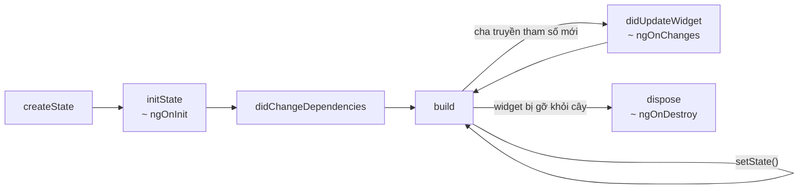

# Chương 4 — Widget: Stateless, Stateful, vòng đời và BuildContext

## Mục tiêu

- Viết `StatelessWidget` và `StatefulWidget`; biết khi nào dùng loại nào.
- Hiểu vòng đời `State`: `initState` → `build` → `didUpdateWidget` → `dispose` (map sang hook của Angular).
- Hiểu **BuildContext** và **Key** ở mức đủ dùng.
- Dọn dẹp tài nguyên (Timer, controller) đúng cách, và test được điều đó.

## Giải thích đơn giản

Docs chính thức ("Widget fundamentals" trong Learning Pathway) nói: widget là **mô tả** một phần giao diện,
và widget **bất biến**. Muốn giao diện đổi thì Flutter tạo widget **mới** với dữ liệu mới.

- **StatelessWidget**: chỉ phụ thuộc tham số truyền vào. Giống component "dumb" chỉ có `@Input`.
- **StatefulWidget**: có một object `State` **sống lâu** đi kèm. Widget có thể bị tạo lại nhiều lần, nhưng
  `State` được giữ nguyên → dữ liệu trong `State` không mất. Gọi `setState` → Flutter gọi lại `build`.



## Ví dụ

### StatelessWidget — ProfileCard

`examples/lib/chapters/ch04/profile_card.dart`:

```dart
class ProfileCard extends StatelessWidget {
  const ProfileCard({
    super.key,
    required this.name,
    required this.role,
    required this.following,
    required this.onFollow,
  });

  final String name;
  final String role;
  final bool following;
  final VoidCallback onFollow;

  @override
  Widget build(BuildContext context) {
    return Card(
      child: ListTile(
        leading: CircleAvatar(child: Text(name.characters.first)),
        title: Text(name),
        subtitle: Text(role),
        trailing: FilledButton.tonal(
          onPressed: onFollow,
          child: Text(following ? 'Đang theo dõi' : 'Theo dõi'),
        ),
      ),
    );
  }
}
```

`ProfileCard` không tự lưu `following`: cha (`ProfileDemo`, một StatefulWidget) giữ state và truyền xuống
(**lifting state up**). `name.characters.first` lấy ký tự đầu an toàn với emoji/chữ có dấu (package
`characters` đi kèm Flutter).

### StatefulWidget có vòng đời — Clock

```dart
class Clock extends StatefulWidget {
  const Clock({super.key, this.paused = false, this.now = DateTime.now});

  final bool paused;

  /// Hàm lấy giờ hiện tại — truyền vào để test dễ (giống inject một ClockService).
  final DateTime Function() now;

  @override
  State<Clock> createState() => _ClockState();
}

class _ClockState extends State<Clock> {
  late DateTime _time = widget.now();
  Timer? _timer;

  @override
  void initState() {
    super.initState();
    if (!widget.paused) _start();
  }

  @override
  void didUpdateWidget(Clock oldWidget) {
    super.didUpdateWidget(oldWidget);
    if (oldWidget.paused != widget.paused) {
      widget.paused ? _stop() : _start();
    }
  }

  void _start() {
    _timer?.cancel();
    _timer = Timer.periodic(const Duration(seconds: 1), (_) => setState(() => _time = widget.now()));
  }

  void _stop() {
    _timer?.cancel();
    _timer = null;
  }

  @override
  void dispose() {
    _stop(); // quên dòng này → Timer vẫn chạy sau khi widget bị gỡ (rò rỉ bộ nhớ)
    super.dispose();
  }

  @override
  Widget build(BuildContext context) => Text(formatTime(_time), style: Theme.of(context).textTheme.displaySmall);
}
```

- `widget.paused`: trong `State`, đọc tham số của widget qua `widget.` (giống `this.paused` của `@Input`).
- `didUpdateWidget` so sánh tham số cũ/mới — đúng vai trò `ngOnChanges(changes)`.
- `late DateTime _time = widget.now();` — `late` cho phép khởi tạo lười, lúc lần đầu đọc (khi đó `widget` đã có).

### Test vòng đời bằng thời gian giả

```dart
testWidgets('Clock cập nhật mỗi giây, dừng khi paused, hủy Timer khi dispose', (tester) async {
  var now = DateTime(2026, 1, 1, 8);
  DateTime clock() => now;
  await pumpApp(tester, Clock(now: clock));
  expect(find.text('08:00:00'), findsOneWidget);
  now = now.add(const Duration(seconds: 2));
  await tester.pump(const Duration(seconds: 1));
  expect(find.text('08:00:02'), findsOneWidget);

  // Bài 2: paused = true → didUpdateWidget dừng Timer
  await pumpApp(tester, Clock(now: clock, paused: true));
  now = now.add(const Duration(seconds: 5));
  await tester.pump(const Duration(seconds: 3));
  expect(find.text('08:00:02'), findsOneWidget);
  // ... chạy lại, rồi gỡ widget:
  await tester.pumpWidget(const SizedBox());
  // Nếu Timer còn chạy sau dispose, flutter_test sẽ báo lỗi "A Timer is still pending".
});
```

Pump lại cùng loại widget ở cùng vị trí với tham số khác → Flutter **giữ State** và gọi `didUpdateWidget`.
Đây là cách test "đổi `@Input`".

Kết quả thật (2026-09-30, `flutter test --reporter expanded test/chapters/ch04_test.dart`):

```text
00:00 +0: Chương 4 — widget ProfileCard đổi nhãn khi bấm Theo dõi (state ở cha)
00:00 +1: Chương 4 — widget formatTime thêm số 0 phía trước
00:00 +2: Chương 4 — widget Clock cập nhật mỗi giây, dừng khi paused, hủy Timer khi dispose
00:01 +3: Chương 4 — widget Bài 1: LikeButton bật/tắt và đổi số
00:01 +4: All tests passed!
```

Xem trong app: tab **Lab** → "Ch.4".

## Đi sâu

### BuildContext là gì?

Mỗi widget trong cây có một `BuildContext` = **vị trí** của nó trong cây. Các hàm `X.of(context)` (ví dụ
`Theme.of(context)`, `Navigator.of(context)`, `ScaffoldMessenger.of(context)`) **tìm lên trên** từ vị trí đó
để lấy đối tượng gần nhất — giống injector phân cấp của Angular. Vì vậy:

- `Theme.of(context)` trong một widget nằm **dưới** `MaterialApp` mới tìm thấy theme.
- Sau `await`, context có thể không còn trong cây: kiểm tra `if (!context.mounted) return;` (với `State`:
  `if (!mounted) return;`) trước khi dùng. Chương 8 dùng mẫu này.

### Widget, Element, RenderObject (đủ biết)

Flutter có 3 cây: **Widget** (mô tả, rẻ, tạo lại liên tục) → **Element** (giữ vị trí và State, sống lâu)
→ **RenderObject** (layout và vẽ). Bạn viết widget; Flutter tự so khớp widget mới với element cũ theo
**loại (runtimeType) + key**. Cùng loại + cùng key → giữ element (và State), chỉ cập nhật.

### Key — khi nào cần?

Hầu như không cần, **trừ** danh sách mà phần tử có thể đổi thứ tự/xóa (vuốt để xóa, sắp xếp). Khi đó dùng
`ValueKey(item.id)` để Flutter giữ đúng State cho đúng phần tử — giống `track item.id` trong `@for` của Angular.
Chương 6 và app mẫu dùng `ValueKey(task.id)` cho `Dismissible`.

### Khi nào widget build lại?

1. `setState` trong State của nó.
2. Cha build lại và tạo widget mới cho nó (trừ khi widget là `const` — cùng đối tượng → bỏ qua).
3. Một `InheritedWidget` nó phụ thuộc (qua `X.of(context)`) thay đổi (Theme, MediaQuery…).

Mẹo: tách phần hay đổi ra widget nhỏ, và thêm `const` ở nơi có thể (Tập 3, Performance).

## Lỗi và bẫy thường gặp

- **Gọi `setState` trong `build`** → vòng lặp vô hạn.
- **Làm việc nặng hoặc gọi API trong `build`** → chạy lại mỗi frame. Gọi trong `initState` hoặc trong ViewModel (Tập 2).
- **Quên `dispose` Timer / `TextEditingController` / `AnimationController` / `StreamSubscription`**.
- **Dùng `context` sau `await`** mà không kiểm tra `mounted`.
- **Lưu dữ liệu vào field của StatelessWidget** — widget bất biến; mọi field phải `final`.
- **Quên gọi `super.initState()` / `super.dispose()`** (lint `must_call_super` sẽ nhắc).

## Tóm tắt

- Stateless = chỉ tham số; Stateful = có `State` sống lâu, đổi bằng `setState`.
- Vòng đời: `initState` (~ngOnInit), `didUpdateWidget` (~ngOnChanges), `dispose` (~ngOnDestroy).
- `BuildContext` = vị trí trong cây; `X.of(context)` tìm lên trên.
- Dùng `Key` cho danh sách đổi thứ tự. Luôn dọn dẹp tài nguyên trong `dispose`.

## Bài tập (có lời giải)

**Bài 1.** Viết `LikeButton(initialLikes)`: bấm lần 1 → tim đầy và +1; bấm lần 2 → trở lại.

<details>
<summary>Lời giải</summary>

`examples/lib/chapters/ch04/exercise_solution.dart`:

```dart
class _LikeButtonState extends State<LikeButton> {
  bool _liked = false;

  @override
  Widget build(BuildContext context) {
    final likes = widget.initialLikes + (_liked ? 1 : 0);
    return TextButton.icon(
      onPressed: () => setState(() => _liked = !_liked),
      icon: Icon(_liked ? Icons.favorite : Icons.favorite_border, semanticLabel: _liked ? 'Bỏ thích' : 'Thích'),
      label: Text('$likes'),
    );
  }
}
```

Chỉ **một** state `_liked`; số lượt thích là giá trị *suy ra* (derived) — tính trong `build`, giống `computed()`.
Test: 12 → bấm → 13 (thấy icon `favorite`) → bấm → 12.
</details>

**Bài 2.** `Clock` chạy mãi. Thêm tham số `paused`; khi cha đổi `paused` thành `true` thì dừng Timer, `false` thì chạy lại.

<details>
<summary>Lời giải</summary>

Dùng `didUpdateWidget` (đã có trong `Clock` ở trên):

```dart
@override
void didUpdateWidget(Clock oldWidget) {
  super.didUpdateWidget(oldWidget);
  if (oldWidget.paused != widget.paused) {
    widget.paused ? _stop() : _start();
  }
}
```

Và `initState` chỉ `_start()` khi `!widget.paused`. Test "Clock cập nhật mỗi giây, dừng khi paused…" pump lại
`Clock(paused: true)`, cho 3 giây trôi qua và kiểm tra giờ **không** đổi; rồi `paused: false` và kiểm tra giờ chạy tiếp.
Đây là mẫu "đăng ký lại khi input đổi" — giống `switchMap` của RxJS hoặc `useEffect(..., [paused])` của React.
</details>

## Nguồn tham khảo (Sources)

Đã mở ngày 2026-09-30 (đọc file nguồn docs ở commit `ab59c61`):

- Tutorial: Widget fundamentals — https://docs.flutter.dev/learn/pathway/tutorial/widget-fundamentals —
  https://github.com/flutter/website/blob/ab59c614e780e2d6d44f07ae4a96238028f581a5/sites/docs/src/content/learn/pathway/tutorial/widget-fundamentals.md
- Tutorial: Learn about stateful widgets — https://docs.flutter.dev/learn/pathway/tutorial/stateful-widget —
  https://github.com/flutter/website/blob/ab59c614e780e2d6d44f07ae4a96238028f581a5/sites/docs/src/content/learn/pathway/tutorial/stateful-widget.md
- Building user interfaces with Flutter — https://docs.flutter.dev/ui —
  https://github.com/flutter/website/blob/ab59c614e780e2d6d44f07ae4a96238028f581a5/sites/docs/src/content/ui/index.md
- Adding interactivity — https://docs.flutter.dev/ui/interactivity —
  https://github.com/flutter/website/blob/ab59c614e780e2d6d44f07ae4a96238028f581a5/sites/docs/src/content/ui/interactivity/index.md
- Flutter for React Native developers (StatelessWidget / StatefulWidget) — https://docs.flutter.dev/flutter-for/react-native-devs —
  https://github.com/flutter/website/blob/ab59c614e780e2d6d44f07ae4a96238028f581a5/sites/docs/src/content/flutter-for/react-native-devs.md
