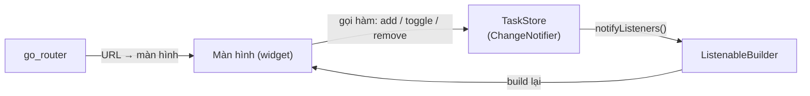

# Chương 9 — App mẫu Tập 1: "Việc Cần Làm"

## Mục tiêu

- Ghép mọi thứ của Tập 1 thành một app hoàn chỉnh: 3 tab, danh sách, form thêm/sửa, chi tiết, xóa có hoàn tác,
  lọc, dark mode, trang 404, deep link.
- Đọc cấu trúc thư mục của một app Flutter nhỏ.
- Chạy toàn bộ kiểm tra: `flutter analyze`, `flutter test`, `flutter build web`, smoke test web.

## Giải thích đơn giản

App quản lý việc cần làm, dữ liệu trong bộ nhớ (Tập 2 sẽ lưu vào SQLite). Luồng dữ liệu một chiều:



- **Model** `Task`: bất biến, có `copyWith` và `==` theo giá trị.
- **Store** `TaskStore extends ChangeNotifier`: giữ danh sách, mọi thay đổi đi qua hàm của nó.
- **Màn hình**: đọc store qua `ListenableBuilder`, gọi hàm của store khi người dùng thao tác.
- **Router**: `StatefulShellRoute` 3 tab; store được truyền vào màn hình qua constructor (DI bằng tham số — Tập 2 thay
  bằng `provider`).

## Ví dụ

### Cấu trúc

```text
examples/lib/
  main.dart                 runApp(TodoApp())
  app.dart                  TodoApp: tạo store, ThemeMode (ValueNotifier), GoRouter; MaterialApp.router
  theme.dart                AppTheme.light / dark (ColorScheme.fromSeed)
  router.dart               cây route: /tasks, /tasks/new, /tasks/:id, /tasks/:id/edit, /lab, /lab/:chapter, /settings
  features/tasks/
    task.dart               Task, Priority, TaskFilter, sortTasks, filterTasks, searchTasks, validateTaskTitle
    task_store.dart         TaskStore (ChangeNotifier)
  screens/                  home_shell, task_list, task_detail, task_form, settings, not_found
  lab/lab_screens.dart      tab Lab: mở ví dụ từng chương
  chapters/ch01..ch08/      ví dụ + lời giải bài tập
examples/test/              test từng chương + features/task_test.dart + app_test.dart
```

### Store

```dart
class TaskStore extends ChangeNotifier {
  TaskStore([Iterable<Task> initial = const []]) : _tasks = [...initial] {
    _nextId = _tasks.length + 1;
  }

  final List<Task> _tasks;
  late int _nextId;

  /// Bản chỉ-đọc: bên ngoài không sửa trực tiếp được.
  List<Task> get tasks => List.unmodifiable(_tasks);

  int get remaining => _tasks.where((t) => !t.done).length;

  Task add({required String title, String note = '', Priority priority = Priority.normal}) {
    final task = Task(id: 't${_nextId++}', title: title.trim(), note: note.trim(), priority: priority);
    _tasks.add(task);
    notifyListeners();
    return task;
  }

  void toggle(String id) {
    final task = byId(id);
    if (task != null) update(task.copyWith(done: !task.done));
  }

  /// Xóa và trả về (vị trí, việc) để có thể "Hoàn tác".
  (int, Task)? remove(String id) {
    final i = _tasks.indexWhere((t) => t.id == id);
    if (i == -1) return null;
    final removed = _tasks.removeAt(i);
    notifyListeners();
    return (i, removed);
  }
  // byId, update, insertAt, clearDone … xem file đầy đủ
}
```

`remove` trả về **record** `(int, Task)?` — màn hình dùng nó cho nút "Hoàn tác" của SnackBar:

```dart
void _delete(Task task) {
  final removed = widget.store.remove(task.id);
  if (removed == null) return;
  final (index, oldTask) = removed;
  ScaffoldMessenger.of(context)
    ..hideCurrentSnackBar()
    ..showSnackBar(SnackBar(
      content: Text('Đã xóa "${oldTask.title}"'),
      action: SnackBarAction(label: 'Hoàn tác', onPressed: () => widget.store.insertAt(index, oldTask)),
    ));
}
```

### Màn hình danh sách đọc store

```dart
body: ListenableBuilder(
  listenable: widget.store,
  builder: (context, _) {
    final visible = sortTasks(filterTasks(widget.store.tasks, _filter));
    return Column(children: [ /* SegmentedButton lọc, "Còn N việc", ListView.builder + Dismissible */ ]);
  },
),
```

Bộ lọc `_filter` là **state cục bộ** của màn hình (`setState`), còn danh sách việc là **state của app** (store) —
đúng phân loại "ephemeral vs app state" của docs.

### Dark mode

`TodoApp` giữ `ValueNotifier<ThemeMode>`; tab Cài đặt đổi `themeMode.value` bằng `SegmentedButton`;
`ValueListenableBuilder` bọc `MaterialApp.router` để đổi theme toàn app ngay lập tức.

### Chạy

```bash
cd books/flutter/vol1-co-ban/examples
flutter pub get
flutter run -d chrome          # hoặc: flutter run (iPhone qua Mac + Xcode)
```

- Trên Chrome/web: đã build và smoke test trong sandbox (xem dưới).
- **Chạy trên iPhone/Android: NOT RUN** (không có Mac/Xcode/Android SDK trong sandbox).

### Kết quả kiểm tra thật (2026-09-30)

Test của app (`flutter test -j 1 --reporter expanded test/features test/app_test.dart`):

```text
00:00 +0: test/features/task_test.dart: Task (model thuần) copyWith tạo bản mới, bản cũ giữ nguyên
00:00 +1: test/features/task_test.dart: Task (model thuần) sortTasks: chưa xong trước, ưu tiên cao trước
00:00 +2: test/features/task_test.dart: Task (model thuần) filterTasks
00:00 +3: test/features/task_test.dart: Task (model thuần) validateTaskTitle
00:00 +4: test/features/task_test.dart: Bài 2: searchTasks không phân biệt dấu
00:00 +5: test/features/task_test.dart: TaskStore (ChangeNotifier) add / toggle / update / remove + insertAt báo cho listener
00:00 +6: test/features/task_test.dart: TaskStore (ChangeNotifier) Bài 1: clearDone xóa việc đã xong và báo listener một lần
00:00 +7: test/features/task_test.dart: TaskStore (ChangeNotifier) tasks là danh sách chỉ-đọc
00:00 +8: test/app_test.dart: mở app thấy danh sách + 3 tab
00:02 +9: test/app_test.dart: thêm việc: validate rồi lưu, quay về danh sách
00:03 +10: test/app_test.dart: đánh dấu xong, lọc "Đã xong"
00:03 +11: test/app_test.dart: chi tiết → sửa → lưu; xóa có hộp thoại xác nhận
00:04 +12: test/app_test.dart: nút "Xóa việc đã xong" trên AppBar
00:04 +13: test/app_test.dart: vuốt để xóa rồi Hoàn tác
00:04 +14: test/app_test.dart: deep link /tasks/t2 và /tasks/khong-co; route lạ → trang 404
00:04 +15: test/app_test.dart: Cài đặt: chuyển sang giao diện Tối
00:05 +16: test/app_test.dart: Lab mở được mọi chương
00:06 +17: All tests passed!
```

Toàn bộ dự án (`bash books/flutter/scripts/check-all.sh vol1-co-ban`, log đầy đủ: [../logs/check-all.txt](../logs/check-all.txt)):
format OK, `flutter analyze` → "No issues found!", `flutter test` → 58 test pass, `flutter build web` → "✓ Built build/web",
smoke test trong Chromium headless (khung 390×844 như iPhone) → thấy "Việc cần làm", "Còn 3 việc chưa xong" → "WEB SMOKE OK".

## Đi sâu

### Vì sao test toàn app lại là widget test?

`app_test.dart` bơm (pump) cả `TodoApp` với router thật và store thật, rồi bấm như người dùng. Nó chạy trong vài giây,
không cần thiết bị — đây là mức test docs khuyên có nhiều nhất ("Test architectural components separately, and
together"). Integration test chạy trên thiết bị thật ở Tập 2, Chương 7.

Mẹo: mỗi lần pump một app mới trong cùng test phải dùng `key: UniqueKey()`, nếu không Flutter **tái sử dụng State cũ**
(cùng loại widget, cùng vị trí) và router cũ vẫn được giữ — sách đã gặp đúng lỗi này (test deep link thứ hai không
chuyển trang) và sửa bằng `UniqueKey()`.

### Điều gì sẽ đổi ở Tập 2?

| Tập 1 (đơn giản) | Tập 2 (theo khuyến nghị kiến trúc chính thức) |
|---|---|
| Store truyền qua constructor | `provider` (`ChangeNotifierProvider`, `context.watch/read`) |
| Dữ liệu trong bộ nhớ | Repository + SQLite (`sqflite`), cài đặt bằng `shared_preferences` |
| Một `TaskStore` cho mọi màn hình | ViewModel cho từng màn hình (MVVM) |
| Không có I/O | `Future`, trạng thái đang tải / lỗi |

## Lỗi và bẫy thường gặp

- **Sửa list trả về từ `store.tasks`** → `UnsupportedError` (cố ý: danh sách chỉ-đọc).
- **Quên `notifyListeners()`** trong store → UI không đổi.
- **Gọi `notifyListeners()` sau khi store đã `dispose`** → lỗi "A TaskStore was used after being disposed".
- **Pump lại app trong test không đổi key** → State/router cũ bị giữ.
- **Tạo router trong `build`** của `TodoApp` → mất lịch sử điều hướng mỗi lần đổi theme (router được tạo một lần bằng `late final`).

## Tóm tắt

- App mẫu = model bất biến + store `ChangeNotifier` + `ListenableBuilder` + go_router 3 tab + theme sáng/tối.
- State cục bộ (bộ lọc) dùng `setState`; state app (danh sách) nằm trong store.
- Kiểm tra: analyze 0 issue, 58 test, build web, smoke test web — tất cả chạy thật.

## Bài tập (có lời giải)

**Bài 1.** Thêm nút "Xóa việc đã xong" trên AppBar: xóa mọi việc `done`, hiện SnackBar "Đã xóa N việc đã xong".
Store chỉ báo listener khi thật sự có thay đổi.

<details>
<summary>Lời giải</summary>

`task_store.dart`:

```dart
int clearDone() {
  final before = _tasks.length;
  _tasks.removeWhere((t) => t.done);
  final removed = before - _tasks.length;
  if (removed > 0) notifyListeners();
  return removed;
}
```

`task_list_screen.dart` — `AppBar(actions: [IconButton(tooltip: 'Xóa việc đã xong', onPressed: () { final n =
widget.store.clearDone(); ScaffoldMessenger.of(context)..hideCurrentSnackBar()..showSnackBar(...); })])`.
Test đơn vị: gọi 2 lần → lần 1 trả 1, lần 2 trả 0, listener được gọi **đúng 1 lần**. Test widget: bấm nút
→ thấy "Đã xóa 1 việc đã xong", còn 3 việc.
</details>

**Bài 2.** Viết `searchTasks(tasks, query)`: tìm theo tên hoặc ghi chú, không phân biệt hoa thường và **có/không dấu**
("hoc" tìm được "Học từ vựng"). Dùng lại extension ở Chương 3.

<details>
<summary>Lời giải</summary>

`task.dart`:

```dart
List<Task> searchTasks(Iterable<Task> tasks, String query) {
  final q = query.trim().withoutAccents;
  if (q.isEmpty) return tasks.toList();
  return tasks.where((t) => t.title.withoutAccents.contains(q) || t.note.withoutAccents.contains(q)).toList();
}
```

(`import '../../chapters/ch03/dart_basics.dart' show VietnameseText;` — `show` chỉ nhập extension cần dùng.)
Test: "hoc" → tìm thấy "Học từ vựng"; "DAM PHAN" → tìm thấy việc có ghi chú "Đàm phán hợp đồng"; chuỗi rỗng → trả tất cả.
Nối vào UI: thêm một `SearchBox` (Chương 2) phía trên danh sách và gọi `searchTasks` trước `sortTasks`. App TOEIC
(Task 9) dùng đúng kỹ thuật này cho ô tìm từ.
</details>

## Nguồn tham khảo (Sources)

Đã mở ngày 2026-09-30 (đọc file nguồn docs ở commit `ab59c61`):

- Tutorial: Use ChangeNotifier to update app state — https://docs.flutter.dev/learn/pathway/tutorial/change-notifier —
  https://github.com/flutter/website/blob/ab59c614e780e2d6d44f07ae4a96238028f581a5/sites/docs/src/content/learn/pathway/tutorial/change-notifier.md
- Tutorial: Use ListenableBuilder to update app UI — https://docs.flutter.dev/learn/pathway/tutorial/listenable-builder —
  https://github.com/flutter/website/blob/ab59c614e780e2d6d44f07ae4a96238028f581a5/sites/docs/src/content/learn/pathway/tutorial/listenable-builder.md
- Ephemeral vs app state — https://docs.flutter.dev/data-and-backend/state-mgmt/ephemeral-vs-app —
  https://github.com/flutter/website/blob/ab59c614e780e2d6d44f07ae4a96238028f581a5/sites/docs/src/content/data-and-backend/state-mgmt/ephemeral-vs-app.md
- Architecture recommendations (testing, immutable models) — https://docs.flutter.dev/app-architecture/recommendations —
  https://github.com/flutter/website/blob/ab59c614e780e2d6d44f07ae4a96238028f581a5/sites/docs/src/content/app-architecture/recommendations.md
- Cookbook: Display a snackbar — https://docs.flutter.dev/cookbook/design/snackbars —
  https://github.com/flutter/website/blob/ab59c614e780e2d6d44f07ae4a96238028f581a5/sites/docs/src/content/cookbook/design/snackbars.md
- Package go_router: https://pub.dev/packages/go_router
