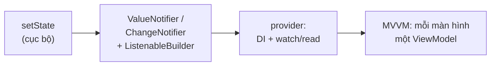

# Chương 1 — Quản lý state: setState → ChangeNotifier → provider (MVVM)

## Mục tiêu

- Phân biệt **state cục bộ** (ephemeral) và **state của app** theo docs chính thức.
- Dùng `ChangeNotifier` + `ListenableBuilder` (cách Learning Pathway dạy, không cần package).
- Dùng package **`provider`** để tiêm phụ thuộc (DI) và lắng nghe: `ChangeNotifierProvider`, `context.read`,
  `context.watch`, `context.select`, `Consumer`.
- Hiểu mô hình **MVVM** (View + ViewModel) mà trang Architecture recommendations khuyên.
- Biết so sánh với Riverpod, Bloc, signals — và vì sao sách chọn provider.

## Giải thích đơn giản

Docs ("Ephemeral vs app state"): state **cục bộ** là thứ chỉ một widget cần (tab đang chọn, ô đang gõ) →
`setState` là đủ. State **của app** là thứ nhiều màn hình cần hoặc phải giữ lâu (danh sách từ vựng, cài đặt,
đăng nhập) → đưa ra khỏi widget, vào một class riêng.

Con đường docs chính thức gợi ý, từ đơn giản tới đầy đủ:



| Angular | Flutter (sách dùng) |
|---|---|
| Service `@Injectable` có state (signal/BehaviorSubject) | `class CartModel extends ChangeNotifier` |
| `this.items.set([...])` / `subject.next()` | sửa field private + `notifyListeners()` |
| `providers: [CartService]` ở component/route | `ChangeNotifierProvider(create: (_) => CartModel(), child: ...)` |
| `inject(CartService)` rồi gọi hàm | `context.read<CartModel>().add(item)` |
| Đọc signal trong template (tự cập nhật) | `context.watch<CartModel>()` hoặc `Consumer<CartModel>` |
| `computed(() => cart.count())` chỉ đổi khi count đổi | `context.select<CartModel, int>((c) => c.count)` |
| `ngOnDestroy` của service theo component | provider tự gọi `dispose()` khi widget bị gỡ |

## Ví dụ

### ChangeNotifier — "service có state"

`examples/lib/chapters/ch01/cart_model.dart` (theo đúng ví dụ giỏ hàng trong docs "Simple app state management"):

```dart
class CartModel extends ChangeNotifier {
  final List<CatalogItem> _items = [];

  List<CatalogItem> get items => List.unmodifiable(_items);
  int get count => _items.length;
  int get totalPrice => _items.fold(0, (sum, i) => sum + i.price);

  void add(CatalogItem item) {
    _items.add(item);
    notifyListeners(); // ≈ signal.set() / subject.next()
  }

  void removeAll() {
    _items.clear();
    notifyListeners();
  }
}
```

### Không cần package: ListenableBuilder (Learning Pathway)

```dart
class CounterView extends StatelessWidget {
  const CounterView({super.key, required this.viewModel});

  final CounterViewModel viewModel;

  @override
  Widget build(BuildContext context) {
    return ListenableBuilder(
      listenable: viewModel,
      builder: (context, _) => Row(
        mainAxisSize: MainAxisSize.min,
        children: [
          Text('Đếm: ${viewModel.value}'),
          IconButton(tooltip: 'Tăng', onPressed: viewModel.increment, icon: const Icon(Icons.add)),
        ],
      ),
    );
  }
}
```

ViewModel được truyền qua constructor. Tập 1 (app "Việc Cần Làm") làm đúng như vậy.

### Có provider: DI + lắng nghe

`examples/lib/chapters/ch01/provider_demo.dart`:

```dart
ChangeNotifierProvider(
  create: (_) => CartModel(), // provider tự dispose CartModel khi widget bị gỡ
  child: const Column(mainAxisSize: MainAxisSize.min, children: [CatalogList(), Divider(), CartSummary()]),
);

// Trong CatalogList — chỉ GỌI HÀM, không cần build lại khi giỏ đổi:
onPressed: () => context.read<CartModel>().add(item),

// Trong CartSummary — HIỂN THỊ, cần build lại:
Consumer<CartModel>(
  builder: (context, cart, child) => ListTile(
    title: Text('Giỏ: ${cart.count} món — ${cart.totalPrice}k'),
    trailing: TextButton(onPressed: cart.count == 0 ? null : cart.removeAll, child: const Text('Xóa hết')),
  ),
);
```

Quy tắc nhớ nhanh:
- `context.watch<T>()` — trong `build`, muốn **build lại** khi T đổi.
- `context.read<T>()` — trong **callback** (onPressed…), chỉ lấy đối tượng. Không gọi `read` trong `build` để hiển thị.
- `context.select<T, R>(fn)` — chỉ build lại khi **kết quả** `fn` đổi.
- `Consumer<T>` — như `watch` nhưng chỉ phần `builder` build lại (dùng sâu trong cây).

### MVVM trong app mẫu "Sổ Từ Vựng"

App Tập 2 theo khuyến nghị kiến trúc chính thức: **mỗi màn hình một ViewModel**, dữ liệu lấy qua **repository**
được tiêm bằng provider. `examples/lib/config/router.dart`:

```dart
GoRoute(
  path: '/words',
  builder: (context, state) => ChangeNotifierProvider(
    create: (context) => WordListViewModel(repository: context.read()),
    child: const WordListScreen(),
  ),
),
```

`create` chạy **một lần** cho màn hình; khi rời màn hình, provider tự `dispose()` ViewModel. Ở gốc app,
`MultiProvider` cung cấp repository và service (`config/dependencies.dart`, Chương 8). Trong View:

```dart
final vm = context.watch<WordListViewModel>();   // build lại khi vm.notifyListeners()
// ...
onChanged: (text) => _debouncer(() => context.read<WordListViewModel>().search(text)),
```

Và `app.dart` chỉ build lại `MaterialApp` khi **theme** đổi:

```dart
final themeMode = context.select<SettingsViewModel, ThemeMode>((vm) => vm.themeMode);
```

### Kết quả test thật

`flutter test --reporter expanded test/chapters/ch01_test.dart` (2026-09-30):

```text
00:00 +0: Chương 1 — quản lý state CartModel báo listener khi thêm / xóa
00:00 +1: Chương 1 — quản lý state CounterView (ChangeNotifier + ListenableBuilder)
00:01 +2: Chương 1 — quản lý state ProviderCartDemo: read để gọi hàm, Consumer để hiển thị
00:01 +3: Chương 1 — quản lý state Bài 1: context.select chỉ build lại khi số lượng đổi
00:01 +4: Chương 1 — quản lý state Bài 2: CartNotifier tạo list mới mỗi lần đổi
00:01 +5: All tests passed!
```

## Đi sâu

### Các lựa chọn khác (so sánh)

Trang "State management options" liệt kê cách có sẵn (`setState`, `ValueNotifier`/`InheritedNotifier`,
`InheritedWidget`) và dẫn tới các package cộng đồng. Số liệu kiểm tra 2026-09-30 (chi tiết ở [STACK.md](../STACK.md)):

| Package (phiên bản mới nhất) | Ý tưởng | Giống Angular | Ghi chú |
|---|---|---|---|
| **provider 6.1.5+1** | DI + lắng nghe ChangeNotifier | DI + service | **Docs chính thức khuyên dùng cho DI**; sách chọn |
| flutter_riverpod 3.4.3 | Provider an toàn compile-time, cache async, không cần BuildContext | DI + RxJS store | Mạnh; nhiều khái niệm hơn; pub.dev không gắn tag web cho bản 3.4.3 |
| flutter_bloc 9.1.1 | Sự kiện → Bloc → State (Stream) | **NgRx** | Nhiều code mẫu (boilerplate), rất tường minh |
| signals 7.1.0 | `signal`, `computed`, `effect` có auto-tracking | **Angular Signals** | Quen thuộc nhất với Nobin; cộng đồng nhỏ hơn |

**Quyết định của sách (và của app TOEIC — Task 9):** `ChangeNotifier` + `provider`. Lý do: (1) docs chính thức khuyên
(MVVM + ChangeNotifier + provider); (2) `ChangeNotifier` có sẵn trong SDK; (3) map thẳng sang service + DI của Angular;
(4) ít khái niệm → ít lỗi khi một agent khác làm theo.

### ViewModel không được biết về widget

ViewModel chỉ chứa **state + hàm**; không import `BuildContext`, không gọi `Navigator`, không hiện SnackBar. Muốn
báo một việc "một lần" (ví dụ thông báo), đặt field `message` rồi View hiện và gọi `consumeMessage()` — xem
`SettingsViewModel`. Nhờ vậy test ViewModel bằng `test()` thường, không cần widget (Chương 7).

### `notifyListeners()` và hiệu năng

`notifyListeners()` báo **mọi** người nghe. Nếu nhiều widget `watch` một ViewModel lớn, dùng `select` hoặc
`Consumer` đặt sâu trong cây để giảm phần build lại. `ValueNotifier` chỉ báo khi `value` **khác** (`==`) giá trị cũ.

## Lỗi và bẫy thường gặp

- **`context.read` trong `build` để hiển thị** → UI không cập nhật. Dùng `watch`/`select`/`Consumer`.
- **`context.watch` trong callback** → lỗi assert của provider. Dùng `read`.
- **`ProviderNotFoundException`**: widget nằm **ngoài** (phía trên) provider, hoặc sai kiểu generic
  (`Provider<SqliteWordRepository>` nhưng đọc `WordRepository`). Khai báo provider theo **interface**.
- **Tạo ViewModel trong `build`** (`WordListViewModel(...)` mỗi lần build) → mất state, rò rỉ. Dùng `create:` của provider.
- **Sửa list rồi gán lại cùng đối tượng cho `ValueNotifier`** → không báo (vì `==` cùng tham chiếu). Tạo list mới (Bài 2).
- **Quên `notifyListeners()`** sau khi đổi field.

## Tóm tắt

- State cục bộ → `setState`. State app → `ChangeNotifier` (ViewModel/service).
- Không package: `ListenableBuilder`. Có provider: `ChangeNotifierProvider` + `read`/`watch`/`select`/`Consumer`.
- MVVM theo docs: mỗi màn hình một ViewModel tạo bằng `create:`; repository tiêm qua `MultiProvider`.
- Riverpod/Bloc/signals đều tốt; sách và app TOEIC dùng provider vì docs khuyên và đơn giản.

## Bài tập (có lời giải)

**Bài 1.** Viết `CartCountBadge` hiển thị số món trong giỏ, **chỉ build lại khi số lượng đổi** (không build lại khi
`notifyListeners()` được gọi mà số lượng giữ nguyên). Viết test đếm số lần build.

<details>
<summary>Lời giải</summary>

`examples/lib/chapters/ch01/exercise_solution.dart`:

```dart
class CartCountBadge extends StatelessWidget {
  const CartCountBadge({super.key});

  static int buildCount = 0; // chỉ để test đếm số lần build

  @override
  Widget build(BuildContext context) {
    buildCount++;
    final count = context.select<CartModel, int>((cart) => cart.count);
    return Badge(label: Text('$count'), child: const Icon(Icons.shopping_cart));
  }
}
```

Test: build lần 1 → `buildCount = 1`; `add` → 2; `removeAll` → 3; gọi `removeAll` lần nữa (vẫn gọi
`notifyListeners()` nhưng `count` vẫn 0) → **vẫn 3**. Nếu thay `select` bằng `watch`, số lần build sẽ là 4.
</details>

**Bài 2.** Viết lại giỏ hàng bằng `ValueNotifier<List<CatalogItem>>` với danh sách **bất biến**.

<details>
<summary>Lời giải</summary>

```dart
class CartNotifier extends ValueNotifier<List<CatalogItem>> {
  CartNotifier() : super(const []);

  // List.unmodifiable: không ai sửa được list cũ → buộc phải tạo list mới (bất biến thật sự).
  void add(CatalogItem item) => value = List.unmodifiable([...value, item]);
  void removeAll() => value = const [];
  int get totalPrice => value.fold(0, (sum, i) => sum + i.price);
}
```

`ValueNotifier` so sánh `value` mới với cũ bằng `==`; list mới → khác → báo listener. Test kiểm tra list cũ và mới
**không** `identical`, và `cart.value.add(...)` ném `UnsupportedError`. Cách này giống cập nhật signal bằng
`items.update(list => [...list, item])` trong Angular.
</details>

## Nguồn tham khảo (Sources)

Đã mở ngày 2026-09-30 (đọc file nguồn docs ở commit `ab59c61`):

- State management — intro — https://docs.flutter.dev/data-and-backend/state-mgmt/intro —
  https://github.com/flutter/website/blob/ab59c614e780e2d6d44f07ae4a96238028f581a5/sites/docs/src/content/data-and-backend/state-mgmt/intro.md
- Ephemeral vs app state — https://docs.flutter.dev/data-and-backend/state-mgmt/ephemeral-vs-app —
  https://github.com/flutter/website/blob/ab59c614e780e2d6d44f07ae4a96238028f581a5/sites/docs/src/content/data-and-backend/state-mgmt/ephemeral-vs-app.md
- Simple app state management (provider) — https://docs.flutter.dev/data-and-backend/state-mgmt/simple —
  https://github.com/flutter/website/blob/ab59c614e780e2d6d44f07ae4a96238028f581a5/sites/docs/src/content/data-and-backend/state-mgmt/simple.md
- State management options — https://docs.flutter.dev/data-and-backend/state-mgmt/options —
  https://github.com/flutter/website/blob/ab59c614e780e2d6d44f07ae4a96238028f581a5/sites/docs/src/content/data-and-backend/state-mgmt/options.md
- Tutorial: Use ChangeNotifier — https://docs.flutter.dev/learn/pathway/tutorial/change-notifier —
  https://github.com/flutter/website/blob/ab59c614e780e2d6d44f07ae4a96238028f581a5/sites/docs/src/content/learn/pathway/tutorial/change-notifier.md
- Tutorial: Use ListenableBuilder — https://docs.flutter.dev/learn/pathway/tutorial/listenable-builder —
  https://github.com/flutter/website/blob/ab59c614e780e2d6d44f07ae4a96238028f581a5/sites/docs/src/content/learn/pathway/tutorial/listenable-builder.md
- Architecture recommendations — https://docs.flutter.dev/app-architecture/recommendations —
  https://github.com/flutter/website/blob/ab59c614e780e2d6d44f07ae4a96238028f581a5/sites/docs/src/content/app-architecture/recommendations.md
- Case study — UI layer — https://docs.flutter.dev/app-architecture/case-study/ui-layer —
  https://github.com/flutter/website/blob/ab59c614e780e2d6d44f07ae4a96238028f581a5/sites/docs/src/content/app-architecture/case-study/ui-layer.md
- pub.dev: https://pub.dev/packages/provider · https://pub.dev/packages/flutter_riverpod · https://pub.dev/packages/flutter_bloc · https://pub.dev/packages/signals
