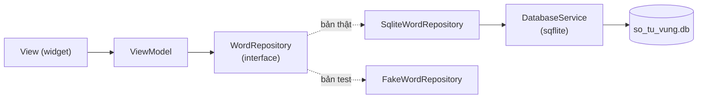

# Chương 4 — Lưu trữ offline: shared_preferences và SQLite (sqflite)

## Mục tiêu

- Chọn đúng cách lưu: key-value (`shared_preferences`) cho cài đặt, **SQLite** (`sqflite`) cho dữ liệu có cấu trúc.
- Mở database, tạo bảng, **migration** (`onCreate`/`onUpgrade`), seed dữ liệu bằng `batch`, dùng `transaction`.
- Viết **repository** theo khuyến nghị kiến trúc: interface + bản SQLite + bản giả.
- Test với **SQLite thật** trên máy tính bằng `sqflite_common_ffi`; chạy SQLite trên **web** bằng `sqflite_common_ffi_web`.
- Tìm kiếm tiếng Việt "có dấu / không dấu" bằng cột `search_key`.

## Giải thích đơn giản

| Nhu cầu | Web / Angular | React Native (sách RN) | Flutter (sách dùng) |
|---|---|---|---|
| Cài đặt nhỏ (theme, giờ nhắc) | `localStorage` | AsyncStorage | **shared_preferences** |
| Dữ liệu có cấu trúc, tìm kiếm, thống kê | IndexedDB | expo-sqlite | **sqflite** (SQLite) |
| Bí mật (token, PIN) | — | expo-secure-store | flutter_secure_storage (Tập 3) |

Docs chính thức: cookbook "Persist data with SQLite" dùng `sqflite` + `path`; "Store key-value data on disk" dùng
`shared_preferences`; mẫu kiến trúc "offline-first" nói **repository là nguồn sự thật duy nhất** (single source of truth),
và là nơi duy nhất được sửa dữ liệu.



## Ví dụ

### Mở database + migration — `examples/lib/data/services/database_service.dart`

```dart
class DatabaseService {
  DatabaseService._(this.db);

  final Database db;

  static const int schemaVersion = 2;
  static const String fileName = 'so_tu_vung.db';

  static Future<DatabaseService> open({DatabaseFactory? factory, String? path}) async {
    final f = factory ?? databaseFactory;
    final dbPath = path ?? (kIsWeb ? fileName : p.join(await f.getDatabasesPath(), fileName));
    final db = await f.openDatabase(
      dbPath,
      options: OpenDatabaseOptions(
        version: schemaVersion,
        onConfigure: (db) => db.execute('PRAGMA foreign_keys = ON'),
        onCreate: (db, version) async {
          await createSchemaV1(db);
          await migrateToV2(db);
          await seed(db);
        },
        onUpgrade: (db, oldVersion, newVersion) async {
          if (oldVersion < 2) await migrateToV2(db);
        },
      ),
    );
    return DatabaseService._(db);
  }
  // createSchemaV1: CREATE TABLE words (...)
  // migrateToV2:   CREATE TABLE reviews (... REFERENCES words(id) ON DELETE CASCADE) + index
}
```

- `version` + `onCreate` + `onUpgrade` = **migration**: máy mới cài chạy `onCreate` (tạo đủ mọi phiên bản); máy đang
  ở v1 chạy `onUpgrade(1 → 2)`. Không bao giờ sửa code của phiên bản cũ đã phát hành — chỉ thêm bước mới.
- `PRAGMA foreign_keys = ON`: SQLite **mặc định tắt** khóa ngoại; phải bật mỗi lần mở.
- `factory` là tham số → test truyền `databaseFactoryFfi`, web dùng `databaseFactoryFfiWeb`.

Bảng `words` có cột `search_key` = "từ + nghĩa", viết thường, **bỏ dấu** — nhờ vậy gõ "dam phan" vẫn tìm được "đàm phán":

```dart
static String searchKey(String text, String meaning) => '$text $meaning'.withoutAccents;
```

Seed 24 từ mẫu trong **một batch** (nhanh hơn nhiều so với 24 lần `insert` riêng lẻ):

```dart
static Future<void> seed(DatabaseExecutor db) async {
  final batch = db.batch();
  for (final (text, pos, meaning, example) in seedWords) {
    batch.insert('words', {
      'text': text, 'pos': pos, 'meaning': meaning, 'example': example,
      'search_key': searchKey(text, meaning),
    });
  }
  await batch.commit(noResult: true);
}
```

### Repository — `sqlite_word_repository.dart`

```dart
@override
Future<List<Word>> search({String query = '', bool favoritesOnly = false}) async {
  final where = <String>[];
  final args = <Object?>[];
  final q = query.trim().withoutAccents;
  if (q.isNotEmpty) {
    where.add('w.search_key LIKE ?');
    args.add('%$q%');
  }
  if (favoritesOnly) where.add('w.favorite = 1');
  final sql = StringBuffer(_select);
  if (where.isNotEmpty) sql.write(' WHERE ${where.join(' AND ')}');
  sql.write(' GROUP BY w.id ORDER BY w.text COLLATE NOCASE');
  final rows = await _db.rawQuery(sql.toString(), args);
  return rows.map(Word.fromRow).toList();
}
```

`_select` nối `words` với `reviews` (LEFT JOIN + COUNT/SUM) để mỗi `Word` có sẵn số lần ôn và số lần đúng. Giá trị người
dùng nhập luôn đi qua **tham số `?`** — không bao giờ nối vào chuỗi SQL (test "search an toàn với ký tự đặc biệt" thử
`' OR 1=1 --`). Thứ tự "nên ôn trước" dùng điểm `(đúng + 1) / (số lần ôn + 2)`: từ hay sai < từ mới < từ đã thuộc.

Model đọc một dòng SQLite — SQLite không có kiểu bool nên lưu `0/1`:

```dart
factory Word.fromRow(Map<String, Object?> row) => Word(
  id: row['id']! as int,
  text: row['text']! as String,
  partOfSpeech: row['pos']! as String,
  meaning: row['meaning']! as String,
  example: (row['example'] as String?) ?? '',
  favorite: (row['favorite'] as int? ?? 0) == 1,
  reviewCount: row['review_count'] as int? ?? 0,
  correctCount: row['correct_count'] as int? ?? 0,
);
```

### Cài đặt bằng shared_preferences — `key_value_store.dart` + `settings_repository.dart`

```dart
abstract interface class KeyValueStore {
  Future<String?> getString(String key);
  Future<void> setString(String key, String value);
  Future<void> remove(String key);
}

class SharedPreferencesStore implements KeyValueStore {
  SharedPreferencesStore([SharedPreferencesAsync? prefs]) : _prefs = prefs ?? SharedPreferencesAsync();
  final SharedPreferencesAsync _prefs;
  // getString / setString / remove gọi thẳng _prefs
}
```

`SharedPreferencesAsync` là API mới của shared_preferences (mọi lời gọi async, không cache). `SettingsRepository` lưu
theme (`ThemeMode.name`), giờ nhắc ("20:00") và tốc độ đọc; test dùng `MemoryStore` trong bộ nhớ.

### Test với SQLite thật (FFI)

```dart
/// SQLite THẬT chạy trên máy tính (qua FFI), trong bộ nhớ — mỗi lần gọi là một DB mới.
Future<DatabaseService> openTestDatabase() {
  sqfliteFfiInit();
  return DatabaseService.open(factory: databaseFactoryFfi, path: inMemoryDatabasePath);
}
```

Test migration mở một **file** DB phiên bản 1 (chưa có bảng `reviews`), đóng lại, rồi mở bằng code mới:

```dart
final v1 = await databaseFactoryFfi.openDatabase(
  path,
  options: OpenDatabaseOptions(
    version: 1,
    onCreate: (db, _) async {
      await DatabaseService.createSchemaV1(db);
      await DatabaseService.seed(db);
    },
  ),
);
await v1.close();
final service = await DatabaseService.open(factory: databaseFactoryFfi, path: path); // onUpgrade(1 → 2)
expect(await service.db.getVersion(), 2);
```

Kết quả thật (2026-09-30, `flutter test --reporter expanded test/data/database_test.dart`):

```text
00:00 +0: DatabaseService (SQLite thật qua FFI) tạo mới: có bảng words + reviews và 24 từ mẫu
00:00 +1: DatabaseService (SQLite thật qua FFI) migration: file DB phiên bản 1 được nâng lên 2, dữ liệu cũ còn nguyên
00:00 +2: DatabaseService (SQLite thật qua FFI) khóa ngoại: xóa từ thì xóa luôn lịch sử ôn (ON DELETE CASCADE)
00:00 +3: SqliteWordRepository search: theo từ, theo nghĩa có dấu và không dấu
00:00 +4: SqliteWordRepository search an toàn với ký tự đặc biệt (tham số ?, không nối chuỗi SQL)
00:00 +5: SqliteWordRepository toggleFavorite + lọc yêu thích
00:00 +6: SqliteWordRepository recordReview + dueForReview ưu tiên từ hay sai / chưa ôn
00:00 +7: SqliteWordRepository stats: tổng, yêu thích, ôn hôm nay
00:00 +8: All tests passed!
```

### SQLite trên web (Safari/Chrome)

`sqflite` chỉ có bản iOS/Android/macOS. Để bản web chạy được (con đường "iPhone không cần Mac" ở Tập 1, Chương 1),
app dùng **import có điều kiện**:

```dart
// main.dart
import 'data/services/db_factory_stub.dart' if (dart.library.js_interop) 'data/services/db_factory_web.dart';
// ...
configureDatabaseFactory(); // web: databaseFactory = databaseFactoryFfiWeb; iOS/Android: không làm gì
```

Web cần 2 file `web/sqlite3.wasm` và `web/sqflite_sw.js`, tạo bằng `dart run sqflite_common_ffi_web:setup` (lệnh tải
`sqlite3.wasm` bản `sqlite3-3.6.0` từ GitHub). Vì vậy `pubspec.yaml` ghim `sqlite3: 3.6.0` cho khớp. Docs kiến trúc gọi
`sqflite_common_ffi_web` là plugin **experimental** (thử nghiệm).

Kiểm tra thật trong sandbox: bản build web mở trong Chromium headless hiện "24 từ" — tức SQLite (Wasm) đã tạo bảng và
seed dữ liệu (`logs/check-all.txt`, "WEB SMOKE OK"); integration test trên Chrome cũng pass (Chương 7). Trên Safari iOS: **UNVERIFIED**.

## Đi sâu

### Đường dẫn file DB

`getDatabasesPath()` trả về thư mục riêng của app (iOS: thư mục Documents/Library của sandbox app; Android: thư mục
databases). Gỡ app là mất DB. Muốn sao lưu, xuất file hoặc đồng bộ lên server.

### Transaction

`db.transaction((txn) async {...})`: mọi lệnh bên trong thành công hết hoặc không lệnh nào có hiệu lực. **Bên trong**
transaction phải dùng `txn`, không dùng `db` (dùng `db` sẽ bị treo — deadlock). Bài 2 minh họa.

### Dữ liệu lớn có sẵn (app TOEIC)

App TOEIC có hàng nghìn từ dựng sẵn từ bộ dữ liệu (Task 5 dùng file JSON). Hai cách: (1) seed từ JSON asset lần đầu
bằng `batch` trong `onCreate` (đơn giản; có thể chạy `jsonDecode` trong isolate); (2) đóng gói sẵn file `.db` trong
`assets` và copy vào `getDatabasesPath()` lần đầu (nhanh nhất khi dữ liệu rất lớn). Cách (1) dễ migration hơn.

### drift?

`drift` (2.35.0) cho truy vấn type-safe và stream tự cập nhật, nhưng cần code generation. Với app một người dùng, ít bảng,
`sqflite` + repository là đủ và là lựa chọn của cookbook.

## Lỗi và bẫy thường gặp

- **Nối chuỗi SQL** với dữ liệu người dùng → SQL injection, lỗi dấu nháy. Luôn dùng `?`.
- **Quên bật `PRAGMA foreign_keys`** → `ON DELETE CASCADE` không chạy.
- **Sửa `onCreate` mà không tăng `version`** → máy cũ không bao giờ nhận bảng mới.
- **`ALTER TABLE ... ADD COLUMN ... NOT NULL` không có `DEFAULT`** → lỗi với bảng đã có dữ liệu (Bài 1).
- **Dùng `db` bên trong `transaction`** → treo.
- **Lưu dữ liệu lớn vào shared_preferences** → chậm, không truy vấn được.
- **Web thiếu `sqlite3.wasm`/`sqflite_sw.js`** hoặc lệch phiên bản với gói `sqlite3` → lỗi khi mở DB trên web.
- **Tìm kiếm không dấu bằng `LIKE`** trên cột gốc → "dam phan" không khớp "đàm phán"; cần cột `search_key`.

## Tóm tắt

- Cài đặt → `shared_preferences` (`SharedPreferencesAsync`); dữ liệu → SQLite (`sqflite`) qua repository.
- `version` + `onCreate` + `onUpgrade` cho migration; `batch` cho seed; `transaction` cho thao tác nhiều bước.
- Test bằng SQLite thật qua `sqflite_common_ffi`; web bằng `sqflite_common_ffi_web` + import có điều kiện.

## Bài tập (có lời giải)

**Bài 1.** Viết migration phiên bản 3: thêm cột `level INTEGER` (1..3) cho bảng `words`. Các từ cũ phải có level 1.

<details>
<summary>Lời giải</summary>

`examples/lib/chapters/ch04/exercise_solution.dart`:

```dart
Future<void> migrateToV3(Database db) async {
  await db.execute('ALTER TABLE words ADD COLUMN level INTEGER NOT NULL DEFAULT 1');
}
```

Trong `DatabaseService`: đổi `schemaVersion = 3`, thêm `await migrateToV3(db);` vào cuối `onCreate`, và
`if (oldVersion < 3) await migrateToV3(db);` vào `onUpgrade`. Test mở DB v1 có dữ liệu, chạy `migrateToV3`, đọc lại
"budget" → `level == 1`.
</details>

**Bài 2.** Viết `renameAll(db, {'cũ': 'mới', ...})` đổi tên nhiều từ; nếu một từ không tồn tại thì **không đổi gì cả**.

<details>
<summary>Lời giải</summary>

```dart
Future<void> renameAll(Database db, Map<String, String> renames) {
  return db.transaction((txn) async {
    for (final e in renames.entries) {
      final n = await txn.rawUpdate('UPDATE words SET text = ? WHERE text = ?', [e.value, e.key]);
      if (n == 0) throw StateError('Không có từ "${e.key}"');
    }
  });
}
```

Ném lỗi bên trong `transaction` → SQLite **rollback**. Test: `{'budget': 'Budget', 'khong-co': 'x'}` → ném
`StateError` và "budget" vẫn còn nguyên; `{'budget': 'Budget'}` → đổi thành công.
</details>

## Nguồn tham khảo (Sources)

Đã mở ngày 2026-09-30 (đọc file nguồn docs ở commit `ab59c61`):

- Cookbook: Persist data with SQLite — https://docs.flutter.dev/cookbook/persistence/sqlite —
  https://github.com/flutter/website/blob/ab59c614e780e2d6d44f07ae4a96238028f581a5/sites/docs/src/content/cookbook/persistence/sqlite.md
- Cookbook: Store key-value data on disk — https://docs.flutter.dev/cookbook/persistence/key-value —
  https://github.com/flutter/website/blob/ab59c614e780e2d6d44f07ae4a96238028f581a5/sites/docs/src/content/cookbook/persistence/key-value.md
- Persistence — https://docs.flutter.dev/data-and-backend/persistence —
  https://github.com/flutter/website/blob/ab59c614e780e2d6d44f07ae4a96238028f581a5/sites/docs/src/content/data-and-backend/persistence/index.md
- Design pattern: Persistent storage architecture — SQL — https://docs.flutter.dev/app-architecture/design-patterns/sql —
  https://github.com/flutter/website/blob/ab59c614e780e2d6d44f07ae4a96238028f581a5/sites/docs/src/content/app-architecture/design-patterns/sql.md
- Design pattern: Key-value data — https://docs.flutter.dev/app-architecture/design-patterns/key-value-data —
  https://github.com/flutter/website/blob/ab59c614e780e2d6d44f07ae4a96238028f581a5/sites/docs/src/content/app-architecture/design-patterns/key-value-data.md
- Design pattern: Offline-first support — https://docs.flutter.dev/app-architecture/design-patterns/offline-first —
  https://github.com/flutter/website/blob/ab59c614e780e2d6d44f07ae4a96238028f581a5/sites/docs/src/content/app-architecture/design-patterns/offline-first.md
- pub.dev: https://pub.dev/packages/sqflite · https://pub.dev/packages/sqflite_common_ffi · https://pub.dev/packages/sqflite_common_ffi_web ·
  https://pub.dev/packages/shared_preferences · https://pub.dev/packages/drift
