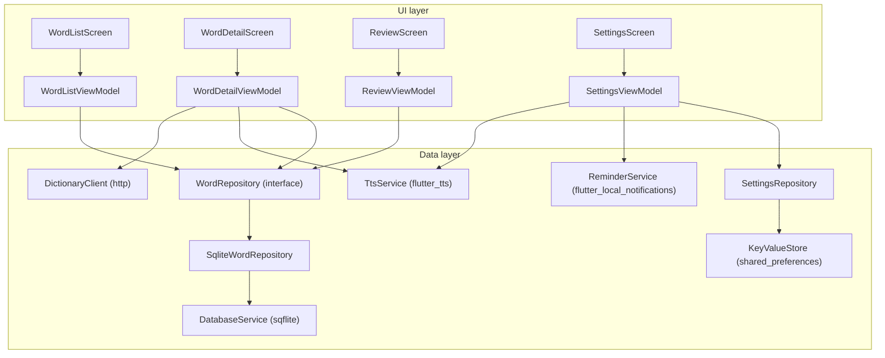

# Chương 8 — App mẫu Tập 2: "Sổ Từ Vựng" (bản tập dượt cho app TOEIC)

## Mục tiêu

- Ghép mọi thứ của Tập 2 thành một app offline-first theo **kiến trúc chính thức**: data layer (service + repository),
  UI layer (View + ViewModel), DI bằng provider, điều hướng bằng go_router, Command + Result.
- Có đúng các tính năng app TOEIC (Task 9) cần: **SQLite offline**, **tìm có/không dấu**, **đọc to (TTS)**,
  **nhắc ôn hằng ngày (local notification)**, **ôn tập bằng thẻ lật**, **dark mode lưu bền**, test đầy đủ.
- Biết cấu trúc thư mục để Task 9 sao chép.

## Giải thích đơn giản



Luồng dữ liệu **một chiều** (docs: "Use unidirectional data flow"): View gọi hàm của ViewModel → ViewModel gọi
repository/service → cập nhật state → `notifyListeners()` → View build lại.

## Ví dụ

### Cấu trúc thư mục (theo gợi ý đặt tên của docs: `ui/core`, `data/repositories`, `data/services`)

```text
examples/lib/
  main.dart                     tạo DatabaseService + bản thật của mọi service → runApp(VocabApp)
  app.dart                      MultiProvider + MaterialApp.router (themeMode từ SettingsViewModel)
  config/
    dependencies.dart           AppDependencies: danh sách provider (thật hoặc giả)
    router.dart                 go_router: /words, /words/:id, /review, /lab, /settings (4 tab)
  domain/
    models/word.dart            Word, ReviewStats (bất biến)
    word_of_the_day.dart        hàm thuần (bài tập)
  data/
    services/                   database_service, seed_words, key_value_store, tts_service,
                                reminder_service, dictionary_client, db_factory_stub/web
    repositories/               word_repository (interface), sqlite_word_repository, settings_repository
  ui/
    core/                       theme, home_shell, flip_card, error_view, debouncer
    word_list/  word_detail/  review/  settings/     mỗi thư mục: *_screen.dart + *_viewmodel.dart
  utils/                        result.dart, command.dart (mẫu chính thức, BSD), vietnamese.dart
  chapters/ch01..ch06/          ví dụ + lời giải từng chương
  lab/                          tab Lab
examples/test/
  fakes/fakes.dart              FakeWordRepository, FakeTts, FakeReminderService
  data/                         SQLite thật (FFI), settings, reminder, HTTP (MockClient)
  ui/viewmodels_test.dart       ViewModel + mocktail
  app_test.dart                 widget test toàn app
  chapters/                     test từng chương
examples/integration_test/      app thật (chạy trên thiết bị hoặc Chrome)
examples/web/sqlite3.wasm, web/sqflite_sw.js     SQLite cho bản web
```

### Điểm vào và DI

```dart
Future<void> main() async {
  // Bắt buộc trước khi gọi plugin (sqflite, shared_preferences…) trước runApp.
  WidgetsFlutterBinding.ensureInitialized();
  configureDatabaseFactory();
  final database = await DatabaseService.open();
  runApp(
    VocabApp(
      dependencies: AppDependencies(
        words: SqliteWordRepository(database),
        settings: SettingsRepository(SharedPreferencesStore()),
        tts: FlutterTtsService(),
        reminders: LocalNotificationReminderService(),
        dictionary: DictionaryClient(),
      ),
    ),
  );
}
```

```dart
List<SingleChildWidget> get providers => [
  Provider<WordRepository>.value(value: words),
  Provider<SettingsRepository>.value(value: settings),
  Provider<TtsService>.value(value: tts),
  Provider<ReminderService>.value(value: reminders),
  Provider<DictionaryClient>.value(value: dictionary),
  ChangeNotifierProvider<SettingsViewModel>(
    create: (_) => SettingsViewModel(settings: settings, reminders: reminders, tts: tts)..load(),
  ),
];
```

Provider được khai báo theo **interface** (`WordRepository`, `TtsService`) để test thay bản giả.

### Command trong ViewModel

`WordDetailViewModel` có 4 Command: `load`, `toggleFavorite`, `speak`, `lookup`. View lắng nghe chúng để khóa nút
khi đang chạy và hiện lỗi:

```dart
OutlinedButton.icon(
  onPressed: vm.toggleFavorite.running ? null : vm.toggleFavorite.execute,
  icon: Icon(word.favorite ? Icons.star : Icons.star_border),
  label: Text(word.favorite ? 'Bỏ yêu thích' : 'Yêu thích'),
),
```

### Chạy

```bash
cd books/flutter/vol2-trung-cap/examples
flutter pub get
flutter run -d chrome                   # web (SQLite chạy bằng WebAssembly)
flutter run                             # iPhone qua Mac + Xcode
flutter test                            # 51 test
bash ../../scripts/integration-web.sh vol2-trung-cap   # integration test trên Chrome headless (cần chromedriver)
```

Nếu đổi phiên bản `sqflite_common_ffi_web`, chạy lại `dart run sqflite_common_ffi_web:setup` để tạo lại
`web/sqlite3.wasm` + `web/sqflite_sw.js`, và ghim `sqlite3` cùng phiên bản với file wasm.

### Kết quả kiểm tra thật (2026-09-30)

`bash books/flutter/scripts/check-all.sh vol2-trung-cap` ([../logs/check-all.txt](../logs/check-all.txt)): format OK,
`flutter analyze` → "No issues found!", `flutter test` → **51 test pass**, `flutter build web` → "✓ Built build/web",
smoke test Chromium (390×844) thấy "Sổ Từ Vựng", "negotiate" → "WEB SMOKE OK". Integration test trên Chrome headless:
"All tests passed." ([../logs/integration-web-vol2.txt](../logs/integration-web-vol2.txt)).

**Chạy trên iPhone/Android: NOT RUN.** Đọc to, thông báo theo lịch, SQLite native chỉ kiểm chứng được trên máy thật.

## Đi sâu

### Checklist sao chép sang app TOEIC (Task 9)

1. `pubspec.yaml`: dùng đúng phiên bản trong [STACK.md](../STACK.md) mục 5 (kể cả `sqlite3: 3.6.0`).
2. Sao chép `utils/` (result, command, vietnamese), `ui/core/` (theme, flip_card, debouncer, error_view),
   `data/services/` (database, key_value_store, tts, reminder, db_factory_*), mẫu `config/dependencies.dart` + `router.dart`.
3. Mở rộng schema: bảng từ (lemma, word family, collocation…), bảng ôn tập theo SM-2 (app TOEIC đã có thuật toán SM-2
   trong bản React Native, Task 5) — dùng migration `onUpgrade` như Chương 4.
4. Tìm kiếm có/không dấu: cột `search_key` + `withoutAccents`.
5. Cấu hình native: AppDelegate (thông báo), Gradle desugaring + receiver (Android), `INTERNET`.
6. Web: `web/sqlite3.wasm` + `web/sqflite_sw.js`; build `--no-web-resources-cdn`; không `--wasm` cho iPhone.
7. Test: fake cho mọi service; SQLite thật qua `sqflite_common_ffi`; widget test toàn app qua `AppDependencies`.

### Vì sao ViewModel được tạo trong route?

`ChangeNotifierProvider(create: ...)` trong `builder` của `GoRoute`: ViewModel sống đúng bằng màn hình, tự `dispose`.
`WordDetailScreen` thêm `key: ValueKey(id)` để mở từ khác thì tạo ViewModel mới.

## Lỗi và bẫy thường gặp

- **Quên `WidgetsFlutterBinding.ensureInitialized()`** trước khi gọi plugin trong `main` → lỗi binding.
- **Khai báo provider theo lớp cụ thể** (`Provider<SqliteWordRepository>`) rồi đọc theo interface → `ProviderNotFoundException`.
- **Tạo router trong `build`** → mất trạng thái điều hướng khi đổi theme.
- **Import `sqflite_common_ffi_web` trực tiếp trong code dùng chung** → có thể hỏng build iOS/Android; dùng import có điều kiện.
- **Lệch phiên bản `sqlite3` và `sqlite3.wasm`** → lỗi mở DB trên web.

## Tóm tắt

- App mẫu = kiến trúc chính thức thu nhỏ: services → repositories → ViewModels → Views; provider + go_router.
- Offline-first với SQLite; TTS và thông báo bọc sau interface; web chạy được nhờ SQLite Wasm.
- 51 test + integration test web, analyze 0 issue, build web OK — sẵn sàng làm khung cho app TOEIC.

## Bài tập (có lời giải)

**Bài 1.** Thêm `resetProgress()` vào `WordRepository` để xóa toàn bộ lịch sử ôn (cho nút "Học lại từ đầu").

<details>
<summary>Lời giải</summary>

Interface: `Future<int> resetProgress();`. Bản SQLite:

```dart
@override
Future<int> resetProgress() => _db.delete('reviews');
```

`delete` không có `where` xóa mọi dòng và trả về số dòng đã xóa. Bản fake xóa list `reviews` và đặt lại `reviewCount`.
Test (`database_test.dart`, "Bài 1 (Ch.8)"): ôn 2 lần → `resetProgress()` trả 2 → `reviewCount` về 0. Thêm hàm vào interface
buộc **mọi** cài đặt (thật và giả) phải cập nhật — compiler nhắc nếu quên.
</details>

**Bài 2.** Viết `wordOfTheDay(words, day)`: trong cùng một ngày luôn ra cùng một từ, sang ngày khác đổi từ, không phụ thuộc
thứ tự danh sách đầu vào.

<details>
<summary>Lời giải</summary>

`examples/lib/domain/word_of_the_day.dart`:

```dart
Word? wordOfTheDay(List<Word> words, DateTime day) {
  if (words.isEmpty) return null;
  final sorted = [...words]..sort((a, b) => a.id.compareTo(b.id));
  final dayNumber = DateTime.utc(day.year, day.month, day.day).millisecondsSinceEpoch ~/ Duration.millisecondsPerDay;
  return sorted[dayNumber % sorted.length];
}
```

Không dùng `Random` → test được. Kết quả thật (`test/domain_test.dart`):

```text
00:00 +0: Word: accuracy, copyWith, ==
00:00 +1: Bài 2 (Ch.8): wordOfTheDay ổn định trong ngày, đổi theo ngày
00:00 +2: All tests passed!
```

Nối vào UI: trong `ReviewViewModel._start`, gọi `wordOfTheDay(await _repository.search(), _clock())` và hiện ở đầu màn hình Ôn tập.
</details>

## Nguồn tham khảo (Sources)

Đã mở ngày 2026-09-30 (đọc file nguồn docs ở commit `ab59c61`):

- Guide to app architecture — https://docs.flutter.dev/app-architecture/guide —
  https://github.com/flutter/website/blob/ab59c614e780e2d6d44f07ae4a96238028f581a5/sites/docs/src/content/app-architecture/guide.md
- Architecture recommendations — https://docs.flutter.dev/app-architecture/recommendations —
  https://github.com/flutter/website/blob/ab59c614e780e2d6d44f07ae4a96238028f581a5/sites/docs/src/content/app-architecture/recommendations.md
- Case study — Dependency injection — https://docs.flutter.dev/app-architecture/case-study/dependency-injection —
  https://github.com/flutter/website/blob/ab59c614e780e2d6d44f07ae4a96238028f581a5/sites/docs/src/content/app-architecture/case-study/dependency-injection.md
- Design pattern: Command — https://docs.flutter.dev/app-architecture/design-patterns/command —
  https://github.com/flutter/website/blob/ab59c614e780e2d6d44f07ae4a96238028f581a5/sites/docs/src/content/app-architecture/design-patterns/command.md
- Mã nguồn mẫu Command (BSD): https://github.com/flutter/website/blob/ab59c614e780e2d6d44f07ae4a96238028f581a5/examples/app-architecture/command/lib/command.dart
- Design pattern: Offline-first — https://docs.flutter.dev/app-architecture/design-patterns/offline-first —
  https://github.com/flutter/website/blob/ab59c614e780e2d6d44f07ae4a96238028f581a5/sites/docs/src/content/app-architecture/design-patterns/offline-first.md
- App TOEIC (React Native, Task 5) trong repo: [apps/toeic/README.md](../../../apps/toeic/README.md)
