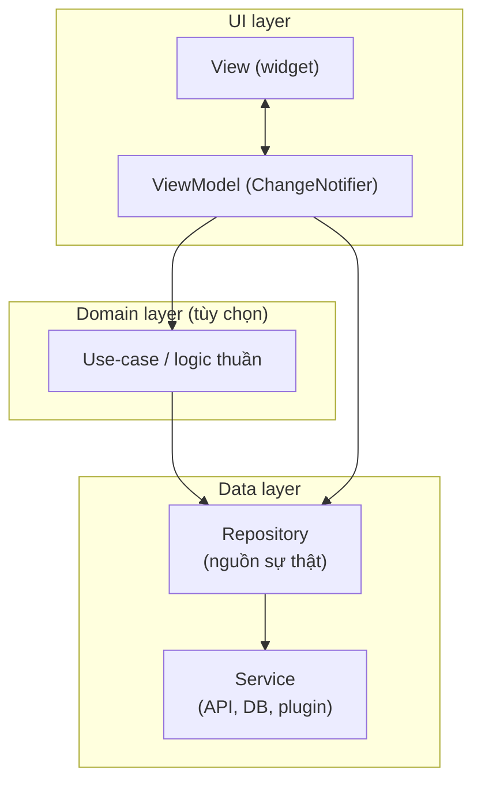

# Chương 1 — Kiến trúc: feature-first, các tầng, và luật phụ thuộc

## Mục tiêu

- Nắm kiến trúc chính thức của Flutter: **UI layer** (View + ViewModel), **data layer** (Repository + Service),
  **domain layer** (tùy chọn), luồng dữ liệu một chiều, DI.
- So sánh hai cách xếp thư mục: **theo loại (by type)** và **theo tính năng (feature-first)** — và cách **kết hợp** mà docs khuyên.
- Viết **test kiến trúc**: kiểm tra luật phụ thuộc bằng code.
- Biết khi nào cần domain layer / use-case.

## Giải thích đơn giản

Docs "Guide to app architecture" chia app thành các tầng:



- **View**: chỉ hiển thị và chuyển sự kiện; logic duy nhất được phép là `if` đơn giản, animation, layout theo kích thước, điều hướng đơn giản.
- **ViewModel**: giữ state của màn hình, gọi repository, biến dữ liệu thành thứ View cần.
- **Repository**: nguồn sự thật cho một loại dữ liệu; cache, retry, kết hợp nhiều nguồn.
- **Service**: bọc một nguồn bên ngoài (HTTP, SQLite, Keychain, plugin); không có state.
- **Domain / use-case**: docs nói **chỉ cần** khi logic phức tạp hoặc lặp lại giữa nhiều ViewModel.

Với Angular dev: View ≈ component template, ViewModel ≈ component class + facade service, Repository ≈ data service,
Service ≈ `HttpClient` wrapper.

### Xếp thư mục: theo loại hay theo tính năng?

| Cách | Ví dụ | Ưu | Nhược |
|---|---|---|---|
| Theo loại (by type) | `repositories/`, `viewmodels/`, `screens/` | Dễ tìm "mọi repository" | Một tính năng nằm rải rác nhiều thư mục |
| **Feature-first** | `features/auth/{data,domain,ui}`, `features/notes/...` | Một tính năng ở một chỗ; dễ xóa/giao cho người khác | Dữ liệu dùng chung giữa tính năng bị "kẹt" trong một feature |
| **Kết hợp (docs khuyên)** | `ui/<feature>/`, `data/repositories/`, `data/services/`, `domain/models/` | UI theo tính năng (mỗi màn một View + một ViewModel); data theo loại (dùng chung) | — |

Docs (case study Compass app, phần "Package structure"): kiến trúc được khuyên **kết hợp cả hai** — data layer theo loại
vì repository/service dùng chung nhiều tính năng; UI layer theo tính năng.

**Trong bộ sách:**
- App Tập 2 "Sổ Từ Vựng" dùng **đúng cấu trúc kết hợp của docs** → **app TOEIC (Task 9) theo cấu trúc này.**
- App Tập 3 "Sổ Ghi Chú Bảo Mật" dùng **feature-first thuần** (đề bài yêu cầu) để bạn thấy cách còn lại, kèm test luật phụ thuộc.

## Ví dụ

### Cấu trúc feature-first của app Tập 3

```text
examples/lib/
  main.dart  app.dart  router.dart
  core/                       dùng chung, KHÔNG phụ thuộc feature nào
    result.dart command.dart  (mẫu chính thức, BSD)
    logging/                  app_logger, error_handlers, redact
    platform/battery_channel.dart
    security/secure_store.dart
    ui/theme.dart
  features/
    auth/
      domain/pin_hasher.dart          logic thuần: băm PIN, khóa tạm, PIN yếu, tự khóa
      data/pin_repository.dart        lưu muối + hash trong SecureStore
      ui/auth_controller.dart         ChangeNotifier: needsSetup / locked / unlocked
      ui/lock_screen.dart
    notes/
      domain/note.dart
      data/note_repository.dart       interface + SecureNoteRepository
      ui/notes_viewmodel.dart         NotesViewModel, NoteEditorViewModel (Command)
      ui/notes_list_screen.dart  ui/note_editor_screen.dart
    settings/ui/settings_screen.dart
```

### Luật phụ thuộc — kiểm tra bằng test

`examples/lib/chapters/ch01/dependency_rules.dart`:

```dart
List<String> checkDependencyRules(Map<String, String> sources) {
  final violations = <String>[];
  final importRe = RegExp(r'''^import\s+['"]([^'"]+)['"]''', multiLine: true);
  for (final MapEntry(key: path, value: code) in sources.entries) {
    final parts = path.split('/');
    if (parts.length < 3 || parts[0] != 'features') continue;
    final feature = parts[1];
    final layer = parts[2];
    for (final m in importRe.allMatches(code)) {
      final target = m.group(1)!;
      final isUiImport =
          target == 'package:flutter/material.dart' ||
          target == 'package:flutter/widgets.dart' ||
          target.contains('/ui/') ||
          target.startsWith('../ui/');
      if ((layer == 'data' || layer == 'domain') && isUiImport) {
        violations.add('$path: tầng $layer không được import UI ($target)');
      }
      final other =
          RegExp(r'features/(\w+)/data/').firstMatch(target) ?? RegExp(r'\.\./\.\./(\w+)/data/').firstMatch(target);
      if (other != null && other.group(1) != feature) {
        violations.add('$path: feature "$feature" import data của feature "${other.group(1)}" ($target)');
      }
    }
  }
  return violations;
}
```

Test đọc **toàn bộ** `lib/` thật và yêu cầu không có vi phạm:

```dart
test('mã thật của app không vi phạm', () {
  final lib = Directory('lib');
  final sources = {
    for (final f in lib.listSync(recursive: true).whereType<File>().where((f) => f.path.endsWith('.dart')))
      f.path.substring(lib.path.length + 1).replaceAll(r'\', '/'): f.readAsStringSync(),
  };
  expect(sources.keys, contains('features/auth/data/pin_repository.dart'));
  expect(checkDependencyRules(sources), isEmpty);
});
```

Kết quả thật (2026-09-30, `flutter test --reporter expanded test/chapters_test.dart`, phần Ch.1):

```text
00:00 +0: Ch.1 — luật phụ thuộc (feature-first) phát hiện vi phạm trong mã giả
00:00 +1: Ch.1 — luật phụ thuộc (feature-first) Bài 1: core không được import features
00:00 +2: Ch.1 — luật phụ thuộc (feature-first) mã thật của app không vi phạm
```

Khi đang viết app, sách định đặt hàm `isWeakPin` trong `chapters/` và gọi từ `features/auth/ui` — điều đó làm feature phụ
thuộc vào code ví dụ. Sách chuyển hàm vào `features/auth/domain/pin_hasher.dart`; file lời giải trong `chapters/` chỉ
`export` lại. Tương tự, `redact` chuyển vào `core/logging/` vì logger (ở `core`) cần nó.

### DI ở gốc app

```dart
MultiProvider(
  providers: [
    Provider<NoteRepository>.value(value: dependencies.notes),
    Provider<BatteryChannel>.value(value: dependencies.battery),
    ChangeNotifierProvider<AppLogger>.value(value: dependencies.logger),
    ChangeNotifierProvider<AuthController>(
      create: (_) => AuthController(pins: dependencies.pins, logger: dependencies.logger)..init(),
    ),
  ],
  child: const _AppView(),
);
```

`AuthController` là **state toàn app** (docs gọi là "app-wide session state" — quản lý ở repository/controller dùng chung);
router đọc nó để chặn màn hình khi chưa mở khóa (Chương 4).

## Đi sâu

### Command và Result

Docs khuyên dùng **Command** cho sự kiện người dùng (tránh bấm nhiều lần, có trạng thái running/error) và **Result** cho
kết quả có thể lỗi. App Tập 2–3 dùng cả hai (`core/command.dart`, `core/result.dart`). View:
`onPressed: vm.save.running ? null : () => _save(vm)`, và `switch (vm.save.result) { Ok() => ..., Error(:final error) => ... }`.

### Khi nào thêm domain layer?

Khi cùng một logic xuất hiện ở nhiều ViewModel, hoặc ViewModel bị "phình". App Tập 3 có `auth/domain/pin_hasher.dart`
vì logic băm PIN, khóa tạm, tự khóa là **thuần** (không I/O) và cần test kỹ. Docs cảnh báo: với đa số app, use-case cho
**mọi** thao tác chỉ thêm code thừa.

### Model API vs model domain

Docs gợi ý tách model API (đúng JSON server) và model domain (đúng thứ UI cần) cho **app lớn**. App của sách nhỏ nên dùng
một model.

### Nhiều môi trường (flavor)

Case study có `main_development.dart`, `main_staging.dart`: mỗi file tạo bộ phụ thuộc khác nhau (repository giả / thật).
`AppDependencies` của sách cho phép đúng điều đó (Chương 5, 6).

## Lỗi và bẫy thường gặp

- **Logic trong widget** (gọi repository trong `onPressed`, tính toán trong `build`) → khó test. Đưa vào ViewModel.
- **Feature import data của feature khác** → vòng phụ thuộc; đưa phần dùng chung lên `core/` (hoặc theo cấu trúc kết hợp: `data/`).
- **ViewModel import `package:flutter/material.dart` để hiện SnackBar** → trộn tầng; ViewModel đặt `message`, View hiển thị.
- **Tạo use-case cho mọi thứ** → code thừa.
- **Không có test kiến trúc** → luật bị phá dần theo thời gian.

## Tóm tắt

- Tầng: View ↔ ViewModel → (Use-case) → Repository → Service. Dữ liệu một chiều, DI bằng provider.
- Docs khuyên kết hợp: UI theo tính năng, data theo loại (app Tập 2, **và app TOEIC**). Feature-first thuần: app Tập 3.
- Kiểm tra luật phụ thuộc bằng test đọc mã nguồn.

## Bài tập (có lời giải)

**Bài 1.** Thêm vào `checkDependencyRules` luật thứ 3: file trong `core/` **không** được import `features/`. Viết test.

<details>
<summary>Lời giải</summary>

Trong `dependency_rules.dart`, xử lý file `core/` trước khi kiểm tra `features/`:

```dart
final parts = path.split('/');
if (parts.first == 'core') {
  for (final m in importRe.allMatches(code)) {
    if (m.group(1)!.contains('features/')) violations.add('$path: core không được import features (${m.group(1)})');
  }
  continue;
}
```

Test "Bài 1: core không được import features": `{'core/x.dart': "import '../features/auth/data/pin_repository.dart';"}`
→ 1 vi phạm. Test "mã thật của app không vi phạm" vẫn pass với luật mới — `core/` chỉ import `core/` và package.
</details>

**Bài 2.** App TOEIC có các màn: Từ vựng, Thẻ ôn, Đọc hiểu, Hội thoại, Tiến độ, Cài đặt; dữ liệu: từ vựng, lịch sử ôn (SM-2),
bài đọc, cài đặt. Hãy vẽ cây thư mục theo cấu trúc **kết hợp** của docs.

<details>
<summary>Lời giải</summary>

```text
lib/
  main.dart  app.dart
  config/dependencies.dart  config/router.dart
  domain/models/            word.dart, review_card.dart, passage.dart, dialog.dart
  data/services/            database_service.dart, tts_service.dart, reminder_service.dart, key_value_store.dart
  data/repositories/        word_repository.dart (+ sqlite_...), review_repository.dart (SM-2), passage_repository.dart,
                            settings_repository.dart
  ui/core/                  theme.dart, flip_card.dart, error_view.dart, word_popup.dart (chạm từ → popup)
  ui/words/  ui/review/  ui/reading/  ui/dialogs/  ui/progress/  ui/settings/   mỗi thư mục: *_screen.dart + *_viewmodel.dart
  utils/                    result.dart, command.dart, vietnamese.dart
test/  data/ ui/ domain/ fakes/
```

Repository dùng chung (ví dụ `WordRepository` dùng ở Từ vựng, Đọc hiểu, Thẻ ôn) nằm ở `data/`, không nằm trong một feature —
đúng lý do docs chọn cấu trúc kết hợp.
</details>

## Nguồn tham khảo (Sources)

Đã mở ngày 2026-09-30 (đọc file nguồn docs ở commit `ab59c61`):

- Guide to app architecture — https://docs.flutter.dev/app-architecture/guide —
  https://github.com/flutter/website/blob/ab59c614e780e2d6d44f07ae4a96238028f581a5/sites/docs/src/content/app-architecture/guide.md
- Common architecture concepts — https://docs.flutter.dev/app-architecture/concepts —
  https://github.com/flutter/website/blob/ab59c614e780e2d6d44f07ae4a96238028f581a5/sites/docs/src/content/app-architecture/concepts.md
- Case study (package structure) — https://docs.flutter.dev/app-architecture/case-study —
  https://github.com/flutter/website/blob/ab59c614e780e2d6d44f07ae4a96238028f581a5/sites/docs/src/content/app-architecture/case-study/index.md
- Architecture recommendations — https://docs.flutter.dev/app-architecture/recommendations —
  https://github.com/flutter/website/blob/ab59c614e780e2d6d44f07ae4a96238028f581a5/sites/docs/src/content/app-architecture/recommendations.md
- Design patterns (Command, Result) — https://docs.flutter.dev/app-architecture/design-patterns —
  https://github.com/flutter/website/blob/ab59c614e780e2d6d44f07ae4a96238028f581a5/sites/docs/src/content/app-architecture/design-patterns.md
- Compass app (mẫu chính thức): https://github.com/flutter/samples
