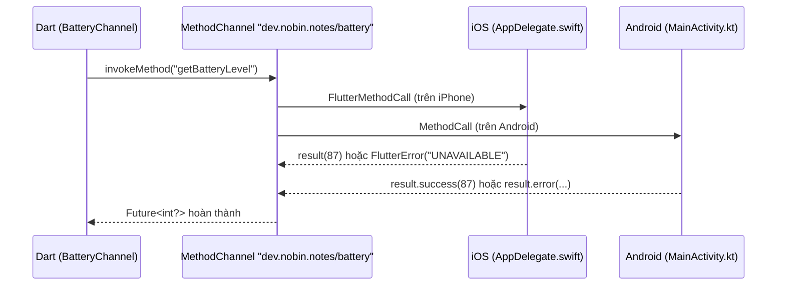

# Chương 3 — Platform channels và plugin: gọi Swift/Kotlin từ Dart

## Mục tiêu

- Hiểu **platform channel**: Dart gửi thông điệp bất đồng bộ tới code native (Swift trên iOS, Kotlin trên Android) và nhận kết quả.
- Viết một **MethodChannel** hoàn chỉnh (theo ví dụ "battery" của docs): Dart + Swift + Kotlin.
- Xử lý lỗi: `PlatformException`, `MissingPluginException` (web / chưa có code native).
- **Test** phía Dart bằng `setMockMethodCallHandler` — không cần thiết bị.
- Biết khi nào dùng `EventChannel`, **Pigeon**, và khi nào tách thành **plugin** riêng; biết Swift Package Manager.

## Giải thích đơn giản

Docs "Writing custom platform-specific code": phần Flutter (client) gửi thông điệp qua một **kênh có tên**; phần native
(host) lắng nghe kênh đó, gọi API của hệ điều hành, rồi trả lời. Thông điệp và trả lời đi **bất đồng bộ** để UI không bị chặn.



| React Native (sách RN, Tập 3) | Flutter |
|---|---|
| TurboModule / Expo Modules API | MethodChannel / Pigeon / plugin |
| Codegen từ TypeScript spec | **Pigeon** sinh code từ Dart |
| Cần development build (không chạy trong Expo Go) | Chạy ngay khi `flutter run` build lại app |

## Ví dụ

### Phía Dart — `examples/lib/core/platform/battery_channel.dart`

```dart
class BatteryChannel {
  const BatteryChannel([this._channel = const MethodChannel(channelName)]);

  static const channelName = 'dev.nobin.notes/battery';
  final MethodChannel _channel;

  /// Phần trăm pin, hoặc `null` nếu nền tảng không hỗ trợ (web, máy ảo không có pin…).
  Future<int?> batteryLevel() async {
    try {
      return await _channel.invokeMethod<int>('getBatteryLevel');
    } on PlatformException {
      return null; // native báo lỗi, ví dụ UNAVAILABLE
    } on MissingPluginException {
      return null; // không có code native cho kênh này (web, test)
    }
  }
}
```

Tên kênh nên có tiền tố duy nhất (domain ngược) để không trùng plugin khác.

### Phía iOS — `examples/ios/Runner/AppDelegate.swift`

```swift
@main
@objc class AppDelegate: FlutterAppDelegate, FlutterImplicitEngineDelegate {
  // Theo docs: tạo kênh trong didInitializeImplicitFlutterEngine
  // (app dùng UIScene lifecycle, window có thể nil trong didFinishLaunching).
  func didInitializeImplicitFlutterEngine(_ engineBridge: FlutterImplicitEngineBridge) {
    GeneratedPluginRegistrant.register(with: engineBridge.pluginRegistry)

    let channel = FlutterMethodChannel(
      name: "dev.nobin.notes/battery",
      binaryMessenger: engineBridge.applicationRegistrar.messenger()
    )
    channel.setMethodCallHandler { [weak self] (call: FlutterMethodCall, result: @escaping FlutterResult) in
      switch call.method {
      case "getBatteryLevel":
        self?.receiveBatteryLevel(result: result)
      case "isLowPowerMode":
        result(ProcessInfo.processInfo.isLowPowerModeEnabled)
      default:
        result(FlutterMethodNotImplemented)
      }
    }
  }

  private func receiveBatteryLevel(result: FlutterResult) {
    let device = UIDevice.current
    device.isBatteryMonitoringEnabled = true
    if device.batteryState == UIDevice.BatteryState.unknown {
      result(FlutterError(code: "UNAVAILABLE", message: "Battery level not available.", details: nil))
    } else {
      result(Int(device.batteryLevel * 100))
    }
  }
}
```

Docs ghi chú: từ Flutter 3.41, app mặc định dùng vòng đời `UISceneDelegate`, nên `window` có thể là `nil` trong
`application(_:didFinishLaunchingWithOptions:)` — tạo kênh trong `didInitializeImplicitFlutterEngine` để tránh crash.
Template `flutter create` của Flutter 3.47.5 đã sinh sẵn protocol `FlutterImplicitEngineDelegate`.

### Phía Android — `examples/android/app/src/main/kotlin/dev/nobin/tap3_so_ghi_chu/MainActivity.kt`

```kotlin
class MainActivity : FlutterActivity() {
    private val channelName = "dev.nobin.notes/battery"

    override fun configureFlutterEngine(flutterEngine: FlutterEngine) {
        super.configureFlutterEngine(flutterEngine)
        MethodChannel(flutterEngine.dartExecutor.binaryMessenger, channelName).setMethodCallHandler { call, result ->
            when (call.method) {
                "getBatteryLevel" -> {
                    val level = getBatteryLevel()
                    if (level != -1) result.success(level)
                    else result.error("UNAVAILABLE", "Battery level not available.", null)
                }
                "isLowPowerMode" -> {
                    val pm = getSystemService(Context.POWER_SERVICE) as PowerManager
                    result.success(pm.isPowerSaveMode)
                }
                else -> result.notImplemented()
            }
        }
    }

    private fun getBatteryLevel(): Int {
        val batteryManager = getSystemService(Context.BATTERY_SERVICE) as BatteryManager
        return batteryManager.getIntProperty(BatteryManager.BATTERY_PROPERTY_CAPACITY)
    }
}
```

**Biên dịch và chạy code Swift/Kotlin này: NOT RUN** (không có Xcode / Android SDK trong sandbox). Code theo sát mẫu của docs.

### Test phía Dart — giả lập native

```dart
const channel = MethodChannel(BatteryChannel.channelName);
final messenger = TestDefaultBinaryMessengerBinding.instance.defaultBinaryMessenger;
tearDown(() => messenger.setMockMethodCallHandler(channel, null));

test('getBatteryLevel trả 87', () async {
  final calls = <String>[];
  messenger.setMockMethodCallHandler(channel, (call) async {
    calls.add(call.method);
    return call.method == 'getBatteryLevel' ? 87 : null;
  });
  expect(await const BatteryChannel().batteryLevel(), 87);
  expect(calls, ['getBatteryLevel']);
});

test('native báo lỗi UNAVAILABLE → null', () async {
  messenger.setMockMethodCallHandler(channel, (call) async => throw PlatformException(code: 'UNAVAILABLE'));
  expect(await const BatteryChannel().batteryLevel(), isNull);
});
```

Kết quả thật (2026-09-30, `flutter test --reporter expanded test/platform_channel_test.dart`):

```text
00:00 +0: getBatteryLevel trả 87
00:00 +1: native báo lỗi UNAVAILABLE → null
00:00 +2: không có code native (web, chưa đăng ký) → null
00:00 +3: Bài tập: isLowPowerMode
00:00 +4: All tests passed!
```

Trên **web**, kênh không có code native → `MissingPluginException` → màn hình Cài đặt hiện "Không hỗ trợ trên nền tảng này"
(bản build web đã chạy trong Chromium headless, xem `logs/`).

## Đi sâu

### Bẫy thật: kênh chưa mock trong widget test có thể treo

Khi viết `app_test.dart`, sách thấy trong `testWidgets` lời gọi tới kênh **chưa được mock** không bao giờ hoàn thành
(`pump`, `pumpAndSettle`, `runAsync` đều không giúp) — trong khi ở `test()` thường thì nó ném `MissingPluginException` ngay.
Cách làm chắc chắn: **luôn mock** mọi kênh mà widget test chạm tới:

```dart
messenger.setMockMethodCallHandler(channel, (call) async => throw MissingPluginException());
addTearDown(() => messenger.setMockMethodCallHandler(channel, null));
```

### Kiểu dữ liệu đi qua kênh

`StandardMessageCodec` hỗ trợ: `null`, `bool`, `int`, `double`, `String`, `Uint8List`…, `List`, `Map`. Muốn gửi object →
chuyển thành `Map`. Dễ sai tên khóa, sai kiểu → dùng **Pigeon**.

### Pigeon — kênh có kiểu (type-safe)

Pigeon (package của team Flutter) đọc một file Dart mô tả API và **sinh code** Dart + Swift + Kotlin khớp nhau — không còn
chuỗi tên hàm "gõ tay". Docs khuyên dùng khi API native có nhiều hàm. Sách chỉ giới thiệu (chưa thêm vào dự án).

### EventChannel — luồng sự kiện từ native

Khi native cần **đẩy** dữ liệu liên tục (cảm biến, trạng thái pin thay đổi), dùng `EventChannel` → phía Dart nhận một `Stream`.

### Khi nào tách thành plugin?

Code native dùng lại ở nhiều app → tạo **plugin package** (`flutter create --template=plugin`), có `ios/`, `android/`, `web/`
riêng. Từ Flutter 3.44, plugin iOS nên hỗ trợ **Swift Package Manager** (docs `swift-package-manager/for-plugin-authors`);
Flutter vẫn dùng CocoaPods cho plugin chưa có SwiftPM, nhưng registry CocoaPods sẽ chỉ-đọc từ 2026-12-02.

### Luồng (thread)

Handler phía native chạy trên **main thread**. Việc nặng (đọc file lớn) → chuyển sang luồng nền trong Swift/Kotlin rồi gọi
`result` (docs có mục riêng về threading của platform channel).

## Lỗi và bẫy thường gặp

- **Sai tên kênh / tên hàm** giữa Dart và native → `MissingPluginException` / `notImplemented`.
- **Tạo kênh iOS trong `didFinishLaunching`** với UIScene → crash vì `window` nil (docs).
- **Quên xử lý `MissingPluginException`** → crash trên web.
- **Gọi `result` hai lần** (hoặc không gọi) ở native → lỗi / Future treo.
- **Widget test chạm kênh chưa mock** → treo (xem trên).
- **Hot reload sau khi sửa Swift/Kotlin** → không áp dụng; phải build lại.

## Tóm tắt

- MethodChannel: Dart `invokeMethod` ↔ native `setMethodCallHandler`; bất đồng bộ; lỗi qua `PlatformException`.
- iOS: tạo kênh trong `didInitializeImplicitFlutterEngine`; Android: trong `configureFlutterEngine`.
- Test phía Dart bằng `setMockMethodCallHandler`. API lớn → Pigeon. Dùng lại → plugin (hỗ trợ SwiftPM).

## Bài tập (có lời giải)

**Bài 1.** Thêm hàm `lowPowerMode()` (iOS: Low Power Mode, Android: Battery Saver) vào `BatteryChannel` và test phía Dart.

<details>
<summary>Lời giải</summary>

Dart:

```dart
Future<bool?> lowPowerMode() async {
  try {
    return await _channel.invokeMethod<bool>('isLowPowerMode');
  } on PlatformException {
    return null;
  } on MissingPluginException {
    return null;
  }
}
```

Native: Swift `case "isLowPowerMode": result(ProcessInfo.processInfo.isLowPowerModeEnabled)`; Kotlin
`"isLowPowerMode" -> result.success((getSystemService(Context.POWER_SERVICE) as PowerManager).isPowerSaveMode)` (đã có trong
hai file ở trên). Test: mock trả `true` cho `isLowPowerMode` → `lowPowerMode()` là `true` (test "Bài tập: isLowPowerMode" pass).
Phía native: NOT RUN.
</details>

**Bài 2.** Vì sao `BatteryChannel` nhận `MethodChannel` qua constructor (có giá trị mặc định), và vì sao nó được cung cấp qua provider?

<details>
<summary>Lời giải</summary>

(1) Có thể truyền kênh khác (tên khác cho flavor, hoặc một kênh giả) mà không sửa class. (2) Qua provider, màn hình Cài đặt và
Lab lấy `context.read<BatteryChannel>()` — test có thể thay bằng lớp giả `implements BatteryChannel` nếu muốn, hoặc giữ lớp
thật và mock ở tầng messenger (cách sách dùng). Đây vẫn là tinh thần "DI + fake" của docs kiến trúc, áp dụng cho code native.
</details>

## Nguồn tham khảo (Sources)

Đã mở ngày 2026-09-30 (đọc file nguồn docs ở commit `ab59c61`):

- Writing custom platform-specific code — https://docs.flutter.dev/platform-integration/platform-channels —
  https://github.com/flutter/website/blob/ab59c614e780e2d6d44f07ae4a96238028f581a5/sites/docs/src/content/platform-integration/platform-channels.md
- Developing packages & plugins — https://docs.flutter.dev/packages-and-plugins/developing-packages —
  https://github.com/flutter/website/blob/ab59c614e780e2d6d44f07ae4a96238028f581a5/sites/docs/src/content/packages-and-plugins/developing-packages.md
- Swift Package Manager for plugin authors — https://docs.flutter.dev/packages-and-plugins/swift-package-manager/for-plugin-authors —
  https://github.com/flutter/website/blob/ab59c614e780e2d6d44f07ae4a96238028f581a5/sites/docs/src/content/packages-and-plugins/swift-package-manager/for-plugin-authors.md
- Mock platform channels in tests (breaking change note) — https://docs.flutter.dev/release/breaking-changes/mock-platform-channels —
  https://github.com/flutter/website/blob/ab59c614e780e2d6d44f07ae4a96238028f581a5/sites/docs/src/content/release/breaking-changes/mock-platform-channels.md
- Package pigeon (29.0.4, kiểm tra 2026-09-30): https://pub.dev/packages/pigeon
- Sách React Native trong repo: [Tập 3, Chương 2 — Native modules](../../react-native/vol3-nang-cao/02-native-modules-expo-modules-api.md)
