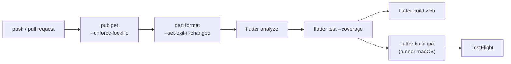

# Chương 5 — CI/CD: tự động kiểm tra, build và giao app

## Mục tiêu

- Hiểu CI (tích hợp liên tục) và CD (giao liên tục) cho app Flutter.
- Viết workflow **GitHub Actions**: pub get → format → analyze → test (coverage) → build web; build iOS + TestFlight trên runner macOS.
- Biết các lựa chọn docs liệt kê: **Codemagic**, **Bitrise** (có sẵn Flutter), và **fastlane** kết hợp CI có sẵn.
- Quản lý version/build number tự động, và giữ bí mật (chứng chỉ, khóa API) trong **secrets**.

## Giải thích đơn giản

Mỗi lần đẩy code, máy CI chạy đúng những lệnh bạn chạy tay — nhờ đó lỗi được bắt **trước** khi tới người dùng. Với Flutter:



Docs "Continuous delivery with Flutter" chia hai hướng: (1) dịch vụ **all-in-one** có sẵn Flutter: Codemagic, Bitrise;
(2) dùng **fastlane** cùng hệ thống CI có sẵn (GitHub Actions, GitLab, CircleCI…). **Build iOS luôn cần macOS** — GitHub Actions
có runner `macos-latest`, nên Nobin không cần tự mua Mac chỉ để **build** (vẫn cần tài khoản Apple Developer để ký và phát hành).

Sách giữ `scripts/check-all.sh` làm "CI chạy tay" cho cả 3 tập — cùng các bước như workflow.

## Ví dụ

### Workflow kiểm tra — `vol3-nang-cao/ci/flutter-ci.yml` (file mẫu)

```yaml
name: flutter-ci

on:
  push:
    branches: [main]
  pull_request:

jobs:
  check:
    runs-on: ubuntu-latest
    defaults:
      run:
        working-directory: books/flutter/vol3-nang-cao/examples
    steps:
      - uses: actions/checkout@v7
      - uses: subosito/flutter-action@v2
        with:
          channel: stable
          flutter-version: 3.47.5   # ghim đúng bản của sách (STACK.md)
          cache: true
      - run: flutter pub get --enforce-lockfile
      - run: dart format --output=none --set-exit-if-changed lib test
      - run: flutter analyze
      - run: flutter test --coverage
      - run: flutter build web --release --no-web-resources-cdn
      - uses: actions/upload-artifact@v7
        with:
          name: web-build
          path: books/flutter/vol3-nang-cao/examples/build/web
```

- `subosito/flutter-action` (MIT, tag mới nhất v2.23.0 kiểm tra bằng `git ls-remote` 2026-09-30) cài Flutter đúng phiên bản.
  `actions/checkout` và `actions/upload-artifact`: tag mới nhất v7.0.1.
- `--enforce-lockfile`: thất bại nếu `pubspec.lock` không khớp — CI build **đúng** phiên bản đã khóa.
- File này là **mẫu**, không đặt trong `.github/workflows/` của repo (ngoài phạm vi thư mục của sách). YAML được kiểm tra cú
  pháp trong `check-all.sh` ("yaml OK: 2 file"). **Chạy thật trên GitHub Actions: NOT RUN.**

### Workflow iOS → TestFlight — `ci/ios-testflight.yml` (mẫu, NOT RUN)

```yaml
jobs:
  ios:
    runs-on: macos-latest
    steps:
      - uses: actions/checkout@v7
      - uses: subosito/flutter-action@v2
        with:
          channel: stable
          flutter-version: 3.47.5
      - run: flutter pub get --enforce-lockfile
      - run: flutter test
      - name: Build IPA
        run: >
          flutter build ipa --release
          --build-number=${{ github.run_number }}
          --obfuscate --split-debug-info=build/symbols
          --export-options-plist=ios/ExportOptions.plist
      - name: Upload to TestFlight
        run: |
          mkdir -p ~/private_keys
          echo "$ASC_PRIVATE_KEY" > ~/private_keys/AuthKey_$ASC_KEY_ID.p8
          xcrun altool --upload-app --type ios -f build/ios/ipa/*.ipa --apiKey "$ASC_KEY_ID" --apiIssuer "$ASC_ISSUER_ID"
```

- `flutter build ipa`, `--build-number`, `--export-options-plist`, và lệnh `xcrun altool --upload-app --type ios -f ... --apiKey
  ... --apiIssuer ...` theo docs "Build and release an iOS app". Việc altool tìm khóa trong `~/private_keys` là **UNVERIFIED**.
- Ký app (certificate + provisioning profile) trên CI: docs gợi ý **fastlane match**; hoặc để Xcode tự ký với App Store Connect
  API key. Cần **Apple Developer Program ($99/năm)** — Chương 6.
- `flutter build ipa` **không có** trên Linux (sandbox: `flutter build -h` chỉ liệt kê aar, apk, appbundle, bundle, linux, web).

### Tăng build number tự động — `examples/lib/chapters/ch05/versioning.dart`

```dart
/// (Flutter: phần trước "+" là version name (CFBundleShortVersionString / versionName),
/// phần sau "+" là build number (CFBundleVersion / versionCode).)
String bumpBuildNumber(String version) {
  final m = RegExp(r'^(\d+\.\d+\.\d+)\+(\d+)$').firstMatch(version.trim());
  if (m == null) throw FormatException('Version không đúng dạng x.y.z+n: $version');
  return '${m.group(1)}+${int.parse(m.group(2)!) + 1}';
}
```

Docs iOS/Android: `version: 1.0.0+1` trong `pubspec.yaml` → iOS `CFBundleShortVersionString` / `CFBundleVersion`, Android
`versionName` / `versionCode`; có thể ghi đè khi build bằng `--build-name` / `--build-number`. Store yêu cầu build number
**tăng dần** cho mỗi lần tải lên — CI dùng `github.run_number` là cách đơn giản.

Kết quả thật (phần Ch.5–6 của `test/chapters_test.dart`, 2026-09-30):

```text
00:01 +7: Ch.5–6 — version bumpBuildNumber và bumpVersion
00:01 +8: Ch.5–6 — version compareVersions / needsForceUpdate
```

## Đi sâu

### Bí mật trên CI

Chứng chỉ `.p12`, provisioning profile, khóa App Store Connect `.p8`, keystore Android `.jks` + `key.properties` → lưu trong
**GitHub Secrets** (hoặc kho bí mật của dịch vụ CI), giải mã ra file tạm khi chạy, **không commit**. `.gitignore` của sách đã chặn
`*.jks`, `*.keystore`, `key.properties`.

### Cache và thời gian build

`flutter-action` có `cache: true` (cache SDK). Runner macOS đắt và chậm hơn Linux: chạy test/analyze trên Linux mỗi PR; build iOS
chỉ khi gắn tag hoặc bấm tay (`workflow_dispatch`).

### Flavor / môi trường

Dev / staging / prod khác nhau ở API URL, tên app, icon → docs "Flavors" (Android product flavors, iOS schemes) + `--flavor`,
hoặc `--dart-define=API_URL=...` cho giá trị đơn giản. Nhớ: `--dart-define` **không** phải chỗ giấu bí mật (vẫn nằm trong binary).

### Codemagic / Bitrise / Xcode Cloud

Dịch vụ có sẵn bước Flutter, ký iOS, đẩy TestFlight bằng giao diện. Giá và hạn mức miễn phí: **UNVERIFIED** (trang của các dịch vụ
bị chặn trong sandbox). Với một người học, GitHub Actions + fastlane đủ dùng.

## Lỗi và bẫy thường gặp

- **CI dùng Flutter khác máy bạn** → lỗi khó hiểu. Ghim `flutter-version`.
- **Không `--enforce-lockfile`** → CI lặng lẽ lấy phiên bản package khác.
- **Commit keystore / .p8** → lộ khóa ký; phải thu hồi và tạo lại.
- **Build number không tăng** → App Store Connect / Play Console từ chối bản tải lên.
- **Mất file `--split-debug-info`** của bản đã phát hành → không đọc được stack trace crash (Chương 7).
- **Chạy build iOS trên runner Linux** → không có `flutter build ipa`.

## Tóm tắt

- CI: pub get (lockfile) → format → analyze → test → build. Sách có `scripts/check-all.sh` và workflow mẫu `ci/*.yml`.
- iOS cần macOS: dùng runner `macos-latest`; ký bằng fastlane match hoặc API key; cần Apple Developer Program.
- Build number tăng tự động; bí mật trong CI secrets.

## Bài tập (có lời giải)

**Bài 1.** Viết `bumpVersion(version, part: 'major'|'minor'|'patch')` theo SemVer, đặt lại build number về 1.

<details>
<summary>Lời giải</summary>

`examples/lib/chapters/ch05/versioning.dart`:

```dart
String bumpVersion(String version, {required String part}) {
  final m = RegExp(r'^(\d+)\.(\d+)\.(\d+)(\+\d+)?$').firstMatch(version.trim());
  if (m == null) throw FormatException('Version không đúng dạng: $version');
  var (major, minor, patch) = (int.parse(m.group(1)!), int.parse(m.group(2)!), int.parse(m.group(3)!));
  switch (part) {
    case 'major':
      (major, minor, patch) = (major + 1, 0, 0);
    case 'minor':
      (minor, patch) = (minor + 1, 0);
    case 'patch':
      patch++;
    default:
      throw ArgumentError('part phải là major/minor/patch');
  }
  return '$major.$minor.$patch+1';
}
```

Record + pattern gán nhiều biến một lúc: `(major, minor, patch) = (major + 1, 0, 0)`. Test: `1.2.3+9` → patch `1.2.4+1`,
minor `1.3.0+1`; `1.2.3` → major `2.0.0+1`. (Lưu ý: nếu store yêu cầu build number tăng **toàn cục**, đừng đặt lại về 1 —
dùng số lần chạy CI.)
</details>

**Bài 2.** Sửa `flutter-ci.yml` để job build web **chỉ** chạy khi test pass, và chỉ trên nhánh `main`.

<details>
<summary>Lời giải</summary>

Tách thành 2 job, job sau `needs` job trước và có điều kiện:

```yaml
jobs:
  check:
    runs-on: ubuntu-latest
    steps: [ ... pub get, format, analyze, test ... ]
  build-web:
    needs: check
    if: github.ref == 'refs/heads/main'
    runs-on: ubuntu-latest
    steps: [ ... checkout, flutter-action, pub get, flutter build web ... ]
```

Trong một job, các bước vốn đã dừng khi một bước lỗi; tách job giúp build chỉ chạy trên `main` và cho phép chạy song song các
kiểm tra khác. Lời giải tham khảo: cú pháp `needs`/`if` là cú pháp chuẩn của GitHub Actions nhưng workflow này **chưa chạy thật** (NOT RUN).
</details>

## Nguồn tham khảo (Sources)

Đã mở ngày 2026-09-30 (đọc file nguồn docs ở commit `ab59c61`):

- Continuous delivery with Flutter — https://docs.flutter.dev/deployment/cd —
  https://github.com/flutter/website/blob/ab59c614e780e2d6d44f07ae4a96238028f581a5/sites/docs/src/content/deployment/cd.md
- Build and release an iOS app — https://docs.flutter.dev/deployment/ios —
  https://github.com/flutter/website/blob/ab59c614e780e2d6d44f07ae4a96238028f581a5/sites/docs/src/content/deployment/ios.md
- Build and release an Android app — https://docs.flutter.dev/deployment/android —
  https://github.com/flutter/website/blob/ab59c614e780e2d6d44f07ae4a96238028f581a5/sites/docs/src/content/deployment/android.md
- Flavors — https://docs.flutter.dev/deployment/flavors —
  https://github.com/flutter/website/blob/ab59c614e780e2d6d44f07ae4a96238028f581a5/sites/docs/src/content/deployment/flavors.md
- subosito/flutter-action README (MIT): https://github.com/subosito/flutter-action
- actions/checkout: https://github.com/actions/checkout · actions/upload-artifact: https://github.com/actions/upload-artifact
- Sách React Native trong repo: [Tập 3, Chương 5 — CI/CD](../../react-native/vol3-nang-cao/05-ci-cd.md)
