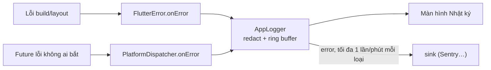

# Chương 7 — Monitoring: bắt lỗi toàn app, logging, báo cáo crash

## Mục tiêu

- Bắt **mọi** loại lỗi theo docs "Handling errors in Flutter": `FlutterError.onError` (lỗi framework), `PlatformDispatcher.instance.onError`
  (lỗi bất đồng bộ không ai bắt), `ErrorWidget.builder` (giao diện khi build lỗi).
- Viết **logger** có bộ đệm vòng (ring buffer), che dữ liệu nhạy cảm, chống "bão lỗi" khi gửi ra ngoài.
- Biết cách nối với dịch vụ crash reporting (ví dụ **Sentry**) — ở mức giới thiệu.
- Test được bộ bắt lỗi.

## Giải thích đơn giản

Docs chia lỗi thành hai nhóm:

| Loại lỗi | Ví dụ | Bắt bằng |
|---|---|---|
| **Flutter bắt được** — trong build, layout, paint, callback của framework | `null` trong `build`, overflow | `FlutterError.onError` |
| **Flutter không bắt** — lỗi bất đồng bộ | `onPressed: () async { await channel.invokeMethod(...) }` ném lỗi, `Future` lỗi không ai `await` | `PlatformDispatcher.instance.onError` |

Với Angular: `FlutterError.onError` + `PlatformDispatcher.onError` ≈ một `ErrorHandler` toàn cục; `ErrorWidget.builder` ≈ trang lỗi dự phòng.



## Ví dụ

### Gắn bộ bắt lỗi — `examples/lib/core/logging/error_handlers.dart`

```dart
void installErrorHandlers(AppLogger logger) {
  final previous = FlutterError.onError;
  FlutterError.onError = (details) {
    logger.error('FlutterError: ${details.exceptionAsString()}', details.exception, details.stack);
    if (kDebugMode) previous?.call(details); // debug: vẫn in ra console như mặc định
  };
  PlatformDispatcher.instance.onError = (error, stack) {
    logger.error('Lỗi bất đồng bộ không được bắt', error, stack);
    return true; // đã xử lý → không làm app dừng
  };
  if (kReleaseMode) {
    ErrorWidget.builder = (details) => const Material(
      child: Center(child: Text('Đã có lỗi ở phần này. Hãy thử lại.')),
    );
  }
}
```

`main.dart` gọi `installErrorHandlers(logger)` **trước** `runApp`. Màn hình Cài đặt có nút **"Gây lỗi thử"**
(`onPressed: () => Future<void>.error(StateError('Lỗi thử nghiệm'))`) để thấy lỗi bất đồng bộ hiện trong Nhật ký.

### Logger — `examples/lib/core/logging/app_logger.dart`

```dart
void _add(LogRecord raw) {
  // Luôn che email / dãy số dài trước khi lưu hoặc gửi đi.
  final record = LogRecord(raw.time, raw.level, redact(raw.message), error: raw.error, stackTrace: raw.stackTrace);
  _records.add(record);
  if (_records.length > capacity) _records.removeAt(0);
  if (kDebugMode && record.level.index >= LogLevel.warning.index) debugPrint(record.toString());
  if (record.level == LogLevel.error && sink != null && _shouldSend(record)) sink!(record);
  notifyListeners();
}

/// Chống "bão lỗi": cùng một lỗi chỉ gửi ra ngoài tối đa 1 lần mỗi phút.
bool _shouldSend(LogRecord record) {
  final key = '${record.message}|${record.error.runtimeType}|${record.error}';
  final last = _lastSent[key];
  if (last != null && record.time.difference(last) < const Duration(minutes: 1)) return false;
  _lastSent[key] = record.time;
  return true;
}
```

- `capacity` (mặc định 200): chỉ giữ N bản ghi gần nhất trong RAM.
- `sink`: nơi gửi lỗi ra ngoài (Sentry…); `null` = chỉ giữ trong máy (app của sách không gửi dữ liệu đi đâu).
- `AppLogger extends ChangeNotifier` → màn hình Nhật ký tự cập nhật (`context.watch<AppLogger>()`).

### Test bộ bắt lỗi

```dart
test('installErrorHandlers: FlutterError và lỗi bất đồng bộ đều vào logger', () {
  final oldFlutter = FlutterError.onError;
  final oldPlatform = PlatformDispatcher.instance.onError;
  addTearDown(() {
    FlutterError.onError = oldFlutter;
    PlatformDispatcher.instance.onError = oldPlatform;
  });
  final logger = AppLogger();
  installErrorHandlers(logger);
  // ...
  FlutterError.reportError(FlutterErrorDetails(exception: Exception('lỗi build')));
  final handled = PlatformDispatcher.instance.onError!(StateError('lỗi async'), StackTrace.empty);
  expect(handled, isTrue);
  expect(logger.records.map((r) => r.level), [LogLevel.error, LogLevel.error]);
});
```

**Luôn khôi phục** handler cũ trong `addTearDown` — `flutter_test` dùng `FlutterError.onError` để phát hiện lỗi trong test; không
khôi phục thì các test sau hoạt động sai. (Trong test này, sau khi gọi `installErrorHandlers`, sách gán lại `FlutterError.onError`
bằng phiên bản không gọi `previous`, để lỗi giả không làm test thất bại.)

Kết quả thật (2026-09-30, `flutter test --reporter expanded test/logging_test.dart`):

```text
00:00 +0: redact che email và dãy số dài
00:00 +1: AppLogger: giữ tối đa capacity bản ghi, che dữ liệu, chống gửi trùng trong 1 phút
00:00 +2: installErrorHandlers: FlutterError và lỗi bất đồng bộ đều vào logger
00:00 +3: Bài 1 (Ch.7): exportLogs lọc theo mức và che dữ liệu
00:00 +4: All tests passed!
```

## Đi sâu

### Nối với Sentry (giới thiệu, chưa dùng trong app)

`sentry_flutter` (9.30.1 trên pub.dev, 2026-09-30) tự gắn các handler trên và gửi crash kèm stack trace lên dịch vụ Sentry (cần
tài khoản + DSN). Với logger của sách, chỉ cần truyền `sink`:

```dart
final logger = AppLogger(sink: (r) => Sentry.captureException(r.error, stackTrace: r.stackTrace));
```

Đoạn này **chưa chạy** (không thêm package, không có DSN — NOT RUN). Khi dùng: khai báo trong App Privacy / Data safety (Chương 6),
upload file symbols (bản obfuscate) để đọc được stack trace.

### Log cái gì?

- **Có**: sự kiện quan trọng (mở app, tạo PIN, lỗi lưu dữ liệu), lỗi kèm ngữ cảnh (màn hình, thao tác).
- **Không**: PIN, token, nội dung ghi chú, email, số điện thoại. `redact()` là lưới an toàn cuối, không thay cho việc cẩn thận.
- Mức: `debug` (chỉ khi phát triển) < `info` < `warning` < `error`.

### Zone và `runZonedGuarded`

Trước đây hay bọc `runApp` trong `runZonedGuarded` để bắt lỗi bất đồng bộ. Docs hiện hướng dẫn dùng `PlatformDispatcher.instance.onError`.
Sách theo docs.

### Theo dõi hiệu năng và sử dụng

DevTools (Chương 2) cho lúc phát triển. Ngoài thực tế: Firebase Crashlytics / Performance, Sentry Performance — cần cân nhắc quyền riêng
tư. App học tập cá nhân (TOEIC) có thể chỉ cần logger nội bộ + nút "Gửi nhật ký" (Bài 1).

## Lỗi và bẫy thường gặp

- **Gắn handler sau `runApp`** → bỏ lỡ lỗi khởi động.
- **`PlatformDispatcher.onError` trả `false`** → lỗi vẫn được coi là chưa xử lý.
- **Không khôi phục `FlutterError.onError` trong test** → test sau hỏng khó hiểu.
- **Log dữ liệu nhạy cảm** / gửi quá nhiều lỗi giống nhau → tốn quota và lộ dữ liệu.
- **Ẩn lỗi hoàn toàn ở debug** → khó sửa; sách vẫn in ra console khi `kDebugMode`.

## Tóm tắt

- `FlutterError.onError` (lỗi framework) + `PlatformDispatcher.instance.onError` (lỗi async) + `ErrorWidget.builder` (UI dự phòng).
- Logger: ring buffer, `redact`, chống gửi trùng, `sink` cho dịch vụ ngoài.
- Test bộ bắt lỗi và nhớ khôi phục handler.

## Bài tập (có lời giải)

**Bài 1.** Viết `exportLogs(records, minLevel)` xuất nhật ký thành văn bản ("HH:mm:ss [level] message — error") để người dùng gửi
kèm báo lỗi; lỗi cũng phải được che dữ liệu.

<details>
<summary>Lời giải</summary>

`examples/lib/chapters/ch07/exercise_solution.dart`:

```dart
String exportLogs(Iterable<LogRecord> records, {LogLevel minLevel = LogLevel.info}) {
  String two(int n) => n.toString().padLeft(2, '0');
  return records
      .where((r) => r.level.index >= minLevel.index)
      .map((r) {
        final t = '${two(r.time.hour)}:${two(r.time.minute)}:${two(r.time.second)}';
        final err = r.error == null ? '' : ' — ${redact('${r.error}')}';
        return '$t [${r.level.name}] ${r.message}$err';
      })
      .join('\n');
}
```

Test: bản ghi `debug` bị lọc; lỗi `StateError('user a@b.co')` thành `Bad state: user <email>`.
</details>

**Bài 2.** Vì sao logger chống gửi trùng theo khóa `message|kiểu lỗi|lỗi` trong 1 phút thay vì gửi mọi lỗi?

<details>
<summary>Lời giải</summary>

Một lỗi trong `build` có thể lặp lại **mỗi frame** (60 lần/giây) → gửi hàng nghìn bản giống nhau, tốn pin, mạng, quota dịch vụ.
Gộp theo khóa giữ lại thông tin (lỗi xảy ra) mà không "spam". Test: gửi 2 lỗi giống nhau liền nhau → `sink` nhận 1; sau 2 phút →
nhận thêm 1. Bản ghi vẫn được **lưu** đủ trong bộ đệm để xem trong máy.
</details>

## Nguồn tham khảo (Sources)

Đã mở ngày 2026-09-30 (đọc file nguồn docs ở commit `ab59c61`):

- Handling errors in Flutter — https://docs.flutter.dev/testing/errors —
  https://github.com/flutter/website/blob/ab59c614e780e2d6d44f07ae4a96238028f581a5/sites/docs/src/content/testing/errors.md
- Debugging Flutter apps — https://docs.flutter.dev/testing/debugging —
  https://github.com/flutter/website/blob/ab59c614e780e2d6d44f07ae4a96238028f581a5/sites/docs/src/content/testing/debugging.md
- DevTools Logging view — https://docs.flutter.dev/tools/devtools/logging —
  https://github.com/flutter/website/blob/ab59c614e780e2d6d44f07ae4a96238028f581a5/sites/docs/src/content/tools/devtools/logging.md
- Package sentry_flutter: https://pub.dev/packages/sentry_flutter
- Sách React Native trong repo: [Tập 3, Chương 7 — Monitoring](../../react-native/vol3-nang-cao/07-monitoring.md)
