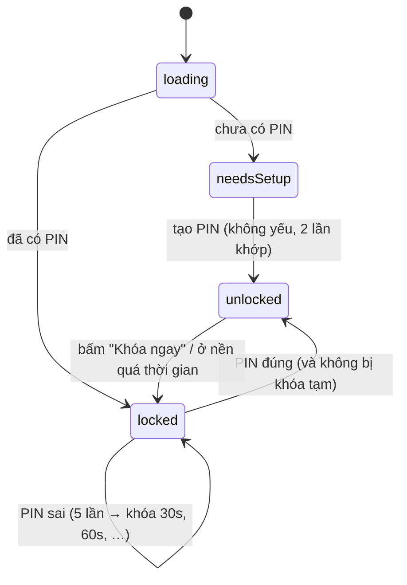

# Chương 8 — App mẫu Tập 3: "Sổ Ghi Chú Bảo Mật"

## Mục tiêu

- Ghép kiến thức Tập 3: kiến trúc **feature-first** có test luật phụ thuộc, **PIN + khóa tạm + tự khóa**, **secure storage**,
  **platform channel** (Swift/Kotlin), **bắt lỗi toàn app + logger**, performance, workflow CI mẫu.
- Chạy toàn bộ kiểm tra; biết phần nào đã kiểm chứng, phần nào NOT RUN.

## Giải thích đơn giản

App ghi chú nhỏ, dữ liệu **mã hóa bởi hệ điều hành** (Keychain/Keystore), mở bằng mã PIN:



Router có `redirect`: trạng thái khác `unlocked` → mọi URL đều về `/lock`.

## Ví dụ

### Cấu trúc (xem Chương 1)

```text
examples/lib/
  main.dart            installErrorHandlers(logger) → runApp(SecureNotesApp(AppDependencies(...)))
  app.dart             MultiProvider + AppLifecycleListener (tự khóa) + MaterialApp.router
  router.dart          /lock, /notes, /notes/new, /notes/:id, /settings, /lab — guard bằng redirect
  core/                result, command, logging (logger, error_handlers, redact), platform/battery_channel,
                       security/secure_store, ui/theme
  features/auth/       domain/pin_hasher.dart · data/pin_repository.dart · ui/auth_controller.dart, lock_screen.dart
  features/notes/      domain/note.dart · data/note_repository.dart · ui/notes_viewmodel.dart, notes_list_screen.dart, note_editor_screen.dart
  features/settings/   ui/settings_screen.dart (pin qua platform channel, thời gian tự khóa, nhật ký)
  chapters/ch01..ch07/ ví dụ + lời giải
examples/ios/Runner/AppDelegate.swift                 MethodChannel "dev.nobin.notes/battery"
examples/android/app/src/main/kotlin/.../MainActivity.kt   MethodChannel cùng tên; allowBackup="false"
vol3-nang-cao/ci/    flutter-ci.yml, ios-testflight.yml (mẫu)
```

### Điểm vào

```dart
void main() {
  WidgetsFlutterBinding.ensureInitialized();
  // sink: nơi gửi lỗi ra ngoài. Muốn dùng Sentry: sink: (r) => Sentry.captureException(r.error, stackTrace: r.stackTrace)
  final logger = AppLogger();
  installErrorHandlers(logger);
  final store = FlutterSecureStore();
  runApp(
    SecureNotesApp(
      dependencies: AppDependencies(
        pins: PinRepository(store),
        notes: SecureNoteRepository(store),
        logger: logger,
        battery: const BatteryChannel(),
      ),
    ),
  );
}
```

### Test toàn app — luồng chính

```dart
testWidgets('tạo PIN → ghi chú: thêm, sửa, xóa → khóa → mở khóa', (tester) async {
  final t = testDependencies();
  await tester.pumpWidget(SecureNotesApp(dependencies: t.deps));
  await tester.pumpAndSettle();
  expect(find.text('Tạo mã PIN'), findsOneWidget);
  // 1234 → "PIN quá dễ đoán…"; 2468 → vào danh sách
  // thêm "Mật khẩu wifi" → dữ liệu nằm trong SecureStore (key notes_v1)
  // sửa thành "Wifi nhà" → Khóa ngay → nhập sai 1357 → "Sai mã PIN (1 lần)" → nhập đúng → thấy "Wifi nhà"
  // vuốt để xóa → "Chưa có ghi chú nào"
});
```

(Bản đầy đủ trong `examples/test/app_test.dart`; `testDependencies()` dùng `MemorySecureStore` và băm PIN 10 vòng cho nhanh.)

### Chạy

```bash
cd books/flutter/vol3-nang-cao/examples
flutter pub get
flutter run -d chrome        # web: secure storage dùng WebCrypto, chỉ chạy trên localhost/HTTPS
flutter run                  # iPhone (Mac + Xcode)
flutter analyze && flutter test
```

### Kết quả kiểm tra thật (2026-09-30)

Test (`flutter test --reporter expanded`, gộp các file):

```text
auth_test.dart              7 test  — băm PIN, khóa tạm, tự khóa, AuthController
notes_test.dart             3 test  — SecureNoteRepository, NoteEditorViewModel, NotesViewModel
platform_channel_test.dart  4 test  — MethodChannel (mock native)
logging_test.dart           4 test  — redact, logger, bộ bắt lỗi, exportLogs
chapters_test.dart          9 test  — luật phụ thuộc, performance, deep link, PIN yếu, version
app_test.dart               4 test  — luồng chính, guard, cài đặt + nhật ký, Lab
```

`bash books/flutter/scripts/check-all.sh vol3-nang-cao` ([../logs/check-all.txt](../logs/check-all.txt)): YAML của `ci/` hợp lệ
("yaml OK: 2 file"), format OK, analyze "No issues found!", **31 test pass**, build web OK, smoke test Chromium thấy
"Sổ Ghi Chú Bảo Mật" và "Tạo mã PIN" → "WEB SMOKE OK".

**NOT RUN:** chạy trên iPhone/Android; biên dịch `AppDelegate.swift` và `MainActivity.kt`; Keychain/Keystore thật; `AppLifecycleListener`
trên thiết bị; workflow GitHub Actions; TestFlight.

## Đi sâu

### Vì sao ghi chú nằm trong secure storage thay vì SQLite?

Ít dữ liệu (vài chục ghi chú) → secure storage đủ và được mã hóa sẵn. Dữ liệu lớn hoặc cần tìm kiếm → SQLite mã hóa (SQLCipher)
với khóa lưu trong Keychain — "Ideas for later". App TOEIC (Task 9) **không** cần mã hóa: từ vựng không nhạy cảm → SQLite thường (Tập 2).

### Điều gì của Tập 3 nên mang sang app TOEIC?

- `core/logging` (logger + `installErrorHandlers`) — bắt lỗi toàn app ngay từ đầu.
- Test luật phụ thuộc (điều chỉnh cho cấu trúc kết hợp: `ui/` không import `data/services` trực tiếp…).
- Workflow CI mẫu (đổi đường dẫn) và `bumpBuildNumber` cho phát hành.
- Không cần PIN / secure storage trừ khi có đăng nhập.

## Lỗi và bẫy thường gặp

- **Quên khôi phục handler lỗi trong test**, **kênh chưa mock trong widget test** (treo) — hai bẫy sách gặp thật khi viết app này.
- **Băm PIN nhiều vòng trong test** làm test chậm → cho phép truyền `iterations` (app dùng 10.000, test dùng 10).
- **Router guard không có `refreshListenable`** → khóa rồi mà màn hình vẫn mở.
- **Web: secure storage trên HTTP thường** (không phải localhost/HTTPS) → lỗi (README của package).

## Tóm tắt

- Feature-first + test luật phụ thuộc; PIN an toàn hợp lý (muối, băm, constant-time, khóa tạm lưu bền, PIN yếu bị từ chối);
  tự khóa + guard; platform channel có test; logger + bắt lỗi toàn app.
- Kiểm chứng: analyze 0 issue, 31 test, build web, smoke web. Thiết bị thật: NOT RUN.

## Bài tập (có lời giải)

**Bài 1.** Thêm luật vào test kiến trúc: `core/` không được import `features/` (đã làm ở Chương 1, Bài 1). Hãy giải thích vì sao
luật này quan trọng với `AppLogger`.

<details>
<summary>Lời giải</summary>

`AppLogger` được mọi feature dùng. Nếu nó import một feature (ví dụ để lấy `redact` từ `chapters/` hay `features/auth`), ta có vòng:
feature → core → feature. Sách đã gặp đúng tình huống này và chuyển `redact` vào `core/logging/redact.dart`. Test "Bài 1: core không
được import features" và "mã thật của app không vi phạm" (`chapters_test.dart`) giữ luật này mãi về sau.
</details>

**Bài 2.** Người dùng quên PIN. Đề xuất luồng "Quên PIN" an toàn cho app này (không cần code).

<details>
<summary>Lời giải</summary>

Không có server nên **không thể** khôi phục ghi chú mà không có PIN (đó chính là mục đích mã hóa). Luồng an toàn: "Quên PIN" → cảnh
báo rõ "toàn bộ ghi chú sẽ bị xóa" → xác nhận hai lần → xóa mọi khóa trong SecureStore (`pin_*`, `notes_v1`) → về màn hình "Tạo mã PIN".
Nếu muốn khôi phục được, cần sao lưu mã hóa bằng một mật khẩu khôi phục riêng (hoặc Face ID qua `local_auth` làm phương án thứ hai) —
"Ideas for later".
</details>

## Nguồn tham khảo (Sources)

Đã mở ngày 2026-09-30 (đọc file nguồn docs ở commit `ab59c61`):

- Guide to app architecture — https://docs.flutter.dev/app-architecture/guide —
  https://github.com/flutter/website/blob/ab59c614e780e2d6d44f07ae4a96238028f581a5/sites/docs/src/content/app-architecture/guide.md
- Writing custom platform-specific code — https://docs.flutter.dev/platform-integration/platform-channels —
  https://github.com/flutter/website/blob/ab59c614e780e2d6d44f07ae4a96238028f581a5/sites/docs/src/content/platform-integration/platform-channels.md
- Handling errors in Flutter — https://docs.flutter.dev/testing/errors —
  https://github.com/flutter/website/blob/ab59c614e780e2d6d44f07ae4a96238028f581a5/sites/docs/src/content/testing/errors.md
- flutter_secure_storage 11.2.0: https://pub.dev/packages/flutter_secure_storage
- Sách React Native trong repo: [Tập 3, Chương 8 — App mẫu Sổ Ghi Chú Bảo Mật](../../react-native/vol3-nang-cao/08-app-mau-so-ghi-chu-bao-mat.md)
