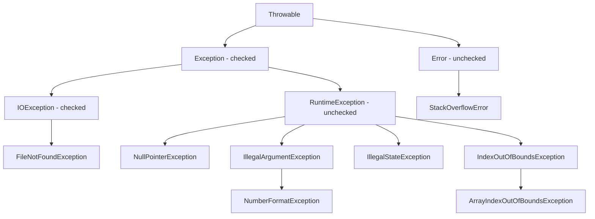

# Chương 4 — Ngoại lệ (Handling Exceptions)

## Mục tiêu

Objective 4.1: xử lý ngoại lệ (exception) bằng `try`/`catch`/`finally`, try-with-resources, multi-catch, và tự định
nghĩa exception (custom exception). Cụ thể:

- Phân biệt **checked** và **unchecked** exception, và `Error`.
- Dự đoán đúng thứ tự chạy của `try` / `catch` / `finally`, kể cả khi có `return` hoặc exception lồng nhau.
- Dùng try-with-resources: thứ tự đóng, **suppressed exception**.
- Biết các lỗi biên dịch hay gặp: catch sai thứ tự, catch checked exception không thể xảy ra, chưa "handle or declare".

## Giải thích đơn giản

Exception là một **object** mô tả sự cố. Khi có sự cố, Java "ném" (throw) object đó; nó bay ngược lên theo chuỗi
lời gọi method cho đến khi gặp một khối `catch` phù hợp. Không ai bắt → chương trình dừng và in **stack trace**.

Cây kế thừa rút gọn:

```text
Throwable
 ├── Error                    (lỗi nghiêm trọng của JVM: StackOverflowError, OutOfMemoryError…) — unchecked
 └── Exception                — checked
      ├── IOException, SQLException, … (checked)
      └── RuntimeException    — unchecked
           ├── NullPointerException, ArithmeticException, ClassCastException
           ├── IllegalArgumentException → NumberFormatException
           ├── IllegalStateException, UnsupportedOperationException
           └── IndexOutOfBoundsException → ArrayIndexOutOfBoundsException
```

**Checked exception** (nhánh `Exception` trừ `RuntimeException`) buộc bạn phải **xử lý hoặc khai báo**
(handle or declare): hoặc `catch`, hoặc ghi `throws` ở method. **Unchecked** thì không bắt buộc.

Sơ đồ (Mermaid):




## Ví dụ

Code trong `examples/ch04/`. Chạy lại: `python3 tools/book.py examples ch04`. Output thật, JDK 21.0.10.

### 1. Cây kế thừa: checked hay unchecked?

<!-- EX:Ex01_Hierarchy -->
`examples/ch04/Ex01_Hierarchy.java`

```java
// objective: 4.1
// Cây kế thừa của exception: checked (phải khai báo/bắt) vs unchecked (RuntimeException, Error).
import java.io.FileNotFoundException;
import java.io.IOException;

public class Ex01_Hierarchy {
    static void chain(Class<?> c) {
        StringBuilder sb = new StringBuilder(c.getSimpleName());
        for (Class<?> p = c.getSuperclass(); p != null; p = p.getSuperclass()) sb.append(" -> ").append(p.getSimpleName());
        boolean unchecked = RuntimeException.class.isAssignableFrom(c) || Error.class.isAssignableFrom(c);
        System.out.println(sb + (unchecked ? "   [unchecked]" : "   [checked]"));
    }

    public static void main(String[] args) {
        chain(FileNotFoundException.class);
        chain(IOException.class);
        chain(Exception.class);
        chain(NullPointerException.class);
        chain(NumberFormatException.class);
        chain(ArrayIndexOutOfBoundsException.class);
        chain(StackOverflowError.class);
        chain(ExceptionInInitializerError.class);
    }
}
```

Output thật (JDK 21.0.10):

```text
FileNotFoundException -> IOException -> Exception -> Throwable -> Object   [checked]
IOException -> Exception -> Throwable -> Object   [checked]
Exception -> Throwable -> Object   [checked]
NullPointerException -> RuntimeException -> Exception -> Throwable -> Object   [unchecked]
NumberFormatException -> IllegalArgumentException -> RuntimeException -> Exception -> Throwable -> Object   [unchecked]
ArrayIndexOutOfBoundsException -> IndexOutOfBoundsException -> RuntimeException -> Exception -> Throwable -> Object   [unchecked]
StackOverflowError -> VirtualMachineError -> Error -> Throwable -> Object   [unchecked]
ExceptionInInitializerError -> LinkageError -> Error -> Throwable -> Object   [unchecked]
```
<!-- /EX -->

### 2. try / catch / finally

<!-- EX:Ex02_TryCatchFinally -->
`examples/ch04/Ex02_TryCatchFinally.java`

```java
// objective: 4.1
// Luồng chạy của try / catch / finally; catch đầu tiên khớp sẽ được chọn.
public class Ex02_TryCatchFinally {
    static void run(String input) {
        System.out.print(input + ": ");
        try {
            System.out.print("try ");
            int n = Integer.parseInt(input);
            System.out.print("parsed ");
            System.out.print(10 / n + " ");
        } catch (NumberFormatException e) {
            System.out.print("NFE ");
        } catch (RuntimeException e) {                 // lớp cha phải đứng SAU lớp con
            System.out.print(e.getClass().getSimpleName() + " ");
        } finally {
            System.out.print("finally");               // luôn chạy
        }
        System.out.println();
    }

    public static void main(String[] args) {
        run("5");
        run("abc");
        run("0");
    }
}
```

Output thật (JDK 21.0.10):

```text
5: try parsed 2 finally
abc: try NFE finally
0: try parsed ArithmeticException finally
```
<!-- /EX -->

### 3. Multi-catch

<!-- EX:Ex03_MultiCatch -->
`examples/ch04/Ex03_MultiCatch.java`

```java
// objective: 4.1
// Multi-catch: một khối catch cho nhiều loại exception không liên quan kế thừa.
import java.io.IOException;

public class Ex03_MultiCatch {
    static void risky(int k) throws IOException {
        switch (k) {
            case 1 -> throw new IOException("disk");
            case 2 -> throw new IllegalStateException("state");
            case 3 -> throw new ArrayIndexOutOfBoundsException(9);
            default -> System.out.println("ok " + k);
        }
    }

    public static void main(String[] args) {
        for (int k = 0; k <= 3; k++) {
            try {
                risky(k);
            } catch (IOException | IllegalStateException e) {
                // e = new IOException();   // lỗi: biến của multi-catch ngầm final
                System.out.println("multi-catch: " + e.getMessage());
            } catch (RuntimeException e) {
                System.out.println("runtime: " + e);
            }
        }
        // catch (FileNotFoundException | IOException e) → lỗi: hai kiểu có quan hệ cha-con
    }
}
```

Output thật (JDK 21.0.10):

```text
ok 0
multi-catch: disk
multi-catch: state
runtime: java.lang.ArrayIndexOutOfBoundsException: Array index out of range: 9
```
<!-- /EX -->

### 4. try-with-resources

<!-- EX:Ex04_TryWithResources -->
`examples/ch04/Ex04_TryWithResources.java`

```java
// objective: 4.1
// try-with-resources: đóng tài nguyên theo thứ tự NGƯỢC, trước khi catch/finally chạy.
public class Ex04_TryWithResources {
    record Res(String name) implements AutoCloseable {
        Res { System.out.println("open " + name); }
        @Override public void close() { System.out.println("close " + name); }
    }

    public static void main(String[] args) {
        try (Res a = new Res("A"); Res b = new Res("B")) {
            System.out.println("body");
            throw new IllegalStateException("boom");
        } catch (IllegalStateException e) {
            System.out.println("catch " + e.getMessage());
        } finally {
            System.out.println("finally");
        }

        Res c = new Res("C");                 // Java 9+: dùng biến effectively final có sẵn
        try (c) {
            System.out.println("using " + c.name());
        }
        // c = null;                          // nếu có dòng này, try (c) sẽ lỗi biên dịch
    }
}
```

Output thật (JDK 21.0.10):

```text
open A
open B
body
close B
close A
catch boom
finally
open C
using C
close C
```
<!-- /EX -->

### 5. Suppressed exception vs finally ném exception

<!-- EX:Ex05_Suppressed -->
`examples/ch04/Ex05_Suppressed.java`

```java
// objective: 4.1
// Suppressed exception: lỗi khi close() được "đính kèm" vào exception chính.
// So sánh với finally ném exception: exception gốc bị MẤT.
public class Ex05_Suppressed {
    static class Bad implements AutoCloseable {
        @Override public void close() throws Exception { throw new Exception("close failed"); }
    }

    public static void main(String[] args) {
        try (Bad b = new Bad()) {
            throw new RuntimeException("body failed");
        } catch (Exception e) {
            System.out.println("primary: " + e.getMessage());
            for (Throwable s : e.getSuppressed()) System.out.println("suppressed: " + s.getMessage());
        }

        try {
            try {
                throw new RuntimeException("try failed");
            } finally {
                throw new IllegalStateException("finally failed");   // thay thế exception gốc
            }
        } catch (RuntimeException e) {
            System.out.println("caught: " + e.getMessage() + ", suppressed=" + e.getSuppressed().length);
        }
    }
}
```

Output thật (JDK 21.0.10):

```text
primary: body failed
suppressed: close failed
caught: finally failed, suppressed=0
```
<!-- /EX -->

### 6. Custom exception

<!-- EX:Ex06_CustomException -->
`examples/ch04/Ex06_CustomException.java`

```java
// objective: 4.1
// Exception tự định nghĩa (custom): checked extends Exception, unchecked extends RuntimeException; gói cause.
public class Ex06_CustomException {
    static class InsufficientFundsException extends Exception {      // checked
        private final long missing;
        InsufficientFundsException(String msg, long missing) { super(msg); this.missing = missing; }
        long getMissing() { return missing; }
    }

    static class AccountLockedException extends RuntimeException {  // unchecked
        AccountLockedException(String msg, Throwable cause) { super(msg, cause); }
    }

    static long balance = 100;

    static void withdraw(long amount) throws InsufficientFundsException {
        if (amount > balance) throw new InsufficientFundsException("need more money", amount - balance);
        balance -= amount;
    }

    public static void main(String[] args) {
        try {
            withdraw(30);
            withdraw(500);
        } catch (InsufficientFundsException e) {
            System.out.println(e.getMessage() + ", missing " + e.getMissing() + ", balance " + balance);
            try {
                throw new AccountLockedException("locked", e);
            } catch (AccountLockedException ex) {
                System.out.println(ex + " / cause: " + ex.getCause().getClass().getSimpleName());
            }
        }
    }
}
```

Output thật (JDK 21.0.10):

```text
need more money, missing 430, balance 70
Ex06_CustomException$AccountLockedException: locked / cause: InsufficientFundsException
```
<!-- /EX -->

### 7. return và finally

<!-- EX:Ex07_FinallyReturn -->
`examples/ch04/Ex07_FinallyReturn.java`

```java
// objective: 4.1
// return trong try và finally: giá trị trả về được "chốt" trước khi finally chạy; return trong finally thắng.
public class Ex07_FinallyReturn {
    static int a() {
        int x = 1;
        try {
            return x;          // giá trị 1 được chốt
        } finally {
            x = 99;            // không ảnh hưởng giá trị đã chốt
        }
    }

    static StringBuilder b() {
        StringBuilder sb = new StringBuilder("v1");
        try {
            return sb;         // chốt THAM CHIẾU
        } finally {
            sb.append("+finally");   // object vẫn bị sửa
        }
    }

    @SuppressWarnings("finally")
    static int c() {
        try {
            throw new RuntimeException("lost");
        } finally {
            return 3;          // nuốt luôn exception
        }
    }

    public static void main(String[] args) {
        System.out.println(a() + " " + b() + " " + c());
    }
}
```

Output thật (JDK 21.0.10):

```text
1 v1+finally 3
```
<!-- /EX -->

### 8. Lỗi biên dịch hay gặp

<!-- EX:Ex08_CatchOrder -->
`examples/ch04/Ex08_CatchOrder.java`

```java
// objective: 4.1
// expect: compile-error
// Lỗi biên dịch: catch lớp cha trước lớp con; catch checked exception không thể xảy ra; chưa xử lý checked.
import java.io.FileNotFoundException;
import java.io.IOException;

public class Ex08_CatchOrder {
    static void read() throws IOException { }

    public static void main(String[] args) {
        try {
            read();
        } catch (IOException e) {
        } catch (FileNotFoundException e) {        // đã bị catch IOException bắt trước
        }

        try {
            System.out.println("no IO here");
        } catch (IOException e) {                  // khối try không thể ném IOException
        }

        read();                                    // checked exception chưa được bắt hay khai báo
    }
}
```

Output thật của `javac` (JDK 21.0.10) — cố ý không biên dịch được:

```text
Ex08_CatchOrder.java:14: error: exception FileNotFoundException has already been caught
        } catch (FileNotFoundException e) {        // đã bị catch IOException bắt trước
          ^
Ex08_CatchOrder.java:19: error: exception IOException is never thrown in body of corresponding try statement
        } catch (IOException e) {                  // khối try không thể ném IOException
          ^
Ex08_CatchOrder.java:22: error: unreported exception IOException; must be caught or declared to be thrown
        read();                                    // checked exception chưa được bắt hay khai báo
            ^
3 errors
```
<!-- /EX -->

### 9. Các exception hay gặp và message thật

<!-- EX:Ex09_CommonExceptions -->
`examples/ch04/Ex09_CommonExceptions.java`

```java
// objective: 4.1
// Những exception hay gặp trong đề và thông điệp thật của chúng (JDK 21).
import java.util.List;

public class Ex09_CommonExceptions {
    interface Action { void run() throws Exception; }

    static void show(Action a) {
        try {
            a.run();
        } catch (Exception e) {
            System.out.println(e.getClass().getName() + ": " + e.getMessage());
        }
    }

    public static void main(String[] args) {
        show(() -> { String s = null; s.length(); });
        show(() -> { int[] arr = new int[2]; arr[2] = 1; });
        show(() -> Integer.parseInt("12a"));
        show(() -> { Object o = "x"; Integer i = (Integer) o; });
        show(() -> List.of(1).add(2));
        show(() -> List.of(1, 2).get(5));
        show(() -> { throw new IllegalArgumentException("bad arg"); });
        show(() -> new java.util.ArrayList<Integer>().iterator().next());
    }
}
```

Output thật (JDK 21.0.10):

```text
java.lang.NullPointerException: Cannot invoke "String.length()" because "<local0>" is null
java.lang.ArrayIndexOutOfBoundsException: Index 2 out of bounds for length 2
java.lang.NumberFormatException: For input string: "12a"
java.lang.ClassCastException: class java.lang.String cannot be cast to class java.lang.Integer (java.lang.String and java.lang.Integer are in module java.base of loader 'bootstrap')
java.lang.UnsupportedOperationException: null
java.lang.IndexOutOfBoundsException: Index: 5 Size: 2
java.lang.IllegalArgumentException: bad arg
java.util.NoSuchElementException: null
```
<!-- /EX -->

### 10. Exception trong khởi tạo static

<!-- EX:Ex10_InitializerError -->
`examples/ch04/Ex10_InitializerError.java`

```java
// objective: 4.1
// Exception trong khối static → ExceptionInInitializerError (một Error), lần sau → NoClassDefFoundError.
public class Ex10_InitializerError {
    static class Config {
        static int value = Integer.parseInt("not a number");
    }

    public static void main(String[] args) {
        for (int i = 0; i < 2; i++) {
            try {
                System.out.println(Config.value);
            } catch (Throwable t) {
                System.out.println(t.getClass().getSimpleName()
                        + (t.getCause() != null ? " caused by " + t.getCause().getClass().getSimpleName() : ""));
            }
        }
    }
}
```

Output thật (JDK 21.0.10):

```text
ExceptionInInitializerError caused by NumberFormatException
NoClassDefFoundError caused by ExceptionInInitializerError
```
<!-- /EX -->

### 11. Rethrow và gói exception

<!-- EX:Ex11_Rethrow -->
`examples/ch04/Ex11_Rethrow.java`

```java
// objective: 4.1
// Ném lại (rethrow) chính xác: catch (Exception e) rồi throw e — compiler biết kiểu thật là IOException.
import java.io.IOException;

public class Ex11_Rethrow {
    static void io(boolean fail) throws IOException {
        if (fail) throw new IOException("io");
    }

    static void precise(boolean fail) throws IOException {   // KHÔNG cần "throws Exception"
        try {
            io(fail);
        } catch (Exception e) {
            System.out.println("log: " + e.getMessage());
            throw e;                                          // e effectively final → rethrow chính xác
        }
    }

    static void wrap() {
        try {
            io(true);
        } catch (IOException e) {
            throw new RuntimeException("wrapped", e);        // đổi checked thành unchecked
        }
    }

    public static void main(String[] args) {
        try {
            precise(true);
        } catch (IOException e) {
            System.out.println("main caught " + e.getMessage());
        }
        try {
            wrap();
        } catch (RuntimeException e) {
            System.out.println(e.getMessage() + " <- " + e.getCause().getMessage());
        }
    }
}
```

Output thật (JDK 21.0.10):

```text
log: io
main caught io
wrapped <- io
```
<!-- /EX -->

### 12. Exception không được bắt

<!-- EX:Ex12_StackTrace -->
`examples/ch04/Ex12_StackTrace.java`

```java
// objective: 4.1
// expect: exception
// Exception không được bắt: JVM in stack trace ra System.err và kết thúc với exit code 1.
public class Ex12_StackTrace {
    static int depth(int n) {
        if (n == 0) throw new IllegalStateException("reached bottom");
        return depth(n - 1);
    }

    public static void main(String[] args) {
        System.out.println("before");
        depth(2);
        System.out.println("never printed");
    }
}
```

Output thật (JDK 21.0.10):

```text
before
Exception in thread "main" java.lang.IllegalStateException: reached bottom
	at Ex12_StackTrace.depth(Ex12_StackTrace.java:6)
	at Ex12_StackTrace.depth(Ex12_StackTrace.java:7)
	at Ex12_StackTrace.depth(Ex12_StackTrace.java:7)
	at Ex12_StackTrace.main(Ex12_StackTrace.java:12)
```
<!-- /EX -->

## Đi sâu

### Cú pháp hợp lệ

- `try { } catch (...) { }`, `try { } finally { }`, `try { } catch { } finally { }` — `try` thường phải có ít nhất
  một `catch` hoặc `finally`.
- try-with-resources `try (R r = ...) { }` **không** cần `catch`/`finally`.
- Dấu ngoặc `{}` là **bắt buộc** cho `try`, `catch`, `finally` (khác `if`).
- Thứ tự `catch`: lớp con trước lớp cha. Catch lớp con sau lớp cha → lỗi "has already been caught".
- Catch một **checked** exception mà khối `try` không thể ném → lỗi (trừ `Exception` và `Throwable`, vì chúng còn
  bao gồm unchecked).

### Multi-catch

- `catch (IOException | IllegalStateException e)` — các kiểu không được có quan hệ cha-con.
- Biến `e` ngầm `final`; kiểu tĩnh của `e` là kiểu chung gần nhất (ở đây `Exception`).

### try-with-resources

1. Tài nguyên phải implements `AutoCloseable` (hoặc `Closeable`, là interface con).
2. Mở theo thứ tự khai báo; đóng theo thứ tự **ngược lại**, ngay khi rời khối `try`, **trước** `catch` và `finally`.
3. Biến tài nguyên ngầm `final`, phạm vi chỉ trong khối `try`.
4. Java 9+: `try (r1; r2)` với biến có sẵn, miễn là effectively final.
5. Nếu thân `try` ném exception và `close()` cũng ném → exception của thân là **chính**, exception của `close()`
   được thêm vào `getSuppressed()`.
6. `AutoCloseable.close()` khai báo `throws Exception`; nếu lớp của bạn khai báo `close() throws Exception` thì code
   dùng nó phải xử lý `Exception`. `Closeable.close()` khai báo `throws IOException`.

### finally

- Luôn chạy (trừ khi JVM dừng: `System.exit`, crash).
- `return` trong `try`: giá trị được chốt trước khi `finally` chạy. Primitive không đổi; object thì `finally` vẫn sửa
  được nội dung.
- `return` hoặc `throw` trong `finally` **thay thế** kết quả/exception của `try`/`catch` — exception gốc mất hẳn
  (không thành suppressed).

### Custom exception

- Checked: `extends Exception`. Unchecked: `extends RuntimeException`.
- Nên có constructor `(String message)` và `(String message, Throwable cause)` gọi `super(...)`.
- `getMessage()` trả về message; `toString()` = tên lớp đầy đủ + `": "` + message; `getCause()` trả về exception gốc.

### Exception và override

Method override được: bỏ `throws`, ném checked exception **hẹp hơn**, thêm bất kỳ unchecked exception nào.
Không được: thêm checked exception mới hoặc rộng hơn (xem thêm chương 3).

### Rethrow chính xác (precise rethrow)

`catch (Exception e) { throw e; }` — nếu `e` effectively final, compiler chỉ coi nó là các checked exception mà khối
`try` thực sự có thể ném. Gán lại `e` → mất tính năng này.

## Lỗi và bẫy thường gặp (Exam traps)

1. Catch lớp cha trước lớp con → lỗi biên dịch.
2. Catch `IOException` khi `try` không thể ném nó → lỗi; catch `Exception` thì luôn được.
3. Multi-catch với hai kiểu cha-con → lỗi; gán lại biến multi-catch → lỗi.
4. try-with-resources: đóng **trước** catch/finally, thứ tự ngược.
5. Exception từ `close()` là suppressed, không thay thế exception chính.
6. `return`/`throw` trong `finally` nuốt exception.
7. `finally` không chạy khi gọi `System.exit`.
8. `NumberFormatException` là `IllegalArgumentException`; `ArrayIndexOutOfBoundsException` là `IndexOutOfBoundsException`.
9. Exception trong khởi tạo static → `ExceptionInInitializerError` (lần sau truy cập: `NoClassDefFoundError`).
10. Override thêm checked exception rộng hơn → lỗi.
11. Biến tài nguyên dùng ngoài khối `try` → lỗi phạm vi.
12. Class kế thừa trực tiếp `Throwable` là **checked**.

## Góc nhìn từ TypeScript

| TypeScript | Java | Ghi chú |
|---|---|---|
| `throw` được mọi giá trị (`throw "oops"`) | Chỉ `throw` object là `Throwable` | |
| `catch (e)` — `e` là `unknown`, một khối catch duy nhất | Nhiều khối `catch` theo kiểu, multi-catch | Java chọn catch theo kiểu, không cần `if (e instanceof ...)` |
| Không có checked exception | Checked exception: compiler bắt buộc handle or declare | Khác biệt lớn nhất |
| `try/finally` + `using` (TS 5.2, explicit resource management) | try-with-resources + `AutoCloseable` | Ý tưởng giống `using` / `Symbol.dispose` |
| `new Error("msg", { cause })` | `new RuntimeException("msg", cause)` | Cùng khái niệm "cause" |
| Promise bị reject không ai bắt → cảnh báo | Exception không bắt → luồng (thread) đó kết thúc, in stack trace | |

## Tóm tắt

- Checked = `Exception` trừ nhánh `RuntimeException`; phải handle or declare. `Error` là unchecked.
- Catch: lớp con trước lớp cha; multi-catch không cha-con, biến ngầm final.
- try-with-resources: đóng ngược, trước catch/finally; exception của `close()` là suppressed.
- `finally` luôn chạy; `return` trong `try` chốt giá trị; `return` trong `finally` nuốt exception.
- Custom exception: chọn `Exception` hoặc `RuntimeException`, truyền message và cause.

## Bài tập (có lời giải)

Mọi đáp án đã được `tools/book.py` biên dịch và chạy để xác nhận (code: `examples/questions/ch04/`).

### Câu hỏi

<!-- QUESTIONS:ch04 -->
#### Câu 04-01 · Dễ · objective 4.1

Chương trình sau in ra gì?

```java
public class Flow {
    public static void main(String[] args) {
        try {
            System.out.print("A");
            int x = 5 / 0;
            System.out.print("B");
        } catch (ArithmeticException e) {
            System.out.print("C");
        } finally {
            System.out.print("D");
        }
        System.out.print("E");
    }
}
```

- **A.** `ACDE`
- **B.** `ABCDE`
- **C.** `ACD`
- **D.** `ADE`

#### Câu 04-02 · Vừa · objective 4.1

Chương trình sau in ra gì?

```java
public class Ret {
    static int f() {
        int x = 10;
        try {
            x++;
            return x;
        } finally {
            x += 100;
            System.out.print(x + " ");
        }
    }

    public static void main(String[] args) {
        System.out.println(f());
    }
}
```

- **A.** `111 111`
- **B.** `111 11`
- **C.** `11 11`
- **D.** `11 111`

#### Câu 04-03 · Vừa · objective 4.1

Dòng nào gây lỗi biên dịch?

```java
import java.io.*;

public class Catches {
    static void load() throws FileNotFoundException { }

    public static void main(String[] args) {
        try { load(); }
        catch (FileNotFoundException e) { }        // L1
        catch (IOException e) { }                  // L2
        try { load(); }
        catch (Exception e) { }                    // L3
        catch (RuntimeException e) { }             // L4
        try { System.out.print(""); }
        catch (RuntimeException e) { }             // L5
    }
}
```

- **A.** L2
- **B.** L4
- **C.** L2 và L4
- **D.** L4 và L5
- **E.** Không dòng nào

#### Câu 04-04 · Vừa · objective 4.1

Chương trình sau in ra gì?

```java
public class Twr {
    static class R implements AutoCloseable {
        final String n;
        R(String n) { this.n = n; System.out.print("o" + n + " "); }
        public void close() { System.out.print("c" + n + " "); }
    }

    public static void main(String[] args) {
        try (R a = new R("1"); R b = new R("2")) {
            System.out.print("body ");
            throw new RuntimeException();
        } catch (RuntimeException e) {
            System.out.print("catch ");
        } finally {
            System.out.print("fin");
        }
    }
}
```

- **A.** `o1 o2 body c1 c2 catch fin`
- **B.** `o1 o2 body catch c2 c1 fin`
- **C.** `o1 o2 body c2 c1 catch fin`
- **D.** `o1 o2 body catch fin c2 c1`

#### Câu 04-05 · Khó · objective 4.1

Kết quả của chương trình là gì?

```java
public class Supp {
    static class R implements AutoCloseable {
        public void close() { throw new IllegalStateException("close"); }
    }

    public static void main(String[] args) {
        try (R r = new R()) {
            throw new IllegalArgumentException("body");
        } catch (RuntimeException e) {
            System.out.println(e.getMessage() + " " + e.getSuppressed().length + " "
                    + e.getSuppressed()[0].getMessage());
        }
    }
}
```

- **A.** In ra `close 1 body`
- **B.** Ném `ArrayIndexOutOfBoundsException` vì mảng suppressed rỗng
- **C.** Không biên dịch được vì `close()` không khai báo `throws`
- **D.** In ra `body 1 close`

#### Câu 04-06 · Vừa · objective 4.1

Chèn khối catch nào vào chỗ `// INSERT CODE HERE` thì chương trình biên dịch được? **(Chọn 2 đáp án.)**

```java
import java.io.*;

public class Multi {
    static void work() throws IOException { }

    public static void main(String[] args) {
        try {
            work();
        } // INSERT CODE HERE
    }
}
```

- **A.** `catch (FileNotFoundException | IOException e) { }`
- **B.** `catch (IOException | RuntimeException e) { }`
- **C.** `catch (IOException | IllegalStateException e) { e = null; }`
- **D.** `catch (IOException e1 | RuntimeException e2) { }`
- **E.** `catch (RuntimeException | IOException e) { System.out.println(e); }`

#### Câu 04-07 · Dễ · objective 4.1

Hai phát biểu nào đúng? **(Chọn 2 đáp án.)**

- **A.** `NumberFormatException` là checked exception.
- **B.** `IOException` là checked exception.
- **C.** `Error` và các lớp con của nó là unchecked.
- **D.** Method ném `RuntimeException` phải khai báo `throws RuntimeException`.
- **E.** Lớp `Exception` là unchecked exception.

#### Câu 04-08 · Khó · objective 4.1

Chương trình sau in ra gì?

```java
public class Nested {
    public static void main(String[] args) {
        StringBuilder sb = new StringBuilder();
        try {
            try {
                sb.append("1");
                throw new IllegalStateException("x");
            } catch (IllegalArgumentException e) {
                sb.append("2");
            } finally {
                sb.append("3");
            }
            sb.append("4");
        } catch (RuntimeException e) {
            sb.append("5");
        } finally {
            sb.append("6");
        }
        System.out.println(sb);
    }
}
```

- **A.** `13456`
- **B.** `12356`
- **C.** `136`
- **D.** `1356`

#### Câu 04-09 · Vừa · objective 4.1, 3.5

Dòng nào gây lỗi biên dịch?

```java
import java.io.*;

public class Throws {
    static class Reader { void read() throws IOException { } }
    static class A extends Reader { void read() throws FileNotFoundException { } }   // L1
    static class B extends Reader { void read() { } }                                 // L2
    static class C extends Reader { void read() throws Exception { } }                // L3
    static class D extends Reader { void read() throws IllegalStateException { } }    // L4

    public static void main(String[] args) { }
}
```

- **A.** L1
- **B.** L2
- **C.** L3
- **D.** L4
- **E.** L3 và L4

#### Câu 04-10 · Vừa · objective 4.1

Chương trình sau in ra gì?

```java
public class Custom {
    static class AppException extends Exception {
        AppException(String m) { super(m); }
    }

    public static void main(String[] args) {
        try {
            throw new AppException("oops");
        } catch (AppException e) {
            System.out.println(e.getMessage() + " | " + e);
        }
    }
}
```

- **A.** `oops | oops`
- **B.** `oops | AppException: oops`
- **C.** `oops | Custom$AppException: oops`
- **D.** `oops | Custom.AppException: oops`

#### Câu 04-11 · Khó · objective 4.1

Kết quả của chương trình là gì?

```java
public class Swallow {
    @SuppressWarnings("finally")
    static String f() {
        try {
            throw new RuntimeException("A");
        } catch (RuntimeException e) {
            throw new IllegalStateException("B");
        } finally {
            return "C";
        }
    }

    public static void main(String[] args) {
        try {
            System.out.println(f());
        } catch (Exception e) {
            System.out.println(e.getMessage());
        }
    }
}
```

- **A.** In ra `A`
- **B.** In ra `B`
- **C.** Không biên dịch được: không có lệnh return tới được
- **D.** In ra `C`

#### Câu 04-12 · Vừa · objective 4.1

Chèn dòng nào vào chỗ `// INSERT CODE HERE` thì chương trình biên dịch được? **(Chọn 3 đáp án.)**

```java
public class Res {
    static class R implements AutoCloseable { public void close() { } }

    public static void main(String[] args) {
        R outer = new R();
        // INSERT CODE HERE
    }
}
```

- **A.** `try (outer) { }`
- **B.** `try (R r = new R()) { }`
- **C.** `try (R r = new R();) { }`
- **D.** `try (Object o = new Object()) { }`
- **E.** `try (R r = new R()) { } r.close();`
- **F.** `try { }`

#### Câu 04-13 · Vừa · objective 4.1

Chương trình sau in ra gì?

```java
public class Boot {
    static class Cfg {
        static final int N = compute();
        static int compute() {
            System.out.print("compute ");
            return 1 / 0;
        }
    }

    public static void main(String[] args) {
        try {
            System.out.print(Cfg.N);
        } catch (ExceptionInInitializerError e) {
            System.out.print("EIIE:" + e.getCause().getClass().getSimpleName());
        }
    }
}
```

- **A.** `compute EIIE:ArithmeticException`
- **B.** `EIIE:ArithmeticException`
- **C.** `compute 0`
- **D.** `compute EIIE:ExceptionInInitializerError`

#### Câu 04-14 · Vừa · objective 4.1

Hai phát biểu nào đúng? **(Chọn 2 đáp án.)**

- **A.** Khối `finally` vẫn chạy khi khối `try` thực hiện `return`.
- **B.** try-with-resources đóng tài nguyên **sau** khi khối `catch` chạy xong.
- **C.** Mỗi khối `try` (không có tài nguyên) phải có ít nhất một `catch`.
- **D.** Biến của multi-catch ngầm `final`.
- **E.** Nếu `try` gọi `System.exit(0)` thì `finally` vẫn chạy.

#### Câu 04-15 · Dễ · objective 4.1

Chương trình sau in ra gì?

```java
public class Parse {
    public static void main(String[] args) {
        try {
            int n = Integer.parseInt("3.5");
            System.out.println(n);
        } catch (IllegalArgumentException e) {
            System.out.println("IAE");
        } catch (RuntimeException e) {
            System.out.println("RE");
        }
    }
}
```

- **A.** `3`
- **B.** `RE`
- **C.** `IAE`
- **D.** Không biên dịch được vì thứ tự các khối catch

#### Câu 04-16 · Khó · objective 4.1

Dòng nào gây lỗi biên dịch?

```java
import java.io.*;

public class Re {
    static void io() throws IOException { }

    static void a() throws IOException {
        try { io(); } catch (Exception e) { throw e; }                          // L1
    }
    static void b() throws IOException {
        try { io(); } catch (Exception e) { e = new Exception(); throw e; }     // L2
    }
    static void c() {
        try { io(); } catch (IOException e) { throw new RuntimeException(e); }  // L3
    }

    public static void main(String[] args) { }
}
```

- **A.** L1
- **B.** L2
- **C.** L3
- **D.** L1 và L2
- **E.** Không dòng nào

#### Câu 04-17 · Vừa · objective 4.1

Chương trình sau in ra gì?

```java
public class Order {
    static String log = "";

    static void m() {
        try {
            log += "t";
            throw new RuntimeException();
        } catch (RuntimeException e) {
            log += "c";
            throw new IllegalStateException();
        } finally {
            log += "f";
        }
    }

    public static void main(String[] args) {
        try { m(); } catch (IllegalStateException e) { log += "m"; }
        System.out.println(log);
    }
}
```

- **A.** `tcm`
- **B.** `tcmf`
- **C.** `tfm`
- **D.** `tcfm`

#### Câu 04-18 · Khó · objective 4.1

Khai báo nào, chèn vào chỗ `// INSERT CODE HERE`, làm chương trình biên dịch và in ra `ok`? **(Chọn 3 đáp án.)**

```java
public class Declare {
    // INSERT CODE HERE

    static void check(int v) throws BadValue {
        if (v < 0) throw new BadValue("negative");
    }

    public static void main(String[] args) throws Throwable {
        check(1);
        System.out.println("ok");
    }
}
```

- **A.** `static class BadValue extends Exception { BadValue(String m) { super(m); } }`
- **B.** `static class BadValue extends RuntimeException { BadValue(String m) { super(m); } }`
- **C.** `static class BadValue extends Throwable { BadValue(String m) { super(m); } }`
- **D.** `static class BadValue extends Exception { }`
- **E.** `static class BadValue implements Exception { BadValue(String m) { } }`

#### Câu 04-19 · Vừa · objective 4.1

Kết quả của chương trình là gì?

```java
public class Cause {
    public static void main(String[] args) {
        try {
            try {
                Object o = null;
                o.toString();
            } catch (NullPointerException e) {
                throw new IllegalStateException("wrapped", e);
            }
        } catch (IllegalStateException e) {
            System.out.println(e.getMessage() + " / " + (e.getCause() instanceof NullPointerException));
        }
    }
}
```

- **A.** In ra `wrapped / true`
- **B.** In ra `wrapped / false`
- **C.** In ra `null / true`
- **D.** Ném `NullPointerException` ra khỏi `main`

#### Câu 04-20 · Dễ · objective 4.1

Dòng nào gây lỗi biên dịch?

```java
import java.io.*;

public class Unreported {
    static void save() throws IOException { }
    static void run() { save(); }                                      // L1
    static void run2() throws Exception { save(); }                    // L2
    static void run3() { try { save(); } catch (Exception e) { } }     // L3

    public static void main(String[] args) { }
}
```

- **A.** L1
- **B.** L2
- **C.** L3
- **D.** L1 và L3
- **E.** Không dòng nào
<!-- /QUESTIONS -->

### Lời giải

<!-- ANSWERS:ch04 -->
#### Câu 04-01 — Đáp án: **A** (Dễ · objective 4.1)

- **Vì sao đúng:** `5 / 0` ném `ArithmeticException` nên `B` bị bỏ qua. Catch khớp → in `C`. `finally` luôn chạy → `D`. Exception đã được xử lý nên chương trình chạy tiếp → `E`.
- **B sai:** Lệnh sau dòng ném exception trong khối `try` không chạy.
- **C sai:** Exception đã được bắt, nên code sau `try` vẫn chạy và in `E`.
- **D sai:** Catch `ArithmeticException` khớp nên `C` được in.
- *Kiểm chứng:* `examples/questions/ch04/Q04_01/` — output confirmed (`python3 tools/book.py questions ch04`).

#### Câu 04-02 — Đáp án: **B** (Vừa · objective 4.1)

- **Vì sao đúng:** `return x` **chốt** giá trị 11 trước khi `finally` chạy. `finally` đổi biến `x` thành 111 và in ra, nhưng giá trị trả về (kiểu primitive) đã được chốt là 11.
- **A sai:** Với primitive, thay đổi biến trong `finally` không đổi giá trị đã chốt để trả về.
- **C sai:** `finally` in giá trị của `x` sau khi cộng 100, tức là 111.
- **D sai:** Thứ tự in: `finally` in trước (111), rồi `main` in giá trị trả về (11).
- *Kiểm chứng:* `examples/questions/ch04/Q04_02/` — output confirmed (`python3 tools/book.py questions ch04`).

#### Câu 04-03 — Đáp án: **B** (Vừa · objective 4.1)

- **Vì sao đúng:** `RuntimeException` là lớp con của `Exception`; catch `Exception` đứng trước đã bắt hết → L4 lỗi "exception RuntimeException has already been caught". L2 hợp lệ vì `IOException` rộng hơn (không phải lớp con của) `FileNotFoundException`. L5 hợp lệ vì unchecked exception luôn được phép catch.
- **A sai:** Catch lớp **cha** sau lớp con là hợp lệ; chỉ lớp con sau lớp cha mới lỗi.
- **C sai:** L2 hợp lệ (xem A).
- **D sai:** Catch unchecked exception (L5) luôn hợp lệ, kể cả khi khối try không ném gì.
- **E sai:** L4 bị catch `Exception` phía trên che mất.
- *Kiểm chứng:* `examples/questions/ch04/Q04_03/` — compile error confirmed at ['L4'] (`python3 tools/book.py questions ch04`).

#### Câu 04-04 — Đáp án: **C** (Vừa · objective 4.1)

- **Vì sao đúng:** Tài nguyên mở theo thứ tự khai báo và **đóng theo thứ tự ngược lại** (b rồi a). Việc đóng xảy ra ngay khi rời khối `try`, **trước** khi `catch` và `finally` chạy.
- **A sai:** Đóng theo thứ tự ngược: `c2` trước `c1`.
- **B sai:** Tài nguyên được đóng trước khi vào `catch`.
- **D sai:** Tài nguyên được đóng trước cả `catch` và `finally`.
- *Kiểm chứng:* `examples/questions/ch04/Q04_04/` — output confirmed (`python3 tools/book.py questions ch04`).

#### Câu 04-05 — Đáp án: **D** (Khó · objective 4.1)

- **Vì sao đúng:** Exception chính là exception ném trong thân `try` (`body`). Exception do `close()` ném sau đó không làm mất exception chính mà được thêm vào danh sách **suppressed** của nó. Vậy có 1 suppressed với message `close`.
- **A sai:** Exception từ thân `try` là exception chính; exception từ `close()` mới là suppressed.
- **B sai:** Exception của `close()` được thêm vào mảng suppressed, nên mảng có 1 phần tử.
- **C sai:** `close()` ném unchecked exception, không cần `throws`; và override được phép bỏ `throws Exception` của `AutoCloseable.close()`.
- *Kiểm chứng:* `examples/questions/ch04/Q04_05/` — output confirmed (`python3 tools/book.py questions ch04`).

#### Câu 04-06 — Đáp án: **B, E** (Vừa · objective 4.1)

- **Vì sao đúng:** Multi-catch dùng **một** biến cho các kiểu **không có quan hệ cha-con**. `IOException` và `RuntimeException` không liên quan nên B và E hợp lệ (thứ tự các kiểu không quan trọng).
- **A sai:** `FileNotFoundException` là lớp con của `IOException` → lỗi "Alternatives in a multi-catch statement cannot be related by subclassing".
- **C sai:** Biến của multi-catch ngầm `final`, không gán lại được.
- **D sai:** Multi-catch chỉ có một tên biến ở cuối.
- *Kiểm chứng:* `examples/questions/ch04/Q04_06/` — variants: BE satisfy compiles (`python3 tools/book.py questions ch04`).

#### Câu 04-07 — Đáp án: **B, C** (Dễ · objective 4.1)

- **Vì sao đúng:** Checked exception = `Exception` và các lớp con, **trừ** nhánh `RuntimeException`. `IOException` là checked. `Error` (và lớp con) là unchecked, giống `RuntimeException`.
- **A sai:** `NumberFormatException` → `IllegalArgumentException` → `RuntimeException`: unchecked.
- **D sai:** Unchecked exception không bắt buộc khai báo `throws` (khai báo vẫn được phép).
- **E sai:** `Exception` là checked: ném nó mà không khai báo `throws` là lỗi biên dịch.
- *Kiểm chứng:* `examples/questions/ch04/Q04_07/` — each option proven true/false by a program (`python3 tools/book.py questions ch04`).

#### Câu 04-08 — Đáp án: **D** (Khó · objective 4.1)

- **Vì sao đúng:** `IllegalStateException` không phải `IllegalArgumentException` nên catch trong không bắt; `finally` trong vẫn chạy (3), rồi exception thoát ra ngoài, bỏ qua `4`. Catch ngoài (`RuntimeException`) bắt (5), `finally` ngoài (6).
- **A sai:** Exception chưa được xử lý khi rời khối try trong, nên `sb.append("4")` bị bỏ qua.
- **B sai:** `IllegalStateException` và `IllegalArgumentException` là hai lớp anh em, không khớp nhau.
- **C sai:** Catch ngoài bắt `RuntimeException`, nên có in `5`.
- *Kiểm chứng:* `examples/questions/ch04/Q04_08/` — output confirmed (`python3 tools/book.py questions ch04`).

#### Câu 04-09 — Đáp án: **C** (Vừa · objective 4.1, 3.5)

- **Vì sao đúng:** Method override không được ném checked exception **rộng hơn** hoặc mới so với method bị override. `Exception` rộng hơn `IOException` → L3 lỗi.
- **A sai:** Ném checked exception **hẹp hơn** (`FileNotFoundException`) là được phép.
- **B sai:** Bỏ hẳn `throws` là được phép.
- **D sai:** Unchecked exception (`IllegalStateException`) luôn được phép thêm.
- **E sai:** L4 hợp lệ vì `IllegalStateException` là unchecked.
- *Kiểm chứng:* `examples/questions/ch04/Q04_09/` — compile error confirmed at ['L3'] (`python3 tools/book.py questions ch04`).

#### Câu 04-10 — Đáp án: **C** (Vừa · objective 4.1)

- **Vì sao đúng:** `getMessage()` trả về message. `toString()` của `Throwable` là `getClass().getName() + ": " + message`. Tên (binary name) của lớp lồng là `Custom$AppException`.
- **A sai:** `toString()` có thêm tên lớp phía trước message.
- **B sai:** `getName()` trả về tên đầy đủ, gồm cả lớp bao ngoài.
- **D sai:** Tên lớp lồng lúc chạy dùng dấu `$`, không phải dấu chấm.
- *Kiểm chứng:* `examples/questions/ch04/Q04_10/` — output confirmed (`python3 tools/book.py questions ch04`).

#### Câu 04-11 — Đáp án: **D** (Khó · objective 4.1)

- **Vì sao đúng:** `return` trong `finally` làm method kết thúc bình thường và **huỷ** exception đang bay (`B`). Vì vậy `f()` trả về `"C"`. Đây là lý do không nên `return` trong `finally`.
- **A sai:** Exception `A` đã được catch.
- **B sai:** Exception `B` bị `return` trong `finally` nuốt mất.
- **C sai:** `return "C"` trong `finally` là lệnh return hợp lệ; code biên dịch được (chỉ có cảnh báo).
- *Kiểm chứng:* `examples/questions/ch04/Q04_11/` — output confirmed (`python3 tools/book.py questions ch04`).

#### Câu 04-12 — Đáp án: **A, B, C** (Vừa · objective 4.1)

- **Vì sao đúng:** A: từ Java 9 dùng được biến effectively final có sẵn. B: try-with-resources không bắt buộc có `catch`/`finally`. C: dấu `;` thừa sau tài nguyên cuối cùng được cho phép.
- **D sai:** Tài nguyên phải implements `AutoCloseable`; `Object` thì không.
- **E sai:** Biến `r` chỉ có phạm vi trong khối `try`.
- **F sai:** `try` thường (không có tài nguyên) phải có ít nhất một `catch` hoặc `finally`.
- *Kiểm chứng:* `examples/questions/ch04/Q04_12/` — variants: ABC satisfy compiles (`python3 tools/book.py questions ch04`).

#### Câu 04-13 — Đáp án: **A** (Vừa · objective 4.1)

- **Vì sao đúng:** Truy cập `Cfg.N` lần đầu làm lớp `Cfg` được khởi tạo; `compute()` in `compute ` rồi ném `ArithmeticException`. Exception trong khởi tạo static được gói vào `ExceptionInInitializerError`, với `getCause()` là exception gốc.
- **B sai:** `compute()` chạy và in trước khi ném exception.
- **C sai:** `1 / 0` với số nguyên ném exception, không trả về 0.
- **D sai:** `getCause()` trả về exception gốc (`ArithmeticException`).
- *Kiểm chứng:* `examples/questions/ch04/Q04_13/` — output confirmed (`python3 tools/book.py questions ch04`).

#### Câu 04-14 — Đáp án: **A, D** (Vừa · objective 4.1)

- **Vì sao đúng:** A: `finally` chạy trước khi method thực sự trả về. D: biến trong `catch (A | B e)` ngầm `final`.
- **B sai:** Tài nguyên được đóng **trước** khi `catch` chạy.
- **C sai:** `try-finally` (không có `catch`) là hợp lệ.
- **E sai:** `System.exit` dừng JVM ngay; `finally` không chạy.
- *Kiểm chứng:* `examples/questions/ch04/Q04_14/` — each option proven true/false by a program (`python3 tools/book.py questions ch04`).

#### Câu 04-15 — Đáp án: **C** (Dễ · objective 4.1)

- **Vì sao đúng:** `"3.5"` không phải số nguyên → `NumberFormatException`, là lớp con của `IllegalArgumentException`. Catch đầu tiên khớp được chọn → `IAE`.
- **A sai:** `parseInt` không làm tròn; chuỗi có dấu chấm là không hợp lệ.
- **B sai:** Catch đầu tiên khớp được chọn; `IllegalArgumentException` đứng trước.
- **D sai:** Lớp con (`IllegalArgumentException`) đứng trước lớp cha (`RuntimeException`) là đúng thứ tự.
- *Kiểm chứng:* `examples/questions/ch04/Q04_15/` — output confirmed (`python3 tools/book.py questions ch04`).

#### Câu 04-16 — Đáp án: **B** (Khó · objective 4.1)

- **Vì sao đúng:** L1 dùng **rethrow chính xác** (precise rethrow): `e` effectively final nên compiler biết chỉ có thể là `IOException` (hoặc unchecked) → khớp `throws IOException`. Ở L2, `e` bị gán lại nên mất tính effectively final; `throw e` bị coi là ném `Exception` → "unreported exception Exception".
- **A sai:** Rethrow chính xác cho phép `throw e` với `e` kiểu `Exception` khi `e` không bị gán lại.
- **C sai:** Gói checked exception vào `RuntimeException` là hợp lệ và không cần `throws`.
- **D sai:** L1 hợp lệ (xem A).
- **E sai:** L2 lỗi vì `e` không còn effectively final.
- *Kiểm chứng:* `examples/questions/ch04/Q04_16/` — compile error confirmed at ['L2'] (`python3 tools/book.py questions ch04`).

#### Câu 04-17 — Đáp án: **D** (Vừa · objective 4.1)

- **Vì sao đúng:** `try` ném exception → `catch` chạy (c) và ném exception mới. Trước khi exception rời method, `finally` chạy (f). Sau đó `main` bắt exception (m).
- **A sai:** `finally` luôn chạy, kể cả khi `catch` ném exception mới.
- **B sai:** `finally` của `m()` chạy **trước** khi exception tới `main`.
- **C sai:** `catch` trong `m()` có chạy (bắt `RuntimeException`).
- *Kiểm chứng:* `examples/questions/ch04/Q04_17/` — output confirmed (`python3 tools/book.py questions ch04`).

#### Câu 04-18 — Đáp án: **A, B, C** (Khó · objective 4.1)

- **Vì sao đúng:** Có thể ném bất kỳ lớp con nào của `Throwable`. A (checked), B (unchecked) và C (kế thừa trực tiếp `Throwable`, được coi là checked) đều hợp lệ. `main` khai báo `throws Throwable` nên phủ cả trường hợp C. Lưu ý: nếu `main` chỉ khai báo `throws Exception` thì C sẽ lỗi, vì `Throwable` rộng hơn `Exception`.
- **D sai:** `new BadValue("negative")` cần một constructor nhận `String`; lớp chỉ có default constructor.
- **E sai:** `Exception` là class, phải dùng `extends`, không phải `implements`.
- *Kiểm chứng:* `examples/questions/ch04/Q04_18/` — variants: ABC satisfy output (`python3 tools/book.py questions ch04`).

#### Câu 04-19 — Đáp án: **A** (Vừa · objective 4.1)

- **Vì sao đúng:** `o.toString()` ném `NullPointerException`, được catch trong và gói vào `IllegalStateException` với cause là NPE. Catch ngoài bắt `IllegalStateException`: message là `wrapped`, cause đúng là NPE.
- **B sai:** Constructor `(String, Throwable)` lưu exception gốc làm cause.
- **C sai:** Message là chuỗi truyền vào constructor: `wrapped`.
- **D sai:** NPE đã được catch trong và gói lại; exception mới được catch ngoài bắt.
- *Kiểm chứng:* `examples/questions/ch04/Q04_19/` — output confirmed (`python3 tools/book.py questions ch04`).

#### Câu 04-20 — Đáp án: **A** (Dễ · objective 4.1)

- **Vì sao đúng:** Checked exception phải được **bắt** (catch) hoặc **khai báo** (throws) — quy tắc "handle or declare". L1 không làm cả hai. L2 khai báo `throws Exception` (rộng hơn) → được. L3 bắt `Exception` → được.
- **B sai:** Khai báo `throws` một lớp cha của exception là hợp lệ.
- **C sai:** Catch `Exception` bắt được `IOException`.
- **D sai:** L3 hợp lệ (xem C).
- **E sai:** L1 vi phạm quy tắc handle-or-declare.
- *Kiểm chứng:* `examples/questions/ch04/Q04_20/` — compile error confirmed at ['L1'] (`python3 tools/book.py questions ch04`).
<!-- /ANSWERS -->

## Đọc thêm (link chính thức — bị chặn trong sandbox nên mình chưa mở được)

- JLS Chương 11 Exceptions và §14.20 The try statement: https://docs.oracle.com/javase/specs/jls/se21/html/jls-11.html
- Javadoc `Throwable`: https://docs.oracle.com/en/java/javase/21/docs/api/java.base/java/lang/Throwable.html

## Nguồn tham khảo (Sources)

Đã mở ngày 2026-09-28:

- `Throwable.java` (`getSuppressed`, `addSuppressed`, `toString`): https://raw.githubusercontent.com/openjdk/jdk21u/master/src/java.base/share/classes/java/lang/Throwable.java
- `AutoCloseable.java` (hợp đồng `close()`): https://raw.githubusercontent.com/openjdk/jdk21u/master/src/java.base/share/classes/java/lang/AutoCloseable.java
- `ExceptionInInitializerError.java`: https://raw.githubusercontent.com/openjdk/jdk21u/master/src/java.base/share/classes/java/lang/ExceptionInInitializerError.java
