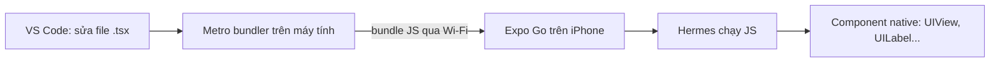

# Chương 1 — Cài đặt và dự án đầu tiên

## Mục tiêu

Sau chương này bạn sẽ:

- Hiểu React Native (RN) là gì và Expo đứng ở đâu.
- Tạo một dự án Expo SDK 57 bằng TypeScript.
- Chạy app trên iPhone bằng **Expo Go** và thấy **Fast Refresh** (tự cập nhật khi lưu file).
- Biết cách chạy type-check, lint và test cho dự án.

## Giải thích đơn giản

**React Native** cho phép bạn viết app iOS/Android bằng TypeScript + React. Khác với Ionic
(chạy trong WebView), RN vẽ **component native thật** (native component): `<View>` trên iOS
là `UIView`, `<Text>` là `UITextView` (theo bảng trong tài liệu RN). Code TypeScript của bạn chạy trong một
**JavaScript engine** tên là **Hermes** trên điện thoại.

**Expo** là một **framework** (bộ khung) cho React Native — giống như Angular CLI + Angular
Router + một thư viện lớn các module native (camera, vị trí, lưu trữ...). Tài liệu chính thức
của React Native khuyên: "if you're building a new app with React Native, we recommend using a
Framework", và Expo là framework được giới thiệu đầu tiên.

**Expo Go** là một app có sẵn trên App Store. Nó chứa sẵn phần native của Expo SDK.
Máy tính của bạn chạy **Metro** (bundler — công cụ đóng gói JS, giống webpack/esbuild của
Angular CLI); Expo Go tải bundle JS qua mạng LAN và chạy nó. Vì vậy bạn **không cần Mac hay
Xcode** để thử app trên iPhone.



## Ví dụ

### Bước 1 — Chuẩn bị

| Công cụ | Phiên bản dùng trong sách | Ghi chú |
|---|---|---|
| Node.js | 22.22.2 (LTS) | RN 0.85+ cần Node ≥ 20.19.4 |
| Expo SDK | 57 (`expo@57.0.25`) | Xem `STACK.md` |
| Expo Go (iPhone) | bản trên App Store hỗ trợ SDK 57 | **UNVERIFIED**: xem `STACK.md` mục 4 |
| Tài khoản Expo | miễn phí, tạo tại expo.dev | Bắt buộc cho Expo Go trên iPhone thật |

Điều mới ở SDK 57: theo tài liệu Expo (`get-started/start-developing.mdx`), trên iPhone thật
Expo Go chỉ mở project khi **Expo CLI và Expo Go đăng nhập cùng một tài khoản**.

### Bước 2 — Tạo dự án

```bash
npx create-expo-app@latest hello-rn --template blank-typescript
cd hello-rn
npx expo login          # đăng nhập tài khoản Expo trên máy tính
npx expo start          # chạy Metro, in ra mã QR
```

Trên iPhone: mở Expo Go → đăng nhập **cùng tài khoản** (biểu tượng tài khoản góc trên bên phải)
→ quét mã QR bằng app Camera. iPhone và máy tính phải cùng mạng Wi-Fi.

> Nếu mạng công ty chặn kết nối LAN, thử `npx expo start --tunnel`.

Trong sách này, mọi ví dụ Tập 1 nằm trong **một** dự án: `vol1-co-ban/examples/`.

```bash
cd books/react-native/vol1-co-ban/examples
npm ci
npx expo start
```

Mở tab **Lab** → "Ch.1 — Hello Expo".

### Bước 3 — Component đầu tiên

File `examples/src/chapters/ch01/HelloExpo.tsx`:

```tsx
import { useState } from 'react';
import { Platform, Pressable, StyleSheet, Text, View } from 'react-native';

export function HelloExpo() {
  const [count, setCount] = useState(0);

  return (
    <View style={styles.container}>
      <Text style={styles.title}>Xin chào React Native 👋</Text>
      <Text>Bạn đang chạy trên: {Platform.OS}</Text>
      <Pressable accessibilityRole="button" style={styles.button} onPress={() => setCount((c) => c + 1)}>
        <Text style={styles.buttonText}>Đã bấm {count} lần</Text>
      </Pressable>
    </View>
  );
}
```

Đổi chữ "Xin chào" rồi lưu: Expo Go cập nhật ngay mà không mất state (Fast Refresh).

### Bước 4 — Kiểm tra chất lượng

```bash
npm run typecheck   # tsc --noEmit
npm run lint        # eslint với eslint-config-expo
npm test            # jest với preset jest-expo
```

Test cho component trên (`HelloExpo.test.tsx`):

```tsx
test('bấm nút thì tăng bộ đếm', async () => {
  const user = userEvent.setup();
  await render(<HelloExpo />);
  expect(screen.getByText('Bạn đang chạy trên: ios')).toBeOnTheScreen(); // jest-expo mặc định giả lập iOS
  await user.press(screen.getByRole('button', { name: 'Đã bấm 0 lần' }));
  expect(screen.getByRole('button', { name: 'Đã bấm 1 lần' })).toBeOnTheScreen();
});
```

Kết quả thật (chạy ngày 2026-09-28, `npx jest --verbose src/chapters/ch01`):

```text
PASS src/chapters/ch01/HelloExpo.test.tsx
  ✓ bấm nút thì tăng bộ đếm
PASS src/chapters/ch01/exercise.solution.test.tsx
  ✓ nút Đặt lại bị vô hiệu khi 0 và đưa bộ đếm về 0
Test Suites: 2 passed, 2 total
Tests:       2 passed, 2 total
```

**Chạy trên Expo Go: NOT RUN** (không có iPhone trong sandbox). Thay vào đó, chúng tôi đã
chạy `npx expo export --platform ios` thành công: Metro tạo được bundle Hermes
(`entry-….hbc`, khoảng 2.4 MB) cho iOS.

## Đi sâu

### Expo Go hay development build?

| | Expo Go | Development build |
|---|---|---|
| Cài đặt | Tải từ App Store | Bạn tự build (EAS Build hoặc Xcode) |
| Native module | Chỉ các module có sẵn trong Expo SDK | Bất kỳ thư viện native nào |
| SDK | Chỉ **một** SDK (mới nhất) | SDK bạn chọn |
| Khi nào dùng | Học, prototype | App thật, sản phẩm |

Tài liệu Expo (`develop/development-builds/introduction.mdx`) mô tả development build là
"essentially your own version of Expo Go". Cả Tập 1 và Tập 2 chỉ dùng module có trong Expo Go.
Tập 3 sẽ dùng development build.

### New Architecture và Hermes (giới thiệu)

Từ React Native 0.82, app **chỉ** chạy trên **New Architecture** (kiến trúc mới: JSI, Fabric,
TurboModules). Từ 0.84, **Hermes V1** là engine mặc định. Bạn không cần cấu hình gì; Tập 3
sẽ giải thích chi tiết.

### Cấu trúc dự án ví dụ

```text
examples/
  app.json              # cấu hình app (tên, scheme, plugin) — giống angular.json + manifest
  package.json          # phiên bản được ghim chính xác
  tsconfig.json         # extends "expo/tsconfig.base", alias "@/*" → src/*
  eslint.config.js      # eslint-config-expo (flat config)
  src/app/              # các màn hình (Expo Router, file-based) — Chương 7
  src/features/tasks/   # logic + component của app mẫu — Chương 8
  src/chapters/chNN/    # code ví dụ + lời giải bài tập của từng chương
```

## Lỗi và bẫy thường gặp

- **"Project is incompatible with this version of Expo Go"**: SDK của project khác SDK của
  Expo Go. Expo Go chỉ hỗ trợ SDK mới nhất. Cách sửa: nâng SDK
  (`npx expo install expo@^<SDK mới> --fix`).
- **Lỗi đăng nhập trên iPhone**: CLI và Expo Go phải cùng tài khoản. Chạy `npx expo login`,
  rồi đăng nhập trong Expo Go, bấm **Try Again**.
- **Quét QR không kết nối**: khác mạng Wi-Fi, hoặc firewall. Dùng `--tunnel`.
- **Viết chữ ngoài `<Text>`**: RN báo lỗi "Text strings must be rendered within a <Text>
  component". Web cho phép chữ trong `<div>`, RN thì không.
- **Dùng `npm install` cho thư viện native**: nên dùng `npx expo install <pkg>` để lấy đúng
  phiên bản tương thích với SDK.

## Tóm tắt

- React Native vẽ UI native; Expo là framework được docs chính thức khuyên dùng.
- Expo Go giúp chạy app trên iPhone không cần Mac, nhưng chỉ với SDK mới nhất và module có sẵn.
- SDK 57 cần đăng nhập cùng tài khoản ở CLI và Expo Go.
- Luôn chạy `typecheck`, `lint`, `test` trước khi commit.

## Bài tập (có lời giải)

**Bài 1.** Thêm nút **"Đặt lại"** vào `HelloExpo`. Nút đưa bộ đếm về 0 và bị vô hiệu
(`disabled`) khi bộ đếm đang bằng 0. Viết test.

<details>
<summary>Lời giải</summary>

File `examples/src/chapters/ch01/exercise.solution.tsx`:

```tsx
export function HelloWithReset() {
  const [count, setCount] = useState(0);
  return (
    <View style={{ padding: 24, gap: 12 }}>
      <Pressable accessibilityRole="button" onPress={() => setCount((c) => c + 1)}>
        <Text>Đã bấm {count} lần</Text>
      </Pressable>
      <Pressable
        accessibilityRole="button"
        disabled={count === 0}
        accessibilityState={{ disabled: count === 0 }}
        onPress={() => setCount(0)}
        style={{ opacity: count === 0 ? 0.4 : 1 }}
      >
        <Text>Đặt lại</Text>
      </Pressable>
    </View>
  );
}
```

Test (`exercise.solution.test.tsx`) dùng matcher `toBeDisabled()` / `toBeEnabled()`:

```tsx
expect(screen.getByRole('button', { name: 'Đặt lại' })).toBeDisabled();
await user.press(screen.getByRole('button', { name: 'Đã bấm 0 lần' }));
expect(screen.getByRole('button', { name: 'Đặt lại' })).toBeEnabled();
```

Vì sao cần cả `disabled` và `accessibilityState`? `disabled` chặn sự kiện bấm;
`accessibilityState` báo cho VoiceOver (trình đọc màn hình của iOS) và cho test biết nút bị vô hiệu.
</details>

**Bài 2.** Chạy `npx expo start`, mở app trên iPhone, rồi lắc máy (shake) để mở **Dev Menu**.
Tìm nút mở React Native DevTools. Ghi lại 3 mục bạn thấy trong menu.

<details>
<summary>Lời giải</summary>

Đây là bài thực hành trên máy thật nên không có đáp án cố định. Bạn thường thấy các mục như
**Reload**, **Toggle Element Inspector**, **Open DevTools** (tên mục chính xác có thể khác theo phiên bản — **UNVERIFIED**, chưa xem được trên máy thật). Nếu không lắc được,
nhấn `m` trong terminal đang chạy `expo start` để mở Dev Menu trên thiết bị.
(Chúng tôi không chạy được bước này trong sandbox — **NOT RUN**.)
</details>

## Nguồn tham khảo (Sources)

Đã mở ngày 2026-09-28:

- React Native — Get Started (mã nguồn docs): https://github.com/facebook/react-native-website/blob/main/docs/getting-started.md
- Expo — Create a project: https://github.com/expo/expo/blob/main/docs/pages/get-started/create-a-project.mdx
- Expo — Start developing (đăng nhập Expo Go): https://github.com/expo/expo/blob/main/docs/pages/get-started/start-developing.mdx
- Expo — Development builds introduction: https://github.com/expo/expo/blob/main/docs/pages/develop/development-builds/introduction.mdx
- Expo — Upgrading SDK walkthrough: https://github.com/expo/expo/blob/main/docs/pages/workflow/upgrading-expo-sdk-walkthrough.mdx
- React Native 0.82 blog (New Architecture only): https://github.com/facebook/react-native-website/blob/main/website/blog/2025-10-08-react-native-0.82.mdx
- React Native 0.84 blog (Hermes V1): https://github.com/facebook/react-native-website/blob/main/website/blog/2026-02-11-react-native-0.84.mdx
- React Native Testing Library v14 — LLM guidelines (API async): https://github.com/callstack/react-native-testing-library/blob/main/docs/guides/llm-guidelines.md
