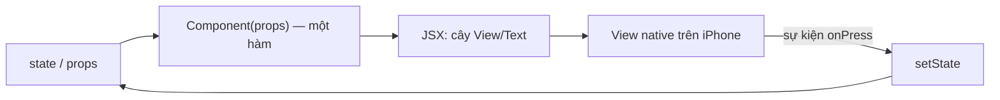

# Chương 2 — React Native cho Angular developer

## Mục tiêu

Bạn đã giỏi Angular. Chương này giúp bạn **chuyển kiến thức** sang React Native thật nhanh:

- Đối chiếu từng khái niệm: component, template, service/DI, RxJS/Signals, routing, forms, testing.
- Hiểu điểm khác lớn nhất: React là **"UI = f(state)"**, render lại cả hàm component khi state đổi.
- Viết 4 ví dụ nhỏ có test: `@Input/@Output`, Signals, DI, `debounceTime`.

## Giải thích đơn giản

Trong Angular, một component là **một class** + **một template HTML**. Angular theo dõi thay đổi
(change detection, hoặc Signals) và cập nhật DOM.

Trong React, một component là **một hàm TypeScript** trả về **JSX** (cú pháp giống HTML nằm ngay
trong code). Mỗi khi state hoặc props đổi, React **gọi lại hàm đó**, so sánh kết quả mới với cũ,
và chỉ cập nhật phần khác (trên RN: cập nhật view native).



Không có `ngOnChanges`, không có zone.js, không có module. Chỉ có **hàm**, **hook**
(các hàm bắt đầu bằng `use...`) và **props**.

## Ví dụ

### Bảng đối chiếu chính

| Angular | React Native (sách dùng) | Ghi chú |
|---|---|---|
| `@Component` class + template | Hàm component trả về JSX | Không có file `.html` riêng |
| `<div>`, `<span>`, `<p>` | `<View>`, `<Text>` | Mọi chữ phải nằm trong `<Text>` |
| `<button (click)>` | `<Pressable onPress>` | `Button` có sẵn nhưng khó style |
| `<input [(ngModel)]>` | `<TextInput value onChangeText>` | Luôn "controlled" |
| `` | `<Image source={{ uri }}>` | Cần width/height |
| `*ngFor` / `@for` | `array.map()` hoặc `<FlatList>` | Danh sách dài → `FlatList` (Chương 5) |
| `*ngIf` / `@if` | `{cond ? <A/> : null}` | Toán tử JS thường |
| `[class.active]`, SCSS | `style={[styles.a, active && styles.b]}` | `StyleSheet.create`, không có CSS cascade (Chương 4) |
| `@Input()` / `input()` | props | Chỉ đọc (read-only) |
| `@Output()` / `output()` | callback prop `onChange` | Hàm được truyền xuống |
| `ngOnInit` / `ngOnDestroy` | `useEffect(() => { ...; return cleanup }, [])` | Một hook cho cả hai |
| `ngOnChanges` | `useEffect(..., [prop])` hoặc tính trực tiếp khi render | |
| `signal()` | `useState()` (cục bộ) / store (toàn cục) | Xem ví dụ `createSignal` |
| `computed()` | `useMemo()` hoặc tính trực tiếp | |
| `effect()` | `useEffect()` | |
| Service `@Injectable` + DI | Custom hook + Context, hoặc store (Zustand, Tập 2) | |
| `providers: [{ provide, useClass }]` | `<Context.Provider value={impl}>` | |
| RxJS `Observable` | Promise + hook; TanStack Query cho HTTP (Tập 2) | RxJS vẫn dùng được nếu muốn |
| `debounceTime` | hook `useDebouncedValue` | |
| `HttpClient` | `fetch` (có sẵn) | Interceptor → hàm wrapper |
| Angular Router | **Expo Router** (file-based) | Chương 7 |
| `[routerLink]` | `<Link href>` | |
| `ActivatedRoute.paramMap` | `useLocalSearchParams()` | |
| Route guard `canActivate` | `<Redirect>` / `Stack.Protected` trong layout | Tập 2–3 |
| Reactive Forms + Validators | `useState` + hàm validate thuần (Chương 6) | Thư viện: react-hook-form |
| `TestBed` + Jasmine/Jest | Jest + `jest-expo` + React Native Testing Library | |
| `fixture.debugElement.query(By.css)` | `screen.getByRole(...)` | Tìm theo vai trò, như người dùng thấy |
| Angular CLI `ng serve` | `npx expo start` | |
| `ng build` | `npx expo export` / EAS Build | Tập 3 |

### Ví dụ 1 — `@Input/@Output` → props + callback

Angular:

```ts
@Component({ selector: 'app-rating', template: `...` })
export class RatingComponent {
  @Input() value = 0;
  @Output() valueChange = new EventEmitter<number>();
}
```

React Native (`examples/src/chapters/ch02/RatingStars.tsx`):

```tsx
interface RatingStarsProps {
  value: number;
  max?: number;
  onChange: (value: number) => void;
}

export function RatingStars({ value, max = 5, onChange }: RatingStarsProps) {
  return (
    <View style={{ flexDirection: 'row' }}>
      {Array.from({ length: max }, (_, i) => i + 1).map((n) => (
        <Pressable
          key={n}
          accessibilityRole="button"
          accessibilityLabel={`${n} sao`}
          accessibilityState={{ selected: n <= value }}
          onPress={() => onChange(n)}
        >
          <Text style={{ fontSize: 32 }}>{n <= value ? '★' : '☆'}</Text>
        </Pressable>
      ))}
    </View>
  );
}
```

Component cha giữ state: `const [rating, setRating] = useState(3);` rồi
`<RatingStars value={rating} onChange={setRating} />` — đây chính là "banana in a box"
`[(value)]` nhưng viết tường minh.

### Ví dụ 2 — Signals → `useSyncExternalStore`

React không có Signals. Nhưng ý tưởng "một giá trị, ai quan tâm thì đăng ký nghe" rất dễ viết
(`ch02/signal.ts`):

```ts
export function createSignal<T>(initial: T): Signal<T> {
  let value = initial;
  const listeners = new Set<() => void>();
  const set = (next: T) => {
    if (Object.is(next, value)) return; // giống Angular: không đổi thì không báo
    value = next;
    listeners.forEach((l) => l());
  };
  return {
    get: () => value,
    set,
    update: (fn) => set(fn(value)),
    subscribe: (listener) => {
      listeners.add(listener);
      return () => listeners.delete(listener);
    },
  };
}

export function useSignal<T>(signal: Signal<T>): T {
  return useSyncExternalStore(signal.subscribe, signal.get, signal.get);
}
```

`useSyncExternalStore` là hook chính thức của React để đọc một "store bên ngoài". Zustand
(Tập 2) cũng dựa trên cùng ý tưởng. Trong app thật bạn sẽ dùng Zustand, không tự viết.

### Ví dụ 3 — DI → Context

```tsx
export interface GreetingService { greet: (name: string) => string }

export const friendlyGreeting: GreetingService = { greet: (name) => `Chào ${name}!` };
export const formalGreeting: GreetingService = { greet: (name) => `Kính chào anh/chị ${name}.` };

const GreetingContext = createContext<GreetingService>(friendlyGreeting);

export function GreetingProvider({ service, children }: { service: GreetingService; children: ReactNode }) {
  const value = useMemo(() => service, [service]);
  return <GreetingContext.Provider value={value}>{children}</GreetingContext.Provider>;
}

// Giống inject(GreetingService)
export function useGreeting(): GreetingService {
  return useContext(GreetingContext);
}
```

- `createContext(default)` ~ `providedIn: 'root'` với giá trị mặc định.
- `<GreetingProvider service={formalGreeting}>` ~ `providers: [{ provide: GreetingService, useValue: formalGreeting }]`
  trong một component con — **hierarchical injector** y như Angular.
- Trong test, bạn bọc component bằng Provider với bản giả (mock) — giống `TestBed.overrideProvider`.

### Ví dụ 4 — RxJS `debounceTime` → hook

```ts
// RxJS: this.search$.pipe(debounceTime(300), distinctUntilChanged())
export function useDebouncedValue<T>(value: T, delayMs = 300): T {
  const [debounced, setDebounced] = useState(value);
  useEffect(() => {
    const timer = setTimeout(() => setDebounced(value), delayMs);
    return () => clearTimeout(timer); // chạy khi value đổi hoặc component bị hủy (ngOnDestroy)
  }, [value, delayMs]);
  return debounced;
}
```

Hàm `return` trong `useEffect` giống `unsubscribe()` / `takeUntilDestroyed()`.

### Kết quả test thật

Chạy ngày 2026-09-28, `npx jest --verbose src/chapters/ch02`:

```text
PASS src/chapters/ch02/angular-mapping.test.tsx
  Angular → React Native
    ✓ RatingStars: props đi xuống, callback đi lên (như @Input/@Output)
    ✓ createSignal: set/update/subscribe, bỏ qua giá trị không đổi
    ✓ Context thay implementation giống providers: [{ provide, useClass }]
    ✓ useDebouncedValue chỉ cập nhật sau 300ms (debounceTime)
    ✓ Demo: bấm "Thêm vào giỏ" làm badge cập nhật
PASS src/chapters/ch02/exercise.solution.test.ts
  ✓ createComputed tính lại khi nguồn đổi
Test Suites: 2 passed, 2 total
Tests:       6 passed, 6 total
```

Trên Expo Go: tab **Lab** → "Ch.2 — Angular → React Native" (**NOT RUN** trong sandbox).

## Đi sâu

### Routing: Angular Router ↔ Expo Router

| Angular | Expo Router |
|---|---|
| `const routes: Routes = [{ path: 'task/:id', component: TaskDetail }]` | Tạo file `src/app/task/[id].tsx` |
| `<router-outlet>` + layout component | File `_layout.tsx` (Stack, Tabs) |
| `router.navigate(['/task', id])` | `router.push(\`/task/${id}\`)` |
| Lazy loading module | Mặc định mỗi route là một file; Metro bundle theo route trên web |
| Child routes | Thư mục lồng nhau + `_layout.tsx` |

### Forms: Reactive Forms ↔ controlled components

Angular có `FormGroup`, `FormControl`, `Validators`, trạng thái `touched/dirty`. React Native
không có sẵn thư viện form. Cách đơn giản và dễ test nhất (Chương 6): state bằng `useState`,
validate bằng **hàm thuần** `validate(values) → errors`, tự quản `touched`. Khi form lớn,
dùng thư viện như `react-hook-form` (không dùng trong sách này để giữ ít phụ thuộc).

### Testing: TestBed ↔ React Native Testing Library

| Angular | RN (jest-expo + RNTL 14) |
|---|---|
| `TestBed.configureTestingModule({ providers })` | `render(<X/>, { wrapper: Providers })` |
| `fixture.detectChanges()` | Không cần; `await render()` và `await user.press()` tự xử lý |
| `By.css('.btn')` | `screen.getByRole('button', { name: 'Lưu' })` |
| `fakeAsync` + `tick(300)` | `jest.useFakeTimers()` + `jest.advanceTimersByTime(300)` |
| `HttpTestingController` | mock `fetch` (Tập 2) |

**Chú ý RNTL v14:** `render`, `renderHook`, `fireEvent`, `userEvent` đều **async**. Luôn `await`.

### Tư duy khác biệt quan trọng

1. **Immutability (bất biến):** không sửa object/array trong state; tạo bản mới
   (`[...list, item]`, `{ ...obj, done: true }`). React so sánh bằng tham chiếu.
2. **Render là hàm thuần:** không gọi API, không `setState` trực tiếp trong thân hàm component.
   Side effect đặt trong `useEffect` hoặc handler sự kiện.
3. **Quy tắc của hook:** chỉ gọi hook ở cấp cao nhất của component/hook khác, không trong
   `if`/vòng lặp. ESLint (`eslint-config-expo`) kiểm tra việc này.
4. **Không có CSS toàn cục:** style gắn trực tiếp vào từng component.

## Lỗi và bẫy thường gặp

- **Mutate state:** `tasks.push(t); setTasks(tasks)` → UI không cập nhật vì cùng tham chiếu.
  Viết `setTasks([...tasks, t])`.
- **Quên dependency trong `useEffect`:** giá trị "cũ" (stale closure). Tin lời cảnh báo của ESLint.
- **Tạo Context value mới mỗi lần render:** mọi consumer render lại. Dùng `useMemo` như ví dụ 3.
- **Mang RxJS vào mọi thứ:** được, nhưng thường không cần. Promise + hook + TanStack Query là đủ.
- **Tìm `ngOnChanges`:** thường bạn chỉ cần **tính trực tiếp** từ props khi render.

## Tóm tắt

- Component = hàm; template = JSX; `@Input/@Output` = props/callback.
- Service + DI = hook + Context (hoặc store). Signals ≈ `useState`/`useSyncExternalStore`.
- RxJS operator phổ biến có thể thay bằng hook nhỏ.
- Expo Router = routing theo file. Test theo cách người dùng thấy, và nhớ `await`.

## Bài tập (có lời giải)

**Bài 1.** Viết `createComputed(sources, compute)` — tương đương `computed()` của Angular —
dùng `createSignal` ở trên. Khi một nguồn đổi, tính lại; chỉ báo listener khi kết quả đổi.

<details>
<summary>Lời giải</summary>

`examples/src/chapters/ch02/exercise.solution.ts`:

```ts
export function createComputed<T>(sources: Signal<unknown>[], compute: () => T): ReadonlySignal<T> {
  let value = compute();
  const listeners = new Set<() => void>();
  for (const s of sources) {
    s.subscribe(() => {
      const next = compute();
      if (Object.is(next, value)) return;
      value = next;
      listeners.forEach((l) => l());
    });
  }
  return {
    get: () => value,
    subscribe: (l) => {
      listeners.add(l);
      return () => listeners.delete(l);
    },
  };
}
```

Test: `price = 100, qty = 2 → total 200`; `qty.set(3) → total 300`, listener được gọi đúng 1 lần.
Khác với Angular: Angular tự phát hiện signal nào được đọc (auto-tracking); ở đây ta khai báo
nguồn bằng tay. Đó là lý do Angular Signals tiện hơn — và vì sao trong React ta thường chỉ dùng
`useMemo(() => price * qty, [price, qty])`.
</details>

**Bài 2.** Viết lại service Angular sau bằng React (hook + Context), rồi nói cách mock nó trong test:

```ts
@Injectable({ providedIn: 'root' })
export class ClockService { now(): Date { return new Date(); } }
```

<details>
<summary>Lời giải</summary>

```tsx
export interface ClockService { now: () => Date }
const ClockContext = createContext<ClockService>({ now: () => new Date() });
export const useClock = () => useContext(ClockContext);

// Trong test:
const fixed: ClockService = { now: () => new Date(2026, 0, 1) };
await render(<ClockContext.Provider value={fixed}><MyScreen /></ClockContext.Provider>);
```

Mẫu này giống hệt `GreetingService` ở ví dụ 3 (đã được test trong `angular-mapping.test.tsx`).
</details>

## Nguồn tham khảo (Sources)

Đã mở ngày 2026-09-28:

- React Native — Core Components and Native Components: https://github.com/facebook/react-native-website/blob/main/docs/intro-react-native-components.md
- React Native — Handling Text Input: https://github.com/facebook/react-native-website/blob/main/docs/handling-text-input.md
- Expo Router — Core concepts: https://github.com/expo/expo/blob/main/docs/pages/router/basics/core-concepts.mdx
- Expo Router — Navigation: https://github.com/expo/expo/blob/main/docs/pages/router/basics/navigation.mdx
- React Native Testing Library (hướng dẫn v14 đi kèm gói npm): https://github.com/callstack/react-native-testing-library
- Angular Signals (mã nguồn docs angular.dev; trang angular.dev bị chặn trong sandbox): https://github.com/angular/angular/blob/main/adev/src/content/guide/signals/overview.md
