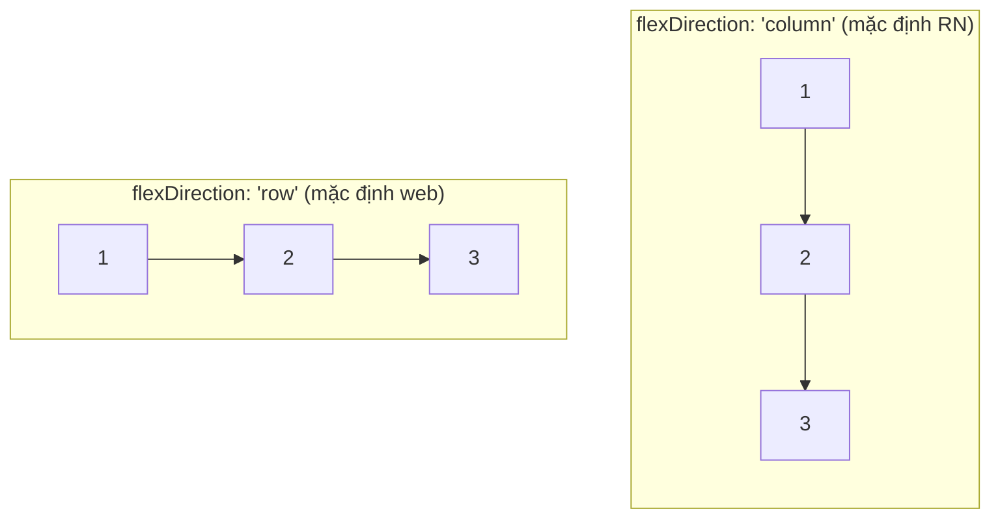

# Chương 4 — Styling và Flexbox

## Mục tiêu

- Viết style bằng `StyleSheet.create` và mảng style.
- Nắm **Flexbox** trong RN và các khác biệt so với CSS web.
- Làm layout thường gặp: hàng/cột, căn giữa, lưới 2 cột, nút nổi (floating button).
- Biết cách xử lý kích thước màn hình, dark mode, và code riêng cho từng nền tảng.

## Giải thích đơn giản

React Native **không có CSS**. Style là **object JavaScript**. Tên thuộc tính viết kiểu
camelCase: `backgroundColor` thay cho `background-color`. Số **không có đơn vị**: `16` là
16 "điểm" (density-independent pixels — điểm độc lập mật độ), iPhone tự nhân theo độ nét màn hình.

Mọi `View` đều là một **flex container**. Chỉ cần nhớ 3 thuộc tính chính:

- `flexDirection`: trục chính đi dọc (`column`, **mặc định**) hay ngang (`row`).
- `justifyContent`: xếp con trên **trục chính**.
- `alignItems`: xếp con trên **trục phụ** (vuông góc).



## Ví dụ

### Style cơ bản và mảng style

```tsx
const styles = StyleSheet.create({
  base: { paddingVertical: 12, paddingHorizontal: 16, borderRadius: 10, alignItems: 'center' },
  primary: { backgroundColor: '#2563eb' },
  pressed: { opacity: 0.7 },
  disabled: { opacity: 0.4 },
});

<Pressable style={({ pressed }) => [styles.base, styles.primary, pressed && styles.pressed, disabled && styles.disabled]} />
```

Trong mảng, style **sau thắng style trước** (giống thứ tự CSS). Giá trị `false`/`null` bị bỏ qua,
nên viết `cond && styles.x` rất tiện — giống `[class.x]="cond"`. Đoạn trên lấy từ
`examples/src/components/AppButton.tsx`.

### Flexbox playground

`examples/src/chapters/ch04/FlexPlayground.tsx` cho bạn bấm để đổi `flexDirection`,
`justifyContent`, `alignItems` và thấy ngay kết quả trên iPhone (tab **Lab** → "Ch.4").
Logic đổi lựa chọn là một hàm thuần:

```ts
export const DIRECTIONS = ['column', 'row', 'column-reverse', 'row-reverse'] as const;

export function nextOption<T>(options: readonly T[], current: T): T {
  const i = options.indexOf(current);
  return options[(i + 1) % options.length];
}
```

Test kiểm tra style thật trên view bằng matcher `toHaveStyle`:

```tsx
await render(<FlexPlayground />);
expect(screen.getByTestId('flex-box')).toHaveStyle({ flexDirection: 'column' });
await user.press(screen.getByRole('button', { name: 'flexDirection: column' }));
expect(screen.getByTestId('flex-box')).toHaveStyle({ flexDirection: 'row' });
```

Kết quả (2026-09-28):

```text
PASS src/chapters/ch04/flex.test.tsx
  Chương 4 — Flexbox
    ✓ nextOption quay vòng về đầu danh sách
    ✓ mặc định là column; bấm nút đổi sang row
PASS src/chapters/ch04/exercise.solution.test.tsx
  ✓ TwoColumnGrid dùng row + wrap, mỗi ô rộng 48%
  ✓ Bài 2: columnsFor và ResponsiveGrid trên màn hình iPad
Test Suites: 2 passed, 2 total
Tests:       4 passed, 4 total
```

### Layout thường gặp

| Muốn | Style |
|---|---|
| Chiếm hết màn hình | `{ flex: 1 }` |
| Căn giữa cả hai chiều | `{ flex: 1, justifyContent: 'center', alignItems: 'center' }` |
| Một hàng: icon + chữ co giãn + nút | cha `{ flexDirection: 'row', alignItems: 'center', gap: 12 }`, chữ `{ flex: 1 }` |
| Khoảng cách giữa các con | `gap`, `rowGap`, `columnGap` |
| Nút nổi góc phải dưới | `{ position: 'absolute', right: 24, bottom: 24 }` |
| Lưới 2 cột | cha `{ flexDirection: 'row', flexWrap: 'wrap', justifyContent: 'space-between' }`, con `{ width: '48%' }` |

Ví dụ thật: hàng công việc trong `src/features/tasks/TaskItem.tsx` dùng
`flexDirection: 'row'` + `gap` + phần chữ `flex: 1`; nút "＋" ở `src/app/(tabs)/index.tsx`
dùng `position: 'absolute'`.

## Đi sâu

### Khác biệt với CSS web (theo tài liệu RN)

Tài liệu Flexbox của RN nói rõ: `flexDirection` mặc định `column` (web: `row`),
`alignContent` mặc định `flex-start` (web: `stretch`), `flexShrink` mặc định `0` (web: `1`),
và `flex` chỉ nhận **một số**.

Ngoài ra:

- **Không kế thừa style** (no cascade) — trừ trong `<Text>` lồng nhau (Text con kế thừa font/màu từ Text cha).
- **Không có selector**, không `:hover`, không media query. Dùng JS: `useWindowDimensions()`.
- `%` được hỗ trợ cho width/height/margin... nhưng cha phải có kích thước xác định.
- `StyleSheet.hairlineWidth`: đường kẻ mảnh nhất mà màn hình vẽ được — đẹp cho dòng phân cách.

### Responsive: `useWindowDimensions`

```tsx
const { width } = useWindowDimensions();
const columns = width >= 768 ? 3 : 2; // iPad xoay ngang → 3 cột
```

Hook này tự cập nhật khi xoay màn hình. Tránh `Dimensions.get()` một lần ở đầu file (không cập nhật).

### Dark mode

`useColorScheme()` trả về `'light' | 'dark'`. App ví dụ đặt `"userInterfaceStyle": "automatic"`
trong `app.json` để app theo cài đặt của iPhone. Mẫu đơn giản:

```tsx
const scheme = useColorScheme();
const bg = scheme === 'dark' ? '#111827' : '#ffffff';
```

### Code riêng cho iOS/Android

- `Platform.OS === 'ios'` hoặc `Platform.select({ ios: 12, android: 8 })`.
- File riêng: `Button.ios.tsx` và `Button.android.tsx` — Metro tự chọn.
- Ví dụ trong sách: `KeyboardAvoidingView behavior={Platform.OS === 'ios' ? 'padding' : undefined}` (Chương 6).

### Safe area (tai thỏ, Dynamic Island)

Màn hình dùng Expo Router (Stack/Tabs) đã tự tránh phần header và thanh tab. Khi bạn tự làm màn
hình full-screen, dùng `SafeAreaView` hoặc hook `useSafeAreaInsets()` của
`react-native-safe-area-context` (đã có trong dự án).

## Lỗi và bẫy thường gặp

- **Quên `flex: 1` ở màn hình gốc** → nội dung co lại, `FlatList` không cuộn được.
- **Nghĩ mặc định là `row`** như web → mọi thứ xếp dọc.
- **Chữ bị tràn trong hàng**: cho phần chữ `flex: 1` và `numberOfLines={1}`.
- **`width: '50%'` hai ô + `gap`** → tràn dòng. Dùng `48%` + `space-between`, hoặc tính bằng `useWindowDimensions`.
- **`StyleSheet.absoluteFillObject`**: đã bị **xóa** ở RN 0.85. Dùng `StyleSheet.absoluteFill`.
- **Style inline object mới mỗi render** (`style={{...}}`) không sai, nhưng trong danh sách dài nên dùng `StyleSheet.create`.

## Tóm tắt

- Style = object JS, camelCase, số không đơn vị. Mảng style: sau thắng trước.
- Flexbox RN: mặc định `column`, `flexShrink: 0`, `alignContent: 'flex-start'`.
- `gap`, `flexWrap`, `position: 'absolute'`, `%` giải quyết hầu hết layout.
- Responsive bằng `useWindowDimensions`, dark mode bằng `useColorScheme`.

## Bài tập (có lời giải)

**Bài 1.** Làm component `TwoColumnGrid` nhận `items: string[]` và hiển thị lưới 2 cột ô vuông,
khoảng cách giữa các hàng 12. Viết test kiểm tra style.

<details>
<summary>Lời giải</summary>

`examples/src/chapters/ch04/exercise.solution.tsx`:

```tsx
export function TwoColumnGrid({ items }: { items: string[] }) {
  return (
    <View testID="grid" style={styles.grid}>
      {items.map((label) => (
        <View key={label} testID="cell" style={styles.cell}>
          <Text>{label}</Text>
        </View>
      ))}
    </View>
  );
}

const styles = StyleSheet.create({
  grid: { flexDirection: 'row', flexWrap: 'wrap', justifyContent: 'space-between', rowGap: 12, padding: 12 },
  cell: { width: '48%', aspectRatio: 1, borderRadius: 12, backgroundColor: '#dbeafe', alignItems: 'center', justifyContent: 'center' },
});
```

`aspectRatio: 1` làm ô vuông mà không cần biết chiều rộng thật. Test:
`expect(screen.getByTestId('grid')).toHaveStyle({ flexDirection: 'row', flexWrap: 'wrap' })`.
</details>

**Bài 2.** Sửa `TwoColumnGrid` để có **3 cột khi màn hình rộng ≥ 768** (iPad), 2 cột khi hẹp hơn.

<details>
<summary>Lời giải</summary>

```tsx
export function columnsFor(width: number): 2 | 3 {
  return width >= 768 ? 3 : 2;
}

// Tách phần "vẽ" (nhận width qua props) khỏi phần "đọc môi trường" (hook) → dễ test.
export function ResponsiveGrid({ items }: { items: string[] }) {
  const { width } = useWindowDimensions(); // tự cập nhật khi xoay màn hình
  return <ResponsiveGridView items={items} width={width} />;
}

export function ResponsiveGridView({ items, width }: { items: string[]; width: number }) {
  const cellWidth = columnsFor(width) === 3 ? '31%' : '48%';
  return (
    <View style={styles.grid}>
      {items.map((label) => (
        <View key={label} testID="rcell" style={[styles.cell, { width: cellWidth }]}>
          <Text>{label}</Text>
        </View>
      ))}
    </View>
  );
}
```

Test: `await render(<ResponsiveGridView items={['A','B','C']} width={1024} />)` rồi kiểm tra ô
có `width: '31%'`.

**Bài học từ lúc viết test:** lần đầu chúng tôi thử
`import * as RN from 'react-native'` + `jest.spyOn(RN, 'useWindowDimensions')` nhưng **không có tác dụng** (component
vẫn nhận giá trị thật), vì import đã được Babel gắn cố định. Cách sạch hơn là tách component
"vẽ" nhận `width` qua props — giống việc inject một service trong Angular thay vì gọi
`window.innerWidth` trực tiếp.
</details>

## Nguồn tham khảo (Sources)

Đã mở ngày 2026-09-28:

- Style: https://github.com/facebook/react-native-website/blob/main/docs/style.md
- Height and Width: https://github.com/facebook/react-native-website/blob/main/docs/height-and-width.md
- Layout with Flexbox: https://github.com/facebook/react-native-website/blob/main/docs/flexbox.md
- useWindowDimensions: https://github.com/facebook/react-native-website/blob/main/docs/usewindowdimensions.md
- useColorScheme: https://github.com/facebook/react-native-website/blob/main/docs/usecolorscheme.md
- Platform-specific code: https://github.com/facebook/react-native-website/blob/main/docs/platform-specific-code.md
- React Native 0.85 blog (xóa `absoluteFillObject`): https://github.com/facebook/react-native-website/blob/main/website/blog/2026-04-07-react-native-0.85.mdx
