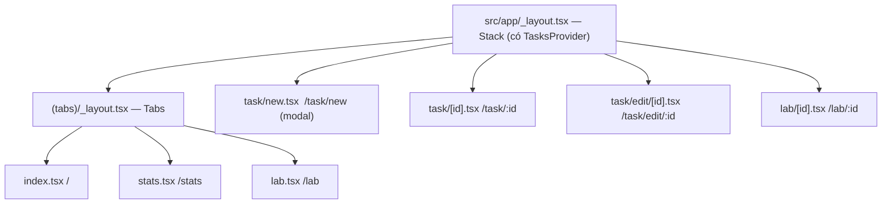

# Chương 7 — Điều hướng (navigation) với Expo Router

## Mục tiêu

- Hiểu **file-based routing** (định tuyến theo file) của Expo Router.
- Dựng Stack + Tabs + modal + route động `[id]`.
- Điều hướng bằng `<Link>`, `router.push`, `router.back`; đọc tham số bằng `useLocalSearchParams`.
- Viết **test tích hợp** cho điều hướng bằng `renderRouter`.

## Giải thích đơn giản

Trong Angular bạn khai báo mảng `routes`. Trong Expo Router, **mỗi file trong `src/app/` là một
màn hình**, và đường dẫn file chính là URL:

| File | URL |
|---|---|
| `src/app/(tabs)/index.tsx` | `/` |
| `src/app/(tabs)/stats.tsx` | `/stats` |
| `src/app/task/new.tsx` | `/task/new` |
| `src/app/task/[id].tsx` | `/task/123` (tham số `id`) |
| `src/app/task/edit/[id].tsx` | `/task/edit/123` |
| `src/app/lab/[id].tsx` | `/lab/ch04` |

- File `_layout.tsx` định nghĩa **navigator** cho thư mục (Stack = chồng màn hình, Tabs = thanh
  tab dưới). Giống component chứa `<router-outlet>`.
- Thư mục trong ngoặc `(tabs)` là **route group**: dùng để nhóm, **không** xuất hiện trong URL.
- Code không phải màn hình (component, hook) để **ngoài** `src/app/` (docs Expo Router yêu cầu vậy).



## Ví dụ

### Layout gốc: Stack + Provider

`examples/src/app/_layout.tsx`:

```tsx
export default function RootLayout() {
  return (
    <TasksProvider>
      <StatusBar style="auto" />
      <Stack>
        <Stack.Screen name="(tabs)" options={{ headerShown: false }} />
        <Stack.Screen name="task/new" options={{ title: 'Việc mới', presentation: 'modal' }} />
        <Stack.Screen name="task/[id]" options={{ title: 'Chi tiết' }} />
        <Stack.Screen name="task/edit/[id]" options={{ title: 'Sửa việc' }} />
        <Stack.Screen name="lab/[id]" options={{ title: 'Lab' }} />
      </Stack>
    </TasksProvider>
  );
}
```

`presentation: 'modal'` làm màn hình "Việc mới" trượt từ dưới lên trên iPhone.

### Tabs

`examples/src/app/(tabs)/_layout.tsx`:

```tsx
export default function TabsLayout() {
  return (
    <Tabs>
      <Tabs.Screen name="index" options={{ title: 'Việc cần làm', tabBarIcon: () => <Icon emoji="✅" /> }} />
      <Tabs.Screen name="stats" options={{ title: 'Thống kê', tabBarIcon: () => <Icon emoji="📊" /> }} />
      <Tabs.Screen name="lab" options={{ title: 'Lab', tabBarIcon: () => <Icon emoji="🧪" /> }} />
    </Tabs>
  );
}
```

(Dùng emoji làm icon để khỏi thêm thư viện icon.)

### Điều hướng

```tsx
// 1) Khai báo: giống [routerLink]
<Link href="/task/new">＋</Link>
<Link href={{ pathname: '/lab/[id]', params: { id: item.id } }}>…</Link>

// 2) Mệnh lệnh: giống router.navigate()
const router = useRouter();
router.push(`/task/${id}`);
router.push({ pathname: '/task/edit/[id]', params: { id: task.id } });
router.back();
```

### Đọc tham số

`examples/src/app/task/[id].tsx`:

```tsx
export default function TaskDetailScreen() {
  // Tham số route, giống ActivatedRoute.snapshot.paramMap.get('id')
  const { id } = useLocalSearchParams<{ id: string }>();
  const { tasks, toggleTask, removeTask } = useTasks();
  const task = tasks.find((t) => t.id === id);
  if (!task) return <View style={styles.screen}><Text>Không tìm thấy việc này.</Text></View>;
  return (
    <View style={styles.screen}>
      <Stack.Screen options={{ title: task.title }} />
      {/* ... */}
    </View>
  );
}
```

`<Stack.Screen options>` **bên trong** màn hình cho phép đặt tiêu đề động (tên công việc).

### Test tích hợp với `renderRouter`

Expo Router có sẵn `expo-router/testing-library`. Nó dựng toàn bộ cây route từ thư mục thật:

```tsx
import { renderRouter } from 'expo-router/testing-library';

async function renderApp(initialUrl: string) {
  const view = renderRouter('./src/app', { initialUrl });
  await view;
  return { getPathname: () => view.getPathname() };
}

it('mở chi tiết khi bấm vào một việc', async () => {
  const app = await renderApp('/');
  const user = userEvent.setup();
  await user.press(await screen.findByLabelText('Mở Đọc chương Flexbox'));
  expect(await screen.findByText('Trạng thái: Chưa xong')).toBeOnTheScreen();
  expect(app.getPathname()).toBe('/task/seed-2');
});
```

**Phát hiện khi viết sách (2026-09-28):** với `expo-router@57.0.23` + RNTL `14.0.1`,
`renderRouter()` trả về **một Promise** (vì `render` của RNTL 14 là async) mà các hàm
`getPathname()`… được gắn thêm vào chính Promise đó. Nếu `return view` từ một hàm `async`,
JavaScript tự "mở" Promise và các hàm này bị mất. Matcher `expect(screen).toHavePathname()`
cũng báo lỗi `screen.getPathname is not a function`. Cách làm trên (giữ biến, `await`, rồi bọc
vào object thường) chạy ổn định.

Kết quả (`npx jest --verbose src/__tests__`):

```text
PASS src/__tests__/app.routes.test.tsx
  App Việc Cần Làm (Expo Router)
    ✓ mở chi tiết khi bấm vào một việc
    ✓ thêm việc mới qua màn hình modal rồi quay về danh sách
    ✓ lọc "Đã xong" chỉ còn việc đã xong
    ✓ màn hình thống kê tính phần trăm
  Tab Lab
    ✓ mở ví dụ Flexbox từ danh sách Lab
    ✓ id không tồn tại thì báo lỗi thân thiện
  Bài tập Chương 7 và 8
    ✓ sửa tiêu đề qua /task/edit/[id]
    ✓ nút "Xóa việc đã xong" ở tab Thống kê
  Xóa việc (bài tập 2, Tập 2 Chương 6)
    ✓ xóa việc sau khi xác nhận trong Alert
```

## Đi sâu

### Deep link

`app.json` có `"scheme": "rnbookvol1"`. Mọi màn hình đều có URL, nên link
`rnbookvol1://task/seed-2` mở thẳng màn hình chi tiết (trong development build / app thật;
với Expo Go, URL có dạng `exp://…` — xem tài liệu Linking của Expo).
Đây là "universal deep-linking" mà tài liệu Expo Router nhấn mạnh.

### `useLocalSearchParams` hay `useGlobalSearchParams`?

Theo tài liệu Expo Router: `useLocalSearchParams` chỉ cập nhật khi URL khớp route **của màn hình
này**; `useGlobalSearchParams` cập nhật mỗi khi URL đổi, có thể làm màn hình nền render thừa.
Mặc định hãy dùng **local**.

### Bảo vệ route (guard)

Angular có `canActivate`. Expo Router có `<Redirect href="/login" />` trong layout và API
`Stack.Protected` (xem trang "Protected routes" trong docs). Tập 3 (Security) dùng cách này.

### Typed routes

Expo có tùy chọn `experiments.typedRoutes` để TypeScript kiểm tra `href`. Sách **không bật** vì
kiểu được sinh ra khi chạy `expo start` (thư mục `.expo/types`, bị `.gitignore`), nên
`tsc --noEmit` trên máy mới/CI sẽ lỗi nếu chưa chạy dev server. Bạn có thể bật khi đã quen.

### State sống ở đâu khi điều hướng?

`TasksProvider` bọc **ngoài** `<Stack>` trong layout gốc, nên mọi màn hình dùng chung một danh
sách. Giống service `providedIn: 'root'`. Nếu đặt Provider trong một màn hình, state sẽ mất khi
màn hình bị gỡ.

## Lỗi và bẫy thường gặp

- **Đặt component thường trong `src/app/`** → Expo Router coi đó là route.
- **Thiếu `default export`** trong file route → lỗi.
- **Tên trong `<Stack.Screen name>` sai** với file → cảnh báo
  "Too many screens defined. Route … is extraneous" (chúng tôi gặp cảnh báo này khi khai báo
  `lab/[id]` trước khi tạo file).
- **Tham số luôn là chuỗi** (hoặc mảng chuỗi): `id` từ URL không phải number. Tự chuyển kiểu.
- **`router.back()` khi màn hình được mở bằng deep link**: không có màn hình trước để quay lại.
  Chúng tôi phát hiện lỗi này nhờ test "xóa việc sau khi xác nhận trong Alert" (mở thẳng
  `/task/seed-2`): React Navigation báo "The action 'GO_BACK' was not handled by any navigator".
  Cách sửa trong app (`src/lib/navigation.ts`):

  ```ts
  export function goBackOr(router: Pick<AppRouter, 'canGoBack' | 'back' | 'replace'>, fallback: Href) {
    if (router.canGoBack()) router.back();
    else router.replace(fallback);
  }
  ```
- **Đọc tham số rồi tin tưởng tuyệt đối**: luôn xử lý trường hợp không tìm thấy (xem màn hình
  "Không tìm thấy việc này" và "Không có ví dụ …").

## Tóm tắt

- File trong `src/app/` = màn hình; `_layout.tsx` = navigator; `(group)` không vào URL; `[id]` = tham số.
- `<Link>` / `router.push` / `router.back`; `useLocalSearchParams` để đọc tham số.
- Provider đặt ở layout gốc để chia sẻ state giữa các màn hình.
- `renderRouter` cho test tích hợp toàn app.

## Bài tập (có lời giải)

**Bài 1.** Thêm màn hình **Sửa việc** tại `/task/edit/[id]`, mở từ nút "Sửa" ở màn hình chi tiết.
Tái sử dụng `TaskForm` với giá trị ban đầu. Sau khi lưu thì quay lại. Viết test tích hợp.

<details>
<summary>Lời giải</summary>

`examples/src/app/task/edit/[id].tsx`:

```tsx
export default function EditTaskScreen() {
  const { id } = useLocalSearchParams<{ id: string }>();
  const { tasks, updateTask } = useTasks();
  const router = useRouter();
  const task = tasks.find((t) => t.id === id);

  if (!task) return <Text>Không tìm thấy việc này.</Text>;

  return (
    <ScrollView keyboardShouldPersistTaps="handled">
      <Stack.Screen options={{ title: 'Sửa việc' }} />
      <TaskForm
        initial={{ title: task.title, note: task.note, priority: task.priority }}
        submitLabel="Cập nhật"
        onSubmit={(input) => {
          updateTask(task.id, input);
          goBackOr(router, { pathname: '/task/[id]', params: { id: task.id } });
        }}
      />
    </ScrollView>
  );
}
```

Nút ở màn hình chi tiết:
`router.push({ pathname: '/task/edit/[id]', params: { id: task.id } })`.

Test (trong `src/__tests__/app.routes.test.tsx`): mở `/task/seed-3` → bấm "Sửa" → kiểm tra URL
`/task/edit/seed-3` → `user.clear` + `user.type` tiêu đề mới → bấm "Cập nhật" → thấy tiêu đề mới
và URL quay về `/task/seed-3`.
</details>

**Bài 2.** Nếu người dùng mở deep link tới một việc không tồn tại, thay vì chữ "Không tìm thấy",
hãy tự chuyển về trang chủ. Dùng API nào?

<details>
<summary>Lời giải</summary>

Dùng component `<Redirect>` của Expo Router:

```tsx
import { Redirect } from 'expo-router';
if (!task) return <Redirect href="/" />;
```

Lời giải được test riêng trong `examples/src/chapters/ch07/redirect.solution.test.tsx`, dùng
**mock routes** (truyền object thay cho thư mục vào `renderRouter`):

```tsx
function Detail() {
  const { id } = useLocalSearchParams<{ id: string }>();
  if (!KNOWN.includes(id)) return <Redirect href="/" />;
  return <Text>Chi tiết {id}</Text>;
}

const view = renderRouter(
  { index: () => <Text>Trang chủ</Text>, 'task/[id]': Detail },
  { initialUrl: '/task/khong-co' },
);
await view;
expect(await screen.findByText('Trang chủ')).toBeOnTheScreen();
expect(view.getPathname()).toBe('/');
```

Kết quả: `✓ deep link tới id không tồn tại thì quay về trang chủ`,
`✓ id hợp lệ thì ở lại màn hình chi tiết`. App mẫu vẫn giữ màn hình "Không tìm thấy" vì thân
thiện hơn khi học.
</details>

## Nguồn tham khảo (Sources)

Đã mở ngày 2026-09-28:

- Expo Router — Core concepts: https://github.com/expo/expo/blob/main/docs/pages/router/basics/core-concepts.mdx
- Expo Router — Notation (group, dynamic route): https://github.com/expo/expo/blob/main/docs/pages/router/basics/notation.mdx
- Expo Router — Navigation layouts: https://github.com/expo/expo/blob/main/docs/pages/router/basics/navigation-layouts.mdx
- Expo Router — URL parameters: https://github.com/expo/expo/blob/main/docs/pages/router/reference/url-parameters.mdx
- Expo Router — Redirects: https://github.com/expo/expo/blob/main/docs/pages/router/reference/redirects.mdx
- Expo Router — Protected routes: https://github.com/expo/expo/blob/main/docs/pages/router/advanced/protected.mdx
- Expo Router — Testing: https://github.com/expo/expo/blob/main/docs/pages/router/reference/testing.mdx
- Expo Router — Typed routes: https://github.com/expo/expo/blob/main/docs/pages/router/reference/typed-routes.mdx
