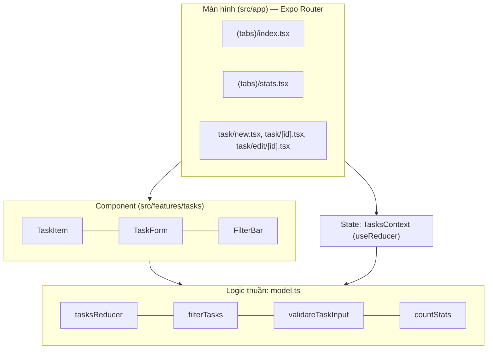

# Chương 8 — App mẫu Tập 1: "Việc Cần Làm"

## Mục tiêu

Ghép mọi thứ của Tập 1 thành một app hoàn chỉnh chạy trong Expo Go:

- Tabs (Việc cần làm / Thống kê / Lab), Stack, modal, route động.
- Danh sách có tìm kiếm + bộ lọc, form có validate, màn hình chi tiết, sửa, xóa.
- State dùng chung bằng `useReducer` + Context.
- Test 3 tầng: logic thuần → component → toàn app (router).

## Giải thích đơn giản

App được chia 3 lớp, giống cách bạn chia Angular app thành model/service/component:



Quy tắc: **logic thuần không import React Native** → test nhanh, không cần render.

## Ví dụ

### Chạy app (lệnh chính xác)

```bash
cd books/react-native/vol1-co-ban/examples
npm ci                 # cài đúng phiên bản trong package-lock.json
npx expo login         # một lần; cùng tài khoản với Expo Go trên iPhone
npx expo start         # quét QR bằng Camera của iPhone
```

Kiểm tra chất lượng:

```bash
npm run typecheck      # tsc --noEmit
npm run lint           # eslint .
npm test               # jest --ci
npm run export:ios     # (tùy chọn) bundle Hermes cho iOS để chắc chắn build được
```

### Reducer — trái tim của app

`examples/src/features/tasks/model.ts`:

```ts
export type TaskAction =
  | { type: 'add'; task: Task }
  | { type: 'toggle'; id: string }
  | { type: 'remove'; id: string }
  | { type: 'update'; id: string; changes: Partial<TaskInput> }
  | { type: 'clearDone' }; // lời giải bài tập Chương 8

export function tasksReducer(state: Task[], action: TaskAction): Task[] {
  switch (action.type) {
    case 'add':
      return [action.task, ...state];
    case 'toggle':
      return state.map((t) => (t.id === action.id ? { ...t, done: !t.done } : t));
    case 'remove':
      return state.filter((t) => t.id !== action.id);
    case 'update':
      return state.map((t) => (t.id === action.id ? { ...t, ...action.changes } : t));
    case 'clearDone':
      return state.filter((t) => !t.done);
  }
}
```

TypeScript kiểm tra `switch` đủ mọi `type` (discriminated union — union có trường phân biệt).
Nếu bạn quên một case, hàm có thể trả `undefined` và `tsc` báo lỗi vì kiểu trả về là `Task[]`.

### Context — "service" dùng chung

`examples/src/features/tasks/TasksContext.tsx` bọc `useReducer` và đưa ra các hàm
`addTask`, `toggleTask`, `removeTask`, `updateTask`, `clearDone`. Màn hình chỉ gọi
`const { tasks, toggleTask } = useTasks();` — giống `inject(TasksService)`.

### Màn hình danh sách

```tsx
const visible = useMemo(() => filterTasks(tasks, filter, query), [tasks, filter, query]);
const openTask = useCallback((id: string) => router.push(`/task/${id}`), [router]);

<FlatList
  data={visible}
  keyExtractor={(t) => t.id}
  renderItem={({ item }) => <TaskItem task={item} onToggle={toggleTask} onOpen={openTask} />}
  ListEmptyComponent={<Text style={styles.empty}>Không có việc nào.</Text>}
/>
```

`TaskItem` bọc `memo`, `openTask` bọc `useCallback`, `toggleTask` đến từ Context (được
`useMemo` giữ ổn định cho tới khi `tasks` đổi) → khi gõ tìm kiếm, các dòng không đổi sẽ không render lại vô ích.

### Kết quả kiểm tra toàn bộ Tập 1 (chạy thật 2026-09-28)

```bash
bash books/react-native/scripts/check-all.sh vol1-co-ban
```

Trích output:

```text
--- typecheck
--- lint
--- test
Test Suites: 16 passed, 16 total
Tests:       56 passed, 56 total
--- export web
web bundle OK
--- export ios
ios bundle OK
ALL CHECKS PASSED: vol1-co-ban
```

(`typecheck` và `lint` không in gì khi không có lỗi.)

**Chạy trên Expo Go: NOT RUN (không có iPhone trong sandbox).** Bằng chứng thay thế: test tích
hợp toàn app bằng `renderRouter` và bundle Hermes iOS được tạo thành công.

## Đi sâu

### Test 3 tầng

| Tầng | File | Kiểm tra gì | Tốc độ |
|---|---|---|---|
| Logic thuần | `features/tasks/model.test.ts` | reducer, lọc, validate, thống kê | Rất nhanh |
| Component | `features/tasks/TaskForm.test.tsx` | form hiện lỗi, gửi dữ liệu | Nhanh |
| Toàn app | `__tests__/app.routes.test.tsx` | điều hướng thật giữa các màn hình | Chậm hơn |

Giống "kim tự tháp test": nhiều test thuần, ít test tích hợp.

### Accessibility để test và cho người dùng

Mọi nút có `accessibilityRole` + nhãn; checkbox có `accessibilityState={{ checked }}`; bộ lọc
dùng `role="tab"` + `selected`; mức ưu tiên dùng `role="radio"`. Nhờ đó test viết được
`getByRole('tab', { name: 'Đã xong' })` và VoiceOver đọc đúng.

### Hạn chế có chủ ý (sẽ làm ở Tập 2–3)

- Dữ liệu **mất khi tắt app** → Tập 2: lưu offline (AsyncStorage/SQLite).
- Chưa có animation khi thêm/xóa → Tập 2: Reanimated.
- Chưa tối ưu danh sách rất dài → Tập 3: FlashList, React Compiler.

## Lỗi và bẫy thường gặp

- **Provider đặt sai chỗ** (trong một màn hình) → mỗi màn hình có danh sách riêng.
- **Quên `router.back()`** sau khi lưu form modal → modal không đóng.
- **So sánh id kiểu number với string** từ URL → không tìm thấy task.
- **Tạo id bằng `Math.random()` trong render** → id đổi mỗi lần render. Tạo id **một lần** khi thêm (`createTask`).
- **Alert trong test**: `Alert.alert` là API native; test luồng xóa cần mock `Alert` (chưa có trong bộ test — xem bài tập Tập 2 Chương Testing).

## Tóm tắt

- App = logic thuần + state (Context/useReducer) + component + màn hình (Expo Router).
- Chia lớp giúp test dễ: 56 test chạy trong vài giây.
- Các chương sau sẽ thêm lưu trữ, animation, API thật, bảo mật và phát hành.

## Bài tập (có lời giải)

**Bài 1.** Thêm nút **"Xóa N việc đã xong"** ở tab Thống kê. Nút bị vô hiệu khi N = 0.

<details>
<summary>Lời giải</summary>

1. Thêm action `{ type: 'clearDone' }` vào `TaskAction` và case trong reducer (xem code ở trên).
2. Thêm `clearDone: () => dispatch({ type: 'clearDone' })` vào `TasksContext`.
3. Trong `src/app/(tabs)/stats.tsx`:

```tsx
<AppButton title={`Xóa ${stats.done} việc đã xong`} variant="danger" disabled={stats.done === 0} onPress={clearDone} />
```

Test (đã có trong dự án):

```text
clearDone (bài tập Chương 8)
  ✓ xóa mọi việc đã xong
Bài tập Chương 7 và 8
  ✓ nút "Xóa việc đã xong" ở tab Thống kê
```
</details>

**Bài 2.** Thêm sắp xếp theo mức ưu tiên (Cao → Thấp) trong `filterTasks` mà **không** làm hỏng
test cũ. Bạn sẽ đặt logic ở đâu và test thế nào?

<details>
<summary>Lời giải</summary>

Đặt trong `model.ts` như một hàm thuần riêng, rồi gọi sau `filterTasks` ở màn hình:

```ts
const RANK: Record<Priority, number> = { high: 0, medium: 1, low: 2 };
export function sortByPriority(tasks: Task[]): Task[] {
  return [...tasks].sort((a, b) => RANK[a.priority] - RANK[b.priority] || b.createdAt - a.createdAt);
}
```

Test thuần: `expect(sortByPriority(SEED_TASKS).map(t => t.id)).toEqual(['seed-1', 'seed-2', 'seed-3'])`.
Tách hàm riêng thay vì sửa `filterTasks` giúp test cũ không đổi (nguyên tắc single responsibility).
Hàm này có trong `model.ts` và test "sortByPriority (bài tập 2 Chương 8)" trong `model.test.ts`.
</details>

## Nguồn tham khảo (Sources)

Đã mở ngày 2026-09-28:

- React — useReducer / Context (mã nguồn react.dev): https://github.com/reactjs/react.dev/blob/main/src/content/reference/react/useReducer.md
- React — Scaling up with Reducer and Context: https://github.com/reactjs/react.dev/blob/main/src/content/learn/scaling-up-with-reducer-and-context.md
- Expo Router — Core concepts: https://github.com/expo/expo/blob/main/docs/pages/router/basics/core-concepts.mdx
- React Native — Accessibility: https://github.com/facebook/react-native-website/blob/main/docs/accessibility.md
- Optimizing FlatList Configuration: https://github.com/facebook/react-native-website/blob/main/docs/optimizing-flatlist-configuration.md
