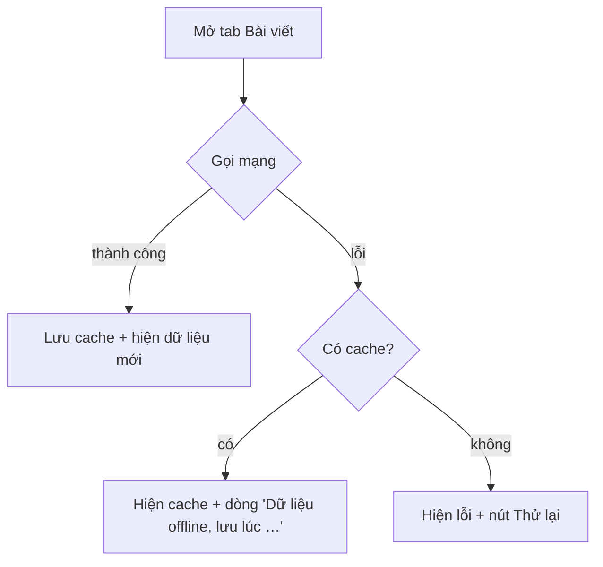

# Chương 3 — Lưu trữ offline: AsyncStorage và expo-sqlite

## Mục tiêu

- Lưu dữ liệu xuống máy để app dùng được khi **mất mạng**.
- Dùng **AsyncStorage** (key-value) và **expo-sqlite** (cơ sở dữ liệu SQL).
- Thiết kế một **repository** có 2 cách cài đặt, chọn được khi chạy — và test được.
- Áp dụng chiến lược **network-first, cache fallback** cho app mẫu.

## Giải thích đơn giản

| | AsyncStorage | expo-sqlite |
|---|---|---|
| Mô hình | key → chuỗi (giống `localStorage`, nhưng **bất đồng bộ**) | bảng, SQL |
| Hợp với | cài đặt, token không nhạy cảm, cache nhỏ dạng JSON | nhiều bản ghi, tìm kiếm, sắp xếp, quan hệ |
| Mã hóa | **Không** | Không (SQLCipher có nhưng không dùng được trong Expo Go) |
| Trong Expo Go SDK 57 | Có (`@react-native-async-storage/async-storage@2.2.0`) | Có (`expo-sqlite@57.0.3`) |

Dữ liệu nhạy cảm (mật khẩu, token) → **expo-secure-store** (Tập 3).

Chiến lược của app mẫu:



## Ví dụ

### Một interface, hai cách cài đặt

`examples/src/storage/postsCache.ts`:

```ts
export interface CachedPosts {
  posts: Post[];
  savedAt: number; // epoch ms
}

export interface PostsCache {
  load(): Promise<CachedPosts | null>;
  save(posts: Post[], now?: number): Promise<void>;
  clear(): Promise<void>;
}

const KEY = 'posts-cache-v1';

export const asyncStoragePostsCache: PostsCache = {
  async load() {
    const raw = await AsyncStorage.getItem(KEY);
    if (!raw) return null;
    try {
      return JSON.parse(raw) as CachedPosts;
    } catch {
      return null; // dữ liệu hỏng → coi như chưa có cache
    }
  },
  async save(posts, now = Date.now()) {
    await AsyncStorage.setItem(KEY, JSON.stringify({ posts, savedAt: now } satisfies CachedPosts));
  },
  async clear() {
    await AsyncStorage.removeItem(KEY);
  },
};
```

Bản SQLite (`src/storage/sqlitePostsCache.ts`, trích):

```ts
export async function migrate(db: SqlDb): Promise<void> {
  await db.execAsync(`
    CREATE TABLE IF NOT EXISTS posts (
      id INTEGER PRIMARY KEY NOT NULL,
      user_id INTEGER NOT NULL,
      title TEXT NOT NULL,
      body TEXT NOT NULL
    );
    CREATE TABLE IF NOT EXISTS meta (key TEXT PRIMARY KEY NOT NULL, value TEXT NOT NULL);
  `);
}

// save(): xóa cũ, chèn mới trong một transaction
await db.execAsync('BEGIN');
try {
  await db.runAsync('DELETE FROM posts');
  for (const p of posts) {
    await db.runAsync('INSERT INTO posts (id, user_id, title, body) VALUES (?, ?, ?, ?)', p.id, p.userId, p.title, p.body);
  }
  await db.runAsync('INSERT OR REPLACE INTO meta (key, value) VALUES (?, ?)', 'savedAt', String(now));
  await db.execAsync('COMMIT');
} catch (e) {
  await db.execAsync('ROLLBACK');
  throw e;
}

// Tìm kiếm ngay trong SQLite (điều AsyncStorage không làm được).
export function searchCachedPosts(db: SqlDb, keyword: string) {
  return db.getAllAsync<PostRow>('SELECT id, user_id, title, body FROM posts WHERE title LIKE ? ORDER BY id', `%${keyword}%`);
}
```

`SqlDb` là interface nhỏ gồm `execAsync`, `runAsync`, `getAllAsync`, `getFirstAsync` — đúng tên
các hàm của `SQLiteDatabase` trong expo-sqlite SDK 57. Nhờ vậy:

- Trên iPhone: truyền database thật từ `SQLite.openDatabaseAsync('book-demo.db')`.
- Trong test: truyền một adapter bọc **`node:sqlite`** (có sẵn trong Node 22) — **SQL chạy thật**,
  không phải mock (`src/test/nodeSqliteDb.ts`).

### Network-first, cache fallback

`examples/src/features/posts/loadPosts.ts`:

```ts
export async function loadPosts(
  deps: { fetcher?: () => Promise<Post[]>; cache?: PostsCache; now?: () => number } = {},
): Promise<PostsResult> {
  const { fetcher = () => fetchPosts(20), cache = asyncStoragePostsCache, now = Date.now } = deps;
  try {
    const posts = await fetcher();
    const savedAt = now();
    await cache.save(posts, savedAt);
    return { posts, source: 'network', savedAt };
  } catch (error) {
    const cached = await cache.load();
    if (cached) return { ...cached, source: 'cache' };
    throw error;
  }
}
```

Hàm này là `queryFn` của `usePosts()` (Chương 2). Màn hình chỉ cần xem `data.source`.

### Test — kết quả thật (2026-09-28)

```text
PASS src/storage/postsCache.test.ts
  ✓ isFresh theo TTL
  asyncStoragePostsCache
    ✓ lưu và đọc lại cùng thời điểm lưu
    ✓ dữ liệu hỏng → null thay vì crash
  createSqlitePostsCache (chạy SQL thật bằng node:sqlite)
    ✓ migrate → save → load → search
    ✓ save lần 2 thay thế toàn bộ dữ liệu cũ
PASS src/features/posts/loadPosts.test.ts
  loadPosts (network-first, cache fallback)
    ✓ có mạng: trả dữ liệu mạng và lưu cache
    ✓ mất mạng: dùng cache
    ✓ mất mạng và chưa có cache: ném lỗi gốc
PASS src/chapters/ch03/offline.test.tsx
    ✓ bài tập: decideCache theo TTL
    ✓ SqliteDemo: mở DB, lưu dữ liệu, tìm theo từ khóa
    ✓ adapter node:sqlite dùng được độc lập
```

(Node in thêm dòng "ExperimentalWarning: SQLite is an experimental feature" — đó là cảnh báo của
`node:sqlite` trong Node 22, không phải lỗi.)

Component `SqliteDemo` (tab **Lab** → "Ch.3") mở SQLite thật trên máy. Trong test, ta thay
`expo-sqlite` bằng adapter:

```ts
jest.mock('expo-sqlite', () => ({
  openDatabaseAsync: async () => require('@/test/nodeSqliteDb').createNodeSqliteDb(),
}));
```

**Chạy trên Expo Go: NOT RUN.**

## Đi sâu

### AsyncStorage trong test

Thư viện cung cấp sẵn bản giả lưu trong bộ nhớ. `jest.setup.js` của dự án:

```js
jest.mock('@react-native-async-storage/async-storage', () =>
  require('@react-native-async-storage/async-storage/jest/async-storage-mock'),
);
```

### expo-sqlite: vài điểm theo tài liệu SDK 57

- `openDatabaseAsync(name)` mở (hoặc tạo) file database.
- `execAsync` chạy nhiều câu lệnh, **không escape tham số** → chỉ dùng cho SQL cố định (tạo bảng).
- `runAsync(sql, ...params)` cho ghi; `getAllAsync`/`getFirstAsync` cho đọc; luôn dùng `?`.
- Có `SQLiteProvider` + `useSQLiteContext()` để chia sẻ một kết nối cho cả cây component.
- Web: cần cấu hình Metro cho file `.wasm` và header COEP/COOP (dự án có `metro.config.js` cho việc này,
  vì script kiểm tra chạy `expo export --platform web`). Web support của expo-sqlite đang **alpha**.

### Migration

Khi đổi cấu trúc bảng ở phiên bản sau, lưu số phiên bản (ví dụ `PRAGMA user_version`) và chạy các
bước nâng cấp tuần tự. Tài liệu expo-sqlite có ví dụ `migrateDbIfNeeded` dùng với `SQLiteProvider onInit`.

### Chọn cái nào?

- Dưới vài trăm bản ghi, chỉ đọc cả khối → AsyncStorage (đơn giản).
- Cần tìm kiếm/lọc/sắp xếp/phân trang → SQLite.
- App mẫu dùng AsyncStorage cho cache danh sách (20 bài) và Zustand persist; SQLite được dạy qua `SqliteDemo`.

## Lỗi và bẫy thường gặp

- **Nối chuỗi SQL với dữ liệu người dùng** → SQL injection. Luôn dùng tham số `?`.
- **`JSON.parse` dữ liệu hỏng** làm crash lúc mở app → bọc `try/catch`, trả `null`.
- **Quên `await`** khi ghi → dữ liệu chưa kịp lưu khi app bị tắt.
- **Thiếu `expo-asset`**: khi chạy test của màn hình dùng `expo-sqlite`, Jest báo
  `Cannot find module 'expo-asset' from 'node_modules/expo-sqlite/build/hooks.js'`. Chúng tôi gặp lỗi
  này; cách sửa: `npx expo install expo-asset` (Expo tự thêm config plugin).
- **Web export lỗi** `Unable to resolve module ./wa-sqlite/wa-sqlite.wasm` → thêm `metro.config.js` như trên.
- **Lưu token trong AsyncStorage** → không mã hóa. Dùng expo-secure-store.

## Tóm tắt

- AsyncStorage: key-value đơn giản; SQLite: truy vấn mạnh. Cả hai có trong Expo Go.
- Tách interface repository → đổi cách lưu không đổi màn hình, và test được.
- Network-first + cache fallback giúp app dùng được khi mất mạng.

## Bài tập (có lời giải)

**Bài 1.** Viết `decideCache(cached, now, ttlMs)` trả về `'fetch'` (chưa có cache),
`'use-cache'` (cache còn tươi) hoặc `'use-cache-and-refresh'` (cache cũ: hiện trước, tải mới ở nền).

<details>
<summary>Lời giải</summary>

`examples/src/chapters/ch03/cachePolicy.ts`:

```ts
export function decideCache(cached: CachedPosts | null, now: number, ttlMs: number): CacheDecision {
  if (!cached || cached.posts.length === 0) return 'fetch';
  return isFresh(cached.savedAt, now, ttlMs) ? 'use-cache' : 'use-cache-and-refresh';
}
```

`isFresh(savedAt, now, ttl)` = `now - savedAt < ttl`. Đây chính là ý tưởng
"stale-while-revalidate" mà TanStack Query dùng với `staleTime`.
</details>

**Bài 2.** Đổi app mẫu sang dùng SQLite thay cho AsyncStorage mà **không sửa** `loadPosts`.

<details>
<summary>Lời giải</summary>

`loadPosts` nhận `cache` qua tham số, nên chỉ cần truyền bản SQLite:

```ts
const db = await SQLite.openDatabaseAsync('posts.db');
await migrate(db);
const sqliteCache = createSqlitePostsCache(db);
// trong usePosts:
queryFn: () => loadPosts({ cache: sqliteCache }),
```

Đây là "Dependency Inversion": `loadPosts` phụ thuộc interface `PostsCache`, không phụ thuộc
AsyncStorage. Test `createSqlitePostsCache` với `node:sqlite` đã chứng minh bản SQLite thỏa interface.
</details>

## Nguồn tham khảo (Sources)

Đã mở ngày 2026-09-28:

- Expo — AsyncStorage (SDK 57): https://github.com/expo/expo/blob/main/docs/pages/versions/v57.0.0/sdk/async-storage.mdx
- Expo — SQLite (SDK 57): https://github.com/expo/expo/blob/main/docs/pages/versions/v57.0.0/sdk/sqlite.mdx
- Expo — cấu hình Metro cho SQLite web: https://github.com/expo/expo/blob/main/docs/public/static/diffs/sqlite-web-metro-config.diff
- Async Storage repo: https://github.com/react-native-async-storage/async-storage
- Node.js — `node:sqlite` (tài liệu API trong repo Node): https://github.com/nodejs/node/blob/main/doc/api/sqlite.md
