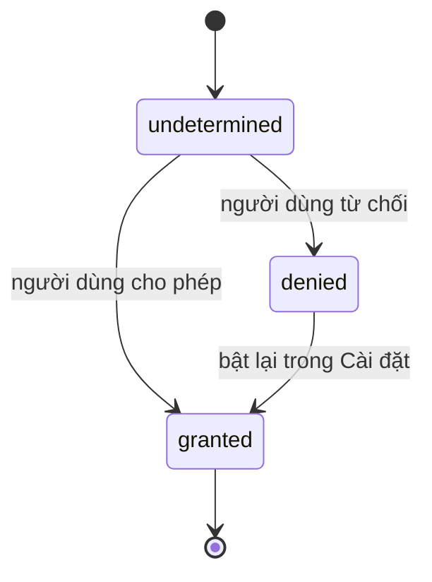

# Chương 5 — Device APIs: rung, vị trí, chọn ảnh, quyền truy cập

## Mục tiêu

- Dùng 4 module Expo chạy được trong Expo Go SDK 57: `expo-haptics`, `expo-location`,
  `expo-image-picker`, `expo-network`.
- Xử lý **quyền truy cập (permission)** đúng cách: xin lần đầu, bị từ chối, bị từ chối vĩnh viễn.
- Tách logic thuần khỏi API native để test được.
- Mock module native trong Jest.

## Giải thích đơn giản

Web có `navigator.geolocation`, `<input type="file">`, `navigator.vibrate`. Trên mobile, mỗi tính
năng phần cứng là một **module native**. Expo đóng gói sẵn nhiều module; Expo Go có sẵn phần native
của chúng, nên bạn chỉ cần `npx expo install <tên-gói>` và import.

Quy tắc quyền trên iOS:

- Lần đầu: app hỏi, iOS hiện hộp thoại hệ thống.
- Nếu người dùng từ chối: **không hỏi lại được** bằng code (`canAskAgain = false`). Chỉ còn cách mở
  **Cài đặt** (`Linking.openSettings()`).
- Khi build app thật, cần câu giải thích (ví dụ `NSLocationWhenInUseUsageDescription`) — Expo thêm
  qua config plugin trong `app.json`. Trong Expo Go, câu giải thích là của Expo Go.



## Ví dụ

### Logic quyền là hàm thuần

`examples/src/chapters/ch05/permissions.ts`:

```ts
export type PermissionStatus = 'granted' | 'denied' | 'undetermined';
export type PermissionAction = 'use' | 'ask' | 'open-settings';

export function nextPermissionAction(status: PermissionStatus, canAskAgain: boolean): PermissionAction {
  if (status === 'granted') return 'use';
  if (status === 'undetermined' || canAskAgain) return 'ask';
  return 'open-settings'; // iOS: đã từ chối → chỉ bật lại được trong Cài đặt
}
```

### Vị trí (expo-location)

`examples/src/chapters/ch05/LocationCard.tsx` (trích):

```tsx
const locate = async () => {
  setState({ kind: 'loading' });
  try {
    let perm = await Location.getForegroundPermissionsAsync();
    let action = nextPermissionAction(perm.status as PermissionStatus, perm.canAskAgain);
    if (action === 'ask') {
      perm = await Location.requestForegroundPermissionsAsync();
      action = nextPermissionAction(perm.status as PermissionStatus, perm.canAskAgain);
    }
    if (action !== 'use') {
      setState({ kind: 'blocked' });
      return;
    }
    const pos = await Location.getCurrentPositionAsync({ accuracy: Location.Accuracy.Balanced });
    setState({ kind: 'done', text: formatCoords(pos.coords.latitude, pos.coords.longitude) });
  } catch (e) {
    setState({ kind: 'error', message: e instanceof Error ? e.message : String(e) });
  }
};
```

State dạng **discriminated union** (`kind: 'idle' | 'loading' | 'done' | 'blocked' | 'error'`) giúp
không bao giờ có trạng thái vô lý như "đang tải và có lỗi cùng lúc".

### Chọn ảnh (expo-image-picker)

```tsx
const result = await ImagePicker.launchImageLibraryAsync({
  mediaTypes: ['images'],
  allowsEditing: true,
  aspect: [1, 1],
  quality: 0.7,
});
if (!result.canceled) {
  setUri(result.assets[0].uri);
  void successFeedback();
}
```

Tài liệu expo-image-picker SDK 57 ghi trong ví dụ: "No permissions request is necessary for launching
the image library" (chỉ trường hợp video đặc biệt trên iOS mới nên xin trước).

### Rung (expo-haptics)

`examples/src/lib/haptics.ts`:

```ts
export async function tapFeedback(): Promise<void> {
  if (Platform.OS === 'web') return;
  try {
    await Haptics.impactAsync(Haptics.ImpactFeedbackStyle.Light);
  } catch {
    // Một số thiết bị không hỗ trợ rung — không sao.
  }
}
```

Nút tim trong app mẫu gọi `tapFeedback()`; chọn ảnh xong gọi `successFeedback()`
(`Haptics.notificationAsync(Haptics.NotificationFeedbackType.Success)`).

### Mạng (expo-network)

`OfflineBanner` dùng hook `useNetworkState()`; `src/lib/queryClient.ts` dùng
`addNetworkStateListener` + `getNetworkStateAsync` cho TanStack Query (Chương 2).

### Test: mock module native

```ts
jest.mock('expo-location', () => ({
  Accuracy: { Balanced: 3 },
  getForegroundPermissionsAsync: jest.fn(),
  requestForegroundPermissionsAsync: jest.fn(),
  getCurrentPositionAsync: jest.fn(),
}));

const loc = jest.mocked(Location);
beforeEach(() => jest.clearAllMocks()); // xóa số lần gọi giữa các test

it('LocationCard: đã từ chối vĩnh viễn → gợi ý mở Cài đặt', async () => {
  loc.getForegroundPermissionsAsync.mockResolvedValue({ status: 'denied', canAskAgain: false } as never);
  const user = userEvent.setup();
  await render(<LocationCard />);
  await user.press(screen.getByRole('button', { name: '📍 Lấy vị trí của tôi' }));
  expect(await screen.findByText('Bạn đã tắt quyền vị trí. Mở Cài đặt')).toBeOnTheScreen();
  expect(loc.getCurrentPositionAsync).not.toHaveBeenCalled();
});
```

Kết quả (2026-09-28):

```text
PASS src/chapters/ch05/device.test.tsx
    ✓ nextPermissionAction
    ✓ bài tập: formatCoords
    ✓ LocationCard: xin quyền lần đầu rồi hiện tọa độ
    ✓ LocationCard: đã từ chối vĩnh viễn → gợi ý mở Cài đặt
    ✓ AvatarPicker: chọn ảnh xong thì hiện ảnh và rung
Tests:       5 passed, 5 total
```

Lần đầu viết, test "đã từ chối vĩnh viễn" **thất bại** ("Expected number of calls: 0, Received: 1")
vì số lần gọi mock còn sót từ test trước. Thêm `beforeEach(() => jest.clearAllMocks())` là hết.

Trên Expo Go: tab **Thiết bị** (**NOT RUN** — cần iPhone thật để thấy hộp thoại quyền và rung).

## Đi sâu

### Giới hạn của Expo Go (theo tài liệu SDK 57)

- Vị trí **nền** (background location) trên iOS: **không** có trong Expo Go → cần development build.
- Push notification từ xa: không có trong Expo Go trên Android từ SDK 53 (thông báo cục bộ vẫn được).
- Face ID của `expo-local-authentication`: không có trong Expo Go trên iOS.

### Chọn độ chính xác vị trí

`Accuracy.Balanced` đủ cho "thành phố/quận", nhanh và tiết kiệm pin hơn `High`/`Highest`.
Chỉ xin quyền **khi người dùng bấm** nút cần vị trí (không xin ngay lúc mở app): lúc đó người dùng
hiểu vì sao app cần quyền, nên ít khi từ chối vĩnh viễn.

### Thiết kế cho test

Ba lớp:

1. Hàm thuần (`nextPermissionAction`, `formatCoords`) — test không cần mock.
2. Wrapper mỏng quanh module native (`lib/haptics.ts`) — nuốt lỗi, bỏ qua web.
3. Component — test với `jest.mock` của module native.

Giống Angular: bọc API trình duyệt trong service rồi mock service trong TestBed.

## Lỗi và bẫy thường gặp

- **Xin quyền lúc khởi động app** → người dùng dễ từ chối vĩnh viễn.
- **Không xử lý `canAskAgain = false`** → nút bấm "không làm gì", người dùng bối rối.
- **Quên `result.canceled`** khi người dùng đóng trình chọn ảnh → `assets` là `null`.
- **Gọi haptics trên web** → không hỗ trợ; bọc wrapper.
- **Mock không reset giữa các test** → kết quả sai lệch.
- **Thêm thư viện native không có trong Expo Go** → màn hình đỏ "native module not found"; cần development build (Tập 3).

## Tóm tắt

- Expo Go SDK 57 có sẵn haptics, location, image picker, network.
- Luồng quyền: undetermined → ask; denied + canAskAgain=false → mở Cài đặt.
- Tách hàm thuần + wrapper; mock module native trong test.

## Bài tập (có lời giải)

**Bài 1.** Viết `formatCoords(lat, lng)` hiển thị kiểu Việt Nam, dấu phẩy thập phân, 4 chữ số:
`10.77689, 106.70092` → `10,7769° B, 106,7009° Đ`; số âm dùng N (Nam) và T (Tây).

<details>
<summary>Lời giải</summary>

`examples/src/chapters/ch05/formatCoords.ts`:

```ts
export function formatCoords(latitude: number, longitude: number, digits = 4): string {
  const fmt = (n: number) => Math.abs(n).toFixed(digits).replace('.', ',');
  const ns = latitude >= 0 ? 'B' : 'N'; // Bắc / Nam
  const ew = longitude >= 0 ? 'Đ' : 'T'; // Đông / Tây
  return `${fmt(latitude)}° ${ns}, ${fmt(longitude)}° ${ew}`;
}
```

Test: `formatCoords(-33.8688, -70.5) === '33,8688° N, 70,5000° T'`.
</details>

**Bài 2.** Thêm nút "Chụp ảnh" dùng camera thay vì thư viện. Cần đổi gì?

<details>
<summary>Lời giải</summary>

Dùng `ImagePicker.launchCameraAsync(...)` với cùng tùy chọn. Camera **cần quyền**:

```ts
const perm = await ImagePicker.requestCameraPermissionsAsync();
if (!perm.granted) { /* dùng nextPermissionAction(perm.status, perm.canAskAgain) để quyết định */ return; }
const result = await ImagePicker.launchCameraAsync({ allowsEditing: true, aspect: [1, 1], quality: 0.7 });
```

Test: mock thêm `requestCameraPermissionsAsync` và `launchCameraAsync` giống test `AvatarPicker`.
Simulator iOS không có camera, nên phải thử trên máy thật. (Lời giải tham khảo, chưa có trong code dự án.)
</details>

## Nguồn tham khảo (Sources)

Đã mở ngày 2026-09-28:

- Expo — Haptics (SDK 57): https://github.com/expo/expo/blob/main/docs/pages/versions/v57.0.0/sdk/haptics.mdx
- Expo — Location (SDK 57): https://github.com/expo/expo/blob/main/docs/pages/versions/v57.0.0/sdk/location.mdx
- Expo — ImagePicker (SDK 57): https://github.com/expo/expo/blob/main/docs/pages/versions/v57.0.0/sdk/imagepicker.mdx
- Expo — Network (SDK 57): https://github.com/expo/expo/blob/main/docs/pages/versions/v57.0.0/sdk/network.mdx
- Expo — Notifications (giới hạn Expo Go): https://github.com/expo/expo/blob/main/docs/pages/versions/v57.0.0/sdk/notifications.mdx
- Expo — LocalAuthentication (giới hạn Expo Go): https://github.com/expo/expo/blob/main/docs/pages/versions/v57.0.0/sdk/local-authentication.mdx
- React Native — Linking (openSettings): https://github.com/facebook/react-native-website/blob/main/docs/linking.md
