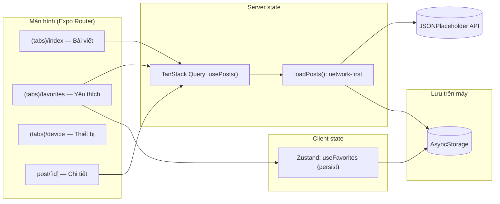

# Chương 7 — App mẫu Tập 2: "Tin Đọc Sau"

## Mục tiêu

Ghép Tập 2 thành một app chạy trong Expo Go:

- Tab **Bài viết**: tải từ API (TanStack Query), kéo để làm mới, **offline** vẫn xem được (cache AsyncStorage).
- Tab **Yêu thích**: store Zustand có persist; badge số lượng trên tab.
- Tab **Thiết bị**: chọn ảnh đại diện, lấy vị trí, rung.
- Tab **Lab**: ví dụ từng chương.
- Animation: thẻ bài trượt vào, tim nảy; rung khi bấm.

## Giải thích đơn giản



- **Server state** (bài viết) chỉ nằm trong TanStack Query; tab Yêu thích **dùng lại cache** đó.
- **Client state** (id yêu thích) nằm trong Zustand.
- Hai thứ gặp nhau ở màn hình: `posts.filter((p) => ids.includes(p.id))`.

## Ví dụ

### Chạy app (lệnh chính xác)

```bash
cd books/react-native/vol2-trung-cap/examples
npm ci
npx expo login         # cùng tài khoản với Expo Go trên iPhone
npx expo start         # quét QR bằng Camera
```

Thử offline: mở app khi có mạng (để có cache) → bật Chế độ máy bay → kéo để làm mới hoặc mở lại
app → thấy "Đang offline — hiển thị dữ liệu đã lưu" và "Dữ liệu offline, lưu lúc …".

Kiểm tra chất lượng:

```bash
npm run typecheck && npm run lint && npm test
npm run export:ios     # tùy chọn: bundle Hermes cho iOS
```

### Màn hình Bài viết

`examples/src/app/(tabs)/index.tsx` (trích):

```tsx
const { data, isPending, isError, error, refetch, isRefetching } = usePosts();

if (isPending) return <View style={styles.center}><ActivityIndicator accessibilityLabel="Đang tải" /></View>;
if (isError)
  return (
    <View style={styles.center}>
      <Text style={styles.error}>Không tải được bài viết: {error.message}</Text>
      <AppButton title="Thử lại" onPress={() => refetch()} />
    </View>
  );

return (
  <View style={styles.screen}>
    <OfflineBanner />
    {data.source === 'cache' ? <Text style={styles.note}>Dữ liệu offline, lưu lúc {formatSavedAt(data.savedAt)}</Text> : null}
    <FlatList
      data={data.posts}
      keyExtractor={(p) => String(p.id)}
      renderItem={({ item, index }) => <PostCard post={item} index={index} onOpen={open} />}
      refreshing={isRefetching}
      onRefresh={() => refetch()}
    />
  </View>
);
```

### Badge trên tab

```tsx
const favCount = useFavoriteCount(); // selector: s.ids.length
<Tabs.Screen name="favorites" options={{ title: 'Yêu thích', tabBarBadge: favCount > 0 ? favCount : undefined }} />
```

Layout Tabs chỉ render lại khi **số lượng** đổi, không phải mỗi khi store đổi.

### Kết quả kiểm tra toàn bộ Tập 2 (chạy thật 2026-09-28)

```bash
bash books/react-native/scripts/check-all.sh vol2-trung-cap
```

```text
--- typecheck
--- lint
--- test
Test Suites: 11 passed, 11 total
Tests:       43 passed, 43 total
--- export web
web bundle OK
--- export ios
ios bundle OK
ALL CHECKS PASSED: vol2-trung-cap
```

**Chạy trên Expo Go: NOT RUN (không có iPhone trong sandbox).** Sandbox cũng **không truy cập được**
`jsonplaceholder.typicode.com` (bị proxy chặn), nên mọi test dùng `fetch` giả; cấu trúc dữ liệu
được lấy từ `data.json` trong repo typicode/jsonplaceholder.

## Đi sâu

### Vì sao không để bài viết trong Zustand?

Nếu copy danh sách bài vào Zustand, bạn có **hai nguồn sự thật**: cache của TanStack Query và store.
Chúng sẽ lệch nhau khi refetch. Quy tắc: dữ liệu của server → TanStack Query; lựa chọn của người
dùng → Zustand; chỉ lưu **id** để nối.

### Cấu trúc thư mục

```text
examples/src/
  api/            # client fetch, hàm gọi API, query keys (+ test)
  storage/        # PostsCache: AsyncStorage và SQLite (+ test với node:sqlite)
  state/          # Zustand stores (+ test)
  features/posts/ # loadPosts (network-first), usePosts, format (+ test)
  components/     # PostCard, FavoriteButton, OfflineBanner, AppButton
  lib/            # queryClient (onlineManager/focusManager), haptics
  app/            # màn hình Expo Router
  chapters/chNN/  # ví dụ + lời giải từng chương (+ test)
  test/           # fixtures, renderWithProviders, adapter node:sqlite
  __tests__/      # test toàn app
```

### Hạn chế có chủ ý (Tập 3 sẽ xử lý)

- JSONPlaceholder là API giả: tạo bài mới không được lưu thật.
- Chưa có đăng nhập / token → Tập 3 (Security, expo-secure-store).
- Danh sách 20 bài nên FlatList đủ nhanh → Tập 3 so sánh FlashList.
- Chưa có báo lỗi từ xa (crash reporting) → Tập 3 (Monitoring).

## Lỗi và bẫy thường gặp

- **Tạo QueryClient trong component không có `useState`** → mất cache mỗi lần render.
- **Không nối `onlineManager`** → không tự refetch khi có mạng lại.
- **Coi `isInternetReachable: undefined` là offline** → banner nhấp nháy khi mở app.
- **Dùng `index` làm key** trong danh sách có thể thay đổi → animation `entering` chạy sai phần tử.
- **Quên `expo-asset`** khi dùng expo-sqlite → Jest không tìm thấy module (Chương 3).

## Tóm tắt

- Server state (TanStack Query) + client state (Zustand) + lưu trữ (AsyncStorage/SQLite) tách bạch.
- Offline-first bằng "network-first, cache fallback" + banner trạng thái mạng.
- 43 test, gồm test toàn app mô phỏng có mạng / mất mạng.

## Bài tập (có lời giải)

**Bài 1.** Ở tab Yêu thích, nếu một bài yêu thích **không còn** trong danh sách tải về (API đổi), hãy
hiện dòng "N bài không còn trên máy chủ".

<details>
<summary>Lời giải</summary>

```tsx
const available = new Set((data?.posts ?? []).map((p) => p.id));
const missing = ids.filter((id) => !available.has(id)).length;
{missing > 0 ? <Text>{missing} bài không còn trên máy chủ</Text> : null}
```

Test: `useFavorites.getState().toggle(999)` trước khi render, `fetch` trả `POSTS` (không có id 999),
mở tab Yêu thích, mong đợi "1 bài không còn trên máy chủ". (Lời giải tham khảo; chưa có trong code dự án.)
</details>

**Bài 2.** Thêm nút "Xóa cache" trong tab Thiết bị để thử lại kịch bản "mất mạng và chưa có cache".

<details>
<summary>Lời giải</summary>

```tsx
import { useQueryClient } from '@tanstack/react-query';
import { asyncStoragePostsCache } from '@/storage/postsCache';

const qc = useQueryClient();
<AppButton
  title="Xóa cache bài viết"
  variant="ghost"
  onPress={async () => {
    await asyncStoragePostsCache.clear();   // xóa bản lưu trên máy
    qc.removeQueries({ queryKey: postKeys.all }); // xóa cache trong bộ nhớ
  }}
/>
```

Phải xóa **cả hai** tầng cache: AsyncStorage và TanStack Query. (Lời giải tham khảo.)
</details>

## Nguồn tham khảo (Sources)

Đã mở ngày 2026-09-28:

- TanStack Query — React Native: https://github.com/TanStack/query/blob/main/docs/framework/react/react-native.md
- Zustand — Persisting store data: https://github.com/pmndrs/zustand/blob/main/docs/reference/integrations/persisting-store-data.md
- Expo Router — Navigation layouts (Tabs): https://github.com/expo/expo/blob/main/docs/pages/router/basics/navigation-layouts.mdx
- Expo — Network (SDK 57): https://github.com/expo/expo/blob/main/docs/pages/versions/v57.0.0/sdk/network.mdx
- JSONPlaceholder: https://github.com/typicode/jsonplaceholder
