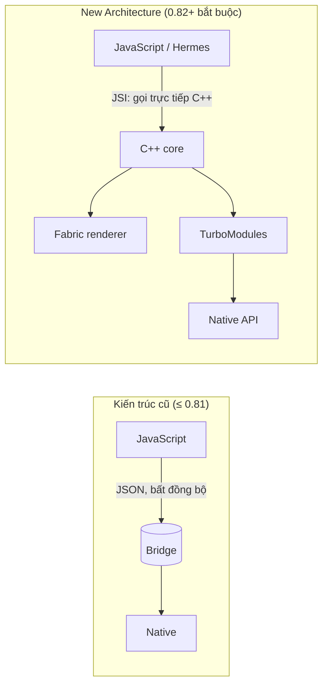

# Chương 1 — New Architecture: JSI, Fabric, TurboModules, Codegen, Hermes

## Mục tiêu

- Hiểu vì sao React Native bỏ "bridge" cũ và kiến trúc mới gồm những phần nào.
- Biết trạng thái hiện tại (2026-09): RN 0.82+ **chỉ** chạy New Architecture; Hermes V1 mặc định từ 0.84.
- Đọc được một **spec TurboModule** viết bằng TypeScript và hiểu Codegen làm gì.
- Kiểm tra engine đang chạy (Hermes) từ JavaScript.

## Giải thích đơn giản

Hãy tưởng tượng app RN có hai "thế giới": **JavaScript** (code của bạn, chạy trong Hermes) và
**native** (UIKit trên iOS, Android View). Chúng phải nói chuyện với nhau.

- **Kiến trúc cũ**: hai bên gửi thư qua một **bridge** (cây cầu): mọi lời gọi được chuyển thành
  JSON, xếp hàng, xử lý **bất đồng bộ**. An toàn nhưng chậm với cập nhật dày đặc, và không đọc
  được layout đồng bộ.
- **Kiến trúc mới**: JS giữ **tham chiếu trực tiếp** tới đối tượng C++ qua **JSI** (JavaScript
  Interface) → gọi hàm native **đồng bộ** được, không cần JSON.



Bốn mảnh ghép:

| Thành phần | Là gì | Lợi ích |
|---|---|---|
| **JSI** | Lớp C++ cho JS gọi native trực tiếp | Không serialize JSON; gọi đồng bộ được |
| **Fabric** | Renderer (bộ vẽ giao diện) mới | Nhiều cây UI song song, đọc layout đồng bộ, hỗ trợ Suspense/Transitions |
| **TurboModules** | Native module thế hệ mới | Tải lười (lazy), gọi qua JSI, có kiểu |
| **Codegen** | Sinh code native từ spec TypeScript | JS và native luôn khớp kiểu |

Và **Hermes**: JavaScript engine tối ưu cho mobile (biên dịch trước ra bytecode). Hermes V1 là
mặc định từ RN 0.84.

## Ví dụ

### 1. Spec của một TurboModule

`examples/src/chapters/ch01/NativeDeviceInfoSpec.ts`:

```ts
import type { TurboModule } from 'react-native';
import { TurboModuleRegistry } from 'react-native';

export interface Spec extends TurboModule {
  getDeviceName(): string; // hàm đồng bộ: gọi thẳng qua JSI, không qua "bridge" JSON
  getBatteryLevel(): Promise<number>;
}

export default TurboModuleRegistry.get<Spec>('NativeDeviceInfo');
```

Theo tài liệu "Turbo Native Modules": `TurboModuleRegistry.get<T>()` trả `null` nếu module không có;
`getEnforcing<T>()` ném lỗi. Module này **không có trong Expo Go**, nên ta dùng `get` để app không crash.

Trong dự án RN CLI, bạn khai báo `codegenConfig` trong `package.json` (tên spec, thư mục `jsSrcsDir`,
package Android); khi build, Codegen sinh interface C++/Objective-C++/Java từ spec. Với Expo, cách
dễ hơn là **Expo Modules API** (Chương 2) — cũng chạy trên JSI.

### 2. Kiểm tra engine và phiên bản

`examples/src/chapters/ch01/runtimeInfo.ts`:

```ts
declare const global: { HermesInternal?: unknown };

export function getRuntimeInfo(): RuntimeInfo {
  const v = Platform.constants.reactNativeVersion;
  return {
    engine: global.HermesInternal ? 'Hermes' : 'khác',
    os: Platform.OS,
    reactNativeVersion: `${v.major}.${v.minor}.${v.patch}`,
    deviceName: NativeDeviceInfo?.getDeviceName() ?? '(không có module NativeDeviceInfo — bình thường trong Expo Go)',
  };
}
```

Tài liệu Hermes của RN: biến toàn cục `HermesInternal` có mặt khi app chạy bằng Hermes.

### Test — kết quả thật (2026-09-28)

```text
PASS src/chapters/ch01/newArch.test.tsx
    ✓ Jest chạy trên Node (không phải Hermes); TurboModule không có → giá trị dự phòng
    ✓ có HermesInternal → báo Hermes (giống trên iPhone)
    ✓ hiển thị phiên bản React Native dạng major.minor.patch
Tests:       3 passed, 3 total
```

**Phát hiện:** trong Jest, `Platform.constants.reactNativeVersion` là bản giả và trả về `1000.0.0`.
Lần đầu chúng tôi viết test mong đợi `0.86.x` và test **thất bại**. Trên iPhone với SDK 57 giá trị sẽ
là 0.86.x (**NOT RUN** trên máy thật).

Bằng chứng build: `npx expo export --platform ios` tạo được bundle **Hermes bytecode** (`.hbc`) cho
cả 3 app — tức là mã của sách biên dịch được cho Hermes.

## Đi sâu

### Dòng thời gian (theo blog chính thức của React Native)

| Phiên bản | Ngày | Mốc |
|---|---|---|
| 0.76 | 2024-10-23 | New Architecture là **mặc định** |
| 0.82 | 2025-10-08 | "the first React Native that runs entirely on the New Architecture" — `newArchEnabled=false` bị bỏ qua |
| 0.84 | 2026-02-11 | **Hermes V1** mặc định; tiếp tục xóa code Legacy; iOS dùng binary biên dịch sẵn |
| 0.85 | 2026-04-07 | Shared Animation Backend (thử nghiệm); Jest preset tách thành `@react-native/jest-preset` |
| 0.86 | 2026-06-11 | Không breaking change; sửa edge-to-edge; repo chuyển sang tổ chức `react` |
| 0.87 | 2026-08-11 | Strict TypeScript API mặc định (chưa có trong Expo SDK 57) |

Expo SDK 54 (RN 0.81) là bản cuối còn cho dùng Legacy Architecture. Tài liệu Expo: "Expo Go only
supports the New Architecture."

### Điều này có ý nghĩa gì với bạn?

- Thư viện cũ chỉ hỗ trợ bridge có thể **không chạy** trên RN 0.82+. Kiểm tra thư viện trước khi dùng
  (ví dụ FlashList v2 ghi rõ "new architecture only").
- Bạn có thể gọi native **đồng bộ** (ví dụ `TextStats.stats(text)` ở Chương 2 trả kết quả ngay).
  Nhưng đừng làm việc nặng đồng bộ trên JS thread — UI sẽ đứng.
- React 19 features (Transitions, Suspense, automatic batching, `useLayoutEffect` đúng nghĩa) hoạt
  động đầy đủ nhờ Fabric.

### Bridgeless

Blog 0.76 gọi là "Removing the Bridge": khởi động nhanh hơn, JS và native giao tiếp trực tiếp,
báo lỗi tốt hơn. Từ 0.82, đây là chế độ duy nhất.

## Lỗi và bẫy thường gặp

- **Dùng `getEnforcing` cho module có thể không tồn tại** (Expo Go, web) → crash ngay khi import.
- **Tin số phiên bản trong Jest** → là bản giả (`1000.0.0`).
- **Cài thư viện native cũ** (chưa hỗ trợ New Architecture) → lỗi build hoặc lỗi runtime "module not found".
- **Làm việc nặng trong hàm native đồng bộ** → khóa JS thread; dùng `AsyncFunction`/Promise cho việc lâu.
- **Tìm cách tắt New Architecture** trên SDK 57 → không thể; chỉ có thể dùng SDK ≤ 54 (không khuyến khích).

## Tóm tắt

- New Architecture = JSI + Fabric + TurboModules + Codegen; bắt buộc từ RN 0.82.
- Hermes V1 mặc định từ 0.84; kiểm tra bằng `global.HermesInternal`.
- Spec TypeScript + Codegen giữ JS và native khớp kiểu; dùng `get()` khi module có thể vắng mặt.

## Bài tập (có lời giải)

**Bài 1.** Vì sao `NativeDeviceInfoSpec.ts` dùng `TurboModuleRegistry.get` thay vì `getEnforcing`?
Viết test chứng minh app không crash khi module vắng mặt.

<details>
<summary>Lời giải</summary>

Vì app chạy trong **Expo Go** (không có module tự viết) và trong **Jest** (không có native). `get`
trả `null`, code dùng `?.` và giá trị dự phòng. Test đã có:

```ts
it('Jest chạy trên Node (không phải Hermes); TurboModule không có → giá trị dự phòng', () => {
  const info = getRuntimeInfo();
  expect(info.engine).toBe('khác');
  expect(info.deviceName).toMatch(/không có module NativeDeviceInfo/);
});
```

Nếu đổi sang `getEnforcing`, chính dòng `import` sẽ ném lỗi — mọi test import file này đều đỏ.
</details>

**Bài 2.** Điền bảng: với mỗi việc, nên gọi native **đồng bộ** hay **bất đồng bộ**?
(a) đếm từ một đoạn văn ngắn; (b) đọc file 50 MB; (c) lấy tên thiết bị; (d) gọi mạng.

<details>
<summary>Lời giải</summary>

| Việc | Cách | Lý do |
|---|---|---|
| (a) đếm từ đoạn ngắn | Đồng bộ (`Function`) | Rất nhanh, cần kết quả ngay để hiển thị |
| (b) đọc file 50 MB | Bất đồng bộ (`AsyncFunction`) | Lâu → sẽ đứng UI nếu đồng bộ |
| (c) tên thiết bị | Đồng bộ hoặc hằng số (`Constant`) | Giá trị có sẵn, không đổi |
| (d) gọi mạng | Bất đồng bộ | Thời gian không đoán trước |

Quy tắc: đồng bộ chỉ cho việc **dưới vài mili-giây**.
</details>

## Nguồn tham khảo (Sources)

Đã mở ngày 2026-09-28:

- The New Architecture is here (0.76): https://github.com/facebook/react-native-website/blob/main/website/blog/2024-10-23-the-new-architecture-is-here.mdx
- React Native 0.82 (New Architecture only): https://github.com/facebook/react-native-website/blob/main/website/blog/2025-10-08-react-native-0.82.mdx
- React Native 0.84 (Hermes V1): https://github.com/facebook/react-native-website/blob/main/website/blog/2026-02-11-react-native-0.84.mdx
- React Native 0.86: https://github.com/facebook/react-native-website/blob/main/website/blog/2026-06-11-react-native-0.86.mdx
- Turbo Native Modules: https://github.com/facebook/react-native-website/blob/main/docs/turbo-native-modules.md
- What is Codegen: https://github.com/facebook/react-native-website/blob/main/docs/the-new-architecture/what-is-codegen.mdx
- Hermes: https://github.com/facebook/react-native-website/blob/main/docs/hermes.md
- Expo — New Architecture guide: https://github.com/expo/expo/blob/main/docs/pages/guides/new-architecture.mdx
