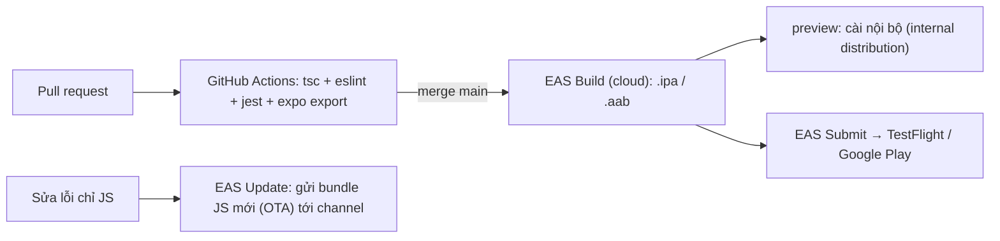

# Chương 5 — CI/CD: GitHub Actions và EAS

## Mục tiêu

- Tự động chạy type-check, lint, test, export mỗi khi có pull request (CI).
- Hiểu **EAS Build** (build trên cloud), **EAS Submit** (gửi lên store), **EAS Update** (cập nhật OTA).
- Cấu hình `eas.json` với 3 profile: development, preview, production.
- "Kiểm tra cấu hình như code": test `app.json` và `eas.json` trước khi build.

## Giải thích đơn giản

- **CI (Continuous Integration)**: mỗi PR, máy chủ tự chạy kiểm tra. Giống pipeline `ng lint && ng test && ng build` của bạn.
- **CD (Continuous Delivery)**: tự tạo bản build và gửi cho tester / store.

Với Expo:



Không cần Mac để build iOS: tài liệu EAS Build viết "iOS builds run on macOS runners hosted in
Expo's macOS cloud" (image mặc định cho SDK 57: `macos-tahoe-26.5-xcode-26.6`, theo trang Build server
infrastructure). Cần tài khoản Expo và Apple Developer để cài lên máy thật / gửi store.

## Ví dụ

### 1. Workflow kiểm tra cho bộ sách

`vol3-nang-cao/ci/book-checks.yml` (mẫu — copy vào `.github/workflows/` ở gốc repo để bật):

```yaml
name: React Native book checks
on:
  pull_request:
    paths:
      - 'books/react-native/**'
  push:
    branches: [main]
    paths:
      - 'books/react-native/**'
jobs:
  check:
    runs-on: ubuntu-latest
    strategy:
      fail-fast: false
      matrix:
        volume: [vol1-co-ban, vol2-trung-cap, vol3-nang-cao]
    steps:
      - uses: actions/checkout@v5
      - uses: actions/setup-node@v6
        with:
          node-version: 22
          cache: npm
          cache-dependency-path: books/react-native/${{ matrix.volume }}/examples/package-lock.json
      - name: Install
        run: npm ci
        working-directory: books/react-native/${{ matrix.volume }}/examples
      - name: Type-check, lint, test, export
        run: bash books/react-native/scripts/check-all.sh ${{ matrix.volume }}
```

Sách **không** tự thêm file vào `.github/workflows/` (ngoài phạm vi thư mục của task). File YAML
được kiểm tra cú pháp bằng Python `yaml.safe_load` trong `check-all.sh` ("yaml OK: 2 file"). Workflow
**chưa chạy trên GitHub** (NOT RUN) — nhưng lệnh bên trong (`check-all.sh`) đã chạy thật trong sandbox.

**Bài học khi viết `check-all.sh`:** phiên bản đầu viết `npx expo export ... && echo "web bundle OK"`.
Khi export lỗi, `set -e` **không** dừng script (lệnh lỗi nằm trong chuỗi `&&`), và script vẫn in
"ALL CHECKS PASSED". Chúng tôi phát hiện khi export web của Tập 2 lỗi (thiếu cấu hình `.wasm`), rồi
sửa bằng `if ! npx expo export ...; then ... exit 1; fi`.

### 2. eas.json

`examples/eas.json`:

```json
{
  "cli": {
    "version": ">= 24.8.0",
    "appVersionSource": "remote"
  },
  "build": {
    "development": { "developmentClient": true, "distribution": "internal" },
    "preview": { "distribution": "internal", "channel": "preview" },
    "production": { "autoIncrement": true, "channel": "production" }
  },
  "submit": { "production": {} }
}
```

- `development`: app có dev tools (cần `expo-dev-client`), cài nội bộ.
- `preview`: giống production nhưng phân phối nội bộ cho tester.
- `production`: bản lên store; `autoIncrement` tăng `ios.buildNumber`/`android.versionCode` (khi
  `appVersionSource` là `remote`, EAS lưu số build trên server — theo tài liệu "App versions").
- `channel`: nhận EAS Update đúng kênh.

`eas-cli` mới nhất trên npm: **24.8.0** (2026-09-28).

### 3. Workflow build bằng EAS (mẫu)

`vol3-nang-cao/ci/eas-build.yml` dựa theo ví dụ trong tài liệu Expo "Building on CI"
(`expo/expo-github-action@v8`, secret `EXPO_TOKEN`):

```yaml
- name: Setup Expo and EAS
  uses: expo/expo-github-action@v8
  with:
    eas-version: latest
    token: ${{ secrets.EXPO_TOKEN }}
- run: npm ci
- run: eas build --platform ios --profile preview --non-interactive --no-wait
```

**NOT RUN**: cần tài khoản Expo, `EXPO_TOKEN`, và Apple Developer. Xem Blockers.

### 4. Test cấu hình (chạy được ngay trong CI)

`examples/src/chapters/ch05/configRules.ts` (trích):

```ts
export function checkAppConfig(c: ExpoConfigLike): string[] {
  const errors: string[] = [];
  if (!c.version || !SEMVER.test(c.version)) errors.push('version phải có dạng x.y.z');
  if (!c.ios?.bundleIdentifier || !REVERSE_DNS.test(c.ios.bundleIdentifier)) errors.push('ios.bundleIdentifier phải dạng reverse-DNS');
  if (!c.android?.package || !REVERSE_DNS.test(c.android.package)) errors.push('android.package phải dạng reverse-DNS');
  if (!c.scheme) errors.push('cần scheme cho deep link');
  if (/secret|password|private[_-]?key/i.test(JSON.stringify(c))) errors.push('app.json có vẻ chứa bí mật');
  return errors;
}
```

```ts
import appJson from '../../../app.json';
import easJson from '../../../eas.json';

it('app.json của dự án hợp lệ', () => {
  expect(checkAppConfig(appJson.expo)).toEqual([]);
});
```

Kết quả (2026-09-28):

```text
PASS src/chapters/ch05/config.test.ts
    ✓ app.json của dự án hợp lệ
    ✓ eas.json của dự án hợp lệ
    ✓ phát hiện cấu hình sai
Tests:       3 passed, 3 total
```

## Đi sâu

### EAS Update (OTA)

Sửa lỗi chỉ ở JavaScript/asset có thể gửi thẳng tới máy người dùng mà không cần duyệt lại trên store:
`npx eas-cli@latest update --channel production --environment production --message "Sửa lỗi PIN"`
(dạng lệnh theo tài liệu "EAS Update getting started": `eas update --channel [channel-name] --message "[message]" --environment [environment-name]`). Tài liệu Expo: lệnh
`eas update:configure` thêm `runtimeVersion` và `updates.url` vào app config; build nhận update theo
`channel`. **Thay đổi native** (thêm module native, đổi quyền) vẫn cần build mới — update phải cùng
`runtimeVersion` với build.

### Chiến lược nhánh gợi ý

| Sự kiện | Việc tự động |
|---|---|
| Pull request | `check-all.sh` (tsc, eslint, jest, export) |
| Merge vào `main` | EAS Build profile `preview` → tester cài thử |
| Tạo tag `v1.2.0` | EAS Build `production` + EAS Submit |
| Hotfix chỉ JS | EAS Update channel `production` |

### Cache và tốc độ CI

- `actions/setup-node` với `cache: npm` + `package-lock.json` → cài nhanh hơn.
- Ma trận theo tập: 3 job chạy song song, một tập lỗi không che tập khác (`fail-fast: false`).

## Lỗi và bẫy thường gặp

- **`cmd && echo OK` trong script có `set -e`** → lỗi bị nuốt (chúng tôi đã gặp).
- **`npx expo install` trên CI không có mạng tới api.expo.dev** → đặt `EXPO_OFFLINE=1` (sandbox của sách phải làm vậy).
- **Quên `package-lock.json`** → `npm ci` lỗi; CI cài phiên bản khác máy dev.
- **Để `EXPO_TOKEN` trong code** → phải là GitHub Secret.
- **Gửi EAS Update có thay đổi native** → app crash vì JS gọi module chưa có trong bản build.

## Tóm tắt

- CI: một script kiểm tra duy nhất, chạy giống nhau ở máy dev và GitHub Actions.
- EAS Build/Submit/Update cho build cloud, gửi store, cập nhật OTA.
- Kiểm tra `app.json`/`eas.json` bằng test để bắt lỗi cấu hình trước khi tốn 20 phút build.

## Bài tập (có lời giải)

**Bài 1.** Viết `checkEasJson(eas)` báo lỗi khi: thiếu một trong 3 profile; `appVersionSource=remote`
nhưng production không bật `autoIncrement`; production là development client.

<details>
<summary>Lời giải</summary>

```ts
export function checkEasJson(e: EasJsonLike): string[] {
  const errors: string[] = [];
  for (const p of ['development', 'preview', 'production']) if (!e.build?.[p]) errors.push(`thiếu build profile "${p}"`);
  if (e.cli?.appVersionSource === 'remote' && !e.build?.production?.autoIncrement) {
    errors.push('appVersionSource=remote nên bật production.autoIncrement');
  }
  if (e.build?.production?.developmentClient) errors.push('production không được là development client');
  return errors;
}
```

Test "phát hiện cấu hình sai" kiểm tra đủ 4 lỗi với một cấu hình xấu.
</details>

**Bài 2.** Thêm bước vào `book-checks.yml` để chạy `findSuspiciousPublicEnv` (Chương 4) trên biến
môi trường của CI. Viết thế nào?

<details>
<summary>Lời giải</summary>

Cách đơn giản: một test Jest đọc `process.env` và CI chạy test như bình thường:

```ts
it('không có bí mật trong EXPO_PUBLIC_* của môi trường build', () => {
  expect(findSuspiciousPublicEnv(process.env)).toEqual([]);
});
```

Trên GitHub Actions, đặt biến public ở `env:` của job; bí mật thật để trong `secrets` và **không**
đặt tiền tố `EXPO_PUBLIC_`. (Lời giải tham khảo, chưa thêm vào bộ test.)
</details>

## Nguồn tham khảo (Sources)

Đã mở ngày 2026-09-28:

- Expo — EAS Build introduction: https://github.com/expo/expo/blob/main/docs/pages/build/introduction.mdx
- Expo — Build server infrastructure: https://github.com/expo/expo/blob/main/docs/pages/build-reference/infrastructure.mdx
- Expo — Building on CI: https://github.com/expo/expo/blob/main/docs/pages/build/building-on-ci.mdx
- Expo — Configure EAS Build with eas.json: https://github.com/expo/expo/blob/main/docs/pages/build/eas-json.mdx
- Expo — App versions (appVersionSource, autoIncrement): https://github.com/expo/expo/blob/main/docs/pages/build-reference/app-versions.mdx
- Expo — EAS Update getting started: https://github.com/expo/expo/blob/main/docs/pages/eas-update/getting-started.mdx
- Expo — Runtime versions: https://github.com/expo/expo/blob/main/docs/pages/eas-update/runtime-versions.mdx
- expo-github-action: https://github.com/expo/expo-github-action
- Gói npm eas-cli: https://www.npmjs.com/package/eas-cli
