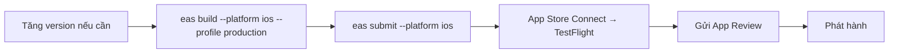

# Chương 6 — Phát hành lên App Store và Google Play

## Mục tiêu

- Nắm quy trình từ code → bản build → TestFlight / Internal testing → phát hành.
- Hiểu **version** và **build number**, và cách EAS tự tăng số build.
- Chuẩn bị `app.json` cho store: tên, icon, bundle identifier/package, quyền, privacy manifest.
- Dùng `eas build` + `eas submit`.

## Giải thích đơn giản

Hai con số luôn đi cùng nhau:

| | Ví dụ | Ai thấy | Quy tắc |
|---|---|---|---|
| **version** (`expo.version`) | `1.4.2` | Người dùng trên store | Tăng theo semver khi có tính năng/sửa lỗi |
| **build number** (`ios.buildNumber` / `android.versionCode`) | `57` | Store dùng để phân biệt bản upload | **Phải tăng** mỗi lần upload |

Quy trình (theo tài liệu EAS Submit):



Android tương tự: `eas build --platform android --profile production` (file `.aab`) → `eas submit
--platform android` → track internal testing trên Google Play Console → production.

## Ví dụ

### 1. app.json của app Tập 3

```json
{
  "expo": {
    "name": "Sổ Ghi Chú Bảo Mật",
    "slug": "rn-book-vol3",
    "version": "1.0.0",
    "scheme": "rnbookvol3",
    "ios": { "supportsTablet": true, "bundleIdentifier": "dev.nobin.rnbook.securenotes" },
    "android": { "package": "dev.nobin.rnbook.securenotes" },
    "experiments": { "reactCompiler": true }
  }
}
```

(Trích; file đầy đủ có icon, adaptive icon, plugins.) `bundleIdentifier`/`package` là **định danh vĩnh
viễn** trên store — chọn kỹ trước lần upload đầu. Tên `dev.nobin...` là ví dụ; Nobin nên dùng domain của
mình.

### 2. Tăng version bằng hàm thuần

`examples/src/chapters/ch06/version.ts`:

```ts
export function bumpVersion(version: string, kind: Bump): string {
  const m = /^(\d+)\.(\d+)\.(\d+)$/.exec(version);
  if (!m) throw new Error(`Phiên bản không hợp lệ: ${version}`);
  let [major, minor, patch] = m.slice(1).map(Number);
  if (kind === 'major') [major, minor, patch] = [major + 1, 0, 0];
  else if (kind === 'minor') [minor, patch] = [minor + 1, 0];
  else patch += 1;
  return `${major}.${minor}.${patch}`;
}
```

Build number để **EAS tự tăng**: `"appVersionSource": "remote"` + `"autoIncrement": true` trong
`eas.json` (Chương 5).

Kết quả test (2026-09-28):

```text
PASS src/chapters/ch06/version.test.ts
    ✓ bumpVersion("1.4.2", "patch") → "1.4.3"
    ✓ bumpVersion("1.4.2", "minor") → "1.5.0"
    ✓ bumpVersion("1.4.2", "major") → "2.0.0"
    ✓ từ chối phiên bản sai định dạng
    ✓ bài tập: bumpFromCommits
Tests:       5 passed, 5 total
```

### 3. Lệnh build và submit (NOT RUN)

```bash
cd books/react-native/vol3-nang-cao/examples
npx eas-cli@latest login
npx eas-cli@latest build:configure              # liên kết project với tài khoản Expo
npx eas-cli@latest build --platform ios --profile production
npx eas-cli@latest submit --platform ios         # upload lên App Store Connect → TestFlight
npx eas-cli@latest build --platform android --profile production
npx eas-cli@latest submit --platform android     # lần đầu: tạo release ở track internal testing
```

**NOT RUN** trong sandbox: cần tài khoản Expo, Apple Developer (trả phí) và Google Play Developer.
Tài liệu EAS Submit: sau khi upload, build xuất hiện trong TestFlight "after processing (usually
10-15 minutes)"; `eas submit` chạy được trên macOS, Linux và Windows.

## Đi sâu

### Checklist trước khi gửi review

1. **Định danh**: `ios.bundleIdentifier`, `android.package` cố định.
2. **Icon & ảnh store**: đúng kích thước và định dạng (ví dụ trang "Store assets" của Expo ghi icon
   Google Play 512 × 512, PNG 32-bit; ảnh chụp màn hình 4–10 ảnh).
3. **Quyền**: chỉ xin quyền thật sự dùng; câu giải thích quyền rõ ràng (config plugin trong `app.json`,
   ví dụ `photosPermission` của expo-image-picker, `NSLocationWhenInUseUsageDescription` của expo-location).
4. **Privacy manifest (iOS)**: nếu dùng API "required reason" (UserDefaults, file timestamp, disk
   space...), khai báo trong `expo.ios.privacyManifests` (tài liệu Expo "Privacy manifests").
5. **Nội dung store**: ảnh chụp màn hình, mô tả, chính sách quyền riêng tư (URL), thông tin liên hệ.
   Tài liệu Expo có trang "Store assets".
6. **Tài khoản demo** cho reviewer nếu app cần đăng nhập. App Tập 3 dùng PIN tự tạo — ghi chú điều này
   cho reviewer.
7. **Bản release test trên máy thật** (không chỉ bản dev).

### Internal distribution vs TestFlight

- `preview` profile + internal distribution: cài thẳng lên máy đã đăng ký (ad hoc), nhanh cho team nhỏ.
- TestFlight: kênh test chính thức của Apple, mời tester qua email/link; bản build cần qua xử lý của Apple.

### Android lần đầu

Tài liệu EAS Submit (Android): cần tạo app trên Google Play Console và tải **Google Service Account key**
lên EAS. Lần submit đầu tạo release ở **internal testing track**; app ở trạng thái draft cho tới khi hoàn
tất store listing. Nếu muốn, có thể tự upload lần đầu bằng tay (hướng dẫn "manual submission").

## Lỗi và bẫy thường gặp

- **Upload trùng build number** → store từ chối. Để EAS `autoIncrement`.
- **Đổi `bundleIdentifier` sau khi đã phát hành** → thành app mới, mất người dùng cũ.
- **Xin quyền không dùng tới** → dễ bị từ chối review.
- **Quên privacy manifest** khi thư viện dùng API "required reason".
- **Gửi bản có dev menu / log nhạy cảm** → luôn build profile `production`.
- **Chỉ test trên Expo Go** → bản production khác (không có module Expo Go "thừa", có React Compiler, Hermes bytecode). Test bản `preview` trên máy thật trước.

## Tóm tắt

- version (người dùng thấy) khác build number (phải tăng mỗi lần upload).
- `eas build` + `eas submit`; iOS qua TestFlight, Android qua internal testing.
- Chuẩn bị định danh, quyền, privacy manifest, nội dung store trước khi gửi review.

## Bài tập (có lời giải)

**Bài 1.** Viết `bumpFromCommits(messages)` chọn loại tăng version từ Conventional Commits:
`feat!:`/`BREAKING CHANGE` → major; `feat:` → minor; `fix:` → patch; còn lại → `null`.

<details>
<summary>Lời giải</summary>

```ts
export function bumpFromCommits(messages: string[]): Bump | null {
  if (messages.some((m) => /^[a-z]+(\(.+\))?!:/.test(m) || /BREAKING CHANGE/.test(m))) return 'major';
  if (messages.some((m) => /^feat(\(.+\))?:/.test(m))) return 'minor';
  if (messages.some((m) => /^fix(\(.+\))?:/.test(m))) return 'patch';
  return null;
}
```

Kết hợp: `bumpVersion(appJson.expo.version, bumpFromCommits(commits) ?? 'patch')` trong một script
release. Repo này cũng dùng Conventional Commits cho mọi commit.
</details>

**Bài 2.** Bạn sửa một lỗi hiển thị (chỉ JS) và một lỗi cần thêm quyền camera. Cái nào gửi bằng EAS
Update được, cái nào cần build mới?

<details>
<summary>Lời giải</summary>

- Lỗi hiển thị (chỉ JS/asset) → **EAS Update** được, cùng `runtimeVersion`.
- Thêm quyền camera → thay đổi native (Info.plist/AndroidManifest) → **build mới + submit + review**.

Quy tắc: bất cứ thứ gì làm thay đổi thư mục `ios/`/`android/` sinh ra (plugin, quyền, module native) đều
cần build mới.
</details>

## Nguồn tham khảo (Sources)

Đã mở ngày 2026-09-28:

- Expo — Submit to the Apple App Store: https://github.com/expo/expo/blob/main/docs/pages/submit/ios.mdx
- Expo — Submit to Google Play: https://github.com/expo/expo/blob/main/docs/pages/submit/android.mdx
- Expo — TestFlight: https://github.com/expo/expo/blob/main/docs/pages/submit/testflight.mdx
- Expo — App versions: https://github.com/expo/expo/blob/main/docs/pages/build-reference/app-versions.mdx
- Expo — Privacy manifests: https://github.com/expo/expo/blob/main/docs/pages/guides/apple-privacy.mdx
- Expo — Store assets: https://github.com/expo/expo/blob/main/docs/pages/guides/store-assets.mdx
- Expo — ImagePicker config plugin (photosPermission): https://github.com/expo/expo/blob/main/docs/pages/versions/v57.0.0/sdk/imagepicker.mdx
