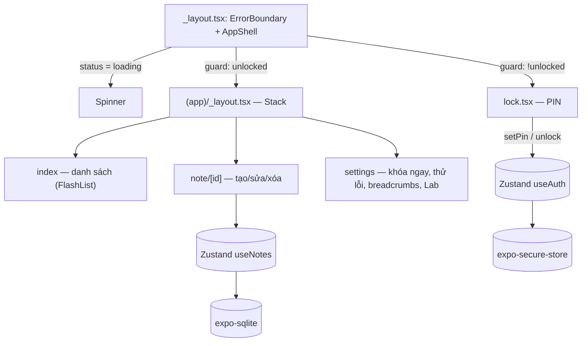

# Chương 8 — App mẫu Tập 3: "Sổ Ghi Chú Bảo Mật"

## Mục tiêu

Ghép Tập 3 thành một app:

- Màn hình **khóa bằng PIN** (tạo PIN lần đầu, mở khóa, khóa tạm khi sai nhiều), tự khóa khi app xuống nền.
- **Protected routes**: không vào được ghi chú khi chưa mở khóa, kể cả bằng deep link.
- Ghi chú lưu trong **SQLite**, danh sách dùng **FlashList v2**, **React Compiler** bật khi build.
- **Error Boundary** + logger có breadcrumbs; nút thử lỗi trong Cài đặt.
- Module native tự viết (`modules/text-stats`) với dự phòng JS; cấu hình **EAS** và workflow CI mẫu.

## Giải thích đơn giản



## Ví dụ

### Chạy app (lệnh chính xác)

```bash
cd books/react-native/vol3-nang-cao/examples
npm ci
npx expo login         # cùng tài khoản với Expo Go
npx expo start         # quét QR bằng Camera
```

Trong Expo Go: module `text-stats` dùng bản JS (không có native); Face ID không có — app dùng PIN.
**Chạy trên Expo Go: NOT RUN (không có iPhone trong sandbox).**

Kiểm tra:

```bash
npm run typecheck && npm run lint && npm test
npm run export:ios
```

### Kết quả kiểm tra toàn bộ Tập 3 (chạy thật 2026-09-28)

```bash
bash books/react-native/scripts/check-all.sh vol3-nang-cao
```

```text
--- yaml (ci/*.yml)
yaml OK: 2 file
--- typecheck
--- lint
--- test
Test Suites: 10 passed, 10 total
Tests:       45 passed, 45 total
--- export web
web bundle OK
--- export ios
ios bundle OK
ALL CHECKS PASSED: vol3-nang-cao
```

Test toàn app (`src/__tests__/app.test.tsx`) — chạy mọi lớp thật (router, Zustand, SQLite qua
`node:sqlite`, logic PIN); chỉ SecureStore/Crypto là bản giả:

```text
PASS src/__tests__/app.test.tsx
  App Tập 3: Sổ Ghi Chú Bảo Mật
    ✓ lần đầu: tạo PIN → vào danh sách ghi chú
    ✓ PIN yếu bị từ chối
    ✓ thêm, sửa, xóa ghi chú (lưu trong SQLite)
    ✓ khóa lại → nhập sai → nhập đúng
    ✓ deep link vào ghi chú khi đang khóa → chỉ thấy màn hình khóa (Protected route)
    ✓ Error Boundary bắt lỗi từ nút "Thử lỗi" trong Cài đặt
```

### Màn hình khóa (trích `src/app/lock.tsx`)

```tsx
const submit = async () => {
  setError(null);
  if (creating) {
    if (pin !== confirm) return setError('Hai lần nhập PIN không khớp');
    const err = await setPin(pin);
    if (err) setError(err);
  } else {
    const ok = await unlock(pin);
    if (!ok) setError('PIN không đúng');
  }
  setPinText('');
  setConfirm('');
};
```

`TextInput` dùng `keyboardType="number-pad"`, `secureTextEntry`, `maxLength={6}`; khi đang bị khóa tạm,
ô nhập bị vô hiệu và hiện "Thử lại sau N giây".

### Store ghi chú (trích `src/state/notes.ts`)

```ts
add: async (input) => {
  const repo = await getNotesRepository();
  const now = Date.now();
  const note = await repo.create(input, newId(now), now);
  set({ notes: [note, ...get().notes] });
  logger.addBreadcrumb('info', 'note.create', { length: input.body.length });
  return note;
},
```

`getNotesRepository()` mở `secure-notes.db` một lần và chạy migration; repository dùng câu SQL có
tham số `?` (chống SQL injection).

## Đi sâu

### Những gì chạy được trong Expo Go và những gì cần development build

| Tính năng | Expo Go SDK 57 | Ghi chú |
|---|---|---|
| expo-secure-store, expo-crypto, expo-sqlite | Có | `requireAuthentication` với sinh trắc học: không |
| FlashList v2 | Có (`@shopify/flash-list@2.0.2`) | JS-only, New Architecture |
| React Compiler | Có (Babel của Expo) | Đã thấy trong bundle `expo export` |
| Module `text-stats` native | **Không** → dùng bản JS | Cần development build |
| Face ID | **Không** | Cần development build |
| SQLCipher (mã hóa DB) | **Không** | Cần development build |

### Giới hạn bảo mật (nói thẳng)

- Ghi chú **không mã hóa** trong SQLite (xem Chương 4). PIN chỉ chặn truy cập qua giao diện app.
- Hash PIN là SHA-256 một vòng — ổn khi nằm trong Keychain, **không** đủ nếu bị lấy ra ngoài.
- Không có sao lưu/khôi phục: quên PIN = phải xóa dữ liệu (chức năng `resetAll` có trong store nhưng
  chưa có nút trên giao diện — một bài tập tốt).

### Cấu trúc thư mục

```text
examples/
  app.json                 # bundleIdentifier/package, scheme, experiments.reactCompiler
  eas.json                 # development / preview / production
  metro.config.js          # wasm cho expo-sqlite trên web
  jest.setup.js            # giả lập đo layout cho FlashList
  modules/text-stats/      # local Expo module: Swift + Kotlin + TS (+ JS fallback)
  src/app/                 # _layout (ErrorBoundary + Protected), lock, (app)/...
  src/security/            # pin.ts (thuần), secureStorage.ts, autoLock.ts
  src/notes/               # model, repository (SQL), db
  src/state/               # useAuth, useNotes (Zustand)
  src/monitoring/          # logger, ErrorBoundary, dedupe
  src/chapters/chNN/       # ví dụ + lời giải bài tập từng chương
  src/__tests__/           # test toàn app
../ci/                     # workflow GitHub Actions mẫu (book-checks.yml, eas-build.yml)
```

## Lỗi và bẫy thường gặp

- **Protected route không có màn hình dự phòng** → người dùng bị kẹt; luôn có `lock` ở nhánh `!unlocked`.
- **Quên khóa khi xuống nền** → người khác cầm máy thấy ghi chú trong app switcher.
- **Mở DB nhiều lần** → dùng một promise dùng chung (`getNotesRepository`).
- **`router.back()` khi mở bằng deep link** → dùng `goBackOr` (từ Tập 1).
- **Test dùng chung DB** → `resetNotesRepositoryForTests()` trong `beforeEach`.
- **FlashList jestSetup của 2.0.2** làm FlashList undefined → dùng `jest.setup.js` của sách.

## Tóm tắt

- App kết hợp: PIN + SecureStore, Protected routes, SQLite, FlashList, React Compiler, Error Boundary, logger.
- 45 test, gồm luồng tạo PIN → ghi chú → khóa/mở → deep link bị chặn → lỗi được bắt.
- Những phần cần tài khoản/phần cứng (build, submit, native, Face ID) được ghi rõ NOT RUN.

## Bài tập (có lời giải)

**Bài 1.** Tự khóa khi không dùng app quá 1 phút (kể cả khi app vẫn mở). Viết hàm thuần và test.

<details>
<summary>Lời giải</summary>

`examples/src/security/autoLock.ts`:

```ts
export function shouldAutoLock(lastActiveAt: number, now: number, timeoutMs: number): boolean {
  return now - lastActiveAt >= timeoutMs;
}
```

Test: `shouldAutoLock(0, 59_999, 60_000) === false`, `shouldAutoLock(0, 60_000, 60_000) === true`.
Gắn vào app: lưu `lastActiveAt` khi có chạm (`onTouchStart` ở View gốc) và kiểm tra bằng `setInterval`
mỗi 10 giây, gọi `lockNow()` khi hàm trả `true`. (Phần gắn vào giao diện là lời giải tham khảo.)
</details>

**Bài 2.** Thêm nút "Quên PIN — xóa toàn bộ dữ liệu" ở màn hình khóa. Cần xóa những gì?

<details>
<summary>Lời giải</summary>

1. `useAuth.getState().resetAll()` — xóa hash, salt, lock trong SecureStore → `status = 'no-pin'`.
2. Xóa ghi chú: `DELETE FROM notes` qua repository (thêm hàm `clearAll`), rồi `useNotes.getState().reset()`.
3. Hỏi xác nhận bằng `Alert` 2 bước (Tập 2 Chương 6 có cách test `Alert`).

Thứ tự quan trọng: xóa dữ liệu **trước**, rồi mới cho tạo PIN mới — tránh người lạ tạo PIN mới và đọc
ghi chú cũ. (Lời giải tham khảo; chưa có trong app mẫu.)
</details>

## Nguồn tham khảo (Sources)

Đã mở ngày 2026-09-28:

- Expo Router — Protected routes: https://github.com/expo/expo/blob/main/docs/pages/router/advanced/protected.mdx
- Expo — SecureStore (SDK 57): https://github.com/expo/expo/blob/main/docs/pages/versions/v57.0.0/sdk/securestore.mdx
- Expo — SQLite (SDK 57): https://github.com/expo/expo/blob/main/docs/pages/versions/v57.0.0/sdk/sqlite.mdx
- Expo — FlashList (SDK 57): https://github.com/expo/expo/blob/main/docs/pages/versions/v57.0.0/sdk/flash-list.mdx
- Expo — React Compiler: https://github.com/expo/expo/blob/main/docs/pages/guides/react-compiler.mdx
- React Native — AppState: https://github.com/facebook/react-native-website/blob/main/docs/appstate.md
