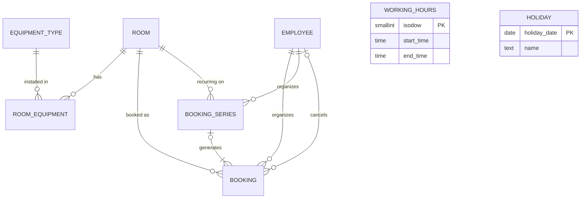

# Test result — database-designer

- Date: 2026-09-28
- Mode: real (headless `claude -p`)
- Delegated to: database-designer
- Correct agent triggered: yes
- Tools the subagent used: (none recorded)

## Prompt

Thiết kế database (PostgreSQL) cho module đặt phòng họp: phòng có sức chứa và thiết bị; nhân viên đặt phòng theo khung giờ; không được trùng lịch cùng phòng; có thể đặt lặp lại hằng tuần; cần báo cáo tỉ lệ sử dụng phòng theo tháng.

## Result (verbatim)

Đây là kết quả đầy đủ từ database-designer agent:

---

Tôi thiết kế cho **PostgreSQL 12 trở lên** (vì dùng generated column). Riêng một truy vấn phụ ở mục 5.6 cần PostgreSQL 14 trở lên (`range_agg`, multirange). Tôi chưa lưu file nào; nếu cần, tôi có thể ghi vào `db/design/meeting_room_booking.sql`.

**Giả định:**
- Toàn công ty dùng một múi giờ `Asia/Ho_Chi_Minh`.
- Mỗi booking nằm trọn trong một ngày.
- Một chuỗi lặp có tối đa 52 lần.
- Giờ làm việc áp dụng chung cho mọi phòng.

Các giả định này đều nằm trong mục 7 để BA xác nhận.

### 1. Quy tắc nghiệp vụ (business rules)

| # | Quy tắc | Cách ép |
|---|---|---|
| BR-01 | Mỗi phòng có mã và tên không trùng | `UNIQUE (code)`, `UNIQUE (name)` |
| BR-02 | Sức chứa của phòng phải lớn hơn 0 | `CHECK (capacity > 0)` |
| BR-03 | Một phòng có nhiều loại thiết bị, một loại thiết bị có ở nhiều phòng (quan hệ n-n), kèm số lượng lớn hơn 0 | Bảng nối `room_equipment`, PK `(room_id, equipment_type_id)`, `CHECK (quantity > 0)` |
| BR-04 | Nhân viên có mã và email không trùng | `UNIQUE (employee_code)`, unique index trên `lower(email)` |
| BR-05 | Một booking thuộc đúng 1 phòng và 1 người tổ chức | `NOT NULL` + FK |
| BR-06 | Giờ kết thúc phải sau giờ bắt đầu | `CHECK (end_at > start_at)`. Điều này cũng chặn range rỗng; range rỗng sẽ "lọt" qua EXCLUDE |
| BR-07 | Booking nằm trong một ngày (giờ địa phương) | `CHECK` so sánh ngày của `start_at` và `end_at` theo `Asia/Ho_Chi_Minh` |
| BR-08 | **Hai booking đang hiệu lực của cùng một phòng không được chồng giờ.** Họp 9h-10h và 10h-11h không coi là trùng | `EXCLUDE USING gist (room_id WITH =, period WITH &&) WHERE (status = 'confirmed')`, với `period` có dạng `[start, end)` |
| BR-09 | Booking đã hủy không chiếm chỗ nhưng vẫn giữ lại để lưu lịch sử | Điều kiện `WHERE` của EXCLUDE; `CHECK` giữa status và các cột cancelled_* |
| BR-10 | Số người dự kiến không vượt sức chứa phòng | Trigger (ràng buộc giữa hai bảng nên không dùng CHECK được) |
| BR-11 | Không đặt phòng đang ngừng hoạt động | Trigger (dùng chung với BR-10) |
| BR-12 | Chuỗi lặp hằng tuần: một phòng, một khung giờ, cùng thứ trong tuần, N tuần liên tiếp (1 ≤ N ≤ 52) | `booking_series` + `CHECK`. Thứ trong tuần suy ra từ `start_date` nên không lưu riêng (tránh dư thừa) |
| BR-13 | Mỗi lần họp (occurrence) của chuỗi là một booking thật, cũng phải tuân BR-08 | Occurrence được lưu thành dòng trong `booking` nên EXCLUDE áp dụng luôn |
| BR-14 | Một occurrence thuộc tối đa 1 chuỗi; số thứ tự không trùng trong chuỗi | FK `series_id` (có thể NULL), `UNIQUE (series_id, occurrence_no)`, `CHECK ((series_id IS NULL) = (occurrence_no IS NULL))` |
| BR-15 | Giờ làm việc định nghĩa theo thứ trong tuần; ngày lễ không tính là ngày làm việc | `working_hours` (PK `isodow`, CHECK), `holiday` (PK `holiday_date`) |
| BR-16 | Tỉ lệ sử dụng = thời gian đã đặt nằm trong giờ làm việc / tổng giờ làm việc của tháng | Truy vấn ở mục 5.4. Không bị đếm trùng vì BR-08 đã được DB bảo đảm |

**Chuẩn hóa và các điểm phi chuẩn hóa có chủ đích:**
- Dữ liệu đạt 3NF.
- `booking.period` là generated column suy ra từ `start_at`/`end_at`. Nó cần cho EXCLUDE và do DB tự tính, nên không thể lệch với hai cột gốc.
- `booking` chép `room_id`, `organizer_id`, `title`, `expected_attendees` từ `booking_series`. Lý do:
  1. Từng occurrence có thể được sửa riêng (đổi giờ, đổi phòng cho một tuần).
  2. EXCLUDE chỉ hoạt động trên các dòng của cùng một bảng.
  3. Mọi truy vấn lịch và báo cáo chỉ cần đọc bảng `booking`.

### 2. ERD



**Quan hệ:**
- `room` 1–n `room_equipment` n–1 `equipment_type`: đây là quan hệ n-n giữa phòng và thiết bị, có thêm thuộc tính `quantity`.
- `room` 1–n `booking`; `employee` 1–n `booking` (vai trò người tổ chức); `employee` 1–n `booking` (vai trò người hủy, có thể NULL).
- `booking_series` 1–n `booking`: một chuỗi sinh ra nhiều occurrence; một booking lẻ có `series_id = NULL`.
- `room` 1–n `booking_series`; `employee` 1–n `booking_series`.
- `working_hours` và `holiday` là bảng tham chiếu độc lập, chỉ dùng cho báo cáo.

### 3. DDL

```sql
-- Cần quyền tạo extension (superuser hoặc trusted extension trên PG13+)
CREATE EXTENSION IF NOT EXISTS btree_gist;

-- ========== EMPLOYEE ==========
CREATE TABLE employee (
    id             bigint GENERATED ALWAYS AS IDENTITY PRIMARY KEY,
    employee_code  text        NOT NULL,
    full_name      text        NOT NULL,
    email          text        NOT NULL,
    is_active      boolean     NOT NULL DEFAULT true,
    created_at     timestamptz NOT NULL DEFAULT now(),
    CONSTRAINT employee_code_uq      UNIQUE (employee_code),
    CONSTRAINT employee_full_name_ck CHECK (btrim(full_name) <> ''),
    CONSTRAINT employee_email_ck     CHECK (email ~ '^[^@]+@[^@]+$')
);
CREATE UNIQUE INDEX employee_email_uq ON employee (lower(email));

-- ========== ROOM ==========
CREATE TABLE room (
    id          bigint GENERATED ALWAYS AS IDENTITY PRIMARY KEY,
    code        text        NOT NULL,
    name        text        NOT NULL,
    location    text,                              -- toà nhà / tầng
    capacity    smallint    NOT NULL,
    is_active   boolean     NOT NULL DEFAULT true,
    created_at  timestamptz NOT NULL DEFAULT now(),
    CONSTRAINT room_code_uq     UNIQUE (code),
    CONSTRAINT room_name_uq     UNIQUE (name),
    CONSTRAINT room_capacity_ck CHECK (capacity > 0)
);

-- ========== EQUIPMENT ==========
CREATE TABLE equipment_type (
    id    bigint GENERATED ALWAYS AS IDENTITY PRIMARY KEY,
    code  text NOT NULL,                           -- PROJECTOR, TV, WHITEBOARD, VIDEO_CONF
    name  text NOT NULL,
    CONSTRAINT equipment_type_code_uq UNIQUE (code),
    CONSTRAINT equipment_type_name_uq UNIQUE (name)
);

CREATE TABLE room_equipment (
    room_id            bigint   NOT NULL REFERENCES room (id) ON DELETE CASCADE,
    equipment_type_id  bigint   NOT NULL REFERENCES equipment_type (id),
    quantity           smallint NOT NULL DEFAULT 1,
    CONSTRAINT room_equipment_pk PRIMARY KEY (room_id, equipment_type_id),
    CONSTRAINT room_equipment_quantity_ck CHECK (quantity > 0)
);

-- ========== RECURRING SERIES ==========
-- Thứ trong tuần = extract(isodow FROM start_date), không lưu riêng.
CREATE TABLE booking_series (
    id                  bigint GENERATED ALWAYS AS IDENTITY PRIMARY KEY,
    room_id             bigint      NOT NULL REFERENCES room (id),
    organizer_id        bigint      NOT NULL REFERENCES employee (id),
    title               text        NOT NULL,
    start_date          date        NOT NULL,      -- ngày của occurrence đầu tiên
    start_time          time(0)     NOT NULL,      -- giờ địa phương Asia/Ho_Chi_Minh
    end_time            time(0)     NOT NULL,
    occurrence_count    smallint    NOT NULL,
    expected_attendees  smallint    NOT NULL,
    created_at          timestamptz NOT NULL DEFAULT now(),
    cancelled_at        timestamptz,
    CONSTRAINT booking_series_title_ck     CHECK (btrim(title) <> ''),
    CONSTRAINT booking_series_time_ck      CHECK (end_time > start_time),
    CONSTRAINT booking_series_count_ck     CHECK (occurrence_count BETWEEN 1 AND 52),
    CONSTRAINT booking_series_attendees_ck CHECK (expected_attendees > 0)
);

-- ========== BOOKING (booking lẻ + occurrence của series) ==========
CREATE TABLE booking (
    id                  bigint GENERATED ALWAYS AS IDENTITY PRIMARY KEY,
    room_id             bigint         NOT NULL REFERENCES room (id),
    organizer_id        bigint         NOT NULL REFERENCES employee (id),
    series_id           bigint         REFERENCES booking_series (id),
    occurrence_no       smallint,
    title               text           NOT NULL,
    expected_attendees  smallint       NOT NULL,
    start_at            timestamptz(0) NOT NULL,
    end_at              timestamptz(0) NOT NULL,
    period              tstzrange      GENERATED ALWAYS AS (tstzrange(start_at, end_at, '[)')) STORED,
    status              text           NOT NULL DEFAULT 'confirmed',
    created_at          timestamptz    NOT NULL DEFAULT now(),
    cancelled_at        timestamptz,
    cancelled_by        bigint         REFERENCES employee (id),

    CONSTRAINT booking_title_ck      CHECK (btrim(title) <> ''),
    CONSTRAINT booking_attendees_ck  CHECK (expected_attendees > 0),
    CONSTRAINT booking_time_order_ck CHECK (end_at > start_at),
    CONSTRAINT booking_same_day_ck   CHECK (
        (start_at AT TIME ZONE 'Asia/Ho_Chi_Minh')::date
      = (end_at   AT TIME ZONE 'Asia/Ho_Chi_Minh')::date),
    CONSTRAINT booking_status_ck     CHECK (status IN ('confirmed', 'cancelled')),
    CONSTRAINT booking_cancel_ck     CHECK (
        (status = 'confirmed' AND cancelled_at IS NULL     AND cancelled_by IS NULL)
     OR (status = 'cancelled' AND cancelled_at IS NOT NULL AND cancelled_by IS NOT NULL)),
    CONSTRAINT booking_series_occ_ck CHECK ((series_id IS NULL) = (occurrence_no IS NULL)),
    CONSTRAINT booking_occ_no_ck     CHECK (occurrence_no >= 1),
    CONSTRAINT booking_series_occ_uq UNIQUE (series_id, occurrence_no),

    -- BR-08: chống trùng lịch cùng phòng, ép ở DB, an toàn khi có nhiều giao dịch đồng thời
    CONSTRAINT booking_no_overlap
        EXCLUDE USING gist (room_id WITH =, period WITH &&)
        WHERE (status = 'confirmed')
);

-- ========== WORKING HOURS & HOLIDAY (cho báo cáo) ==========
CREATE TABLE working_hours (
    isodow      smallint PRIMARY KEY,              -- 1 = Thứ Hai ... 7 = Chủ Nhật
    start_time  time(0)  NOT NULL,
    end_time    time(0)  NOT NULL,
    CONSTRAINT working_hours_isodow_ck CHECK (isodow BETWEEN 1 AND 7),
    CONSTRAINT working_hours_time_ck   CHECK (end_time > start_time)
);
-- Ngày không có dòng = ngày nghỉ
INSERT INTO working_hours (isodow, start_time, end_time)
SELECT d, time '08:00', time '17:00' FROM generate_series(1, 5) AS d;

CREATE TABLE holiday (
    holiday_date  date PRIMARY KEY,
    name          text NOT NULL
);

-- ========== TRIGGER: sức chứa + phòng còn hoạt động (BR-10, BR-11) ==========
CREATE OR REPLACE FUNCTION booking_check_room_rules() RETURNS trigger
LANGUAGE plpgsql AS $$
DECLARE
    v_capacity  smallint;
    v_is_active boolean;
BEGIN
    -- Chỉ kiểm tra khi thông tin liên quan thay đổi (sửa title thì bỏ qua)
    IF TG_OP = 'UPDATE'
       AND NEW.room_id = OLD.room_id
       AND NEW.expected_attendees = OLD.expected_attendees
       AND NEW.status = OLD.status THEN
        RETURN NEW;
    END IF;

    -- FOR SHARE: chặn việc sửa capacity/is_active của phòng cho đến khi giao dịch này commit
    SELECT capacity, is_active INTO v_capacity, v_is_active
    FROM room WHERE id = NEW.room_id
    FOR SHARE;

    IF v_is_active IS FALSE THEN
        RAISE EXCEPTION 'Room % is inactive', NEW.room_id
            USING ERRCODE = 'check_violation';
    END IF;
    IF NEW.expected_attendees > v_capacity THEN
        RAISE EXCEPTION 'Expected attendees (%) exceed room capacity (%)',
                        NEW.expected_attendees, v_capacity
            USING ERRCODE = 'check_violation';
    END IF;
    RETURN NEW;
END $$;

CREATE TRIGGER booking_check_room_rules_trg
BEFORE INSERT OR UPDATE ON booking
FOR EACH ROW WHEN (NEW.status = 'confirmed')
EXECUTE FUNCTION booking_check_room_rules();
```

**Cơ chế chống trùng lịch (BR-08):**
- **Khoảng `[)`:** `period` luôn có dạng `[start_at, end_at)`, nên cuộc họp 9h-10h và cuộc họp 10h-11h không giao nhau.
- **Vai trò của `btree_gist`:** extension này cho phép dùng `room_id WITH =` trong một index GiST cùng với `period WITH &&`.
- **Khi có giao dịch đồng thời:** hai giao dịch cùng chèn vào một khung giờ thì giao dịch sau phải chờ giao dịch trước commit. Sau đó nó bị lỗi `SQLSTATE 23P01` (`exclusion_violation`). Không có khe hở kiểu "kiểm tra xong rồi mới chèn" như khi chỉ kiểm tra ở ứng dụng. Ứng dụng chỉ cần bắt mã lỗi `23P01` và báo "Phòng đã có người đặt trong khung giờ này".
- **Booking đã hủy:** `WHERE (status = 'confirmed')` làm booking đã hủy nhả chỗ ngay. Nếu ai đó cố "khôi phục" một booking đã hủy trong khi khung giờ đó đã có người khác đặt, UPDATE sẽ bị EXCLUDE chặn.
- **`CHECK (end_at > start_at)`:** ràng buộc này bắt buộc phải có. Một range rỗng không giao với range nào, nên nếu thiếu CHECK thì booking rỗng sẽ lọt qua EXCLUDE.

**Thiết kế đặt lặp hằng tuần: lưu sẵn từng occurrence thành dòng thật**
- `booking_series` chỉ lưu "ý định": phòng, người tổ chức, ngày đầu, giờ, số tuần.
- Khi tạo chuỗi, **trong cùng một transaction**, hệ thống sinh N dòng `booking` (mục 5.2).
- Mỗi occurrence là một dòng thật, nên chịu **cùng một EXCLUDE** như booking lẻ. DB không phân biệt được hai loại này, nên không có đường nào tránh được ràng buộc.
- Có hai chính sách xử lý khi một tuần bị trùng (BA cần chọn, mục 7):
  - **Tất cả hoặc không có gì (mặc định):** chỉ cần một occurrence trùng thì cả câu INSERT, cùng với dòng series, bị rollback.
  - **Bỏ qua tuần bị trùng:** thêm `ON CONFLICT DO NOTHING` (không ghi conflict target; cách này dùng được với exclusion constraint). So `RETURNING` với N để biết tuần nào bị bỏ qua.
- Tôi không chọn cách "chỉ lưu quy tắc RRULE rồi tính occurrence khi đọc". Với cách đó, EXCLUDE không có dòng nào để kiểm tra, việc chống trùng lại phải dựa vào ứng dụng, và báo cáo cũng phức tạp hơn. Với N ≤ 52, lượng dữ liệu phát sinh không đáng kể.
- Việc sinh giờ dùng `(date + time) AT TIME ZONE 'Asia/Ho_Chi_Minh'`, nên vẫn cho đúng giờ địa phương nếu sau này có múi giờ áp dụng DST.

### 4. Index và lý do (query nào dùng index nào)

| Index | Phục vụ query | Chi phí khi ghi |
|---|---|---|
| `booking_no_overlap` (GiST `(room_id, period)` WHERE confirmed): tự tạo cùng EXCLUDE | Kiểm tra trùng (bắt buộc); 5.1 tìm phòng trống (`room_id = ? AND period && ?`); 5.2a kiểm tra xung đột trước khi tạo chuỗi; 5.5 lịch tuần của phòng; 5.4 báo cáo (`period && win`; GiST nhiều cột vẫn dùng được khi chỉ có điều kiện trên cột thứ hai) | Ghi vào GiST chậm hơn btree. Chấp nhận được vì booking chỉ vài trăm đến vài nghìn dòng mỗi ngày. Chỉ chứa dòng confirmed nên index gọn |
| `booking_room_start_idx` | 5.3 danh sách booking sắp tới của phòng: `room_id = ? AND start_at >= now() ORDER BY start_at LIMIT n`. GiST không trả dữ liệu theo thứ tự `start_at`, còn btree đọc đúng n dòng, không phải sort | Thêm một btree nhỏ (partial) |
| `booking_organizer_start_idx` | 5.5 lịch của một nhân viên, kể cả đã hủy: `organizer_id = ? ORDER BY start_at` | Thêm một btree. Không để partial vì màn hình lịch sử cần cả booking đã hủy |
| `room_equipment_equipment_idx` | 5.1 lọc phòng có thiết bị X; FK `equipment_type_id` | Không đáng kể (bảng nhỏ, ít khi thay đổi) |
| `booking_series_occ_uq` (tự có do UNIQUE) | 5.2c hủy các buổi tương lai của chuỗi (`series_id = ?`), không cần thêm index riêng cho `series_id` | Đã có sẵn |

```sql
CREATE INDEX booking_room_start_idx      ON booking (room_id, start_at) WHERE status = 'confirmed';
CREATE INDEX booking_organizer_start_idx ON booking (organizer_id, start_at);
CREATE INDEX room_equipment_equipment_idx ON room_equipment (equipment_type_id, room_id);
```

**Những index cố ý không tạo:**
- `room(capacity)`: số phòng ít (dưới vài trăm), seq scan nhanh hơn.
- Index cho các FK `booking_series.room_id` / `organizer_id` và `booking.cancelled_by`: phòng và nhân viên không bị xóa (FK mặc định RESTRICT), nên không có query nào cần đến.

**Lưu ý khi viết query:** mọi truy vấn muốn dùng partial index phải ghi đúng điều kiện `status = 'confirmed'`.

### 5. Truy vấn mẫu

**5.1 Tìm phòng trống** trong khung giờ, có ít nhất N chỗ và có đủ các thiết bị yêu cầu

```sql
-- $1 start_at timestamptz, $2 end_at timestamptz, $3 min capacity, $4 bigint[] equipment_type ids (đã loại trùng)
SELECT r.id, r.code, r.name, r.capacity, r.location
FROM room r
WHERE r.is_active
  AND r.capacity >= $3
  AND NOT EXISTS (
        SELECT 1 FROM booking b
        WHERE b.room_id = r.id
          AND b.status  = 'confirmed'
          AND b.period && tstzrange($1, $2, '[)'))
  AND (SELECT count(*) FROM room_equipment re
       WHERE re.room_id = r.id
         AND re.equipment_type_id = ANY ($4)) = cardinality($4)
ORDER BY r.capacity, r.name;     -- ưu tiên phòng vừa đủ chỗ
```

**5.2 Đặt lặp hằng tuần**

```sql
-- 5.2a (tuỳ chọn, cho UX) Liệt kê xung đột TRƯỚC khi tạo: phòng 1, thứ Hai 9h-10h, 8 tuần từ 2026-10-05
SELECT g.n + 1 AS occurrence_no, b.id AS conflicting_booking_id, b.title, b.start_at, b.end_at
FROM generate_series(0, 7) AS g(n)
JOIN booking b
  ON b.room_id = 1
 AND b.status  = 'confirmed'
 AND b.period && tstzrange((date '2026-10-05' + g.n * 7 + time '09:00') AT TIME ZONE 'Asia/Ho_Chi_Minh',
                           (date '2026-10-05' + g.n * 7 + time '10:00') AT TIME ZONE 'Asia/Ho_Chi_Minh', '[)')
ORDER BY occurrence_no;

-- 5.2b Tạo series + sinh occurrence trong 1 transaction (EXCLUDE là chốt chặn cuối cùng)
BEGIN;
WITH s AS (
    INSERT INTO booking_series (room_id, organizer_id, title, start_date, start_time, end_time,
                                occurrence_count, expected_attendees)
    VALUES (1, 42, 'Weekly team sync', date '2026-10-05', time '09:00', time '10:00', 8, 6)
    RETURNING *
)
INSERT INTO booking (room_id, organizer_id, series_id, occurrence_no, title, expected_attendees, start_at, end_at)
SELECT s.room_id, s.organizer_id, s.id, g.n + 1, s.title, s.expected_attendees,
       (s.start_date + g.n * 7 + s.start_time) AT TIME ZONE 'Asia/Ho_Chi_Minh',
       (s.start_date + g.n * 7 + s.end_time)   AT TIME ZONE 'Asia/Ho_Chi_Minh'
FROM s
CROSS JOIN LATERAL generate_series(0, s.occurrence_count - 1) AS g(n)
-- ON CONFLICT DO NOTHING      -- bật dòng này nếu chính sách là "bỏ qua tuần bị trùng"
RETURNING id, occurrence_no, start_at, end_at;
COMMIT;

-- 5.2c Hủy các buổi còn lại (tương lai) của chuỗi
UPDATE booking
SET status = 'cancelled', cancelled_at = now(), cancelled_by = 42
WHERE series_id = 123
  AND status = 'confirmed'
  AND start_at >= now();
UPDATE booking_series SET cancelled_at = now() WHERE id = 123;
```

Nếu có một tuần trùng lịch, câu 5.2b lỗi `23P01`, transaction rollback, và không còn dòng series "mồ côi" nào. Kết quả 5.2a chỉ để hiển thị cho người dùng; giữa lúc kiểm tra và lúc chèn, người khác vẫn có thể đặt mất khung giờ, và khi đó EXCLUDE vẫn chặn đúng.

**5.3 Danh sách booking sắp tới của một phòng**

```sql
SELECT b.id, b.title, b.start_at, b.end_at, e.full_name AS organizer, b.series_id
FROM booking b
JOIN employee e ON e.id = b.organizer_id
WHERE b.room_id = $1
  AND b.status  = 'confirmed'
  AND b.start_at >= now()
ORDER BY b.start_at
LIMIT 20;
```

**5.4 Báo cáo tỉ lệ sử dụng phòng theo tháng** (chỉ tính phần thời gian booking nằm trong giờ làm việc, bỏ qua ngày lễ)

```sql
WITH params AS (
    SELECT date '2026-01-01' AS from_month,      -- ngày 1 của tháng đầu
           date '2026-09-01' AS to_month         -- ngày 1 của tháng cuối (bao gồm)
),
work_window AS (             -- mỗi ngày làm việc -> 1 khoảng giờ làm việc (timestamptz)
    SELECT date_trunc('month', d)::date AS month,
           tstzrange((d::date + wh.start_time) AT TIME ZONE 'Asia/Ho_Chi_Minh',
                     (d::date + wh.end_time)   AT TIME ZONE 'Asia/Ho_Chi_Minh', '[)') AS win
    FROM params p
    CROSS JOIN LATERAL generate_series(p.from_month::timestamp,
                                       p.to_month + interval '1 month' - interval '1 day',
                                       interval '1 day') AS d
    JOIN working_hours wh ON wh.isodow = extract(isodow FROM d)
    WHERE NOT EXISTS (SELECT 1 FROM holiday h WHERE h.holiday_date = d::date)
),
month_capacity AS (          -- tổng giờ làm việc của tháng (mẫu số)
    SELECT month, sum(upper(win) - lower(win)) AS work_time
    FROM work_window
    GROUP BY month
),
booked AS (                  -- phần giao giữa booking và giờ làm việc (tử số)
    SELECT w.month, b.room_id,
           sum(upper(b.period * w.win) - lower(b.period * w.win)) AS booked_time
    FROM work_window w
    JOIN booking b
      ON b.status = 'confirmed'
     AND b.period && w.win
    GROUP BY w.month, b.room_id
)
SELECT to_char(mc.month, 'YYYY-MM')                                               AS month,
       r.code, r.name,
       round(extract(epoch FROM mc.work_time)::numeric / 3600, 1)                  AS working_hours,
       round(extract(epoch FROM coalesce(bk.booked_time, interval '0'))::numeric / 3600, 1) AS booked_hours,
       round(100 * extract(epoch FROM coalesce(bk.booked_time, interval '0'))::numeric
                 / nullif(extract(epoch FROM mc.work_time)::numeric, 0), 2)        AS utilization_pct
FROM month_capacity mc
CROSS JOIN room r
LEFT JOIN booked bk ON bk.month = mc.month AND bk.room_id = r.id
ORDER BY mc.month, utilization_pct DESC, r.code;
```

- **Cách cắt theo giờ làm việc:** `b.period * w.win` là phép giao hai range. Booking 16h-18h khi giờ làm kết thúc lúc 17h chỉ được tính 1 giờ.
- **Không đếm trùng:** các booking confirmed của một phòng không giao nhau (nhờ EXCLUDE), và mỗi ngày chỉ có một khung giờ làm việc. Vì vậy có thể cộng thẳng phần giao mà không lo đếm trùng. Đây là một lợi ích trực tiếp của việc ép ràng buộc ở DB.
- **Khi dữ liệu lớn:** có thể lưu kết quả các tháng đã chốt vào bảng `room_utilization_monthly`. Bảng này được làm mới bằng job đầu tháng; đây là phi chuẩn hóa phục vụ báo cáo.

**5.5 Lịch của một phòng trong tuần, và lịch của một nhân viên**

```sql
-- Lịch tuần của phòng (dùng GiST)
SELECT id, title, start_at, end_at, organizer_id
FROM booking
WHERE room_id = $1 AND status = 'confirmed'
  AND period && tstzrange($2::timestamptz, $2::timestamptz + interval '7 days', '[)')
ORDER BY start_at;

-- Lịch của tôi, gồm cả booking đã hủy (dùng booking_organizer_start_idx)
SELECT b.id, b.title, r.name AS room, b.start_at, b.end_at, b.status
FROM booking b JOIN room r ON r.id = b.room_id
WHERE b.organizer_id = $1 AND b.start_at >= $2
ORDER BY b.start_at
LIMIT 50;
```

**5.6 (PG14 trở lên) Các khoảng trống của một phòng trong một ngày làm việc**

```sql
SELECT unnest(
         tstzmultirange(w.win) - coalesce(range_agg(b.period), '{}'::tstzmultirange)
       ) AS free_slot
FROM (SELECT tstzrange((date '2026-10-05' + time '08:00') AT TIME ZONE 'Asia/Ho_Chi_Minh',
                       (date '2026-10-05' + time '17:00') AT TIME ZONE 'Asia/Ho_Chi_Minh', '[)') AS win) w
LEFT JOIN booking b
  ON b.room_id = 1 AND b.status = 'confirmed' AND b.period && w.win
GROUP BY w.win;
```

Khi đã có dữ liệu thật, bạn chạy `EXPLAIN (ANALYZE, BUFFERS)` cho 5.1, 5.3 và 5.4 rồi gửi lại plan cho tôi. Tôi không có quyền truy cập DB nên chưa kiểm chứng được plan thực tế.

### 6. Quy tắc không ép được ở DB → phải kiểm tra ở tầng ứng dụng

1. **Giảm sức chứa hoặc ngừng hoạt động một phòng** không làm DB kiểm tra lại các booking tương lai đã có. Ứng dụng phải liệt kê các booking bị ảnh hưởng và xử lý (thông báo, dời phòng).
2. **Không cho đặt vào thời điểm đã qua:** không dùng `now()` trong CHECK được, vì dữ liệu cũ sẽ vi phạm khi restore. Kiểm tra ở ứng dụng, hoặc thêm vào trigger nhưng chỉ cho INSERT.
3. **Chuyển trạng thái chỉ theo một chiều `confirmed → cancelled`**, không khôi phục. CHECK không so được giá trị cũ với giá trị mới, nên việc này nằm ở ứng dụng hoặc trigger.
4. **Nhất quán giữa series và occurrence:** khi series bị hủy thì các occurrence tương lai cũng phải bị hủy; occurrence phải khớp phòng và giờ với series, trừ trường hợp được sửa riêng. Việc này do ứng dụng làm trong cùng transaction (5.2c).
5. **Nhân viên đã nghỉ việc (`is_active = false`) không được đặt phòng mới:** kiểm tra ở ứng dụng. Có thể bổ sung vào trigger nếu cần.
6. **Chỉ một múi giờ:** hằng `'Asia/Ho_Chi_Minh'` nằm trong CHECK và trong các query. Nếu có văn phòng ở múi giờ khác, cần thêm bảng `building(time_zone)` và chuyển CHECK "cùng ngày" sang trigger.
7. **Danh sách `equipment_type_id` truyền vào 5.1 phải không trùng lặp**, nếu không phép đếm `cardinality` sẽ sai.
8. **Chồng lịch của cùng một người tổ chức** (một người đặt hai phòng cùng lúc) hiện được phép. Nếu cần cấm thì thêm một EXCLUDE thứ hai trên `(organizer_id, period)`.

### 7. Câu hỏi mở cho BA

1. Khi tạo chuỗi lặp mà có tuần bị trùng: **hủy cả chuỗi** (mặc định hiện tại) hay **bỏ qua tuần đó** và tạo các tuần còn lại? Có tự động bỏ qua ngày lễ không?
2. Giới hạn 52 lần trong một chuỗi và việc đặt trước tối đa bao xa (ví dụ 6 tháng) có hợp lý không? Có cần lặp hai tuần một lần hoặc hằng tháng không?
3. Có được sửa riêng một buổi trong chuỗi (đổi giờ hay đổi phòng cho một tuần) không?
4. Giờ làm việc có **nghỉ trưa** (ví dụ 12h-13h30) không? Có làm sáng thứ Bảy không? Giờ làm có khác nhau theo tòa nhà hay theo phòng không? Hiện mỗi ngày chỉ có một khung giờ; nếu có nghỉ trưa thì phải đổi `working_hours` sang nhiều khung mỗi ngày.
5. Có cần **khoảng đệm** giữa hai cuộc họp (ví dụ 10 phút dọn phòng) không? Nếu có, EXCLUDE sẽ dùng `tstzrange(start_at, end_at + buffer)`.
6. Có cho phép số người dự kiến vượt sức chứa (họp đứng, họp ngắn) không? Có booking kéo qua nửa đêm hoặc kéo dài nhiều ngày (workshop) không?
7. Báo cáo tỉ lệ sử dụng: có tính booking bị hủy sát giờ hoặc "đặt mà không đến" (no-show) không? Nếu có thì cần chức năng check-in. Với phòng mới mở hoặc ngừng hoạt động giữa tháng, mẫu số tính theo cả tháng hay chỉ theo những ngày phòng hoạt động?
8. Công ty có nhiều văn phòng ở các múi giờ khác nhau không?
9. Có cần tách "người tạo booking" (ví dụ thư ký) khỏi "người chủ trì" không? Có cần lưu danh sách người tham dự (bảng `booking_attendee`) không?
